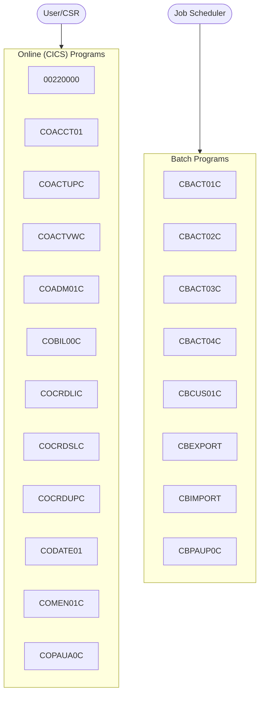

# CardDemo - System Overview

> **Auto-generated documentation** | 2026-03-16 21:06  
> Analyzed from 44 COBOL programs across 20 functional modules

---

## What is CardDemo?

CardDemo is a mainframe COBOL application that provides core business functionality
for credit card account management. The system handles customer sign-on, account inquiries,
transaction processing, credit card management, and batch operations through a combination
of CICS online screens and batch JCL jobs.

## System at a Glance

| Metric | Count |
|--------|-------|
| Programs | 44 |
| Functional Modules | 20 |
| BMS Screens | 189 |
| Data Items | 7383 |
| Inter-Program Calls | 59 |
| Business Rules | 447 |
| Copybooks | 68 |

## Architecture Overview

## Functional Modules

### [Batch Account Processing](modules/ACCOUNT_BATCH.md)

Batch Account Processing

| Programs | Type |
|----------|------|
| [CBACT01C](programs/CBACT01C.md) | BATCH |
| [CBACT02C](programs/CBACT02C.md) | BATCH |
| [CBACT03C](programs/CBACT03C.md) | BATCH |
| [CBACT04C](programs/CBACT04C.md) | BATCH |

### [Online Account Management](modules/ACCOUNT_MGMT_ONLINE.md)

Online Account Management

| Programs | Type |
|----------|------|
| [COACTUPC](programs/COACTUPC.md) | ONLINE |
| [COACTVWC](programs/COACTVWC.md) | ONLINE |

### [System Administration](modules/ADMINISTRATION.md)

System Administration

| Programs | Type |
|----------|------|
| [COADM01C](programs/COADM01C.md) | ONLINE |

### [Authentication & Sign-On](modules/AUTHENTICATION.md)

Authentication & Sign-On

| Programs | Type |
|----------|------|
| [COSGN00C](programs/COSGN00C.md) | ONLINE |

### [Batch Processing (Uncategorised)](modules/BATCH_PROCESSING.md)

Batch Processing (Uncategorised)

| Programs | Type |
|----------|------|
| [CBPAUP0C](programs/CBPAUP0C.md) | BATCH |

### [Billing & Statements](modules/BILLING.md)

Billing & Statements

| Programs | Type |
|----------|------|
| [COBIL00C](programs/COBIL00C.md) | ONLINE |

### [Credit Card Management](modules/CREDIT_CARD_MGMT.md)

Credit Card Management

| Programs | Type |
|----------|------|
| [COCRDLIC](programs/COCRDLIC.md) | ONLINE |
| [COCRDSLC](programs/COCRDSLC.md) | ONLINE |
| [COCRDUPC](programs/COCRDUPC.md) | ONLINE |

### [Customer Data Processing](modules/CUSTOMER_BATCH.md)

Customer Data Processing

| Programs | Type |
|----------|------|
| [CBCUS01C](programs/CBCUS01C.md) | BATCH |

### [Database Operations](modules/DATABASE_OPERATIONS.md)

Database Operations

| Programs | Type |
|----------|------|
| [DBUNLDGS](programs/DBUNLDGS.md) | BATCH |

### [Data Import/Export](modules/DATA_EXCHANGE.md)

Data Import/Export

| Programs | Type |
|----------|------|
| [CBEXPORT](programs/CBEXPORT.md) | BATCH |
| [CBIMPORT](programs/CBIMPORT.md) | BATCH |

### [Module: MODULE_00](modules/MODULE_00.md)

Module: MODULE_00

| Programs | Type |
|----------|------|
| [00220000](programs/00220000.md) | ONLINE |

### [Menu Navigation](modules/NAVIGATION.md)

Menu Navigation

| Programs | Type |
|----------|------|
| [COMEN01C](programs/COMEN01C.md) | ONLINE |

### [Online Processing (Uncategorised)](modules/ONLINE_PROCESSING.md)

Online Processing (Uncategorised)

| Programs | Type |
|----------|------|
| [COACCT01](programs/COACCT01.md) | ONLINE |
| [COBTUPDT](programs/COBTUPDT.md) | DB2 |
| [CODATE01](programs/CODATE01.md) | ONLINE |
| [COPAUA0C](programs/COPAUA0C.md) | ONLINE |
| [COPAUS0C](programs/COPAUS0C.md) | ONLINE |
| *...3 more* | |

### [Payment Processing](modules/PAYMENT_PROCESSING.md)

Payment Processing

| Programs | Type |
|----------|------|
| [PAUDBLOD](programs/PAUDBLOD.md) | BATCH |
| [PAUDBUNL](programs/PAUDBUNL.md) | BATCH |

### [Reports & Analytics](modules/REPORTING.md)

Reports & Analytics

| Programs | Type |
|----------|------|
| [CORPT00C](programs/CORPT00C.md) | ONLINE |

### [Statement Generation](modules/STATEMENT_PROCESSING.md)

Statement Generation

| Programs | Type |
|----------|------|
| [CBSTM03A](programs/CBSTM03A.md) | BATCH |
| [CBSTM03B](programs/CBSTM03B.md) | BATCH |

### [Batch Transaction Processing](modules/TRANSACTION_BATCH.md)

Batch Transaction Processing

| Programs | Type |
|----------|------|
| [CBTRN01C](programs/CBTRN01C.md) | BATCH |
| [CBTRN02C](programs/CBTRN02C.md) | BATCH |
| [CBTRN03C](programs/CBTRN03C.md) | BATCH |

### [Online Transaction Processing](modules/TRANSACTION_ONLINE.md)

Online Transaction Processing

| Programs | Type |
|----------|------|
| [COTRN00C](programs/COTRN00C.md) | ONLINE |
| [COTRN01C](programs/COTRN01C.md) | ONLINE |
| [COTRN02C](programs/COTRN02C.md) | ONLINE |

### [User Management](modules/USER_MANAGEMENT.md)

User Management

| Programs | Type |
|----------|------|
| [COUSR00C](programs/COUSR00C.md) | ONLINE |
| [COUSR01C](programs/COUSR01C.md) | ONLINE |
| [COUSR02C](programs/COUSR02C.md) | ONLINE |
| [COUSR03C](programs/COUSR03C.md) | ONLINE |

### [Shared Utilities](modules/UTILITIES.md)

Shared Utilities

| Programs | Type |
|----------|------|
| [COBSWAIT](programs/COBSWAIT.md) | BATCH |
| [CSUTLDTC](programs/CSUTLDTC.md) | BATCH |

## Entry Points

Programs that are not called by others -- these are likely user-facing entry points:

- [00220000](programs/00220000.md)
- [CBACT01C](programs/CBACT01C.md)
- [CBACT02C](programs/CBACT02C.md)
- [CBACT03C](programs/CBACT03C.md)
- [CBACT04C](programs/CBACT04C.md)
- [CBCUS01C](programs/CBCUS01C.md)
- [CBEXPORT](programs/CBEXPORT.md)
- [CBIMPORT](programs/CBIMPORT.md)
- [CBPAUP0C](programs/CBPAUP0C.md)
- [CBSTM03A](programs/CBSTM03A.md)
- [CBSTM03B](programs/CBSTM03B.md)
- [CBTRN01C](programs/CBTRN01C.md)
- [CBTRN02C](programs/CBTRN02C.md)
- [CBTRN03C](programs/CBTRN03C.md)
- [COACCT01](programs/COACCT01.md)
- [COACTUPC](programs/COACTUPC.md)
- [COACTVWC](programs/COACTVWC.md)
- [COADM01C](programs/COADM01C.md)
- [COBIL00C](programs/COBIL00C.md)
- [COBSWAIT](programs/COBSWAIT.md)
- [COBTUPDT](programs/COBTUPDT.md)
- [COCRDLIC](programs/COCRDLIC.md)
- [COCRDSLC](programs/COCRDSLC.md)
- [COCRDUPC](programs/COCRDUPC.md)
- [CODATE01](programs/CODATE01.md)
- [COMEN01C](programs/COMEN01C.md)
- [COPAUA0C](programs/COPAUA0C.md)
- [COPAUS0C](programs/COPAUS0C.md)
- [COPAUS1C](programs/COPAUS1C.md)
- [COPAUS2C](programs/COPAUS2C.md)
- [CORPT00C](programs/CORPT00C.md)
- [COSGN00C](programs/COSGN00C.md)
- [COTRN00C](programs/COTRN00C.md)
- [COTRN01C](programs/COTRN01C.md)
- [COTRN02C](programs/COTRN02C.md)
- [COTRTLIC](programs/COTRTLIC.md)
- [COUSR00C](programs/COUSR00C.md)
- [COUSR01C](programs/COUSR01C.md)
- [COUSR02C](programs/COUSR02C.md)
- [COUSR03C](programs/COUSR03C.md)
- [CSUTLDTC](programs/CSUTLDTC.md)
- [DBUNLDGS](programs/DBUNLDGS.md)
- [PAUDBLOD](programs/PAUDBLOD.md)
- [PAUDBUNL](programs/PAUDBUNL.md)

## Quick Navigation

| Section | Description |
|---------|-------------|
| [Program Documentation](programs/) | Detailed walkthrough for each COBOL program |
| [Linked Programs](clusters/INDEX.md) | Connected program clusters and dependency graphs |
| [Module Documentation](modules/) | Business-grouped program clusters |
| [Business Rules Catalog](business-rules/INDEX.md) | All extracted business rules |
| [Screen Catalog](screens/INDEX.md) | BMS screen definitions and layouts |
| [Call Graph](diagrams/call-graph.md) | Inter-program dependency diagram |
| [Data Dictionary](data-dictionary.md) | Complete variable listing |
| [Copybook Reference](copybook-reference.md) | Shared data structures |

---

*Generated by COBOL Documentation Pipeline*