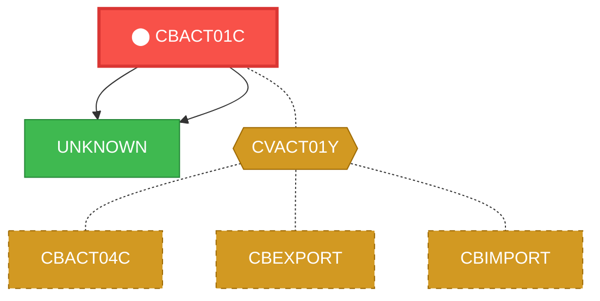

# Program: CBACT01C

---

## Quick Reference

| Attribute | Value |
|-----------|-------|
| Program ID | `CBACT01C` |
| Type | BATCH |
| Lines | 431 |
| Source | [CBACT01C.cbl](../carddemo/CBACT01C.cbl#L1) |
| Paragraphs | 16 |
| Statements | 96 |
| Impact Risk | **HIGH** — 13 programs affected |

> **View Source:** [Open CBACT01C.cbl](../carddemo/CBACT01C.cbl#L1)

## Dependency Context

> This section shows how **CBACT01C** connects to the rest of the system — who calls it,
> what it calls, and what data it shares. If linked programs exist, they must appear here.

### Programs That Call CBACT01C (Callers)

*No programs call CBACT01C — this is likely a top-level entry point or CICS transaction starter.*

### Programs Called by CBACT01C (Callees)

| Called Program | Type | Line | Why |
|----------------|------|------|-----|
| [UNKNOWN](UNKNOWN.md) | None | 303 |  |
| [UNKNOWN](UNKNOWN.md) | None | 482 |  |

### Shared Data (Copybooks & Files)

#### Shared Copybooks

| Copybook | Also Used By | # Co-Users |
|----------|-------------|------------|
| `CODATECN` |  | 0 |
| `CVACT01Y` | CBACT04C, CBEXPORT, CBIMPORT, CBSTM03A, CBTRN01C (+8 more) | 13 |

---

## Dependency Graph

> **Legend:** 🔴 Target program · 🔵 Direct callers · 🟢 Direct callees · 🟡 Copybook-coupled · ⚫ Transitive (indirect)

---

## Impact Ripple View

> **If you change CBACT01C, what else could break?**

| Impact Metric | Count |
|--------------|-------|
| Direct Callers | 0 |
| Transitive Callers (callers of callers) | 0 |
| Direct Callees | 0 |
| Transitive Callees | 0 |
| Copybook-Coupled Programs | 13 |
| **Total Impact** | **13** |
| **Risk Rating** | **HIGH** |

**Programs affected via shared copybooks:**
- `CBACT04C`
- `CBEXPORT`
- `CBIMPORT`
- `CBSTM03A`
- `CBTRN01C`
- `CBTRN02C`
- `COACCT01`
- `COACTUPC`
- `COACTVWC`
- `COBIL00C`
- `COPAUA0C`
- `COPAUS0C`
- `COTRN02C`

---

## Statement Profile

| Statement Type | Count |
|---------------|-------|
| MOVE | 35 |
| IF | 18 |
| EXIT | 15 |
| DISPLAY | 15 |
| WRITE | 4 |
| OPEN | 4 |
| CALL | 2 |
| READ | 1 |
| CLOSE | 1 |
| ARITHMETIC | 1 |

## Control Flow

```mermaid
flowchart TD
    START([Program Entry])
    1000_ACCTFILE_GET_NEXT["1000-ACCTFILE-GET-NEXT"]
    1100_DISPLAY_ACCT_RECORD["1100-DISPLAY-ACCT-RECORD"]
    1300_POPUL_ACCT_RECORD["1300-POPUL-ACCT-RECORD"]
    1350_WRITE_ACCT_RECORD["1350-WRITE-ACCT-RECORD"]
    1400_POPUL_ARRAY_RECORD["1400-POPUL-ARRAY-RECORD"]
    1450_WRITE_ARRY_RECORD["1450-WRITE-ARRY-RECORD"]
    1500_POPUL_VBRC_RECORD["1500-POPUL-VBRC-RECORD"]
    1550_WRITE_VB1_RECORD["1550-WRITE-VB1-RECORD"]
    1575_WRITE_VB2_RECORD["1575-WRITE-VB2-RECORD"]
    0000_ACCTFILE_OPEN["0000-ACCTFILE-OPEN"]
    2000_OUTFILE_OPEN["2000-OUTFILE-OPEN"]
    3000_ARRFILE_OPEN["3000-ARRFILE-OPEN"]
    4000_VBRFILE_OPEN["4000-VBRFILE-OPEN"]
    9000_ACCTFILE_CLOSE["9000-ACCTFILE-CLOSE"]
    9999_ABEND_PROGRAM["9999-ABEND-PROGRAM"]
    START --> 1000_ACCTFILE_GET_NEXT
```

## Paragraphs

### 1000-ACCTFILE-GET-NEXT

| | |
|---|---|
| **Paragraph** | `1000-ACCTFILE-GET-NEXT` |
| **Lines** | 237 - 270 |
| **View Code** | [Jump to Line 237](../carddemo/CBACT01C.cbl#L237) |

### 1100-DISPLAY-ACCT-RECORD

| | |
|---|---|
| **Paragraph** | `1100-DISPLAY-ACCT-RECORD` |
| **Lines** | 272 - 285 |
| **View Code** | [Jump to Line 272](../carddemo/CBACT01C.cbl#L272) |

### 1300-POPUL-ACCT-RECORD

| | |
|---|---|
| **Paragraph** | `1300-POPUL-ACCT-RECORD` |
| **Lines** | 287 - 312 |
| **View Code** | [Jump to Line 287](../carddemo/CBACT01C.cbl#L287) |

### 1350-WRITE-ACCT-RECORD

| | |
|---|---|
| **Paragraph** | `1350-WRITE-ACCT-RECORD` |
| **Lines** | 314 - 323 |
| **View Code** | [Jump to Line 314](../carddemo/CBACT01C.cbl#L314) |

### 1400-POPUL-ARRAY-RECORD

| | |
|---|---|
| **Paragraph** | `1400-POPUL-ARRAY-RECORD` |
| **Lines** | 325 - 333 |
| **View Code** | [Jump to Line 325](../carddemo/CBACT01C.cbl#L325) |

### 1450-WRITE-ARRY-RECORD

| | |
|---|---|
| **Paragraph** | `1450-WRITE-ARRY-RECORD` |
| **Lines** | 335 - 346 |
| **View Code** | [Jump to Line 335](../carddemo/CBACT01C.cbl#L335) |

### 1500-POPUL-VBRC-RECORD

| | |
|---|---|
| **Paragraph** | `1500-POPUL-VBRC-RECORD` |
| **Lines** | 348 - 357 |
| **View Code** | [Jump to Line 348](../carddemo/CBACT01C.cbl#L348) |

### 1550-WRITE-VB1-RECORD

| | |
|---|---|
| **Paragraph** | `1550-WRITE-VB1-RECORD` |
| **Lines** | 359 - 372 |
| **View Code** | [Jump to Line 359](../carddemo/CBACT01C.cbl#L359) |

### 1575-WRITE-VB2-RECORD

| | |
|---|---|
| **Paragraph** | `1575-WRITE-VB2-RECORD` |
| **Lines** | 374 - 387 |
| **View Code** | [Jump to Line 374](../carddemo/CBACT01C.cbl#L374) |

### 0000-ACCTFILE-OPEN

| | |
|---|---|
| **Paragraph** | `0000-ACCTFILE-OPEN` |
| **Lines** | 389 - 405 |
| **View Code** | [Jump to Line 389](../carddemo/CBACT01C.cbl#L389) |

### 2000-OUTFILE-OPEN

| | |
|---|---|
| **Paragraph** | `2000-OUTFILE-OPEN` |
| **Lines** | 406 - 422 |
| **View Code** | [Jump to Line 406](../carddemo/CBACT01C.cbl#L406) |

### 3000-ARRFILE-OPEN

| | |
|---|---|
| **Paragraph** | `3000-ARRFILE-OPEN` |
| **Lines** | 424 - 440 |
| **View Code** | [Jump to Line 424](../carddemo/CBACT01C.cbl#L424) |

### 4000-VBRFILE-OPEN

| | |
|---|---|
| **Paragraph** | `4000-VBRFILE-OPEN` |
| **Lines** | 442 - 458 |
| **View Code** | [Jump to Line 442](../carddemo/CBACT01C.cbl#L442) |

### 9000-ACCTFILE-CLOSE

| | |
|---|---|
| **Paragraph** | `9000-ACCTFILE-CLOSE` |
| **Lines** | 460 - 476 |
| **View Code** | [Jump to Line 460](../carddemo/CBACT01C.cbl#L460) |

### 9999-ABEND-PROGRAM

| | |
|---|---|
| **Paragraph** | `9999-ABEND-PROGRAM` |
| **Lines** | 478 - 482 |
| **View Code** | [Jump to Line 478](../carddemo/CBACT01C.cbl#L478) |

### 9910-DISPLAY-IO-STATUS

| | |
|---|---|
| **Paragraph** | `9910-DISPLAY-IO-STATUS` |
| **Lines** | 485 - 498 |
| **View Code** | [Jump to Line 485](../carddemo/CBACT01C.cbl#L485) |

## Executed by JCL Jobs

This program is run by the following batch JCL jobs:

| Job Name | Step | Step Comments |
|----------|------|---------------|
| [READACCT](../jcl/READACCT.md) | `STEP05` | *******************************************************************
RUN THE PROG... |

## Business Rules

- **Account Record Type Validation** `BR-043`  
  The system must validate the account record type to ensure it is a valid type before processing.  
  [View Rule Details](../business-rules/BR-043.md)
- **High Balance Account Archiving** `BR-044`  
  Accounts with balances exceeding a defined threshold are archived to a specific high-balance output file.  
  [View Rule Details](../business-rules/BR-044.md)
- **Populate Account Record** `BR-045`  
  When an account record is processed, populate the account record with data from the input file.  
  [View Rule Details](../business-rules/BR-045.md)
- **Account Record Archiving** `BR-046`  
  Account records are archived to specific output files based on the record type.  
  [View Rule Details](../business-rules/BR-046.md)
- **Archive Account Record** `BR-047`  
  Account records are written to an archive file.  
  [View Rule Details](../business-rules/BR-047.md)
- **Populate VB1 Record** `BR-048`  
  Account data is extracted and formatted into a VB1 record.  
  [View Rule Details](../business-rules/BR-048.md)
- **Populate VB2 Record** `BR-049`  
  When a specific condition is met (unspecified in provided code snippet), populate the VB2 record with data.  
  [View Rule Details](../business-rules/BR-049.md)
- **Account Record Type Validation** `BR-050`  
  The system validates the account record type to determine the appropriate processing path.  
  [View Rule Details](../business-rules/BR-050.md)
- **Account Record Processing** `BR-051`  
  The system processes account records based on their specific type.  
  [View Rule Details](../business-rules/BR-051.md)
- **Open Account Type 1 File** `BR-052`  
  The program opens a specific output file for account records of type 1.  
  [View Rule Details](../business-rules/BR-052.md)
- **Open Account Type 2 File** `BR-053`  
  The program opens a specific output file for account records of type 2.  
  [View Rule Details](../business-rules/BR-053.md)
- **Account File Open Status Check** `BR-054`  
  If the account file fails to open, the archiving process cannot proceed.  
  [View Rule Details](../business-rules/BR-054.md)
- **Output File Open Status Check** `BR-055`  
  If any of the output files fail to open, the archiving process cannot proceed.  
  [View Rule Details](../business-rules/BR-055.md)
- **Account Record Type Validation** `BR-056`  
  The system validates the account record type to determine the appropriate archive file.  
  [View Rule Details](../business-rules/BR-056.md)
- **Account Data Archiving** `BR-057`  
  Account data is archived to specific output files based on the account record type.  
  [View Rule Details](../business-rules/BR-057.md)
- **Account Record Type Validation** `BR-058`  
  If the account record type is invalid, the program should terminate.  
  [View Rule Details](../business-rules/BR-058.md)
- **Account File Closing Validation** `BR-059`  
  If the account file closing process fails, the program should terminate.  
  [View Rule Details](../business-rules/BR-059.md)
- **File Status Display** `BR-060`  
  The program displays the status of input and output files to provide operational feedback.  
  [View Rule Details](../business-rules/BR-060.md)

## Key Data Items

| Name | Level | Picture | Section | Business Name |
|------|-------|---------|---------|---------------|
| `ACCOUNT-RECORD` | 1 | `None` | WORKING-STORAGE | None |
| `ACCT-ID` | 5 | `9(11)` | WORKING-STORAGE | None |
| `ACCT-ACTIVE-STATUS` | 5 | `X(01)` | WORKING-STORAGE | None |
| `ACCT-CURR-BAL` | 5 | `S9(10)V99` | WORKING-STORAGE | None |
| `ACCT-CREDIT-LIMIT` | 5 | `S9(10)V99` | WORKING-STORAGE | None |
| `ACCT-CASH-CREDIT-LIMIT` | 5 | `S9(10)V99` | WORKING-STORAGE | None |
| `ACCT-OPEN-DATE` | 5 | `X(10)` | WORKING-STORAGE | None |
| `ACCT-EXPIRAION-DATE` | 5 | `X(10)` | WORKING-STORAGE | None |
| `ACCT-REISSUE-DATE` | 5 | `X(10)` | WORKING-STORAGE | None |
| `ACCT-CURR-CYC-CREDIT` | 5 | `S9(10)V99` | WORKING-STORAGE | None |
| `ACCT-CURR-CYC-DEBIT` | 5 | `S9(10)V99` | WORKING-STORAGE | None |
| `ACCT-ADDR-ZIP` | 5 | `X(10)` | WORKING-STORAGE | None |
| `ACCT-GROUP-ID` | 5 | `X(10)` | WORKING-STORAGE | None |
| `FILLER` | 5 | `X(178)` | WORKING-STORAGE | None |
| `CODATECN-REC` | 1 | `None` | WORKING-STORAGE | None |
| `CODATECN-IN-REC` | 5 | `None` | WORKING-STORAGE | None |
| `CODATECN-TYPE` | 10 | `X` | WORKING-STORAGE | None |
| `YYYYMMDD-IN` | 88 | `None` | WORKING-STORAGE | None |
| `YYYY-MM-DD-IN` | 88 | `None` | WORKING-STORAGE | None |
| `CODATECN-INP-DATE` | 10 | `X(20)` | WORKING-STORAGE | None |
| `CODATECN-1INP` | 10 | `None` | WORKING-STORAGE | None |
| `CODATECN-1YYYY` | 15 | `XXXX` | WORKING-STORAGE | None |
| `CODATECN-1MM` | 15 | `XX` | WORKING-STORAGE | None |
| `CODATECN-1DD` | 15 | `XX` | WORKING-STORAGE | None |
| `CODATECN-1FIL` | 15 | `X(12)` | WORKING-STORAGE | None |
| `CODATECN-2INP` | 10 | `None` | WORKING-STORAGE | None |
| `CODATECN-1O-YYYY` | 15 | `XXXX` | WORKING-STORAGE | None |
| `CODATECN-1I-S1` | 15 | `X` | WORKING-STORAGE | None |
| `CODATECN-1MM` | 15 | `XX` | WORKING-STORAGE | None |
| `CODATECN-1I-S2` | 15 | `X` | WORKING-STORAGE | None |
| `CODATECN-2YY` | 15 | `XX` | WORKING-STORAGE | None |
| `CODATECN-2FIL` | 15 | `X(10)` | WORKING-STORAGE | None |
| `CODATECN-OUT-REC` | 5 | `None` | WORKING-STORAGE | None |
| `CODATECN-OUTTYPE` | 10 | `X` | WORKING-STORAGE | None |
| `YYYY-MM-DD-OP` | 88 | `None` | WORKING-STORAGE | None |
| `YYYYMMDD-OP` | 88 | `None` | WORKING-STORAGE | None |
| `CODATECN-0UT-DATE` | 10 | `X(20)` | WORKING-STORAGE | None |
| `CODATECN-1OUT` | 10 | `None` | WORKING-STORAGE | None |
| `CODATECN-1O-YYYY` | 15 | `XXXX` | WORKING-STORAGE | None |
| `CODATECN-1O-S1` | 15 | `X` | WORKING-STORAGE | None |

*Showing 40 of 94 data items. See [Data Dictionary](../data-dictionary.md).*

---

*Generated 2026-03-16 21:06*