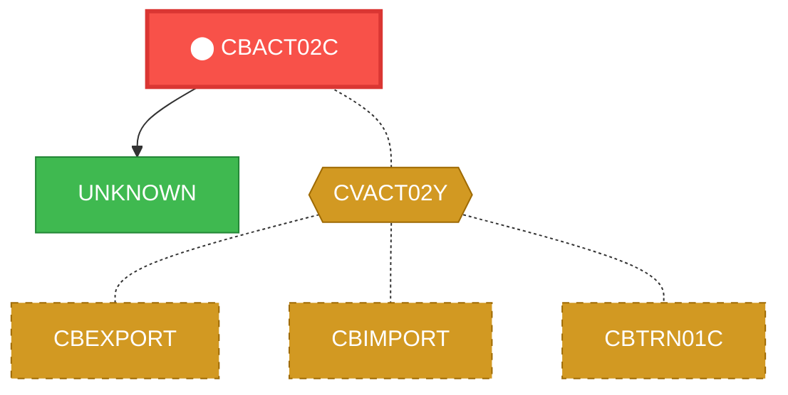
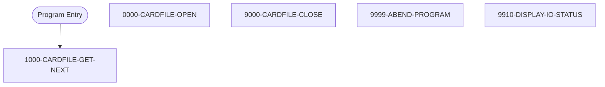

# Program: CBACT02C

---

## Quick Reference

| Attribute | Value |
|-----------|-------|
| Program ID | `CBACT02C` |
| Type | BATCH |
| Lines | 179 |
| Source | [CBACT02C.cbl](../carddemo/CBACT02C.cbl#L1) |
| Paragraphs | 5 |
| Statements | 20 |
| Impact Risk | **MEDIUM** — 9 programs affected |

> **View Source:** [Open CBACT02C.cbl](../carddemo/CBACT02C.cbl#L1)

## Dependency Context

> This section shows how **CBACT02C** connects to the rest of the system — who calls it,
> what it calls, and what data it shares. If linked programs exist, they must appear here.

### Programs That Call CBACT02C (Callers)

*No programs call CBACT02C — this is likely a top-level entry point or CICS transaction starter.*

### Programs Called by CBACT02C (Callees)

| Called Program | Type | Line | Why |
|----------------|------|------|-----|
| [UNKNOWN](UNKNOWN.md) | None | 172 |  |

### Shared Data (Copybooks & Files)

#### Shared Copybooks

| Copybook | Also Used By | # Co-Users |
|----------|-------------|------------|
| `CVACT02Y` | CBEXPORT, CBIMPORT, CBTRN01C, COACTVWC, COCRDLIC (+4 more) | 9 |

---

## Dependency Graph

> **Legend:** 🔴 Target program · 🔵 Direct callers · 🟢 Direct callees · 🟡 Copybook-coupled · ⚫ Transitive (indirect)

---

## Impact Ripple View

> **If you change CBACT02C, what else could break?**

| Impact Metric | Count |
|--------------|-------|
| Direct Callers | 0 |
| Transitive Callers (callers of callers) | 0 |
| Direct Callees | 0 |
| Transitive Callees | 0 |
| Copybook-Coupled Programs | 9 |
| **Total Impact** | **9** |
| **Risk Rating** | **MEDIUM** |

**Programs affected via shared copybooks:**
- `CBEXPORT`
- `CBIMPORT`
- `CBTRN01C`
- `COACTVWC`
- `COCRDLIC`
- `COCRDSLC`
- `COCRDUPC`
- `COPAUS0C`
- `COTRTLIC`

---

## Statement Profile

| Statement Type | Count |
|---------------|-------|
| IF | 7 |
| EXIT | 4 |
| MOVE | 3 |
| READ | 1 |
| OPEN | 1 |
| DISPLAY | 1 |
| CLOSE | 1 |
| CALL | 1 |
| ARITHMETIC | 1 |

## Control Flow

## Paragraphs

### 1000-CARDFILE-GET-NEXT

| | |
|---|---|
| **Paragraph** | `1000-CARDFILE-GET-NEXT` |
| **Lines** | 106 - 130 |
| **View Code** | [Jump to Line 106](../carddemo/CBACT02C.cbl#L106) |

### 0000-CARDFILE-OPEN

| | |
|---|---|
| **Paragraph** | `0000-CARDFILE-OPEN` |
| **Lines** | 132 - 148 |
| **View Code** | [Jump to Line 132](../carddemo/CBACT02C.cbl#L132) |

### 9000-CARDFILE-CLOSE

| | |
|---|---|
| **Paragraph** | `9000-CARDFILE-CLOSE` |
| **Lines** | 150 - 166 |
| **View Code** | [Jump to Line 150](../carddemo/CBACT02C.cbl#L150) |

### 9999-ABEND-PROGRAM

| | |
|---|---|
| **Paragraph** | `9999-ABEND-PROGRAM` |
| **Lines** | 168 - 172 |
| **View Code** | [Jump to Line 168](../carddemo/CBACT02C.cbl#L168) |

### 9910-DISPLAY-IO-STATUS

| | |
|---|---|
| **Paragraph** | `9910-DISPLAY-IO-STATUS` |
| **Lines** | 175 - 188 |
| **View Code** | [Jump to Line 175](../carddemo/CBACT02C.cbl#L175) |

## Executed by JCL Jobs

This program is run by the following batch JCL jobs:

| Job Name | Step | Step Comments |
|----------|------|---------------|
| [READCARD](../jcl/READCARD.md) | `STEP05` | *****************************************************************
Copyright Amaz... |

## Business Rules

- **Card File Read Successful** `BR-061`  
  If a card record is successfully read from the input file, the system proceeds to process the card data.  
  [View Rule Details](../business-rules/BR-061.md)
- **Card File End of File** `BR-062`  
  When the end of the card input file is reached, the system closes the card file and proceeds to the program's termination logic.  
  [View Rule Details](../business-rules/BR-062.md)
- **Card File Open Successful** `BR-063`  
  The card file must open successfully before processing can continue.  
  [View Rule Details](../business-rules/BR-063.md)
- **Card File Open Unsuccessful** `BR-064`  
  If the card file cannot be opened, the batch process will terminate.  
  [View Rule Details](../business-rules/BR-064.md)
- **Card File Close Successful** `BR-065`  
  The card file must be closed successfully after processing all card records.  
  [View Rule Details](../business-rules/BR-065.md)
- **Card File Close Unsuccessful** `BR-066`  
  If the card file cannot be closed successfully, the program must terminate abnormally.  
  [View Rule Details](../business-rules/BR-066.md)
- **File Open Successful** `BR-067`  
  The card file must open successfully before processing can continue.  
  [View Rule Details](../business-rules/BR-067.md)
- **File Read Successful** `BR-068`  
  The card file must be read successfully to process card records.  
  [View Rule Details](../business-rules/BR-068.md)

## Key Data Items

| Name | Level | Picture | Section | Business Name |
|------|-------|---------|---------|---------------|
| `CARD-RECORD` | 1 | `None` | WORKING-STORAGE | None |
| `CARD-NUM` | 5 | `X(16)` | WORKING-STORAGE | None |
| `CARD-ACCT-ID` | 5 | `9(11)` | WORKING-STORAGE | None |
| `CARD-CVV-CD` | 5 | `9(03)` | WORKING-STORAGE | None |
| `CARD-EMBOSSED-NAME` | 5 | `X(50)` | WORKING-STORAGE | None |
| `CARD-EXPIRAION-DATE` | 5 | `X(10)` | WORKING-STORAGE | None |
| `CARD-ACTIVE-STATUS` | 5 | `X(01)` | WORKING-STORAGE | None |
| `FILLER` | 5 | `X(59)` | WORKING-STORAGE | None |
| `CARDFILE-STATUS` | 1 | `None` | WORKING-STORAGE | None |
| `CARDFILE-STAT1` | 5 | `X` | WORKING-STORAGE | None |
| `CARDFILE-STAT2` | 5 | `X` | WORKING-STORAGE | None |
| `IO-STATUS` | 1 | `None` | WORKING-STORAGE | None |
| `IO-STAT1` | 5 | `X` | WORKING-STORAGE | None |
| `IO-STAT2` | 5 | `X` | WORKING-STORAGE | None |
| `TWO-BYTES-BINARY` | 1 | `9(4)` | WORKING-STORAGE | None |
| `TWO-BYTES-ALPHA` | 1 | `None` | WORKING-STORAGE | None |
| `TWO-BYTES-LEFT` | 5 | `X` | WORKING-STORAGE | None |
| `TWO-BYTES-RIGHT` | 5 | `X` | WORKING-STORAGE | None |
| `IO-STATUS-04` | 1 | `None` | WORKING-STORAGE | None |
| `IO-STATUS-0401` | 5 | `9` | WORKING-STORAGE | None |
| `IO-STATUS-0403` | 5 | `999` | WORKING-STORAGE | None |
| `APPL-RESULT` | 1 | `S9(9)` | WORKING-STORAGE | None |
| `APPL-AOK` | 88 | `None` | WORKING-STORAGE | None |
| `APPL-EOF` | 88 | `None` | WORKING-STORAGE | None |
| `END-OF-FILE` | 1 | `X(01)` | WORKING-STORAGE | None |
| `ABCODE` | 1 | `S9(9)` | WORKING-STORAGE | None |
| `TIMING` | 1 | `S9(9)` | WORKING-STORAGE | None |

---

*Generated 2026-03-16 21:06*