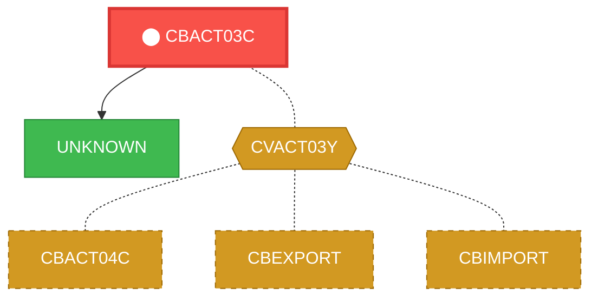
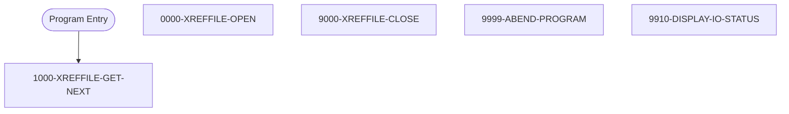

# Program: CBACT03C

---

## Quick Reference

| Attribute | Value |
|-----------|-------|
| Program ID | `CBACT03C` |
| Type | BATCH |
| Lines | 179 |
| Source | [CBACT03C.cbl](../carddemo/CBACT03C.cbl#L1) |
| Paragraphs | 5 |
| Statements | 20 |
| Impact Risk | **HIGH** — 13 programs affected |

> **View Source:** [Open CBACT03C.cbl](../carddemo/CBACT03C.cbl#L1)

## Dependency Context

> This section shows how **CBACT03C** connects to the rest of the system — who calls it,
> what it calls, and what data it shares. If linked programs exist, they must appear here.

### Programs That Call CBACT03C (Callers)

*No programs call CBACT03C — this is likely a top-level entry point or CICS transaction starter.*

### Programs Called by CBACT03C (Callees)

| Called Program | Type | Line | Why |
|----------------|------|------|-----|
| [UNKNOWN](UNKNOWN.md) | None | 169 |  |

### Shared Data (Copybooks & Files)

#### Shared Copybooks

| Copybook | Also Used By | # Co-Users |
|----------|-------------|------------|
| `CVACT03Y` | CBACT04C, CBEXPORT, CBIMPORT, CBSTM03A, CBTRN01C (+8 more) | 13 |

---

## Dependency Graph

> **Legend:** 🔴 Target program · 🔵 Direct callers · 🟢 Direct callees · 🟡 Copybook-coupled · ⚫ Transitive (indirect)

---

## Impact Ripple View

> **If you change CBACT03C, what else could break?**

| Impact Metric | Count |
|--------------|-------|
| Direct Callers | 0 |
| Transitive Callers (callers of callers) | 0 |
| Direct Callees | 0 |
| Transitive Callees | 0 |
| Copybook-Coupled Programs | 13 |
| **Total Impact** | **13** |
| **Risk Rating** | **HIGH** |

**Programs affected via shared copybooks:**
- `CBACT04C`
- `CBEXPORT`
- `CBIMPORT`
- `CBSTM03A`
- `CBTRN01C`
- `CBTRN02C`
- `CBTRN03C`
- `COACTUPC`
- `COACTVWC`
- `COBIL00C`
- `COPAUA0C`
- `COPAUS0C`
- `COTRN02C`

---

## Statement Profile

| Statement Type | Count |
|---------------|-------|
| IF | 7 |
| EXIT | 4 |
| MOVE | 3 |
| READ | 1 |
| OPEN | 1 |
| DISPLAY | 1 |
| CLOSE | 1 |
| CALL | 1 |
| ARITHMETIC | 1 |

## Control Flow

## Paragraphs

### 1000-XREFFILE-GET-NEXT

| | |
|---|---|
| **Paragraph** | `1000-XREFFILE-GET-NEXT` |
| **Lines** | 103 - 127 |
| **View Code** | [Jump to Line 103](../carddemo/CBACT03C.cbl#L103) |

### 0000-XREFFILE-OPEN

| | |
|---|---|
| **Paragraph** | `0000-XREFFILE-OPEN` |
| **Lines** | 129 - 145 |
| **View Code** | [Jump to Line 129](../carddemo/CBACT03C.cbl#L129) |

### 9000-XREFFILE-CLOSE

| | |
|---|---|
| **Paragraph** | `9000-XREFFILE-CLOSE` |
| **Lines** | 147 - 163 |
| **View Code** | [Jump to Line 147](../carddemo/CBACT03C.cbl#L147) |

### 9999-ABEND-PROGRAM

| | |
|---|---|
| **Paragraph** | `9999-ABEND-PROGRAM` |
| **Lines** | 165 - 169 |
| **View Code** | [Jump to Line 165](../carddemo/CBACT03C.cbl#L165) |

### 9910-DISPLAY-IO-STATUS

| | |
|---|---|
| **Paragraph** | `9910-DISPLAY-IO-STATUS` |
| **Lines** | 172 - 185 |
| **View Code** | [Jump to Line 172](../carddemo/CBACT03C.cbl#L172) |

## Executed by JCL Jobs

This program is run by the following batch JCL jobs:

| Job Name | Step | Step Comments |
|----------|------|---------------|
| [READXREF](../jcl/READXREF.md) | `STEP05` | *****************************************************************
Copyright Amaz... |

## Business Rules

- **Cross-Reference File Read Error** `BR-069`  
  If there is a problem reading a record from the card cross-reference file, the system should display an error message indicating the file status.  
  [View Rule Details](../business-rules/BR-069.md)
- **End of Cross-Reference File Processing** `BR-070`  
  When the end of the card cross-reference file is reached, the system should close the file and proceed to the next step.  
  [View Rule Details](../business-rules/BR-070.md)
- **Cross-Reference File Open Successful** `BR-071`  
  The cross-reference file must open successfully before processing can continue.  
  [View Rule Details](../business-rules/BR-071.md)
- **Cross-Reference File Read Successful** `BR-072`  
  The cross-reference file must be read successfully.  
  [View Rule Details](../business-rules/BR-072.md)
- **Cross-Reference File Close Successful** `BR-073`  
  The cross-reference file should be closed successfully at the end of processing.  
  [View Rule Details](../business-rules/BR-073.md)
- **Handle Cross-Reference File Close Error** `BR-074`  
  If an error occurs while closing the cross-reference file, the program should handle the error.  
  [View Rule Details](../business-rules/BR-074.md)
- **Cross-Reference File Read Error** `BR-075`  
  If there is an issue reading the cross-reference file, the program will display an error message.  
  [View Rule Details](../business-rules/BR-075.md)
- **Cross-Reference File Write Error** `BR-076`  
  If there is an issue writing to the cross-reference file, the program will display an error message.  
  [View Rule Details](../business-rules/BR-076.md)

## Key Data Items

| Name | Level | Picture | Section | Business Name |
|------|-------|---------|---------|---------------|
| `CARD-XREF-RECORD` | 1 | `None` | WORKING-STORAGE | None |
| `XREF-CARD-NUM` | 5 | `X(16)` | WORKING-STORAGE | None |
| `XREF-CUST-ID` | 5 | `9(09)` | WORKING-STORAGE | None |
| `XREF-ACCT-ID` | 5 | `9(11)` | WORKING-STORAGE | None |
| `FILLER` | 5 | `X(14)` | WORKING-STORAGE | None |
| `XREFFILE-STATUS` | 1 | `None` | WORKING-STORAGE | None |
| `XREFFILE-STAT1` | 5 | `X` | WORKING-STORAGE | None |
| `XREFFILE-STAT2` | 5 | `X` | WORKING-STORAGE | None |
| `IO-STATUS` | 1 | `None` | WORKING-STORAGE | None |
| `IO-STAT1` | 5 | `X` | WORKING-STORAGE | None |
| `IO-STAT2` | 5 | `X` | WORKING-STORAGE | None |
| `TWO-BYTES-BINARY` | 1 | `9(4)` | WORKING-STORAGE | None |
| `TWO-BYTES-ALPHA` | 1 | `None` | WORKING-STORAGE | None |
| `TWO-BYTES-LEFT` | 5 | `X` | WORKING-STORAGE | None |
| `TWO-BYTES-RIGHT` | 5 | `X` | WORKING-STORAGE | None |
| `IO-STATUS-04` | 1 | `None` | WORKING-STORAGE | None |
| `IO-STATUS-0401` | 5 | `9` | WORKING-STORAGE | None |
| `IO-STATUS-0403` | 5 | `999` | WORKING-STORAGE | None |
| `APPL-RESULT` | 1 | `S9(9)` | WORKING-STORAGE | None |
| `APPL-AOK` | 88 | `None` | WORKING-STORAGE | None |
| `APPL-EOF` | 88 | `None` | WORKING-STORAGE | None |
| `END-OF-FILE` | 1 | `X(01)` | WORKING-STORAGE | None |
| `ABCODE` | 1 | `S9(9)` | WORKING-STORAGE | None |
| `TIMING` | 1 | `S9(9)` | WORKING-STORAGE | None |

---

*Generated 2026-03-16 21:06*