# Program: CBEXPORT

---

## Quick Reference

| Attribute | Value |
|-----------|-------|
| Program ID | `CBEXPORT` |
| Type | BATCH |
| Lines | 583 |
| Source | [CBEXPORT.cbl](../carddemo/CBEXPORT.cbl#L1) |
| Paragraphs | 21 |
| Statements | 182 |
| Impact Risk | **HIGH** — 24 programs affected |

> **View Source:** [Open CBEXPORT.cbl](../carddemo/CBEXPORT.cbl#L1)

## Dependency Context

> This section shows how **CBEXPORT** connects to the rest of the system — who calls it,
> what it calls, and what data it shares. If linked programs exist, they must appear here.

### Programs That Call CBEXPORT (Callers)

*No programs call CBEXPORT — this is likely a top-level entry point or CICS transaction starter.*

### Programs Called by CBEXPORT (Callees)

| Called Program | Type | Line | Why |
|----------------|------|------|-----|
| [UNKNOWN](UNKNOWN.md) | None | 774 |  |

### Shared Data (Copybooks & Files)

#### Shared Copybooks

| Copybook | Also Used By | # Co-Users |
|----------|-------------|------------|
| `CVACT01Y` | CBACT01C, CBACT04C, CBIMPORT, CBSTM03A, CBTRN01C (+8 more) | 13 |
| `CVACT02Y` | CBACT02C, CBIMPORT, CBTRN01C, COACTVWC, COCRDLIC (+4 more) | 9 |
| `CVACT03Y` | CBACT03C, CBACT04C, CBIMPORT, CBSTM03A, CBTRN01C (+8 more) | 13 |
| `CVCUS01Y` | CBCUS01C, CBIMPORT, CBTRN01C, COACTUPC, COACTVWC (+4 more) | 9 |
| `CVEXPORT` | CBIMPORT | 1 |
| `CVTRA05Y` | CBACT04C, CBIMPORT, CBTRN01C, CBTRN02C, CBTRN03C (+5 more) | 10 |

---

## Dependency Graph

```mermaid
flowchart TD
    CBEXPORT["⬤ CBEXPORT"]:::target
    UNKNOWN["UNKNOWN"]:::callee
    CBEXPORT --> UNKNOWN
    CB_CVACT01Y{{"CVACT01Y"}}:::copybook
    CBEXPORT -.- CB_CVACT01Y
    CBACT01C["CBACT01C"]:::coupled
    CB_CVACT01Y -.- CBACT01C
    CBACT04C["CBACT04C"]:::coupled
    CB_CVACT01Y -.- CBACT04C
    CBIMPORT["CBIMPORT"]:::coupled
    CB_CVACT01Y -.- CBIMPORT
    CB_CVACT02Y{{"CVACT02Y"}}:::copybook
    CBEXPORT -.- CB_CVACT02Y
    CBACT02C["CBACT02C"]:::coupled
    CB_CVACT02Y -.- CBACT02C
    CBIMPORT["CBIMPORT"]:::coupled
    CB_CVACT02Y -.- CBIMPORT
    CBTRN01C["CBTRN01C"]:::coupled
    CB_CVACT02Y -.- CBTRN01C
    CB_CVACT03Y{{"CVACT03Y"}}:::copybook
    CBEXPORT -.- CB_CVACT03Y
    CBACT03C["CBACT03C"]:::coupled
    CB_CVACT03Y -.- CBACT03C
    CBACT04C["CBACT04C"]:::coupled
    CB_CVACT03Y -.- CBACT04C
    CBIMPORT["CBIMPORT"]:::coupled
    CB_CVACT03Y -.- CBIMPORT
    CB_CVCUS01Y{{"CVCUS01Y"}}:::copybook
    CBEXPORT -.- CB_CVCUS01Y
    CBCUS01C["CBCUS01C"]:::coupled
    CB_CVCUS01Y -.- CBCUS01C
    CBIMPORT["CBIMPORT"]:::coupled
    CB_CVCUS01Y -.- CBIMPORT
    CBTRN01C["CBTRN01C"]:::coupled
    CB_CVCUS01Y -.- CBTRN01C
    CB_CVEXPORT{{"CVEXPORT"}}:::copybook
    CBEXPORT -.- CB_CVEXPORT
    CBIMPORT["CBIMPORT"]:::coupled
    CB_CVEXPORT -.- CBIMPORT
    CB_CVTRA05Y{{"CVTRA05Y"}}:::copybook
    CBEXPORT -.- CB_CVTRA05Y
    CBACT04C["CBACT04C"]:::coupled
    CB_CVTRA05Y -.- CBACT04C
    CBIMPORT["CBIMPORT"]:::coupled
    CB_CVTRA05Y -.- CBIMPORT
    CBTRN01C["CBTRN01C"]:::coupled
    CB_CVTRA05Y -.- CBTRN01C

    classDef target fill:#f85149,stroke:#da3633,color:#fff,stroke-width:3px
    classDef caller fill:#58a6ff,stroke:#1f6feb,color:#fff
    classDef callee fill:#3fb950,stroke:#238636,color:#fff
    classDef copybook fill:#d29922,stroke:#9e6a03,color:#fff
    classDef coupled fill:#d29922,stroke:#9e6a03,color:#fff,stroke-dasharray:5
    classDef transitive fill:#484f58,stroke:#8b949e,color:#c9d1d9,stroke-dasharray:5
```

> **Legend:** 🔴 Target program · 🔵 Direct callers · 🟢 Direct callees · 🟡 Copybook-coupled · ⚫ Transitive (indirect)

---

## Impact Ripple View

> **If you change CBEXPORT, what else could break?**

| Impact Metric | Count |
|--------------|-------|
| Direct Callers | 0 |
| Transitive Callers (callers of callers) | 0 |
| Direct Callees | 0 |
| Transitive Callees | 0 |
| Copybook-Coupled Programs | 24 |
| **Total Impact** | **24** |
| **Risk Rating** | **HIGH** |

**Programs affected via shared copybooks:**
- `CBACT01C`
- `CBACT02C`
- `CBACT03C`
- `CBACT04C`
- `CBCUS01C`
- `CBIMPORT`
- `CBSTM03A`
- `CBTRN01C`
- `CBTRN02C`
- `CBTRN03C`
- `COACCT01`
- `COACTUPC`
- `COACTVWC`
- `COBIL00C`
- `COCRDLIC`
- `COCRDSLC`
- `COCRDUPC`
- `COPAUA0C`
- `COPAUS0C`
- `CORPT00C`
- `COTRN00C`
- `COTRN01C`
- `COTRN02C`
- `COTRTLIC`

---

## Statement Profile

| Statement Type | Count |
|---------------|-------|
| MOVE | 77 |
| DISPLAY | 21 |
| PERFORM | 19 |
| IF | 16 |
| ARITHMETIC | 15 |
| OPEN | 6 |
| CLOSE | 6 |
| WRITE | 5 |
| READ | 5 |
| INITIALIZE | 5 |
| STRING_OP | 3 |
| ACCEPT | 2 |
| GOBACK | 1 |
| CALL | 1 |

## Control Flow

```mermaid
flowchart TD
    START([Program Entry])
    0000_MAIN_PROCESSING["0000-MAIN-PROCESSING"]
    1000_INITIALIZE["1000-INITIALIZE"]
    1050_GENERATE_TIMESTAMP["1050-GENERATE-TIMESTAMP"]
    1100_OPEN_FILES["1100-OPEN-FILES"]
    2000_EXPORT_CUSTOMERS["2000-EXPORT-CUSTOMERS"]
    2100_READ_CUSTOMER_RECORD["2100-READ-CUSTOMER-RECORD"]
    2200_CREATE_CUSTOMER_EXP_REC["2200-CREATE-CUSTOMER-EXP-REC"]
    3000_EXPORT_ACCOUNTS["3000-EXPORT-ACCOUNTS"]
    3100_READ_ACCOUNT_RECORD["3100-READ-ACCOUNT-RECORD"]
    3200_CREATE_ACCOUNT_EXP_REC["3200-CREATE-ACCOUNT-EXP-REC"]
    4000_EXPORT_XREFS["4000-EXPORT-XREFS"]
    4100_READ_XREF_RECORD["4100-READ-XREF-RECORD"]
    4200_CREATE_XREF_EXPORT_RECORD["4200-CREATE-XREF-EXPORT-RECORD"]
    5000_EXPORT_TRANSACTIONS["5000-EXPORT-TRANSACTIONS"]
    5100_READ_TRANSACTION_RECORD["5100-READ-TRANSACTION-RECORD"]
    START --> 0000_MAIN_PROCESSING
    0000_MAIN_PROCESSING --> INLINE
    1000_INITIALIZE --> INLINE
    2000_EXPORT_CUSTOMERS --> INLINE
    3000_EXPORT_ACCOUNTS --> INLINE
    4000_EXPORT_XREFS --> INLINE
    5000_EXPORT_TRANSACTIONS --> INLINE
    5500_EXPORT_CARDS --> INLINE
```

## Paragraphs

### 0000-MAIN-PROCESSING

| | |
|---|---|
| **Paragraph** | `0000-MAIN-PROCESSING` |
| **Lines** | 344 - 353 |
| **View Code** | [Jump to Line 344](../carddemo/CBEXPORT.cbl#L344) |

### 1000-INITIALIZE

| | |
|---|---|
| **Paragraph** | `1000-INITIALIZE` |
| **Lines** | 356 - 364 |
| **View Code** | [Jump to Line 356](../carddemo/CBEXPORT.cbl#L356) |

### 1050-GENERATE-TIMESTAMP

| | |
|---|---|
| **Paragraph** | `1050-GENERATE-TIMESTAMP` |
| **Lines** | 367 - 390 |
| **View Code** | [Jump to Line 367](../carddemo/CBEXPORT.cbl#L367) |

### 1100-OPEN-FILES

| | |
|---|---|
| **Paragraph** | `1100-OPEN-FILES` |
| **Lines** | 393 - 435 |
| **View Code** | [Jump to Line 393](../carddemo/CBEXPORT.cbl#L393) |

### 2000-EXPORT-CUSTOMERS

| | |
|---|---|
| **Paragraph** | `2000-EXPORT-CUSTOMERS` |
| **Lines** | 438 - 450 |
| **View Code** | [Jump to Line 438](../carddemo/CBEXPORT.cbl#L438) |

### 2100-READ-CUSTOMER-RECORD

| | |
|---|---|
| **Paragraph** | `2100-READ-CUSTOMER-RECORD` |
| **Lines** | 453 - 461 |
| **View Code** | [Jump to Line 453](../carddemo/CBEXPORT.cbl#L453) |

### 2200-CREATE-CUSTOMER-EXP-REC

| | |
|---|---|
| **Paragraph** | `2200-CREATE-CUSTOMER-EXP-REC` |
| **Lines** | 464 - 505 |
| **View Code** | [Jump to Line 464](../carddemo/CBEXPORT.cbl#L464) |

### 3000-EXPORT-ACCOUNTS

| | |
|---|---|
| **Paragraph** | `3000-EXPORT-ACCOUNTS` |
| **Lines** | 507 - 519 |
| **View Code** | [Jump to Line 507](../carddemo/CBEXPORT.cbl#L507) |

### 3100-READ-ACCOUNT-RECORD

| | |
|---|---|
| **Paragraph** | `3100-READ-ACCOUNT-RECORD` |
| **Lines** | 522 - 530 |
| **View Code** | [Jump to Line 522](../carddemo/CBEXPORT.cbl#L522) |

### 3200-CREATE-ACCOUNT-EXP-REC

| | |
|---|---|
| **Paragraph** | `3200-CREATE-ACCOUNT-EXP-REC` |
| **Lines** | 533 - 568 |
| **View Code** | [Jump to Line 533](../carddemo/CBEXPORT.cbl#L533) |

### 4000-EXPORT-XREFS

| | |
|---|---|
| **Paragraph** | `4000-EXPORT-XREFS` |
| **Lines** | 571 - 583 |
| **View Code** | [Jump to Line 571](../carddemo/CBEXPORT.cbl#L571) |

### 4100-READ-XREF-RECORD

| | |
|---|---|
| **Paragraph** | `4100-READ-XREF-RECORD` |
| **Lines** | 586 - 594 |
| **View Code** | [Jump to Line 586](../carddemo/CBEXPORT.cbl#L586) |

### 4200-CREATE-XREF-EXPORT-RECORD

| | |
|---|---|
| **Paragraph** | `4200-CREATE-XREF-EXPORT-RECORD` |
| **Lines** | 597 - 623 |
| **View Code** | [Jump to Line 597](../carddemo/CBEXPORT.cbl#L597) |

### 5000-EXPORT-TRANSACTIONS

| | |
|---|---|
| **Paragraph** | `5000-EXPORT-TRANSACTIONS` |
| **Lines** | 626 - 638 |
| **View Code** | [Jump to Line 626](../carddemo/CBEXPORT.cbl#L626) |

### 5100-READ-TRANSACTION-RECORD

| | |
|---|---|
| **Paragraph** | `5100-READ-TRANSACTION-RECORD` |
| **Lines** | 641 - 649 |
| **View Code** | [Jump to Line 641](../carddemo/CBEXPORT.cbl#L641) |

### 5200-CREATE-TRAN-EXP-REC

| | |
|---|---|
| **Paragraph** | `5200-CREATE-TRAN-EXP-REC` |
| **Lines** | 652 - 688 |
| **View Code** | [Jump to Line 652](../carddemo/CBEXPORT.cbl#L652) |

### 5500-EXPORT-CARDS

| | |
|---|---|
| **Paragraph** | `5500-EXPORT-CARDS` |
| **Lines** | 691 - 703 |
| **View Code** | [Jump to Line 691](../carddemo/CBEXPORT.cbl#L691) |

### 5600-READ-CARD-RECORD

| | |
|---|---|
| **Paragraph** | `5600-READ-CARD-RECORD` |
| **Lines** | 706 - 714 |
| **View Code** | [Jump to Line 706](../carddemo/CBEXPORT.cbl#L706) |

### 5700-CREATE-CARD-EXPORT-RECORD

| | |
|---|---|
| **Paragraph** | `5700-CREATE-CARD-EXPORT-RECORD` |
| **Lines** | 717 - 746 |
| **View Code** | [Jump to Line 717](../carddemo/CBEXPORT.cbl#L717) |

### 6000-FINALIZE

| | |
|---|---|
| **Paragraph** | `6000-FINALIZE` |
| **Lines** | 749 - 768 |
| **View Code** | [Jump to Line 749](../carddemo/CBEXPORT.cbl#L749) |

### 9999-ABEND-PROGRAM

| | |
|---|---|
| **Paragraph** | `9999-ABEND-PROGRAM` |
| **Lines** | 771 - 774 |
| **View Code** | [Jump to Line 771](../carddemo/CBEXPORT.cbl#L771) |

## Executed by JCL Jobs

This program is run by the following batch JCL jobs:

| Job Name | Step | Step Comments |
|----------|------|---------------|
| [CBEXPORT](../jcl/CBEXPORT.md) | `STEP02` | *******************************************************************
STEP 2: RUN ... |

## Business Rules

- **Customer File Open Status Check** `BR-117`  
  The export process cannot proceed if the customer file is not successfully opened.  
  [View Rule Details](../business-rules/BR-117.md)
- **Account File Open Status Check** `BR-118`  
  The export process cannot proceed if the account file is not successfully opened.  
  [View Rule Details](../business-rules/BR-118.md)
- **Cross-Reference File Open Status Check** `BR-119`  
  The export process cannot proceed if the cross-reference file is not successfully opened.  
  [View Rule Details](../business-rules/BR-119.md)
- **Transaction File Open Status Check** `BR-120`  
  The export process cannot proceed if the transaction file is not successfully opened.  
  [View Rule Details](../business-rules/BR-120.md)
- **Export File Open Status Check** `BR-121`  
  The export process cannot proceed if the export file is not successfully opened.  
  [View Rule Details](../business-rules/BR-121.md)
- **Timestamp File Open Status Check** `BR-122`  
  The export process cannot proceed if the timestamp file is not successfully opened.  
  [View Rule Details](../business-rules/BR-122.md)
- **Invalid Customer Record** `BR-123`  
  If a customer record is invalid, it is rejected and not included in the export file.  
  [View Rule Details](../business-rules/BR-123.md)
- **Populate Customer Export Record** `BR-124`  
  When creating a customer export record, populate the record with data from the customer file.  
  [View Rule Details](../business-rules/BR-124.md)
- **Account Record Read Error** `BR-125`  
  If there is an error reading an account record, the export process will stop.  
  [View Rule Details](../business-rules/BR-125.md)
- **Populate Account Export Record** `BR-126`  
  Populate the account export record with data from the account file.  
  [View Rule Details](../business-rules/BR-126.md)
- **Cross-Reference Record Processing** `BR-127`  
  If a cross-reference record is successfully read, process it for inclusion in the export file.  
  [View Rule Details](../business-rules/BR-127.md)
- **Populate Cross-Reference Export Record** `BR-128`  
  When creating a cross-reference export record, populate it with data from the source records.  
  [View Rule Details](../business-rules/BR-128.md)
- **Transaction Amount Validation** `BR-129`  
  If a transaction amount is negative, the transaction is considered invalid and should not be included in the export file.  
  [View Rule Details](../business-rules/BR-129.md)
- **Populate Transaction Export Record** `BR-130`  
  When creating a transaction export record, populate the record with data from the source transaction record.  
  [View Rule Details](../business-rules/BR-130.md)
- **Invalid Card Record Handling** `BR-131`  
  If a card record is invalid, the system should log the error and continue processing.  
  [View Rule Details](../business-rules/BR-131.md)
- **Populate Export Record - Customer Data** `BR-132`  
  When creating an export record, populate the customer-related fields in the export record with the corresponding data from the customer record.  
  [View Rule Details](../business-rules/BR-132.md)
- **Populate Export Record - Account Data** `BR-133`  
  When creating an export record, populate the account-related fields in the export record with the corresponding data from the account record.  
  [View Rule Details](../business-rules/BR-133.md)
- **Populate Export Record - Cross-Reference Data** `BR-134`  
  When creating an export record, populate the cross-reference fields in the export record with the corresponding data from the cross-reference record.  
  [View Rule Details](../business-rules/BR-134.md)
- **Populate Export Record - Transaction Data** `BR-135`  
  When creating an export record, populate the transaction-related fields in the export record with the corresponding data from the transaction record.  
  [View Rule Details](../business-rules/BR-135.md)

## Key Data Items

| Name | Level | Picture | Section | Business Name |
|------|-------|---------|---------|---------------|
| `EXPORT-RECORD` | 1 | `None` | WORKING-STORAGE | None |
| `EXPORT-REC-TYPE` | 5 | `X(1)` | WORKING-STORAGE | None |
| `EXPORT-TIMESTAMP` | 5 | `X(26)` | WORKING-STORAGE | None |
| `EXPORT-TIMESTAMP-R` | 5 | `None` | WORKING-STORAGE | None |
| `EXPORT-DATE` | 10 | `X(10)` | WORKING-STORAGE | None |
| `EXPORT-DATE-TIME-SEP` | 10 | `X(1)` | WORKING-STORAGE | None |
| `EXPORT-TIME` | 10 | `X(15)` | WORKING-STORAGE | None |
| `EXPORT-SEQUENCE-NUM` | 5 | `9(9)` | WORKING-STORAGE | None |
| `EXPORT-BRANCH-ID` | 5 | `X(4)` | WORKING-STORAGE | None |
| `EXPORT-REGION-CODE` | 5 | `X(5)` | WORKING-STORAGE | None |
| `EXPORT-RECORD-DATA` | 5 | `X(460)` | WORKING-STORAGE | None |
| `EXPORT-CUSTOMER-DATA` | 5 | `None` | WORKING-STORAGE | None |
| `EXP-CUST-ID` | 10 | `9(09)` | WORKING-STORAGE | None |
| `EXP-CUST-FIRST-NAME` | 10 | `X(25)` | WORKING-STORAGE | None |
| `EXP-CUST-MIDDLE-NAME` | 10 | `X(25)` | WORKING-STORAGE | None |
| `EXP-CUST-LAST-NAME` | 10 | `X(25)` | WORKING-STORAGE | None |
| `EXP-CUST-ADDR-LINES` | 10 | `None` | WORKING-STORAGE | None |
| `EXP-CUST-ADDR-LINE` | 15 | `X(50)` | WORKING-STORAGE | None |
| `EXP-CUST-ADDR-STATE-CD` | 10 | `X(02)` | WORKING-STORAGE | None |
| `EXP-CUST-ADDR-COUNTRY-CD` | 10 | `X(03)` | WORKING-STORAGE | None |
| `EXP-CUST-ADDR-ZIP` | 10 | `X(10)` | WORKING-STORAGE | None |
| `EXP-CUST-PHONE-NUMS` | 10 | `None` | WORKING-STORAGE | None |
| `EXP-CUST-PHONE-NUM` | 15 | `X(15)` | WORKING-STORAGE | None |
| `EXP-CUST-SSN` | 10 | `9(09)` | WORKING-STORAGE | None |
| `EXP-CUST-GOVT-ISSUED-ID` | 10 | `X(20)` | WORKING-STORAGE | None |
| `EXP-CUST-DOB-YYYY-MM-DD` | 10 | `X(10)` | WORKING-STORAGE | None |
| `EXP-CUST-EFT-ACCOUNT-ID` | 10 | `X(10)` | WORKING-STORAGE | None |
| `EXP-CUST-PRI-CARD-HOLDER-IND` | 10 | `X(01)` | WORKING-STORAGE | None |
| `EXP-CUST-FICO-CREDIT-SCORE` | 10 | `9(03)` | WORKING-STORAGE | None |
| `FILLER` | 10 | `X(134)` | WORKING-STORAGE | None |
| `EXPORT-ACCOUNT-DATA` | 5 | `None` | WORKING-STORAGE | None |
| `EXP-ACCT-ID` | 10 | `9(11)` | WORKING-STORAGE | None |
| `EXP-ACCT-ACTIVE-STATUS` | 10 | `X(01)` | WORKING-STORAGE | None |
| `EXP-ACCT-CURR-BAL` | 10 | `S9(10)V99` | WORKING-STORAGE | None |
| `EXP-ACCT-CREDIT-LIMIT` | 10 | `S9(10)V99` | WORKING-STORAGE | None |
| `EXP-ACCT-CASH-CREDIT-LIMIT` | 10 | `S9(10)V99` | WORKING-STORAGE | None |
| `EXP-ACCT-OPEN-DATE` | 10 | `X(10)` | WORKING-STORAGE | None |
| `EXP-ACCT-EXPIRAION-DATE` | 10 | `X(10)` | WORKING-STORAGE | None |
| `EXP-ACCT-REISSUE-DATE` | 10 | `X(10)` | WORKING-STORAGE | None |
| `EXP-ACCT-CURR-CYC-CREDIT` | 10 | `S9(10)V99` | WORKING-STORAGE | None |

*Showing 40 of 112 data items. See [Data Dictionary](../data-dictionary.md).*

---

*Generated 2026-03-16 21:06*