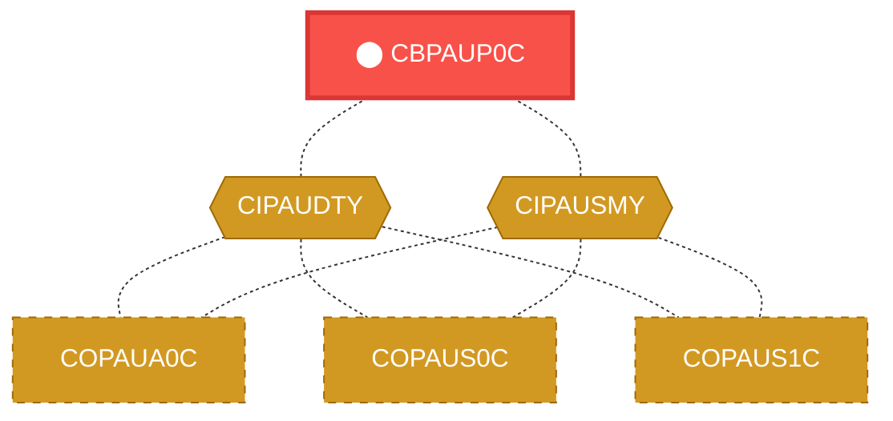

# Program: CBPAUP0C

---

## Quick Reference

| Attribute | Value |
|-----------|-------|
| Program ID | `CBPAUP0C` |
| Type | BATCH |
| Lines | 387 |
| Source | [CBPAUP0C.cbl](../carddemo/CBPAUP0C.cbl#L1) |
| Paragraphs | 18 |
| Statements | 0 |
| Impact Risk | **MEDIUM** — 7 programs affected |

> **View Source:** [Open CBPAUP0C.cbl](../carddemo/CBPAUP0C.cbl#L1)

## Dependency Context

> This section shows how **CBPAUP0C** connects to the rest of the system — who calls it,
> what it calls, and what data it shares. If linked programs exist, they must appear here.

### Programs That Call CBPAUP0C (Callers)

*No programs call CBPAUP0C — this is likely a top-level entry point or CICS transaction starter.*

### Programs Called by CBPAUP0C (Callees)

*CBPAUP0C does not call any other programs (leaf program).*

### Shared Data (Copybooks & Files)

#### Shared Copybooks

| Copybook | Also Used By | # Co-Users |
|----------|-------------|------------|
| `CIPAUDTY` | COPAUA0C, COPAUS0C, COPAUS1C, COPAUS2C, DBUNLDGS (+2 more) | 7 |
| `CIPAUSMY` | COPAUA0C, COPAUS0C, COPAUS1C, DBUNLDGS, PAUDBLOD (+1 more) | 6 |

---

## Dependency Graph

> **Legend:** 🔴 Target program · 🔵 Direct callers · 🟢 Direct callees · 🟡 Copybook-coupled · ⚫ Transitive (indirect)

---

## Impact Ripple View

> **If you change CBPAUP0C, what else could break?**

| Impact Metric | Count |
|--------------|-------|
| Direct Callers | 0 |
| Transitive Callers (callers of callers) | 0 |
| Direct Callees | 0 |
| Transitive Callees | 0 |
| Copybook-Coupled Programs | 7 |
| **Total Impact** | **7** |
| **Risk Rating** | **MEDIUM** |

**Programs affected via shared copybooks:**
- `COPAUA0C`
- `COPAUS0C`
- `COPAUS1C`
- `COPAUS2C`
- `DBUNLDGS`
- `PAUDBLOD`
- `PAUDBUNL`

---

## Statement Profile

## Control Flow

```mermaid
flowchart TD
    START([Program Entry])
    FILE_CONTROL["FILE-CONTROL"]
    MAIN_PARA["MAIN-PARA"]
    1000_INITIALIZE["1000-INITIALIZE"]
    1000_EXIT["1000-EXIT"]
    2000_FIND_NEXT_AUTH_SUMMARY["2000-FIND-NEXT-AUTH-SUMMARY"]
    2000_EXIT["2000-EXIT"]
    3000_FIND_NEXT_AUTH_DTL["3000-FIND-NEXT-AUTH-DTL"]
    3000_EXIT["3000-EXIT"]
    4000_CHECK_IF_EXPIRED["4000-CHECK-IF-EXPIRED"]
    4000_EXIT["4000-EXIT"]
    5000_DELETE_AUTH_DTL["5000-DELETE-AUTH-DTL"]
    5000_EXIT["5000-EXIT"]
    6000_DELETE_AUTH_SUMMARY["6000-DELETE-AUTH-SUMMARY"]
    6000_EXIT["6000-EXIT"]
    9000_TAKE_CHECKPOINT["9000-TAKE-CHECKPOINT"]
    START --> FILE_CONTROL
    MAIN --> 1000_INITIALIZE
    MAIN --> 2000_FIND_NEXT_AUTH_SUMMARY
    MAIN --> UNTIL
    MAIN --> 3000_FIND_NEXT_AUTH_DTL
    MAIN --> 4000_CHECK_IF_EXPIRED
    MAIN --> 5000_DELETE_AUTH_DTL
    MAIN --> 6000_DELETE_AUTH_SUMMARY
    MAIN --> 9000_TAKE_CHECKPOINT
    MAIN --> 9999_ABEND
```

## Paragraphs

### FILE-CONTROL

| | |
|---|---|
| **Paragraph** | `FILE-CONTROL` |
| **Lines** | 30 - 135 |
| **View Code** | [Jump to Line 30](../carddemo/CBPAUP0C.cbl#L30) |

### MAIN-PARA

| | |
|---|---|
| **Paragraph** | `MAIN-PARA` |
| **Lines** | 136 - 182 |
| **View Code** | [Jump to Line 136](../carddemo/CBPAUP0C.cbl#L136) |

### 1000-INITIALIZE

| | |
|---|---|
| **Paragraph** | `1000-INITIALIZE` |
| **Lines** | 183 - 211 |
| **View Code** | [Jump to Line 183](../carddemo/CBPAUP0C.cbl#L183) |

### 1000-EXIT

| | |
|---|---|
| **Paragraph** | `1000-EXIT` |
| **Lines** | 212 - 215 |
| **View Code** | [Jump to Line 212](../carddemo/CBPAUP0C.cbl#L212) |

### 2000-FIND-NEXT-AUTH-SUMMARY

| | |
|---|---|
| **Paragraph** | `2000-FIND-NEXT-AUTH-SUMMARY` |
| **Lines** | 216 - 242 |
| **View Code** | [Jump to Line 216](../carddemo/CBPAUP0C.cbl#L216) |

### 2000-EXIT

| | |
|---|---|
| **Paragraph** | `2000-EXIT` |
| **Lines** | 243 - 247 |
| **View Code** | [Jump to Line 243](../carddemo/CBPAUP0C.cbl#L243) |

### 3000-FIND-NEXT-AUTH-DTL

| | |
|---|---|
| **Paragraph** | `3000-FIND-NEXT-AUTH-DTL` |
| **Lines** | 248 - 272 |
| **View Code** | [Jump to Line 248](../carddemo/CBPAUP0C.cbl#L248) |

### 3000-EXIT

| | |
|---|---|
| **Paragraph** | `3000-EXIT` |
| **Lines** | 273 - 276 |
| **View Code** | [Jump to Line 273](../carddemo/CBPAUP0C.cbl#L273) |

### 4000-CHECK-IF-EXPIRED

| | |
|---|---|
| **Paragraph** | `4000-CHECK-IF-EXPIRED` |
| **Lines** | 277 - 298 |
| **View Code** | [Jump to Line 277](../carddemo/CBPAUP0C.cbl#L277) |

### 4000-EXIT

| | |
|---|---|
| **Paragraph** | `4000-EXIT` |
| **Lines** | 299 - 302 |
| **View Code** | [Jump to Line 299](../carddemo/CBPAUP0C.cbl#L299) |

### 5000-DELETE-AUTH-DTL

| | |
|---|---|
| **Paragraph** | `5000-DELETE-AUTH-DTL` |
| **Lines** | 303 - 323 |
| **View Code** | [Jump to Line 303](../carddemo/CBPAUP0C.cbl#L303) |

### 5000-EXIT

| | |
|---|---|
| **Paragraph** | `5000-EXIT` |
| **Lines** | 324 - 327 |
| **View Code** | [Jump to Line 324](../carddemo/CBPAUP0C.cbl#L324) |

### 6000-DELETE-AUTH-SUMMARY

| | |
|---|---|
| **Paragraph** | `6000-DELETE-AUTH-SUMMARY` |
| **Lines** | 328 - 347 |
| **View Code** | [Jump to Line 328](../carddemo/CBPAUP0C.cbl#L328) |

### 6000-EXIT

| | |
|---|---|
| **Paragraph** | `6000-EXIT` |
| **Lines** | 348 - 351 |
| **View Code** | [Jump to Line 348](../carddemo/CBPAUP0C.cbl#L348) |

### 9000-TAKE-CHECKPOINT

| | |
|---|---|
| **Paragraph** | `9000-TAKE-CHECKPOINT` |
| **Lines** | 352 - 372 |
| **View Code** | [Jump to Line 352](../carddemo/CBPAUP0C.cbl#L352) |

### 9000-EXIT

| | |
|---|---|
| **Paragraph** | `9000-EXIT` |
| **Lines** | 373 - 376 |
| **View Code** | [Jump to Line 373](../carddemo/CBPAUP0C.cbl#L373) |

### 9999-ABEND

| | |
|---|---|
| **Paragraph** | `9999-ABEND` |
| **Lines** | 377 - 384 |
| **View Code** | [Jump to Line 377](../carddemo/CBPAUP0C.cbl#L377) |

### 9999-EXIT

| | |
|---|---|
| **Paragraph** | `9999-EXIT` |
| **Lines** | 385 - 387 |
| **View Code** | [Jump to Line 385](../carddemo/CBPAUP0C.cbl#L385) |

## Business Rules

*No business rules extracted yet. Run LLM enrichment to extract rules from IF/EVALUATE logic.*

## Key Data Items

*No data items found for this program.*

---

*Generated 2026-04-28 20:00*