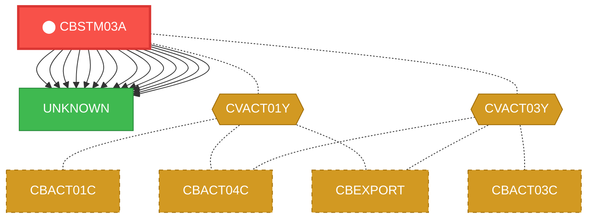

# Program: CBSTM03A

---

## Quick Reference

| Attribute | Value |
|-----------|-------|
| Program ID | `CBSTM03A` |
| Type | BATCH |
| Lines | 925 |
| Source | [CBSTM03A.CBL](../carddemo/CBSTM03A.CBL#L1) |
| Paragraphs | 25 |
| Statements | 320 |
| Impact Risk | **HIGH** — 15 programs affected |

> **View Source:** [Open CBSTM03A.CBL](../carddemo/CBSTM03A.CBL#L1)

## Dependency Context

> This section shows how **CBSTM03A** connects to the rest of the system — who calls it,
> what it calls, and what data it shares. If linked programs exist, they must appear here.

### Programs That Call CBSTM03A (Callers)

*No programs call CBSTM03A — this is likely a top-level entry point or CICS transaction starter.*

### Programs Called by CBSTM03A (Callees)

| Called Program | Type | Line | Why |
|----------------|------|------|-----|
| [UNKNOWN](UNKNOWN.md) | None | 435 |  |
| [UNKNOWN](UNKNOWN.md) | None | 461 |  |
| [UNKNOWN](UNKNOWN.md) | None | 485 |  |
| [UNKNOWN](UNKNOWN.md) | None | 818 |  |
| [UNKNOWN](UNKNOWN.md) | None | 830 |  |
| [UNKNOWN](UNKNOWN.md) | None | 853 |  |
| [UNKNOWN](UNKNOWN.md) | None | 871 |  |
| [UNKNOWN](UNKNOWN.md) | None | 889 |  |
| [UNKNOWN](UNKNOWN.md) | None | 919 |  |
| [UNKNOWN](UNKNOWN.md) | None | 944 |  |
| [UNKNOWN](UNKNOWN.md) | None | 961 |  |
| [UNKNOWN](UNKNOWN.md) | None | 977 |  |
| [UNKNOWN](UNKNOWN.md) | None | 993 |  |
| [UNKNOWN](UNKNOWN.md) | None | 1007 |  |

### Shared Data (Copybooks & Files)

#### Shared Copybooks

| Copybook | Also Used By | # Co-Users |
|----------|-------------|------------|
| `COSTM01` |  | 0 |
| `CUSTREC` |  | 0 |
| `CVACT01Y` | CBACT01C, CBACT04C, CBEXPORT, CBIMPORT, CBTRN01C (+8 more) | 13 |
| `CVACT03Y` | CBACT03C, CBACT04C, CBEXPORT, CBIMPORT, CBTRN01C (+8 more) | 13 |

---

## Dependency Graph

> **Legend:** 🔴 Target program · 🔵 Direct callers · 🟢 Direct callees · 🟡 Copybook-coupled · ⚫ Transitive (indirect)

---

## Impact Ripple View

> **If you change CBSTM03A, what else could break?**

| Impact Metric | Count |
|--------------|-------|
| Direct Callers | 0 |
| Transitive Callers (callers of callers) | 0 |
| Direct Callees | 0 |
| Transitive Callees | 0 |
| Copybook-Coupled Programs | 15 |
| **Total Impact** | **15** |
| **Risk Rating** | **HIGH** |

**Programs affected via shared copybooks:**
- `CBACT01C`
- `CBACT03C`
- `CBACT04C`
- `CBEXPORT`
- `CBIMPORT`
- `CBTRN01C`
- `CBTRN02C`
- `CBTRN03C`
- `COACCT01`
- `COACTUPC`
- `COACTVWC`
- `COBIL00C`
- `COPAUA0C`
- `COPAUS0C`
- `COTRN02C`

---

## Statement Profile

| Statement Type | Count |
|---------------|-------|
| WRITE | 95 |
| SET | 77 |
| MOVE | 70 |
| EXIT | 17 |
| CALL | 14 |
| STRING_OP | 12 |
| IF | 10 |
| PERFORM | 8 |
| GOTO | 6 |
| EVALUATE | 5 |
| COMPUTE | 2 |
| INITIALIZE | 1 |
| GOBACK | 1 |
| DISPLAY | 1 |
| CLOSE | 1 |

## Control Flow

```mermaid
flowchart TD
    START([Program Entry])
    0000_START["0000-START"]
    1000_MAINLINE["1000-MAINLINE"]
    9999_GOBACK["9999-GOBACK"]
    1000_XREFFILE_GET_NEXT["1000-XREFFILE-GET-NEXT"]
    2000_CUSTFILE_GET["2000-CUSTFILE-GET"]
    3000_ACCTFILE_GET["3000-ACCTFILE-GET"]
    4000_TRNXFILE_GET["4000-TRNXFILE-GET"]
    5000_CREATE_STATEMENT["5000-CREATE-STATEMENT"]
    5100_WRITE_HTML_HEADER["5100-WRITE-HTML-HEADER"]
    5100_EXIT["5100-EXIT"]
    5200_WRITE_HTML_NMADBS["5200-WRITE-HTML-NMADBS"]
    5200_EXIT["5200-EXIT"]
    6000_WRITE_TRANS["6000-WRITE-TRANS"]
    8100_FILE_OPEN["8100-FILE-OPEN"]
    8100_TRNXFILE_OPEN["8100-TRNXFILE-OPEN"]
    START --> 0000_START
    1000_MAINLINE --> INLINE
    4000_TRNXFILE_GET --> INLINE
    5000_CREATE_STATEMENT --> INLINE
```

## Paragraphs

### 0000-START

| | |
|---|---|
| **Paragraph** | `0000-START` |
| **Lines** | 380 - 398 |
| **View Code** | [Jump to Line 380](../carddemo/CBSTM03A.CBL#L380) |

### 1000-MAINLINE

| | |
|---|---|
| **Paragraph** | `1000-MAINLINE` |
| **Lines** | 400 - 423 |
| **View Code** | [Jump to Line 400](../carddemo/CBSTM03A.CBL#L400) |

### 9999-GOBACK

| | |
|---|---|
| **Paragraph** | `9999-GOBACK` |
| **Lines** | 425 - 426 |
| **View Code** | [Jump to Line 425](../carddemo/CBSTM03A.CBL#L425) |

### 1000-XREFFILE-GET-NEXT

| | |
|---|---|
| **Paragraph** | `1000-XREFFILE-GET-NEXT` |
| **Lines** | 429 - 450 |
| **View Code** | [Jump to Line 429](../carddemo/CBSTM03A.CBL#L429) |

### 2000-CUSTFILE-GET

| | |
|---|---|
| **Paragraph** | `2000-CUSTFILE-GET` |
| **Lines** | 452 - 474 |
| **View Code** | [Jump to Line 452](../carddemo/CBSTM03A.CBL#L452) |

### 3000-ACCTFILE-GET

| | |
|---|---|
| **Paragraph** | `3000-ACCTFILE-GET` |
| **Lines** | 476 - 498 |
| **View Code** | [Jump to Line 476](../carddemo/CBSTM03A.CBL#L476) |

### 4000-TRNXFILE-GET

| | |
|---|---|
| **Paragraph** | `4000-TRNXFILE-GET` |
| **Lines** | 500 - 540 |
| **View Code** | [Jump to Line 500](../carddemo/CBSTM03A.CBL#L500) |

### 5000-CREATE-STATEMENT

| | |
|---|---|
| **Paragraph** | `5000-CREATE-STATEMENT` |
| **Lines** | 542 - 588 |
| **View Code** | [Jump to Line 542](../carddemo/CBSTM03A.CBL#L542) |

### 5100-WRITE-HTML-HEADER

| | |
|---|---|
| **Paragraph** | `5100-WRITE-HTML-HEADER` |
| **Lines** | 590 - 636 |
| **View Code** | [Jump to Line 590](../carddemo/CBSTM03A.CBL#L590) |

### 5100-EXIT

| | |
|---|---|
| **Paragraph** | `5100-EXIT` |
| **Lines** | 638 - 639 |
| **View Code** | [Jump to Line 638](../carddemo/CBSTM03A.CBL#L638) |

### 5200-WRITE-HTML-NMADBS

| | |
|---|---|
| **Paragraph** | `5200-WRITE-HTML-NMADBS` |
| **Lines** | 642 - 753 |
| **View Code** | [Jump to Line 642](../carddemo/CBSTM03A.CBL#L642) |

### 5200-EXIT

| | |
|---|---|
| **Paragraph** | `5200-EXIT` |
| **Lines** | 755 - 756 |
| **View Code** | [Jump to Line 755](../carddemo/CBSTM03A.CBL#L755) |

### 6000-WRITE-TRANS

| | |
|---|---|
| **Paragraph** | `6000-WRITE-TRANS` |
| **Lines** | 759 - 807 |
| **View Code** | [Jump to Line 759](../carddemo/CBSTM03A.CBL#L759) |

### 8100-FILE-OPEN

| | |
|---|---|
| **Paragraph** | `8100-FILE-OPEN` |
| **Lines** | 810 - 812 |
| **View Code** | [Jump to Line 810](../carddemo/CBSTM03A.CBL#L810) |

### 8100-TRNXFILE-OPEN

| | |
|---|---|
| **Paragraph** | `8100-TRNXFILE-OPEN` |
| **Lines** | 814 - 846 |
| **View Code** | [Jump to Line 814](../carddemo/CBSTM03A.CBL#L814) |

### 8200-XREFFILE-OPEN

| | |
|---|---|
| **Paragraph** | `8200-XREFFILE-OPEN` |
| **Lines** | 849 - 865 |
| **View Code** | [Jump to Line 849](../carddemo/CBSTM03A.CBL#L849) |

### 8300-CUSTFILE-OPEN

| | |
|---|---|
| **Paragraph** | `8300-CUSTFILE-OPEN` |
| **Lines** | 867 - 883 |
| **View Code** | [Jump to Line 867](../carddemo/CBSTM03A.CBL#L867) |

### 8400-ACCTFILE-OPEN

| | |
|---|---|
| **Paragraph** | `8400-ACCTFILE-OPEN` |
| **Lines** | 885 - 900 |
| **View Code** | [Jump to Line 885](../carddemo/CBSTM03A.CBL#L885) |

### 8500-READTRNX-READ

| | |
|---|---|
| **Paragraph** | `8500-READTRNX-READ` |
| **Lines** | 902 - 931 |
| **View Code** | [Jump to Line 902](../carddemo/CBSTM03A.CBL#L902) |

### 8599-EXIT

| | |
|---|---|
| **Paragraph** | `8599-EXIT` |
| **Lines** | 933 - 937 |
| **View Code** | [Jump to Line 933](../carddemo/CBSTM03A.CBL#L933) |

### 9100-TRNXFILE-CLOSE

| | |
|---|---|
| **Paragraph** | `9100-TRNXFILE-CLOSE` |
| **Lines** | 940 - 954 |
| **View Code** | [Jump to Line 940](../carddemo/CBSTM03A.CBL#L940) |

### 9200-XREFFILE-CLOSE

| | |
|---|---|
| **Paragraph** | `9200-XREFFILE-CLOSE` |
| **Lines** | 957 - 971 |
| **View Code** | [Jump to Line 957](../carddemo/CBSTM03A.CBL#L957) |

### 9300-CUSTFILE-CLOSE

| | |
|---|---|
| **Paragraph** | `9300-CUSTFILE-CLOSE` |
| **Lines** | 973 - 987 |
| **View Code** | [Jump to Line 973](../carddemo/CBSTM03A.CBL#L973) |

### 9400-ACCTFILE-CLOSE

| | |
|---|---|
| **Paragraph** | `9400-ACCTFILE-CLOSE` |
| **Lines** | 989 - 1003 |
| **View Code** | [Jump to Line 989](../carddemo/CBSTM03A.CBL#L989) |

### 9999-ABEND-PROGRAM

| | |
|---|---|
| **Paragraph** | `9999-ABEND-PROGRAM` |
| **Lines** | 1005 - 1007 |
| **View Code** | [Jump to Line 1005](../carddemo/CBSTM03A.CBL#L1005) |

## Executed by JCL Jobs

This program is run by the following batch JCL jobs:

| Job Name | Step | Step Comments |
|----------|------|---------------|
| [CREASTMT](../jcl/CREASTMT.md) | `STEP040` | ********************************************************************
PRODUCING R... |

## Business Rules

- **Transaction Type Validation** `BR-157`  
  Only transactions of type 'Credit', 'Debit', or 'Adjustment' are processed for inclusion in the customer statement.  
  [View Rule Details](../business-rules/BR-157.md)
- **Cross-Reference Record Found** `BR-158`  
  When a cross-reference record is successfully read, the card number, customer ID, and other relevant details are extracted for further processing.  
  [View Rule Details](../business-rules/BR-158.md)
- **Handle Invalid Customer Status** `BR-159`  
  If a customer's status is invalid, the system should proceed as if the customer is inactive.  
  [View Rule Details](../business-rules/BR-159.md)
- **Account Status Handling** `BR-160`  
  The system must handle different account statuses appropriately during statement generation.  
  [View Rule Details](../business-rules/BR-160.md)
- **Transaction Record Validation** `BR-161`  
  Only process transaction records with a valid transaction code.  
  [View Rule Details](../business-rules/BR-161.md)
- **Transaction Amount Limit** `BR-162`  
  Transactions exceeding a predefined amount limit are flagged for review.  
  [View Rule Details](../business-rules/BR-162.md)
- **Cross-Reference File Open Successful** `BR-163`  
  If the cross-reference file opens successfully, proceed to the next step in processing.  
  [View Rule Details](../business-rules/BR-163.md)
- **Cross-Reference File Open Unsuccessful** `BR-164`  
  If the cross-reference file fails to open, the statement generation process is terminated.  
  [View Rule Details](../business-rules/BR-164.md)
- **Customer File Open Error** `BR-165`  
  If the customer file cannot be opened, the statement generation process will stop.  
  [View Rule Details](../business-rules/BR-165.md)
- **Account File Open Status Check** `BR-166`  
  If the account file cannot be opened, the statement generation process cannot proceed.  
  [View Rule Details](../business-rules/BR-166.md)
- **Transaction Type Validation** `BR-167`  
  Only transactions of type 'P', 'D', 'W', or 'I' are included in the customer's monthly statement.  
  [View Rule Details](../business-rules/BR-167.md)
- **Transaction Code Handling** `BR-168`  
  Specific transaction codes trigger different descriptions to be displayed on the customer statement.  
  [View Rule Details](../business-rules/BR-168.md)
- **Transaction File Close Status** `BR-169`  
  If the transaction file is successfully closed, set the transaction file status to 'Closed Successfully'.  
  [View Rule Details](../business-rules/BR-169.md)
- **Transaction File Close Status Unsuccessful** `BR-170`  
  If the transaction file is not successfully closed, set the transaction file status to 'Close Unsuccessful'.  
  [View Rule Details](../business-rules/BR-170.md)
- **Cross-Reference File Close Status** `BR-171`  
  If the cross-reference file is successfully closed, proceed to the next step.  
  [View Rule Details](../business-rules/BR-171.md)
- **Cross-Reference File Close Error** `BR-172`  
  If the cross-reference file fails to close, stop the statement generation process.  
  [View Rule Details](../business-rules/BR-172.md)
- **End of Customer File Processing** `BR-173`  
  When the end of the customer file is reached, the program proceeds to the next step.  
  [View Rule Details](../business-rules/BR-173.md)
- **Account File Closing Procedure** `BR-174`  
  When the account file processing is complete, specific actions are performed to finalize the process.  
  [View Rule Details](../business-rules/BR-174.md)

## Key Data Items

| Name | Level | Picture | Section | Business Name |
|------|-------|---------|---------|---------------|
| `TRNX-RECORD` | 1 | `None` | WORKING-STORAGE | None |
| `TRNX-KEY` | 5 | `None` | WORKING-STORAGE | None |
| `TRNX-CARD-NUM` | 10 | `X(16)` | WORKING-STORAGE | None |
| `TRNX-ID` | 10 | `X(16)` | WORKING-STORAGE | None |
| `TRNX-REST` | 5 | `None` | WORKING-STORAGE | None |
| `TRNX-TYPE-CD` | 10 | `X(02)` | WORKING-STORAGE | None |
| `TRNX-CAT-CD` | 10 | `9(04)` | WORKING-STORAGE | None |
| `TRNX-SOURCE` | 10 | `X(10)` | WORKING-STORAGE | None |
| `TRNX-DESC` | 10 | `X(100)` | WORKING-STORAGE | None |
| `TRNX-AMT` | 10 | `S9(09)V99` | WORKING-STORAGE | None |
| `TRNX-MERCHANT-ID` | 10 | `9(09)` | WORKING-STORAGE | None |
| `TRNX-MERCHANT-NAME` | 10 | `X(50)` | WORKING-STORAGE | None |
| `TRNX-MERCHANT-CITY` | 10 | `X(50)` | WORKING-STORAGE | None |
| `TRNX-MERCHANT-ZIP` | 10 | `X(10)` | WORKING-STORAGE | None |
| `TRNX-ORIG-TS` | 10 | `X(26)` | WORKING-STORAGE | None |
| `TRNX-PROC-TS` | 10 | `X(26)` | WORKING-STORAGE | None |
| `FILLER` | 10 | `X(20)` | WORKING-STORAGE | None |
| `CARD-XREF-RECORD` | 1 | `None` | WORKING-STORAGE | None |
| `XREF-CARD-NUM` | 5 | `X(16)` | WORKING-STORAGE | None |
| `XREF-CUST-ID` | 5 | `9(09)` | WORKING-STORAGE | None |
| `XREF-ACCT-ID` | 5 | `9(11)` | WORKING-STORAGE | None |
| `FILLER` | 5 | `X(14)` | WORKING-STORAGE | None |
| `CUSTOMER-RECORD` | 1 | `None` | WORKING-STORAGE | None |
| `CUST-ID` | 5 | `9(09)` | WORKING-STORAGE | None |
| `CUST-FIRST-NAME` | 5 | `X(25)` | WORKING-STORAGE | None |
| `CUST-MIDDLE-NAME` | 5 | `X(25)` | WORKING-STORAGE | None |
| `CUST-LAST-NAME` | 5 | `X(25)` | WORKING-STORAGE | None |
| `CUST-ADDR-LINE-1` | 5 | `X(50)` | WORKING-STORAGE | None |
| `CUST-ADDR-LINE-2` | 5 | `X(50)` | WORKING-STORAGE | None |
| `CUST-ADDR-LINE-3` | 5 | `X(50)` | WORKING-STORAGE | None |
| `CUST-ADDR-STATE-CD` | 5 | `X(02)` | WORKING-STORAGE | None |
| `CUST-ADDR-COUNTRY-CD` | 5 | `X(03)` | WORKING-STORAGE | None |
| `CUST-ADDR-ZIP` | 5 | `X(10)` | WORKING-STORAGE | None |
| `CUST-PHONE-NUM-1` | 5 | `X(15)` | WORKING-STORAGE | None |
| `CUST-PHONE-NUM-2` | 5 | `X(15)` | WORKING-STORAGE | None |
| `CUST-SSN` | 5 | `9(09)` | WORKING-STORAGE | None |
| `CUST-GOVT-ISSUED-ID` | 5 | `X(20)` | WORKING-STORAGE | None |
| `CUST-DOB-YYYYMMDD` | 5 | `X(10)` | WORKING-STORAGE | None |
| `CUST-EFT-ACCOUNT-ID` | 5 | `X(10)` | WORKING-STORAGE | None |
| `CUST-PRI-CARD-HOLDER-IND` | 5 | `X(01)` | WORKING-STORAGE | None |

*Showing 40 of 222 data items. See [Data Dictionary](../data-dictionary.md).*

---

*Generated 2026-03-16 21:06*