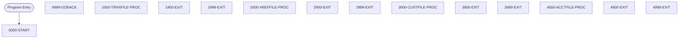

# Program: CBSTM03B

---

## Quick Reference

| Attribute | Value |
|-----------|-------|
| Program ID | `CBSTM03B` |
| Type | BATCH |
| Lines | 231 |
| Source | [CBSTM03B.CBL](../carddemo/CBSTM03B.CBL#L1) |
| Paragraphs | 14 |
| Statements | 22 |
| Impact Risk | **LOW** — 0 programs affected |

> **View Source:** [Open CBSTM03B.CBL](../carddemo/CBSTM03B.CBL#L1)

## Dependency Context

> This section shows how **CBSTM03B** connects to the rest of the system — who calls it,
> what it calls, and what data it shares. If linked programs exist, they must appear here.

### Programs That Call CBSTM03B (Callers)

*No programs call CBSTM03B — this is likely a top-level entry point or CICS transaction starter.*

### Programs Called by CBSTM03B (Callees)

*CBSTM03B does not call any other programs (leaf program).*

### Shared Data (Copybooks & Files)

*No shared copybooks.*

---

## Dependency Graph

> **Legend:** 🔴 Target program · 🔵 Direct callers · 🟢 Direct callees · 🟡 Copybook-coupled · ⚫ Transitive (indirect)

---

## Impact Ripple View

> **If you change CBSTM03B, what else could break?**

| Impact Metric | Count |
|--------------|-------|
| Direct Callers | 0 |
| Transitive Callers (callers of callers) | 0 |
| Direct Callees | 0 |
| Transitive Callees | 0 |
| Copybook-Coupled Programs | 0 |
| **Total Impact** | **0** |
| **Risk Rating** | **LOW** |

---

## Statement Profile

| Statement Type | Count |
|---------------|-------|
| IF | 12 |
| MOVE | 4 |
| EXIT | 4 |
| GOBACK | 1 |
| EVALUATE | 1 |

## Control Flow

## Paragraphs

### 0000-START

| | |
|---|---|
| **Paragraph** | `0000-START` |
| **Lines** | 116 - 128 |
| **View Code** | [Jump to Line 116](../carddemo/CBSTM03B.CBL#L116) |

### 9999-GOBACK

| | |
|---|---|
| **Paragraph** | `9999-GOBACK` |
| **Lines** | 130 - 131 |
| **View Code** | [Jump to Line 130](../carddemo/CBSTM03B.CBL#L130) |

### 1000-TRNXFILE-PROC

| | |
|---|---|
| **Paragraph** | `1000-TRNXFILE-PROC` |
| **Lines** | 133 - 149 |
| **View Code** | [Jump to Line 133](../carddemo/CBSTM03B.CBL#L133) |

### 1900-EXIT

| | |
|---|---|
| **Paragraph** | `1900-EXIT` |
| **Lines** | 151 - 152 |
| **View Code** | [Jump to Line 151](../carddemo/CBSTM03B.CBL#L151) |

### 1999-EXIT

| | |
|---|---|
| **Paragraph** | `1999-EXIT` |
| **Lines** | 154 - 155 |
| **View Code** | [Jump to Line 154](../carddemo/CBSTM03B.CBL#L154) |

### 2000-XREFFILE-PROC

| | |
|---|---|
| **Paragraph** | `2000-XREFFILE-PROC` |
| **Lines** | 157 - 173 |
| **View Code** | [Jump to Line 157](../carddemo/CBSTM03B.CBL#L157) |

### 2900-EXIT

| | |
|---|---|
| **Paragraph** | `2900-EXIT` |
| **Lines** | 175 - 176 |
| **View Code** | [Jump to Line 175](../carddemo/CBSTM03B.CBL#L175) |

### 2999-EXIT

| | |
|---|---|
| **Paragraph** | `2999-EXIT` |
| **Lines** | 178 - 179 |
| **View Code** | [Jump to Line 178](../carddemo/CBSTM03B.CBL#L178) |

### 3000-CUSTFILE-PROC

| | |
|---|---|
| **Paragraph** | `3000-CUSTFILE-PROC` |
| **Lines** | 181 - 198 |
| **View Code** | [Jump to Line 181](../carddemo/CBSTM03B.CBL#L181) |

### 3900-EXIT

| | |
|---|---|
| **Paragraph** | `3900-EXIT` |
| **Lines** | 200 - 201 |
| **View Code** | [Jump to Line 200](../carddemo/CBSTM03B.CBL#L200) |

### 3999-EXIT

| | |
|---|---|
| **Paragraph** | `3999-EXIT` |
| **Lines** | 203 - 204 |
| **View Code** | [Jump to Line 203](../carddemo/CBSTM03B.CBL#L203) |

### 4000-ACCTFILE-PROC

| | |
|---|---|
| **Paragraph** | `4000-ACCTFILE-PROC` |
| **Lines** | 206 - 223 |
| **View Code** | [Jump to Line 206](../carddemo/CBSTM03B.CBL#L206) |

### 4900-EXIT

| | |
|---|---|
| **Paragraph** | `4900-EXIT` |
| **Lines** | 225 - 226 |
| **View Code** | [Jump to Line 225](../carddemo/CBSTM03B.CBL#L225) |

### 4999-EXIT

| | |
|---|---|
| **Paragraph** | `4999-EXIT` |
| **Lines** | 228 - 229 |
| **View Code** | [Jump to Line 228](../carddemo/CBSTM03B.CBL#L228) |

## Business Rules

- **Transaction File Open Check** `BR-175`  
  The system verifies if the transaction file can be opened based on the input parameter.  
  [View Rule Details](../business-rules/BR-175.md)
- **Cross-Reference File Open Check** `BR-176`  
  The system verifies if the cross-reference file can be opened based on the input parameter.  
  [View Rule Details](../business-rules/BR-176.md)
- **Customer File Open Check** `BR-177`  
  The system verifies if the customer file can be opened based on the input parameter.  
  [View Rule Details](../business-rules/BR-177.md)
- **Account File Open Check** `BR-178`  
  The system verifies if the account file can be opened based on the input parameter.  
  [View Rule Details](../business-rules/BR-178.md)
- **Transaction File Close Check** `BR-179`  
  The system verifies if the transaction file can be closed based on the input parameter.  
  [View Rule Details](../business-rules/BR-179.md)
- **Cross-Reference File Close Check** `BR-180`  
  The system verifies if the cross-reference file can be closed based on the input parameter.  
  [View Rule Details](../business-rules/BR-180.md)
- **Customer File Close Check** `BR-181`  
  The system verifies if the customer file can be closed based on the input parameter.  
  [View Rule Details](../business-rules/BR-181.md)
- **Account File Close Check** `BR-182`  
  The system verifies if the account file can be closed based on the input parameter.  
  [View Rule Details](../business-rules/BR-182.md)
- **Transaction File Read Check** `BR-183`  
  The system verifies if the transaction file can be read based on the input parameter.  
  [View Rule Details](../business-rules/BR-183.md)
- **Cross-Reference File Read Check** `BR-184`  
  The system verifies if the cross-reference file can be read based on the input parameter.  
  [View Rule Details](../business-rules/BR-184.md)
- **Customer File Read Check** `BR-185`  
  The system verifies if the customer file can be read based on the input parameter.  
  [View Rule Details](../business-rules/BR-185.md)
- **Account File Read Check** `BR-186`  
  The system verifies if the account file can be read based on the input parameter.  
  [View Rule Details](../business-rules/BR-186.md)
- **Transaction File Read-Key Check** `BR-187`  
  The system verifies if the transaction file can be read by key based on the input parameter.  
  [View Rule Details](../business-rules/BR-187.md)
- **Cross-Reference File Read-Key Check** `BR-188`  
  The system verifies if the cross-reference file can be read by key based on the input parameter.  
  [View Rule Details](../business-rules/BR-188.md)
- **Customer File Read-Key Check** `BR-189`  
  The system verifies if the customer file can be read by key based on the input parameter.  
  [View Rule Details](../business-rules/BR-189.md)
- **Account File Read-Key Check** `BR-190`  
  The system verifies if the account file can be read by key based on the input parameter.  
  [View Rule Details](../business-rules/BR-190.md)
- **Transaction File Write Check** `BR-191`  
  The system verifies if the transaction file can be written to based on the input parameter.  
  [View Rule Details](../business-rules/BR-191.md)
- **Cross-Reference File Write Check** `BR-192`  
  The system verifies if the cross-reference file can be written to based on the input parameter.  
  [View Rule Details](../business-rules/BR-192.md)
- **Customer File Write Check** `BR-193`  
  The system verifies if the customer file can be written to based on the input parameter.  
  [View Rule Details](../business-rules/BR-193.md)
- **Account File Write Check** `BR-194`  
  The system verifies if the account file can be written to based on the input parameter.  
  [View Rule Details](../business-rules/BR-194.md)
- **Transaction File Open Status Check** `BR-195`  
  The system verifies if the transaction file can be opened successfully.  
  [View Rule Details](../business-rules/BR-195.md)
- **Transaction File Read Status Check** `BR-196`  
  The system verifies if records can be read from the transaction file.  
  [View Rule Details](../business-rules/BR-196.md)
- **Transaction File Write Status Check** `BR-197`  
  The system verifies if records can be written to the transaction file.  
  [View Rule Details](../business-rules/BR-197.md)
- **Cross-Reference File Open Status Check** `BR-198`  
  The system verifies if the cross-reference file can be opened successfully.  
  [View Rule Details](../business-rules/BR-198.md)
- **Cross-Reference File Read Status Check** `BR-199`  
  The system verifies if records can be read from the cross-reference file.  
  [View Rule Details](../business-rules/BR-199.md)
- **Cross-Reference File Close Status Check** `BR-200`  
  The system verifies if the cross-reference file can be closed successfully.  
  [View Rule Details](../business-rules/BR-200.md)
- **Customer File Read Status Check** `BR-201`  
  If the attempt to read the customer file fails, the customer file status is set to indicate a read error.  
  [View Rule Details](../business-rules/BR-201.md)
- **Customer File Write Status Check** `BR-202`  
  If the attempt to write to the customer file fails, the customer file status is set to indicate a write error.  
  [View Rule Details](../business-rules/BR-202.md)
- **Account File Open Status Check** `BR-203`  
  The system verifies if the account file can be opened successfully.  
  [View Rule Details](../business-rules/BR-203.md)
- **Account File Read Status Check** `BR-204`  
  The system verifies if records can be read from the account file.  
  [View Rule Details](../business-rules/BR-204.md)
- **Account File Read-by-Key Status Check** `BR-205`  
  The system verifies if records can be read from the account file using a key.  
  [View Rule Details](../business-rules/BR-205.md)

## Key Data Items

| Name | Level | Picture | Section | Business Name |
|------|-------|---------|---------|---------------|
| `TRNXFILE-STATUS` | 1 | `None` | WORKING-STORAGE | None |
| `TRNXFILE-STAT1` | 5 | `X` | WORKING-STORAGE | None |
| `TRNXFILE-STAT2` | 5 | `X` | WORKING-STORAGE | None |
| `XREFFILE-STATUS` | 1 | `None` | WORKING-STORAGE | None |
| `XREFFILE-STAT1` | 5 | `X` | WORKING-STORAGE | None |
| `XREFFILE-STAT2` | 5 | `X` | WORKING-STORAGE | None |
| `CUSTFILE-STATUS` | 1 | `None` | WORKING-STORAGE | None |
| `CUSTFILE-STAT1` | 5 | `X` | WORKING-STORAGE | None |
| `CUSTFILE-STAT2` | 5 | `X` | WORKING-STORAGE | None |
| `ACCTFILE-STATUS` | 1 | `None` | WORKING-STORAGE | None |
| `ACCTFILE-STAT1` | 5 | `X` | WORKING-STORAGE | None |
| `ACCTFILE-STAT2` | 5 | `X` | WORKING-STORAGE | None |
| `LK-M03B-AREA` | 1 | `None` | LINKAGE | None |
| `LK-M03B-DD` | 5 | `X(08)` | LINKAGE | None |
| `LK-M03B-OPER` | 5 | `X(01)` | LINKAGE | None |
| `M03B-OPEN` | 88 | `None` | LINKAGE | None |
| `M03B-CLOSE` | 88 | `None` | LINKAGE | None |
| `M03B-READ` | 88 | `None` | LINKAGE | None |
| `M03B-READ-K` | 88 | `None` | LINKAGE | None |
| `M03B-WRITE` | 88 | `None` | LINKAGE | None |
| `M03B-REWRITE` | 88 | `None` | LINKAGE | None |
| `LK-M03B-RC` | 5 | `X(02)` | LINKAGE | None |
| `LK-M03B-KEY` | 5 | `X(25)` | LINKAGE | None |
| `LK-M03B-KEY-LN` | 5 | `S9(4)` | LINKAGE | None |
| `LK-M03B-FLDT` | 5 | `X(1000)` | LINKAGE | None |

---

*Generated 2026-03-16 21:06*