# Program: CBTRN01C

---

## Quick Reference

| Attribute | Value |
|-----------|-------|
| Program ID | `CBTRN01C` |
| Type | BATCH |
| Lines | 495 |
| Source | [CBTRN01C.cbl](../carddemo/CBTRN01C.cbl#L1) |
| Paragraphs | 18 |
| Statements | 90 |
| Impact Risk | **HIGH** — 24 programs affected |

> **View Source:** [Open CBTRN01C.cbl](../carddemo/CBTRN01C.cbl#L1)

## Dependency Context

> This section shows how **CBTRN01C** connects to the rest of the system — who calls it,
> what it calls, and what data it shares. If linked programs exist, they must appear here.

### Programs That Call CBTRN01C (Callers)

*No programs call CBTRN01C — this is likely a top-level entry point or CICS transaction starter.*

### Programs Called by CBTRN01C (Callees)

| Called Program | Type | Line | Why |
|----------------|------|------|-----|
| [UNKNOWN](UNKNOWN.md) | None | 586 |  |

### Shared Data (Copybooks & Files)

#### Shared Copybooks

| Copybook | Also Used By | # Co-Users |
|----------|-------------|------------|
| `CVACT01Y` | CBACT01C, CBACT04C, CBEXPORT, CBIMPORT, CBSTM03A (+8 more) | 13 |
| `CVACT02Y` | CBACT02C, CBEXPORT, CBIMPORT, COACTVWC, COCRDLIC (+4 more) | 9 |
| `CVACT03Y` | CBACT03C, CBACT04C, CBEXPORT, CBIMPORT, CBSTM03A (+8 more) | 13 |
| `CVCUS01Y` | CBCUS01C, CBEXPORT, CBIMPORT, COACTUPC, COACTVWC (+4 more) | 9 |
| `CVTRA05Y` | CBACT04C, CBEXPORT, CBIMPORT, CBTRN02C, CBTRN03C (+5 more) | 10 |
| `CVTRA06Y` | CBTRN02C | 1 |

---

## Dependency Graph

```mermaid
flowchart TD
    CBTRN01C["⬤ CBTRN01C"]:::target
    UNKNOWN["UNKNOWN"]:::callee
    CBTRN01C --> UNKNOWN
    CB_CVACT01Y{{"CVACT01Y"}}:::copybook
    CBTRN01C -.- CB_CVACT01Y
    CBACT01C["CBACT01C"]:::coupled
    CB_CVACT01Y -.- CBACT01C
    CBACT04C["CBACT04C"]:::coupled
    CB_CVACT01Y -.- CBACT04C
    CBEXPORT["CBEXPORT"]:::coupled
    CB_CVACT01Y -.- CBEXPORT
    CB_CVACT02Y{{"CVACT02Y"}}:::copybook
    CBTRN01C -.- CB_CVACT02Y
    CBACT02C["CBACT02C"]:::coupled
    CB_CVACT02Y -.- CBACT02C
    CBEXPORT["CBEXPORT"]:::coupled
    CB_CVACT02Y -.- CBEXPORT
    CBIMPORT["CBIMPORT"]:::coupled
    CB_CVACT02Y -.- CBIMPORT
    CB_CVACT03Y{{"CVACT03Y"}}:::copybook
    CBTRN01C -.- CB_CVACT03Y
    CBACT03C["CBACT03C"]:::coupled
    CB_CVACT03Y -.- CBACT03C
    CBACT04C["CBACT04C"]:::coupled
    CB_CVACT03Y -.- CBACT04C
    CBEXPORT["CBEXPORT"]:::coupled
    CB_CVACT03Y -.- CBEXPORT
    CB_CVCUS01Y{{"CVCUS01Y"}}:::copybook
    CBTRN01C -.- CB_CVCUS01Y
    CBCUS01C["CBCUS01C"]:::coupled
    CB_CVCUS01Y -.- CBCUS01C
    CBEXPORT["CBEXPORT"]:::coupled
    CB_CVCUS01Y -.- CBEXPORT
    CBIMPORT["CBIMPORT"]:::coupled
    CB_CVCUS01Y -.- CBIMPORT
    CB_CVTRA05Y{{"CVTRA05Y"}}:::copybook
    CBTRN01C -.- CB_CVTRA05Y
    CBACT04C["CBACT04C"]:::coupled
    CB_CVTRA05Y -.- CBACT04C
    CBEXPORT["CBEXPORT"]:::coupled
    CB_CVTRA05Y -.- CBEXPORT
    CBIMPORT["CBIMPORT"]:::coupled
    CB_CVTRA05Y -.- CBIMPORT
    CB_CVTRA06Y{{"CVTRA06Y"}}:::copybook
    CBTRN01C -.- CB_CVTRA06Y
    CBTRN02C["CBTRN02C"]:::coupled
    CB_CVTRA06Y -.- CBTRN02C

    classDef target fill:#f85149,stroke:#da3633,color:#fff,stroke-width:3px
    classDef caller fill:#58a6ff,stroke:#1f6feb,color:#fff
    classDef callee fill:#3fb950,stroke:#238636,color:#fff
    classDef copybook fill:#d29922,stroke:#9e6a03,color:#fff
    classDef coupled fill:#d29922,stroke:#9e6a03,color:#fff,stroke-dasharray:5
    classDef transitive fill:#484f58,stroke:#8b949e,color:#c9d1d9,stroke-dasharray:5
```

> **Legend:** 🔴 Target program · 🔵 Direct callers · 🟢 Direct callees · 🟡 Copybook-coupled · ⚫ Transitive (indirect)

---

## Impact Ripple View

> **If you change CBTRN01C, what else could break?**

| Impact Metric | Count |
|--------------|-------|
| Direct Callers | 0 |
| Transitive Callers (callers of callers) | 0 |
| Direct Callees | 0 |
| Transitive Callees | 0 |
| Copybook-Coupled Programs | 24 |
| **Total Impact** | **24** |
| **Risk Rating** | **HIGH** |

**Programs affected via shared copybooks:**
- `CBACT01C`
- `CBACT02C`
- `CBACT03C`
- `CBACT04C`
- `CBCUS01C`
- `CBEXPORT`
- `CBIMPORT`
- `CBSTM03A`
- `CBTRN02C`
- `CBTRN03C`
- `COACCT01`
- `COACTUPC`
- `COACTVWC`
- `COBIL00C`
- `COCRDLIC`
- `COCRDSLC`
- `COCRDUPC`
- `COPAUA0C`
- `COPAUS0C`
- `CORPT00C`
- `COTRN00C`
- `COTRN01C`
- `COTRN02C`
- `COTRTLIC`

---

## Statement Profile

| Statement Type | Count |
|---------------|-------|
| IF | 27 |
| EXIT | 14 |
| PERFORM | 13 |
| MOVE | 10 |
| OPEN | 6 |
| CLOSE | 6 |
| ARITHMETIC | 6 |
| READ | 3 |
| DISPLAY | 3 |
| GOBACK | 1 |
| CALL | 1 |

## Control Flow

```mermaid
flowchart TD
    START([Program Entry])
    MAIN_PARA["MAIN-PARA"]
    1000_DALYTRAN_GET_NEXT["1000-DALYTRAN-GET-NEXT"]
    2000_LOOKUP_XREF["2000-LOOKUP-XREF"]
    3000_READ_ACCOUNT["3000-READ-ACCOUNT"]
    0000_DALYTRAN_OPEN["0000-DALYTRAN-OPEN"]
    0100_CUSTFILE_OPEN["0100-CUSTFILE-OPEN"]
    0200_XREFFILE_OPEN["0200-XREFFILE-OPEN"]
    0300_CARDFILE_OPEN["0300-CARDFILE-OPEN"]
    0400_ACCTFILE_OPEN["0400-ACCTFILE-OPEN"]
    0500_TRANFILE_OPEN["0500-TRANFILE-OPEN"]
    9000_DALYTRAN_CLOSE["9000-DALYTRAN-CLOSE"]
    9100_CUSTFILE_CLOSE["9100-CUSTFILE-CLOSE"]
    9200_XREFFILE_CLOSE["9200-XREFFILE-CLOSE"]
    9300_CARDFILE_CLOSE["9300-CARDFILE-CLOSE"]
    9400_ACCTFILE_CLOSE["9400-ACCTFILE-CLOSE"]
    START --> MAIN_PARA
    MAIN_PARA --> INLINE
```

## Paragraphs

### MAIN-PARA

| | |
|---|---|
| **Paragraph** | `MAIN-PARA` |
| **Lines** | 268 - 310 |
| **View Code** | [Jump to Line 268](../carddemo/CBTRN01C.cbl#L268) |

### 1000-DALYTRAN-GET-NEXT

| | |
|---|---|
| **Paragraph** | `1000-DALYTRAN-GET-NEXT` |
| **Lines** | 315 - 338 |
| **View Code** | [Jump to Line 315](../carddemo/CBTRN01C.cbl#L315) |

### 2000-LOOKUP-XREF

| | |
|---|---|
| **Paragraph** | `2000-LOOKUP-XREF` |
| **Lines** | 340 - 352 |
| **View Code** | [Jump to Line 340](../carddemo/CBTRN01C.cbl#L340) |

### 3000-READ-ACCOUNT

| | |
|---|---|
| **Paragraph** | `3000-READ-ACCOUNT` |
| **Lines** | 354 - 363 |
| **View Code** | [Jump to Line 354](../carddemo/CBTRN01C.cbl#L354) |

### 0000-DALYTRAN-OPEN

| | |
|---|---|
| **Paragraph** | `0000-DALYTRAN-OPEN` |
| **Lines** | 365 - 381 |
| **View Code** | [Jump to Line 365](../carddemo/CBTRN01C.cbl#L365) |

### 0100-CUSTFILE-OPEN

| | |
|---|---|
| **Paragraph** | `0100-CUSTFILE-OPEN` |
| **Lines** | 384 - 400 |
| **View Code** | [Jump to Line 384](../carddemo/CBTRN01C.cbl#L384) |

### 0200-XREFFILE-OPEN

| | |
|---|---|
| **Paragraph** | `0200-XREFFILE-OPEN` |
| **Lines** | 402 - 418 |
| **View Code** | [Jump to Line 402](../carddemo/CBTRN01C.cbl#L402) |

### 0300-CARDFILE-OPEN

| | |
|---|---|
| **Paragraph** | `0300-CARDFILE-OPEN` |
| **Lines** | 420 - 436 |
| **View Code** | [Jump to Line 420](../carddemo/CBTRN01C.cbl#L420) |

### 0400-ACCTFILE-OPEN

| | |
|---|---|
| **Paragraph** | `0400-ACCTFILE-OPEN` |
| **Lines** | 438 - 454 |
| **View Code** | [Jump to Line 438](../carddemo/CBTRN01C.cbl#L438) |

### 0500-TRANFILE-OPEN

| | |
|---|---|
| **Paragraph** | `0500-TRANFILE-OPEN` |
| **Lines** | 456 - 472 |
| **View Code** | [Jump to Line 456](../carddemo/CBTRN01C.cbl#L456) |

### 9000-DALYTRAN-CLOSE

| | |
|---|---|
| **Paragraph** | `9000-DALYTRAN-CLOSE` |
| **Lines** | 474 - 490 |
| **View Code** | [Jump to Line 474](../carddemo/CBTRN01C.cbl#L474) |

### 9100-CUSTFILE-CLOSE

| | |
|---|---|
| **Paragraph** | `9100-CUSTFILE-CLOSE` |
| **Lines** | 492 - 508 |
| **View Code** | [Jump to Line 492](../carddemo/CBTRN01C.cbl#L492) |

### 9200-XREFFILE-CLOSE

| | |
|---|---|
| **Paragraph** | `9200-XREFFILE-CLOSE` |
| **Lines** | 510 - 526 |
| **View Code** | [Jump to Line 510](../carddemo/CBTRN01C.cbl#L510) |

### 9300-CARDFILE-CLOSE

| | |
|---|---|
| **Paragraph** | `9300-CARDFILE-CLOSE` |
| **Lines** | 528 - 544 |
| **View Code** | [Jump to Line 528](../carddemo/CBTRN01C.cbl#L528) |

### 9400-ACCTFILE-CLOSE

| | |
|---|---|
| **Paragraph** | `9400-ACCTFILE-CLOSE` |
| **Lines** | 546 - 562 |
| **View Code** | [Jump to Line 546](../carddemo/CBTRN01C.cbl#L546) |

### 9500-TRANFILE-CLOSE

| | |
|---|---|
| **Paragraph** | `9500-TRANFILE-CLOSE` |
| **Lines** | 564 - 580 |
| **View Code** | [Jump to Line 564](../carddemo/CBTRN01C.cbl#L564) |

### Z-ABEND-PROGRAM

| | |
|---|---|
| **Paragraph** | `Z-ABEND-PROGRAM` |
| **Lines** | 582 - 586 |
| **View Code** | [Jump to Line 582](../carddemo/CBTRN01C.cbl#L582) |

### Z-DISPLAY-IO-STATUS

| | |
|---|---|
| **Paragraph** | `Z-DISPLAY-IO-STATUS` |
| **Lines** | 589 - 602 |
| **View Code** | [Jump to Line 589](../carddemo/CBTRN01C.cbl#L589) |

## Business Rules

- **Transaction Record Read Failure** `BR-206`  
  If a transaction record cannot be read from the daily transaction file, the program will stop processing.  
  [View Rule Details](../business-rules/BR-206.md)
- **End of Daily Transaction File** `BR-207`  
  When the end of the daily transaction file is reached, the program proceeds to the next step in the process.  
  [View Rule Details](../business-rules/BR-207.md)
- **Transaction File Open Validation** `BR-208`  
  The daily transaction file must be successfully opened before processing can continue.  
  [View Rule Details](../business-rules/BR-208.md)
- **Customer Cross-Reference File Open Validation** `BR-209`  
  The customer cross-reference file, linking transaction details to customer accounts, must be successfully opened before processing can continue.  
  [View Rule Details](../business-rules/BR-209.md)
- **Customer File Open Successful** `BR-210`  
  The program must successfully open the customer file to proceed with transaction processing.  
  [View Rule Details](../business-rules/BR-210.md)
- **Customer File Open Unsuccessful** `BR-211`  
  If the customer file cannot be opened, the transaction processing job must terminate.  
  [View Rule Details](../business-rules/BR-211.md)
- **Cross-Reference File Open Successful** `BR-212`  
  The program must successfully open the cross-reference file to proceed with transaction processing.  
  [View Rule Details](../business-rules/BR-212.md)
- **Cross-Reference File Open Unsuccessful** `BR-213`  
  If the cross-reference file cannot be opened, the transaction processing will be terminated.  
  [View Rule Details](../business-rules/BR-213.md)
- **Card File Open Status Check** `BR-214`  
  If the card file fails to open, the transaction processing will stop.  
  [View Rule Details](../business-rules/BR-214.md)
- **Card File Not Found Handling** `BR-215`  
  If the card file is not found, the transaction processing will stop.  
  [View Rule Details](../business-rules/BR-215.md)
- **Account File Open Successful** `BR-216`  
  The system must successfully open the account file before processing transactions.  
  [View Rule Details](../business-rules/BR-216.md)
- **Account File Open Unsuccessful** `BR-217`  
  If the account file cannot be opened, the transaction processing must be stopped.  
  [View Rule Details](../business-rules/BR-217.md)
- **Transaction File Open Successful** `BR-218`  
  The daily transaction file must open successfully for processing to continue.  
  [View Rule Details](../business-rules/BR-218.md)
- **Customer Cross-Reference File Open Successful** `BR-219`  
  The customer cross-reference file must open successfully to link transactions to customer data.  
  [View Rule Details](../business-rules/BR-219.md)
- **Transaction File Closing Success** `BR-220`  
  Ensure the daily transaction file is successfully closed.  
  [View Rule Details](../business-rules/BR-220.md)
- **Account File Closing Success** `BR-221`  
  Ensure the account file is successfully closed.  
  [View Rule Details](../business-rules/BR-221.md)
- **Customer File Close Status Check** `BR-222`  
  The system verifies that the customer file has been successfully closed.  
  [View Rule Details](../business-rules/BR-222.md)
- **Cross-Reference File Close Status Check** `BR-223`  
  The system verifies that the cross-reference file has been successfully closed.  
  [View Rule Details](../business-rules/BR-223.md)
- **Cross-Reference File Close Status Check** `BR-224`  
  If the cross-reference file does not close successfully, the program should terminate.  
  [View Rule Details](../business-rules/BR-224.md)
- **Customer File Close Status Check** `BR-225`  
  If the customer file does not close successfully, the program should terminate.  
  [View Rule Details](../business-rules/BR-225.md)
- **Card File Status Check** `BR-226`  
  If the card file is not successfully closed, the transaction processing is considered incomplete.  
  [View Rule Details](../business-rules/BR-226.md)
- **Card File Error Handling** `BR-227`  
  If an error occurs while closing the card file, an error message is displayed.  
  [View Rule Details](../business-rules/BR-227.md)
- **Account File Status Check** `BR-228`  
  If the account file is not successfully closed, an error message is displayed.  
  [View Rule Details](../business-rules/BR-228.md)
- **Transaction File Status Check** `BR-229`  
  If the transaction file is not successfully closed, an error message is displayed.  
  [View Rule Details](../business-rules/BR-229.md)
- **Transaction File Close Success Check** `BR-230`  
  Verify that the daily transaction file has been successfully closed.  
  [View Rule Details](../business-rules/BR-230.md)
- **Customer Cross-Reference File Close Success Check** `BR-231`  
  Ensure the customer cross-reference file is successfully closed.  
  [View Rule Details](../business-rules/BR-231.md)
- **Transaction File Read Error** `BR-232`  
  If the program fails to read a transaction record, the batch process will terminate.  
  [View Rule Details](../business-rules/BR-232.md)

## Key Data Items

| Name | Level | Picture | Section | Business Name |
|------|-------|---------|---------|---------------|
| `DALYTRAN-RECORD` | 1 | `None` | WORKING-STORAGE | None |
| `DALYTRAN-ID` | 5 | `X(16)` | WORKING-STORAGE | None |
| `DALYTRAN-TYPE-CD` | 5 | `X(02)` | WORKING-STORAGE | None |
| `DALYTRAN-CAT-CD` | 5 | `9(04)` | WORKING-STORAGE | None |
| `DALYTRAN-SOURCE` | 5 | `X(10)` | WORKING-STORAGE | None |
| `DALYTRAN-DESC` | 5 | `X(100)` | WORKING-STORAGE | None |
| `DALYTRAN-AMT` | 5 | `S9(09)V99` | WORKING-STORAGE | None |
| `DALYTRAN-MERCHANT-ID` | 5 | `9(09)` | WORKING-STORAGE | None |
| `DALYTRAN-MERCHANT-NAME` | 5 | `X(50)` | WORKING-STORAGE | None |
| `DALYTRAN-MERCHANT-CITY` | 5 | `X(50)` | WORKING-STORAGE | None |
| `DALYTRAN-MERCHANT-ZIP` | 5 | `X(10)` | WORKING-STORAGE | None |
| `DALYTRAN-CARD-NUM` | 5 | `X(16)` | WORKING-STORAGE | None |
| `DALYTRAN-ORIG-TS` | 5 | `X(26)` | WORKING-STORAGE | None |
| `DALYTRAN-PROC-TS` | 5 | `X(26)` | WORKING-STORAGE | None |
| `FILLER` | 5 | `X(20)` | WORKING-STORAGE | None |
| `DALYTRAN-STATUS` | 1 | `None` | WORKING-STORAGE | None |
| `DALYTRAN-STAT1` | 5 | `X` | WORKING-STORAGE | None |
| `DALYTRAN-STAT2` | 5 | `X` | WORKING-STORAGE | None |
| `CUSTOMER-RECORD` | 1 | `None` | WORKING-STORAGE | None |
| `CUST-ID` | 5 | `9(09)` | WORKING-STORAGE | None |
| `CUST-FIRST-NAME` | 5 | `X(25)` | WORKING-STORAGE | None |
| `CUST-MIDDLE-NAME` | 5 | `X(25)` | WORKING-STORAGE | None |
| `CUST-LAST-NAME` | 5 | `X(25)` | WORKING-STORAGE | None |
| `CUST-ADDR-LINE-1` | 5 | `X(50)` | WORKING-STORAGE | None |
| `CUST-ADDR-LINE-2` | 5 | `X(50)` | WORKING-STORAGE | None |
| `CUST-ADDR-LINE-3` | 5 | `X(50)` | WORKING-STORAGE | None |
| `CUST-ADDR-STATE-CD` | 5 | `X(02)` | WORKING-STORAGE | None |
| `CUST-ADDR-COUNTRY-CD` | 5 | `X(03)` | WORKING-STORAGE | None |
| `CUST-ADDR-ZIP` | 5 | `X(10)` | WORKING-STORAGE | None |
| `CUST-PHONE-NUM-1` | 5 | `X(15)` | WORKING-STORAGE | None |
| `CUST-PHONE-NUM-2` | 5 | `X(15)` | WORKING-STORAGE | None |
| `CUST-SSN` | 5 | `9(09)` | WORKING-STORAGE | None |
| `CUST-GOVT-ISSUED-ID` | 5 | `X(20)` | WORKING-STORAGE | None |
| `CUST-DOB-YYYY-MM-DD` | 5 | `X(10)` | WORKING-STORAGE | None |
| `CUST-EFT-ACCOUNT-ID` | 5 | `X(10)` | WORKING-STORAGE | None |
| `CUST-PRI-CARD-HOLDER-IND` | 5 | `X(01)` | WORKING-STORAGE | None |
| `CUST-FICO-CREDIT-SCORE` | 5 | `9(03)` | WORKING-STORAGE | None |
| `FILLER` | 5 | `X(168)` | WORKING-STORAGE | None |
| `CUSTFILE-STATUS` | 1 | `None` | WORKING-STORAGE | None |
| `CUSTFILE-STAT1` | 5 | `X` | WORKING-STORAGE | None |

*Showing 40 of 114 data items. See [Data Dictionary](../data-dictionary.md).*

---

*Generated 2026-03-16 21:06*