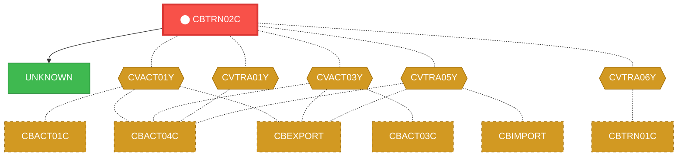

# Program: CBTRN02C

---

## Quick Reference

| Attribute | Value |
|-----------|-------|
| Program ID | `CBTRN02C` |
| Type | BATCH |
| Lines | 732 |
| Source | [CBTRN02C.cbl](../carddemo/CBTRN02C.cbl#L1) |
| Paragraphs | 26 |
| Statements | 146 |
| Impact Risk | **HIGH** — 18 programs affected |

> **View Source:** [Open CBTRN02C.cbl](../carddemo/CBTRN02C.cbl#L1)

## Dependency Context

> This section shows how **CBTRN02C** connects to the rest of the system — who calls it,
> what it calls, and what data it shares. If linked programs exist, they must appear here.

### Programs That Call CBTRN02C (Callers)

*No programs call CBTRN02C — this is likely a top-level entry point or CICS transaction starter.*

### Programs Called by CBTRN02C (Callees)

| Called Program | Type | Line | Why |
|----------------|------|------|-----|
| [UNKNOWN](UNKNOWN.md) | None | 797 |  |

### Shared Data (Copybooks & Files)

#### Shared Copybooks

| Copybook | Also Used By | # Co-Users |
|----------|-------------|------------|
| `CVACT01Y` | CBACT01C, CBACT04C, CBEXPORT, CBIMPORT, CBSTM03A (+8 more) | 13 |
| `CVACT03Y` | CBACT03C, CBACT04C, CBEXPORT, CBIMPORT, CBSTM03A (+8 more) | 13 |
| `CVTRA01Y` | CBACT04C | 1 |
| `CVTRA05Y` | CBACT04C, CBEXPORT, CBIMPORT, CBTRN01C, CBTRN03C (+5 more) | 10 |
| `CVTRA06Y` | CBTRN01C | 1 |

---

## Dependency Graph

> **Legend:** 🔴 Target program · 🔵 Direct callers · 🟢 Direct callees · 🟡 Copybook-coupled · ⚫ Transitive (indirect)

---

## Impact Ripple View

> **If you change CBTRN02C, what else could break?**

| Impact Metric | Count |
|--------------|-------|
| Direct Callers | 0 |
| Transitive Callers (callers of callers) | 0 |
| Direct Callees | 0 |
| Transitive Callees | 0 |
| Copybook-Coupled Programs | 18 |
| **Total Impact** | **18** |
| **Risk Rating** | **HIGH** |

**Programs affected via shared copybooks:**
- `CBACT01C`
- `CBACT03C`
- `CBACT04C`
- `CBEXPORT`
- `CBIMPORT`
- `CBSTM03A`
- `CBTRN01C`
- `CBTRN03C`
- `COACCT01`
- `COACTUPC`
- `COACTVWC`
- `COBIL00C`
- `COPAUA0C`
- `COPAUS0C`
- `CORPT00C`
- `COTRN00C`
- `COTRN01C`
- `COTRN02C`

---

## Statement Profile

| Statement Type | Count |
|---------------|-------|
| MOVE | 51 |
| IF | 40 |
| EXIT | 23 |
| OPEN | 6 |
| CLOSE | 6 |
| PERFORM | 5 |
| READ | 4 |
| WRITE | 3 |
| ARITHMETIC | 3 |
| REWRITE | 2 |
| INITIALIZE | 1 |
| DISPLAY | 1 |
| CALL | 1 |

## Control Flow

```mermaid
flowchart TD
    START([Program Entry])
    0000_DALYTRAN_OPEN["0000-DALYTRAN-OPEN"]
    0100_TRANFILE_OPEN["0100-TRANFILE-OPEN"]
    0200_XREFFILE_OPEN["0200-XREFFILE-OPEN"]
    0300_DALYREJS_OPEN["0300-DALYREJS-OPEN"]
    0400_ACCTFILE_OPEN["0400-ACCTFILE-OPEN"]
    0500_TCATBALF_OPEN["0500-TCATBALF-OPEN"]
    1000_DALYTRAN_GET_NEXT["1000-DALYTRAN-GET-NEXT"]
    1500_VALIDATE_TRAN["1500-VALIDATE-TRAN"]
    1500_A_LOOKUP_XREF["1500-A-LOOKUP-XREF"]
    1500_B_LOOKUP_ACCT["1500-B-LOOKUP-ACCT"]
    2000_POST_TRANSACTION["2000-POST-TRANSACTION"]
    2500_WRITE_REJECT_REC["2500-WRITE-REJECT-REC"]
    2700_UPDATE_TCATBAL["2700-UPDATE-TCATBAL"]
    2700_A_CREATE_TCATBAL_REC["2700-A-CREATE-TCATBAL-REC"]
    2700_B_UPDATE_TCATBAL_REC["2700-B-UPDATE-TCATBAL-REC"]
    START --> 0000_DALYTRAN_OPEN
    1500_VALIDATE_TRAN --> INLINE
    2000_POST_TRANSACTION --> INLINE
```

## Paragraphs

### 0000-DALYTRAN-OPEN

| | |
|---|---|
| **Paragraph** | `0000-DALYTRAN-OPEN` |
| **Lines** | 322 - 338 |
| **View Code** | [Jump to Line 322](../carddemo/CBTRN02C.cbl#L322) |

### 0100-TRANFILE-OPEN

| | |
|---|---|
| **Paragraph** | `0100-TRANFILE-OPEN` |
| **Lines** | 340 - 356 |
| **View Code** | [Jump to Line 340](../carddemo/CBTRN02C.cbl#L340) |

### 0200-XREFFILE-OPEN

| | |
|---|---|
| **Paragraph** | `0200-XREFFILE-OPEN` |
| **Lines** | 359 - 375 |
| **View Code** | [Jump to Line 359](../carddemo/CBTRN02C.cbl#L359) |

### 0300-DALYREJS-OPEN

| | |
|---|---|
| **Paragraph** | `0300-DALYREJS-OPEN` |
| **Lines** | 377 - 393 |
| **View Code** | [Jump to Line 377](../carddemo/CBTRN02C.cbl#L377) |

### 0400-ACCTFILE-OPEN

| | |
|---|---|
| **Paragraph** | `0400-ACCTFILE-OPEN` |
| **Lines** | 395 - 411 |
| **View Code** | [Jump to Line 395](../carddemo/CBTRN02C.cbl#L395) |

### 0500-TCATBALF-OPEN

| | |
|---|---|
| **Paragraph** | `0500-TCATBALF-OPEN` |
| **Lines** | 413 - 429 |
| **View Code** | [Jump to Line 413](../carddemo/CBTRN02C.cbl#L413) |

### 1000-DALYTRAN-GET-NEXT

| | |
|---|---|
| **Paragraph** | `1000-DALYTRAN-GET-NEXT` |
| **Lines** | 431 - 455 |
| **View Code** | [Jump to Line 431](../carddemo/CBTRN02C.cbl#L431) |

### 1500-VALIDATE-TRAN

| | |
|---|---|
| **Paragraph** | `1500-VALIDATE-TRAN` |
| **Lines** | 456 - 464 |
| **View Code** | [Jump to Line 456](../carddemo/CBTRN02C.cbl#L456) |

### 1500-A-LOOKUP-XREF

| | |
|---|---|
| **Paragraph** | `1500-A-LOOKUP-XREF` |
| **Lines** | 466 - 478 |
| **View Code** | [Jump to Line 466](../carddemo/CBTRN02C.cbl#L466) |

### 1500-B-LOOKUP-ACCT

| | |
|---|---|
| **Paragraph** | `1500-B-LOOKUP-ACCT` |
| **Lines** | 479 - 508 |
| **View Code** | [Jump to Line 479](../carddemo/CBTRN02C.cbl#L479) |

### 2000-POST-TRANSACTION

| | |
|---|---|
| **Paragraph** | `2000-POST-TRANSACTION` |
| **Lines** | 510 - 530 |
| **View Code** | [Jump to Line 510](../carddemo/CBTRN02C.cbl#L510) |

### 2500-WRITE-REJECT-REC

| | |
|---|---|
| **Paragraph** | `2500-WRITE-REJECT-REC` |
| **Lines** | 532 - 551 |
| **View Code** | [Jump to Line 532](../carddemo/CBTRN02C.cbl#L532) |

### 2700-UPDATE-TCATBAL

| | |
|---|---|
| **Paragraph** | `2700-UPDATE-TCATBAL` |
| **Lines** | 553 - 587 |
| **View Code** | [Jump to Line 553](../carddemo/CBTRN02C.cbl#L553) |

### 2700-A-CREATE-TCATBAL-REC

| | |
|---|---|
| **Paragraph** | `2700-A-CREATE-TCATBAL-REC` |
| **Lines** | 589 - 610 |
| **View Code** | [Jump to Line 589](../carddemo/CBTRN02C.cbl#L589) |

### 2700-B-UPDATE-TCATBAL-REC

| | |
|---|---|
| **Paragraph** | `2700-B-UPDATE-TCATBAL-REC` |
| **Lines** | 612 - 628 |
| **View Code** | [Jump to Line 612](../carddemo/CBTRN02C.cbl#L612) |

### 2800-UPDATE-ACCOUNT-REC

| | |
|---|---|
| **Paragraph** | `2800-UPDATE-ACCOUNT-REC` |
| **Lines** | 631 - 646 |
| **View Code** | [Jump to Line 631](../carddemo/CBTRN02C.cbl#L631) |

### 2900-WRITE-TRANSACTION-FILE

| | |
|---|---|
| **Paragraph** | `2900-WRITE-TRANSACTION-FILE` |
| **Lines** | 648 - 665 |
| **View Code** | [Jump to Line 648](../carddemo/CBTRN02C.cbl#L648) |

### 9000-DALYTRAN-CLOSE

| | |
|---|---|
| **Paragraph** | `9000-DALYTRAN-CLOSE` |
| **Lines** | 668 - 684 |
| **View Code** | [Jump to Line 668](../carddemo/CBTRN02C.cbl#L668) |

### 9100-TRANFILE-CLOSE

| | |
|---|---|
| **Paragraph** | `9100-TRANFILE-CLOSE` |
| **Lines** | 686 - 702 |
| **View Code** | [Jump to Line 686](../carddemo/CBTRN02C.cbl#L686) |

### 9200-XREFFILE-CLOSE

| | |
|---|---|
| **Paragraph** | `9200-XREFFILE-CLOSE` |
| **Lines** | 705 - 721 |
| **View Code** | [Jump to Line 705](../carddemo/CBTRN02C.cbl#L705) |

### 9300-DALYREJS-CLOSE

| | |
|---|---|
| **Paragraph** | `9300-DALYREJS-CLOSE` |
| **Lines** | 723 - 739 |
| **View Code** | [Jump to Line 723](../carddemo/CBTRN02C.cbl#L723) |

### 9400-ACCTFILE-CLOSE

| | |
|---|---|
| **Paragraph** | `9400-ACCTFILE-CLOSE` |
| **Lines** | 741 - 757 |
| **View Code** | [Jump to Line 741](../carddemo/CBTRN02C.cbl#L741) |

### 9500-TCATBALF-CLOSE

| | |
|---|---|
| **Paragraph** | `9500-TCATBALF-CLOSE` |
| **Lines** | 760 - 776 |
| **View Code** | [Jump to Line 760](../carddemo/CBTRN02C.cbl#L760) |

### Z-GET-DB2-FORMAT-TIMESTAMP

| | |
|---|---|
| **Paragraph** | `Z-GET-DB2-FORMAT-TIMESTAMP` |
| **Lines** | 778 - 791 |
| **View Code** | [Jump to Line 778](../carddemo/CBTRN02C.cbl#L778) |

### 9999-ABEND-PROGRAM

| | |
|---|---|
| **Paragraph** | `9999-ABEND-PROGRAM` |
| **Lines** | 793 - 797 |
| **View Code** | [Jump to Line 793](../carddemo/CBTRN02C.cbl#L793) |

### 9910-DISPLAY-IO-STATUS

| | |
|---|---|
| **Paragraph** | `9910-DISPLAY-IO-STATUS` |
| **Lines** | 800 - 813 |
| **View Code** | [Jump to Line 800](../carddemo/CBTRN02C.cbl#L800) |

## Executed by JCL Jobs

This program is run by the following batch JCL jobs:

| Job Name | Step | Step Comments |
|----------|------|---------------|
| [POSTTRAN](../jcl/POSTTRAN.md) | `STEP15` | *****************************************************************
Copyright Amaz... |

## Business Rules

- **Transaction File Open Successful** `BR-233`  
  The daily transaction file must be successfully opened before processing can continue.  
  [View Rule Details](../business-rules/BR-233.md)
- **Cross-Reference File Open Successful** `BR-234`  
  The cross-reference file, used for validating transaction data, must be successfully opened before processing can continue.  
  [View Rule Details](../business-rules/BR-234.md)
- **Transaction File Open Successful** `BR-235`  
  The transaction file must open successfully for processing to continue.  
  [View Rule Details](../business-rules/BR-235.md)
- **Transaction File Open Unsuccessful** `BR-236`  
  If the transaction file cannot be opened, the batch process must terminate.  
  [View Rule Details](../business-rules/BR-236.md)
- **Cross-Reference File Open Successful** `BR-237`  
  The program must successfully open the cross-reference file to proceed with transaction processing.  
  [View Rule Details](../business-rules/BR-237.md)
- **Cross-Reference File Open Unsuccessful** `BR-238`  
  If the program fails to open the cross-reference file, the transaction processing cannot continue.  
  [View Rule Details](../business-rules/BR-238.md)
- **Transaction File Open Validation** `BR-239`  
  The daily transaction file must be successfully opened before processing can continue.  
  [View Rule Details](../business-rules/BR-239.md)
- **Reject File Open Validation** `BR-240`  
  The reject file must be successfully opened before invalid transactions can be written.  
  [View Rule Details](../business-rules/BR-240.md)
- **Account Record Found** `BR-241`  
  If a matching account record is found in the account file, proceed with transaction processing.  
  [View Rule Details](../business-rules/BR-241.md)
- **Invalid Account Number** `BR-242`  
  If a matching account record is not found in the account file, reject the transaction.  
  [View Rule Details](../business-rules/BR-242.md)
- **TCATBAL File Open Status Check** `BR-243`  
  The program verifies that the Transaction Category Balance file (TCATBAL) has been successfully opened before proceeding with transaction processing.  
  [View Rule Details](../business-rules/BR-243.md)
- **TCATBAL File Availability Check** `BR-244`  
  The program checks if the Transaction Category Balance file (TCATBAL) is available for processing.  
  [View Rule Details](../business-rules/BR-244.md)
- **Transaction Record Validation** `BR-245`  
  If a transaction record is read successfully from the input file, proceed to process the transaction.  
  [View Rule Details](../business-rules/BR-245.md)
- **End of Daily Transaction Processing** `BR-246`  
  If the end of the daily transaction input file is reached, finalize the transaction processing.  
  [View Rule Details](../business-rules/BR-246.md)
- **Invalid Transaction Code** `BR-247`  
  If a transaction has an invalid transaction code, it is rejected.  
  [View Rule Details](../business-rules/BR-247.md)
- **Invalid Transaction Record Handling** `BR-248`  
  If a transaction record is determined to be invalid, write the rejected record to the reject file.  
  [View Rule Details](../business-rules/BR-248.md)
- **Increase Transaction Category Balance for Credits** `BR-249`  
  If a transaction is a credit, increase the corresponding transaction category balance.  
  [View Rule Details](../business-rules/BR-249.md)
- **Decrease Transaction Category Balance for Debits** `BR-250`  
  If a transaction is a debit, decrease the corresponding transaction category balance.  
  [View Rule Details](../business-rules/BR-250.md)
- **Handle Zero Amount Transactions** `BR-251`  
  If a transaction has a zero amount, it may be handled differently or skipped.  
  [View Rule Details](../business-rules/BR-251.md)
- **Initial Transaction Category Balance** `BR-252`  
  When creating a new transaction category balance record, the beginning balance, total debits, and total credits are initialized to zero.  
  [View Rule Details](../business-rules/BR-252.md)
- **Increase Transaction Category Balance for Credits** `BR-253`  
  If a transaction is a credit, increase the corresponding transaction category balance.  
  [View Rule Details](../business-rules/BR-253.md)
- **Decrease Transaction Category Balance for Debits** `BR-254`  
  If a transaction is a debit, decrease the corresponding transaction category balance.  
  [View Rule Details](../business-rules/BR-254.md)
- **Transaction Amount Limit Check** `BR-255`  
  If a transaction amount exceeds a predefined limit, the transaction is considered invalid.  
  [View Rule Details](../business-rules/BR-255.md)
- **Account Status Check** `BR-256`  
  Transactions are only allowed for accounts that are in good standing.  
  [View Rule Details](../business-rules/BR-256.md)
- **Transaction Category Balance Update** `BR-257`  
  The transaction category balance is updated to reflect the transaction amount.  
  [View Rule Details](../business-rules/BR-257.md)
- **Transaction Record Write Success** `BR-258`  
  If a transaction record is successfully written to the output file, increment the count of successfully written transaction records.  
  [View Rule Details](../business-rules/BR-258.md)
- **Transaction Record Write Failure** `BR-259`  
  If a transaction record cannot be written to the output file, increment the count of failed transaction record writes.  
  [View Rule Details](../business-rules/BR-259.md)
- **Transaction Category Balance Update** `BR-260`  
  If a transaction is successfully processed, the corresponding transaction category balance is updated to reflect the transaction amount.  
  [View Rule Details](../business-rules/BR-260.md)
- **Reject Invalid Transactions** `BR-261`  
  If a transaction fails validation, it is written to a reject file for further review and correction.  
  [View Rule Details](../business-rules/BR-261.md)
- **Transaction File Status Check** `BR-262`  
  If the transaction file processing was successful, proceed to update the transaction category balance file.  
  [View Rule Details](../business-rules/BR-262.md)
- **Transaction File Error Handling** `BR-263`  
  If the transaction file processing encountered errors, bypass updating the transaction category balance file.  
  [View Rule Details](../business-rules/BR-263.md)
- **Transaction Category Balance Update** `BR-264`  
  The transaction category balance file is updated to reflect the processed transactions.  
  [View Rule Details](../business-rules/BR-264.md)
- **Reject Record if TCATBAL Update Fails** `BR-265`  
  If updating the Transaction Category Balance file (TCATBAL) is unsuccessful, the transaction record is considered invalid and should be rejected.  
  [View Rule Details](../business-rules/BR-265.md)
- **Close Reject File After Processing** `BR-266`  
  After processing all transaction records, the reject file must be closed to ensure all rejected transactions are properly written and the file is available for subsequent use.  
  [View Rule Details](../business-rules/BR-266.md)
- **Account File Status Check** `BR-267`  
  Verify the account file was successfully processed.  
  [View Rule Details](../business-rules/BR-267.md)
- **Transaction Category Balance File Status Check** `BR-268`  
  Verify the transaction category balance file was successfully processed.  
  [View Rule Details](../business-rules/BR-268.md)
- **TCATBAL File Status Check** `BR-269`  
  If the transaction category balance file (TCATBAL) close operation is unsuccessful, the program terminates.  
  [View Rule Details](../business-rules/BR-269.md)
- **TCATBAL File Close Error Handling** `BR-270`  
  If an error occurs during the closing of the transaction category balance file (TCATBAL), an error message is displayed.  
  [View Rule Details](../business-rules/BR-270.md)
- **File Status Display** `BR-271`  
  The program displays the status of input/output operations for debugging and monitoring purposes.  
  [View Rule Details](../business-rules/BR-271.md)

## Key Data Items

| Name | Level | Picture | Section | Business Name |
|------|-------|---------|---------|---------------|
| `DALYTRAN-RECORD` | 1 | `None` | WORKING-STORAGE | None |
| `DALYTRAN-ID` | 5 | `X(16)` | WORKING-STORAGE | None |
| `DALYTRAN-TYPE-CD` | 5 | `X(02)` | WORKING-STORAGE | None |
| `DALYTRAN-CAT-CD` | 5 | `9(04)` | WORKING-STORAGE | None |
| `DALYTRAN-SOURCE` | 5 | `X(10)` | WORKING-STORAGE | None |
| `DALYTRAN-DESC` | 5 | `X(100)` | WORKING-STORAGE | None |
| `DALYTRAN-AMT` | 5 | `S9(09)V99` | WORKING-STORAGE | None |
| `DALYTRAN-MERCHANT-ID` | 5 | `9(09)` | WORKING-STORAGE | None |
| `DALYTRAN-MERCHANT-NAME` | 5 | `X(50)` | WORKING-STORAGE | None |
| `DALYTRAN-MERCHANT-CITY` | 5 | `X(50)` | WORKING-STORAGE | None |
| `DALYTRAN-MERCHANT-ZIP` | 5 | `X(10)` | WORKING-STORAGE | None |
| `DALYTRAN-CARD-NUM` | 5 | `X(16)` | WORKING-STORAGE | None |
| `DALYTRAN-ORIG-TS` | 5 | `X(26)` | WORKING-STORAGE | None |
| `DALYTRAN-PROC-TS` | 5 | `X(26)` | WORKING-STORAGE | None |
| `FILLER` | 5 | `X(20)` | WORKING-STORAGE | None |
| `DALYTRAN-STATUS` | 1 | `None` | WORKING-STORAGE | None |
| `DALYTRAN-STAT1` | 5 | `X` | WORKING-STORAGE | None |
| `DALYTRAN-STAT2` | 5 | `X` | WORKING-STORAGE | None |
| `TRAN-RECORD` | 1 | `None` | WORKING-STORAGE | None |
| `TRAN-ID` | 5 | `X(16)` | WORKING-STORAGE | None |
| `TRAN-TYPE-CD` | 5 | `X(02)` | WORKING-STORAGE | None |
| `TRAN-CAT-CD` | 5 | `9(04)` | WORKING-STORAGE | None |
| `TRAN-SOURCE` | 5 | `X(10)` | WORKING-STORAGE | None |
| `TRAN-DESC` | 5 | `X(100)` | WORKING-STORAGE | None |
| `TRAN-AMT` | 5 | `S9(09)V99` | WORKING-STORAGE | None |
| `TRAN-MERCHANT-ID` | 5 | `9(09)` | WORKING-STORAGE | None |
| `TRAN-MERCHANT-NAME` | 5 | `X(50)` | WORKING-STORAGE | None |
| `TRAN-MERCHANT-CITY` | 5 | `X(50)` | WORKING-STORAGE | None |
| `TRAN-MERCHANT-ZIP` | 5 | `X(10)` | WORKING-STORAGE | None |
| `TRAN-CARD-NUM` | 5 | `X(16)` | WORKING-STORAGE | None |
| `TRAN-ORIG-TS` | 5 | `X(26)` | WORKING-STORAGE | None |
| `TRAN-PROC-TS` | 5 | `X(26)` | WORKING-STORAGE | None |
| `FILLER` | 5 | `X(20)` | WORKING-STORAGE | None |
| `TRANFILE-STATUS` | 1 | `None` | WORKING-STORAGE | None |
| `TRANFILE-STAT1` | 5 | `X` | WORKING-STORAGE | None |
| `TRANFILE-STAT2` | 5 | `X` | WORKING-STORAGE | None |
| `CARD-XREF-RECORD` | 1 | `None` | WORKING-STORAGE | None |
| `XREF-CARD-NUM` | 5 | `X(16)` | WORKING-STORAGE | None |
| `XREF-CUST-ID` | 5 | `9(09)` | WORKING-STORAGE | None |
| `XREF-ACCT-ID` | 5 | `9(11)` | WORKING-STORAGE | None |

*Showing 40 of 127 data items. See [Data Dictionary](../data-dictionary.md).*

---

*Generated 2026-03-16 21:06*