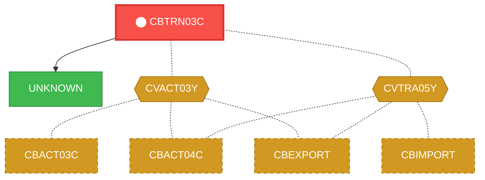

# Program: CBTRN03C

---

## Quick Reference

| Attribute | Value |
|-----------|-------|
| Program ID | `CBTRN03C` |
| Type | BATCH |
| Lines | 650 |
| Source | [CBTRN03C.cbl](../carddemo/CBTRN03C.cbl#L1) |
| Paragraphs | 26 |
| Statements | 137 |
| Impact Risk | **HIGH** — 16 programs affected |

> **View Source:** [Open CBTRN03C.cbl](../carddemo/CBTRN03C.cbl#L1)

## Dependency Context

> This section shows how **CBTRN03C** connects to the rest of the system — who calls it,
> what it calls, and what data it shares. If linked programs exist, they must appear here.

### Programs That Call CBTRN03C (Callers)

*No programs call CBTRN03C — this is likely a top-level entry point or CICS transaction starter.*

### Programs Called by CBTRN03C (Callees)

| Called Program | Type | Line | Why |
|----------------|------|------|-----|
| [UNKNOWN](UNKNOWN.md) | None | 757 |  |

### Shared Data (Copybooks & Files)

#### Shared Copybooks

| Copybook | Also Used By | # Co-Users |
|----------|-------------|------------|
| `CVACT03Y` | CBACT03C, CBACT04C, CBEXPORT, CBIMPORT, CBSTM03A (+8 more) | 13 |
| `CVTRA03Y` |  | 0 |
| `CVTRA04Y` |  | 0 |
| `CVTRA05Y` | CBACT04C, CBEXPORT, CBIMPORT, CBTRN01C, CBTRN02C (+5 more) | 10 |
| `CVTRA07Y` |  | 0 |

---

## Dependency Graph

> **Legend:** 🔴 Target program · 🔵 Direct callers · 🟢 Direct callees · 🟡 Copybook-coupled · ⚫ Transitive (indirect)

---

## Impact Ripple View

> **If you change CBTRN03C, what else could break?**

| Impact Metric | Count |
|--------------|-------|
| Direct Callers | 0 |
| Transitive Callers (callers of callers) | 0 |
| Direct Callees | 0 |
| Transitive Callees | 0 |
| Copybook-Coupled Programs | 16 |
| **Total Impact** | **16** |
| **Risk Rating** | **HIGH** |

**Programs affected via shared copybooks:**
- `CBACT03C`
- `CBACT04C`
- `CBEXPORT`
- `CBIMPORT`
- `CBSTM03A`
- `CBTRN01C`
- `CBTRN02C`
- `COACTUPC`
- `COACTVWC`
- `COBIL00C`
- `COPAUA0C`
- `COPAUS0C`
- `CORPT00C`
- `COTRN00C`
- `COTRN01C`
- `COTRN02C`

---

## Statement Profile

| Statement Type | Count |
|---------------|-------|
| MOVE | 35 |
| IF | 31 |
| EXIT | 24 |
| ARITHMETIC | 13 |
| PERFORM | 11 |
| OPEN | 6 |
| CLOSE | 6 |
| READ | 5 |
| EVALUATE | 2 |
| WRITE | 1 |
| INITIALIZE | 1 |
| DISPLAY | 1 |
| CALL | 1 |

## Control Flow

```mermaid
flowchart TD
    START([Program Entry])
    0550_DATEPARM_READ["0550-DATEPARM-READ"]
    1000_TRANFILE_GET_NEXT["1000-TRANFILE-GET-NEXT"]
    1100_WRITE_TRANSACTION_REPORT["1100-WRITE-TRANSACTION-REPORT"]
    1110_WRITE_PAGE_TOTALS["1110-WRITE-PAGE-TOTALS"]
    1120_WRITE_ACCOUNT_TOTALS["1120-WRITE-ACCOUNT-TOTALS"]
    1110_WRITE_GRAND_TOTALS["1110-WRITE-GRAND-TOTALS"]
    1120_WRITE_HEADERS["1120-WRITE-HEADERS"]
    1111_WRITE_REPORT_REC["1111-WRITE-REPORT-REC"]
    1120_WRITE_DETAIL["1120-WRITE-DETAIL"]
    0000_TRANFILE_OPEN["0000-TRANFILE-OPEN"]
    0100_REPTFILE_OPEN["0100-REPTFILE-OPEN"]
    0200_CARDXREF_OPEN["0200-CARDXREF-OPEN"]
    0300_TRANTYPE_OPEN["0300-TRANTYPE-OPEN"]
    0400_TRANCATG_OPEN["0400-TRANCATG-OPEN"]
    0500_DATEPARM_OPEN["0500-DATEPARM-OPEN"]
    START --> 0550_DATEPARM_READ
    1100_WRITE_TRANSACTION_REPORT --> INLINE
    1110_WRITE_PAGE_TOTALS --> INLINE
    1120_WRITE_ACCOUNT_TOTALS --> INLINE
    1110_WRITE_GRAND_TOTALS --> INLINE
    1120_WRITE_HEADERS --> INLINE
    1120_WRITE_DETAIL --> INLINE
```

## Paragraphs

### 0550-DATEPARM-READ

| | |
|---|---|
| **Paragraph** | `0550-DATEPARM-READ` |
| **Lines** | 347 - 370 |
| **View Code** | [Jump to Line 347](../carddemo/CBTRN03C.cbl#L347) |

### 1000-TRANFILE-GET-NEXT

| | |
|---|---|
| **Paragraph** | `1000-TRANFILE-GET-NEXT` |
| **Lines** | 375 - 399 |
| **View Code** | [Jump to Line 375](../carddemo/CBTRN03C.cbl#L375) |

### 1100-WRITE-TRANSACTION-REPORT

| | |
|---|---|
| **Paragraph** | `1100-WRITE-TRANSACTION-REPORT` |
| **Lines** | 401 - 417 |
| **View Code** | [Jump to Line 401](../carddemo/CBTRN03C.cbl#L401) |

### 1110-WRITE-PAGE-TOTALS

| | |
|---|---|
| **Paragraph** | `1110-WRITE-PAGE-TOTALS` |
| **Lines** | 420 - 431 |
| **View Code** | [Jump to Line 420](../carddemo/CBTRN03C.cbl#L420) |

### 1120-WRITE-ACCOUNT-TOTALS

| | |
|---|---|
| **Paragraph** | `1120-WRITE-ACCOUNT-TOTALS` |
| **Lines** | 433 - 443 |
| **View Code** | [Jump to Line 433](../carddemo/CBTRN03C.cbl#L433) |

### 1110-WRITE-GRAND-TOTALS

| | |
|---|---|
| **Paragraph** | `1110-WRITE-GRAND-TOTALS` |
| **Lines** | 445 - 449 |
| **View Code** | [Jump to Line 445](../carddemo/CBTRN03C.cbl#L445) |

### 1120-WRITE-HEADERS

| | |
|---|---|
| **Paragraph** | `1120-WRITE-HEADERS` |
| **Lines** | 451 - 468 |
| **View Code** | [Jump to Line 451](../carddemo/CBTRN03C.cbl#L451) |

### 1111-WRITE-REPORT-REC

| | |
|---|---|
| **Paragraph** | `1111-WRITE-REPORT-REC` |
| **Lines** | 470 - 486 |
| **View Code** | [Jump to Line 470](../carddemo/CBTRN03C.cbl#L470) |

### 1120-WRITE-DETAIL

| | |
|---|---|
| **Paragraph** | `1120-WRITE-DETAIL` |
| **Lines** | 488 - 501 |
| **View Code** | [Jump to Line 488](../carddemo/CBTRN03C.cbl#L488) |

### 0000-TRANFILE-OPEN

| | |
|---|---|
| **Paragraph** | `0000-TRANFILE-OPEN` |
| **Lines** | 503 - 519 |
| **View Code** | [Jump to Line 503](../carddemo/CBTRN03C.cbl#L503) |

### 0100-REPTFILE-OPEN

| | |
|---|---|
| **Paragraph** | `0100-REPTFILE-OPEN` |
| **Lines** | 521 - 537 |
| **View Code** | [Jump to Line 521](../carddemo/CBTRN03C.cbl#L521) |

### 0200-CARDXREF-OPEN

| | |
|---|---|
| **Paragraph** | `0200-CARDXREF-OPEN` |
| **Lines** | 539 - 555 |
| **View Code** | [Jump to Line 539](../carddemo/CBTRN03C.cbl#L539) |

### 0300-TRANTYPE-OPEN

| | |
|---|---|
| **Paragraph** | `0300-TRANTYPE-OPEN` |
| **Lines** | 557 - 573 |
| **View Code** | [Jump to Line 557](../carddemo/CBTRN03C.cbl#L557) |

### 0400-TRANCATG-OPEN

| | |
|---|---|
| **Paragraph** | `0400-TRANCATG-OPEN` |
| **Lines** | 575 - 591 |
| **View Code** | [Jump to Line 575](../carddemo/CBTRN03C.cbl#L575) |

### 0500-DATEPARM-OPEN

| | |
|---|---|
| **Paragraph** | `0500-DATEPARM-OPEN` |
| **Lines** | 593 - 609 |
| **View Code** | [Jump to Line 593](../carddemo/CBTRN03C.cbl#L593) |

### 1500-A-LOOKUP-XREF

| | |
|---|---|
| **Paragraph** | `1500-A-LOOKUP-XREF` |
| **Lines** | 611 - 619 |
| **View Code** | [Jump to Line 611](../carddemo/CBTRN03C.cbl#L611) |

### 1500-B-LOOKUP-TRANTYPE

| | |
|---|---|
| **Paragraph** | `1500-B-LOOKUP-TRANTYPE` |
| **Lines** | 621 - 629 |
| **View Code** | [Jump to Line 621](../carddemo/CBTRN03C.cbl#L621) |

### 1500-C-LOOKUP-TRANCATG

| | |
|---|---|
| **Paragraph** | `1500-C-LOOKUP-TRANCATG` |
| **Lines** | 631 - 639 |
| **View Code** | [Jump to Line 631](../carddemo/CBTRN03C.cbl#L631) |

### 9000-TRANFILE-CLOSE

| | |
|---|---|
| **Paragraph** | `9000-TRANFILE-CLOSE` |
| **Lines** | 641 - 657 |
| **View Code** | [Jump to Line 641](../carddemo/CBTRN03C.cbl#L641) |

### 9100-REPTFILE-CLOSE

| | |
|---|---|
| **Paragraph** | `9100-REPTFILE-CLOSE` |
| **Lines** | 659 - 675 |
| **View Code** | [Jump to Line 659](../carddemo/CBTRN03C.cbl#L659) |

### 9200-CARDXREF-CLOSE

| | |
|---|---|
| **Paragraph** | `9200-CARDXREF-CLOSE` |
| **Lines** | 678 - 694 |
| **View Code** | [Jump to Line 678](../carddemo/CBTRN03C.cbl#L678) |

### 9300-TRANTYPE-CLOSE

| | |
|---|---|
| **Paragraph** | `9300-TRANTYPE-CLOSE` |
| **Lines** | 696 - 712 |
| **View Code** | [Jump to Line 696](../carddemo/CBTRN03C.cbl#L696) |

### 9400-TRANCATG-CLOSE

| | |
|---|---|
| **Paragraph** | `9400-TRANCATG-CLOSE` |
| **Lines** | 714 - 730 |
| **View Code** | [Jump to Line 714](../carddemo/CBTRN03C.cbl#L714) |

### 9500-DATEPARM-CLOSE

| | |
|---|---|
| **Paragraph** | `9500-DATEPARM-CLOSE` |
| **Lines** | 732 - 748 |
| **View Code** | [Jump to Line 732](../carddemo/CBTRN03C.cbl#L732) |

### 9999-ABEND-PROGRAM

| | |
|---|---|
| **Paragraph** | `9999-ABEND-PROGRAM` |
| **Lines** | 753 - 757 |
| **View Code** | [Jump to Line 753](../carddemo/CBTRN03C.cbl#L753) |

### 9910-DISPLAY-IO-STATUS

| | |
|---|---|
| **Paragraph** | `9910-DISPLAY-IO-STATUS` |
| **Lines** | 760 - 773 |
| **View Code** | [Jump to Line 760](../carddemo/CBTRN03C.cbl#L760) |

## Executed by JCL Jobs

This program is run by the following batch JCL jobs:

| Job Name | Step | Step Comments |
|----------|------|---------------|
| [TRANREPT](../jcl/TRANREPT.md) | `STEP10R` | *******************************************************************
Produce a fo... |

## Business Rules

- **Invalid Date Range** `BR-272`  
  If the report's start date is later than the end date, the report cannot be generated.  
  [View Rule Details](../business-rules/BR-272.md)
- **Transaction Type Processing** `BR-273`  
  Different actions are taken based on the type of transaction.  
  [View Rule Details](../business-rules/BR-273.md)
- **Invalid Transaction Handling** `BR-274`  
  If a transaction record has an invalid transaction type, it is flagged as an error.  
  [View Rule Details](../business-rules/BR-274.md)
- **Transaction Amount Threshold** `BR-275`  
  If a transaction amount exceeds a predefined threshold, it may require special handling or review.  
  [View Rule Details](../business-rules/BR-275.md)
- **Account Activity Limit** `BR-276`  
  If an account's total transaction activity exceeds a predefined limit, it may indicate unusual activity.  
  [View Rule Details](../business-rules/BR-276.md)
- **Page Overflow Check** `BR-277`  
  If the current line count exceeds the maximum lines per page, a new page is started.  
  [View Rule Details](../business-rules/BR-277.md)
- **Account Overflow Check** `BR-278`  
  If the current page count exceeds the maximum pages per account, a new account section is started.  
  [View Rule Details](../business-rules/BR-278.md)
- **Transaction File Open Validation** `BR-279`  
  The transaction file must be successfully opened before processing can continue.  
  [View Rule Details](../business-rules/BR-279.md)
- **Cross-Reference File Open Validation** `BR-280`  
  The cross-reference file must be successfully opened before transaction data can be enriched.  
  [View Rule Details](../business-rules/BR-280.md)
- **Page Overflow Check** `BR-281`  
  If the current line count on the report page exceeds the maximum allowed lines per page, a new page should be started.  
  [View Rule Details](../business-rules/BR-281.md)
- **Account Overflow Check** `BR-282`  
  If the current account number changes, print the account totals and reset the account totals.  
  [View Rule Details](../business-rules/BR-282.md)
- **Cross-Reference File Open Validation** `BR-283`  
  The program must successfully open the cross-reference file to proceed with transaction processing.  
  [View Rule Details](../business-rules/BR-283.md)
- **Transaction Data Validation** `BR-284`  
  The program validates transaction data against the cross-reference file to ensure data integrity.  
  [View Rule Details](../business-rules/BR-284.md)
- **Transaction Type Validation** `BR-285`  
  If the transaction type is invalid, the transaction should be rejected.  
  [View Rule Details](../business-rules/BR-285.md)
- **High Value Transaction Handling** `BR-286`  
  Transactions exceeding a certain value require special handling.  
  [View Rule Details](../business-rules/BR-286.md)
- **Transaction Category Assignment** `BR-287`  
  Transactions are categorized based on specific criteria to facilitate reporting and analysis.  
  [View Rule Details](../business-rules/BR-287.md)
- **Transaction Data Enrichment** `BR-288`  
  Transaction data is enhanced with additional information from cross-reference files to provide a more comprehensive view.  
  [View Rule Details](../business-rules/BR-288.md)
- **Report Date Range Control** `BR-289`  
  The report includes transactions within a specific date range defined in a parameter file.  
  [View Rule Details](../business-rules/BR-289.md)
- **Report Date Range Validation** `BR-290`  
  The report will only be generated if the specified start date is before the specified end date.  
  [View Rule Details](../business-rules/BR-290.md)
- **Parameter File Required** `BR-291`  
  The report generation requires a valid parameter file to define the report's date range.  
  [View Rule Details](../business-rules/BR-291.md)
- **Transaction File Status Check** `BR-292`  
  If the transaction file does not close successfully, stop the report generation process.  
  [View Rule Details](../business-rules/BR-292.md)
- **Report File Status Check** `BR-293`  
  If the report file is not successfully closed, stop the report generation process.  
  [View Rule Details](../business-rules/BR-293.md)
- **Transaction File Status Check** `BR-294`  
  If the transaction file is not successfully closed, stop the report generation process.  
  [View Rule Details](../business-rules/BR-294.md)
- **Card Cross-Reference File Status Check** `BR-295`  
  If the card cross-reference file is not successfully closed, an error message is displayed.  
  [View Rule Details](../business-rules/BR-295.md)
- **Card Cross-Reference File Status Check** `BR-296`  
  If the card cross-reference file is successfully closed, a confirmation message is displayed.  
  [View Rule Details](../business-rules/BR-296.md)
- **Transaction Type Validation** `BR-297`  
  If the transaction type is invalid, the transaction should be rejected.  
  [View Rule Details](../business-rules/BR-297.md)
- **Transaction Type Closure** `BR-298`  
  When processing a specific transaction type, a closure process must be initiated.  
  [View Rule Details](../business-rules/BR-298.md)
- **Transaction Category Closing Procedure** `BR-299`  
  When processing of a specific transaction category is complete, the system finalizes the category's totals.  
  [View Rule Details](../business-rules/BR-299.md)
- **Report Date Range Validation** `BR-300`  
  The report will only be generated if the specified start date is before the specified end date.  
  [View Rule Details](../business-rules/BR-300.md)
- **File Status Check** `BR-301`  
  If a file operation fails, the program must stop.  
  [View Rule Details](../business-rules/BR-301.md)

## Key Data Items

| Name | Level | Picture | Section | Business Name |
|------|-------|---------|---------|---------------|
| `TRAN-RECORD` | 1 | `None` | WORKING-STORAGE | None |
| `TRAN-ID` | 5 | `X(16)` | WORKING-STORAGE | None |
| `TRAN-TYPE-CD` | 5 | `X(02)` | WORKING-STORAGE | None |
| `TRAN-CAT-CD` | 5 | `9(04)` | WORKING-STORAGE | None |
| `TRAN-SOURCE` | 5 | `X(10)` | WORKING-STORAGE | None |
| `TRAN-DESC` | 5 | `X(100)` | WORKING-STORAGE | None |
| `TRAN-AMT` | 5 | `S9(09)V99` | WORKING-STORAGE | None |
| `TRAN-MERCHANT-ID` | 5 | `9(09)` | WORKING-STORAGE | None |
| `TRAN-MERCHANT-NAME` | 5 | `X(50)` | WORKING-STORAGE | None |
| `TRAN-MERCHANT-CITY` | 5 | `X(50)` | WORKING-STORAGE | None |
| `TRAN-MERCHANT-ZIP` | 5 | `X(10)` | WORKING-STORAGE | None |
| `TRAN-CARD-NUM` | 5 | `X(16)` | WORKING-STORAGE | None |
| `TRAN-ORIG-TS` | 5 | `X(26)` | WORKING-STORAGE | None |
| `TRAN-PROC-TS` | 5 | `X(26)` | WORKING-STORAGE | None |
| `FILLER` | 5 | `X(20)` | WORKING-STORAGE | None |
| `TRANFILE-STATUS` | 1 | `None` | WORKING-STORAGE | None |
| `TRANFILE-STAT1` | 5 | `X` | WORKING-STORAGE | None |
| `TRANFILE-STAT2` | 5 | `X` | WORKING-STORAGE | None |
| `CARD-XREF-RECORD` | 1 | `None` | WORKING-STORAGE | None |
| `XREF-CARD-NUM` | 5 | `X(16)` | WORKING-STORAGE | None |
| `XREF-CUST-ID` | 5 | `9(09)` | WORKING-STORAGE | None |
| `XREF-ACCT-ID` | 5 | `9(11)` | WORKING-STORAGE | None |
| `FILLER` | 5 | `X(14)` | WORKING-STORAGE | None |
| `CARDXREF-STATUS` | 1 | `None` | WORKING-STORAGE | None |
| `CARDXREF-STAT1` | 5 | `X` | WORKING-STORAGE | None |
| `CARDXREF-STAT2` | 5 | `X` | WORKING-STORAGE | None |
| `TRAN-TYPE-RECORD` | 1 | `None` | WORKING-STORAGE | None |
| `TRAN-TYPE` | 5 | `X(02)` | WORKING-STORAGE | None |
| `TRAN-TYPE-DESC` | 5 | `X(50)` | WORKING-STORAGE | None |
| `FILLER` | 5 | `X(08)` | WORKING-STORAGE | None |
| `TRANTYPE-STATUS` | 1 | `None` | WORKING-STORAGE | None |
| `TRANTYPE-STAT1` | 5 | `X` | WORKING-STORAGE | None |
| `TRANTYPE-STAT2` | 5 | `X` | WORKING-STORAGE | None |
| `TRAN-CAT-RECORD` | 1 | `None` | WORKING-STORAGE | None |
| `TRAN-CAT-KEY` | 5 | `None` | WORKING-STORAGE | None |
| `TRAN-TYPE-CD` | 10 | `X(02)` | WORKING-STORAGE | None |
| `TRAN-CAT-CD` | 10 | `9(04)` | WORKING-STORAGE | None |
| `TRAN-CAT-TYPE-DESC` | 5 | `X(50)` | WORKING-STORAGE | None |
| `FILLER` | 5 | `X(04)` | WORKING-STORAGE | None |
| `TRANCATG-STATUS` | 1 | `None` | WORKING-STORAGE | None |

*Showing 40 of 122 data items. See [Data Dictionary](../data-dictionary.md).*

---

*Generated 2026-03-16 21:06*