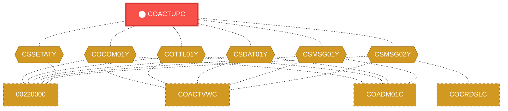

# Program: COACTUPC

---

## Quick Reference

| Attribute | Value |
|-----------|-------|
| Program ID | `COACTUPC` |
| Type | ONLINE |
| Lines | 4237 |
| Source | [COACTUPC.cbl](../carddemo/COACTUPC.cbl#L1) |
| Paragraphs | 88 |
| Statements | 0 |
| Impact Risk | **HIGH** — 32 programs affected |

> **View Source:** [Open COACTUPC.cbl](../carddemo/COACTUPC.cbl#L1)

## Dependency Context

> This section shows how **COACTUPC** connects to the rest of the system — who calls it,
> what it calls, and what data it shares. If linked programs exist, they must appear here.

### Programs That Call COACTUPC (Callers)

*No programs call COACTUPC — this is likely a top-level entry point or CICS transaction starter.*

### Programs Called by COACTUPC (Callees)

*COACTUPC does not call any other programs (leaf program).*

### Shared Data (Copybooks & Files)

#### Shared Copybooks

| Copybook | Also Used By | # Co-Users |
|----------|-------------|------------|
| `COACTUP` |  | 0 |
| `COCOM01Y` | 00220000, COACTVWC, COADM01C, COBIL00C, COCRDLIC (+15 more) | 20 |
| `COTTL01Y` | 00220000, COACTVWC, COADM01C, COBIL00C, COCRDLIC (+15 more) | 20 |
| `CSDAT01Y` | 00220000, COACTVWC, COADM01C, COBIL00C, COCRDLIC (+15 more) | 20 |
| `CSLKPCDY` |  | 0 |
| `CSMSG01Y` | 00220000, COACTVWC, COADM01C, COBIL00C, COCRDLIC (+15 more) | 20 |
| `CSMSG02Y` | 00220000, COACTVWC, COCRDSLC, COCRDUPC, COPAUS0C (+1 more) | 6 |
| `CSSETATY` | 00220000 | 1 |
| `CSUSR01Y` | 00220000, COACTVWC, COADM01C, COCRDLIC, COCRDSLC (+8 more) | 13 |
| `CSUTLDPY` |  | 0 |
| `CVACT01Y` | CBACT01C, CBACT04C, CBEXPORT, CBIMPORT, CBSTM03A (+8 more) | 13 |
| `CVACT03Y` | CBACT03C, CBACT04C, CBEXPORT, CBIMPORT, CBSTM03A (+8 more) | 13 |
| `CVCRD01Y` | 00220000, COACTVWC, COCRDLIC, COCRDSLC, COCRDUPC (+1 more) | 6 |
| `CVCUS01Y` | CBCUS01C, CBEXPORT, CBIMPORT, CBTRN01C, COACTVWC (+4 more) | 9 |
| `DFHAID` | 00220000, COACTVWC, COADM01C, COBIL00C, COCRDLIC (+15 more) | 20 |
| `DFHBMSCA` | 00220000, COACTVWC, COADM01C, COBIL00C, COCRDLIC (+15 more) | 20 |

---

## Dependency Graph

> **Legend:** 🔴 Target program · 🔵 Direct callers · 🟢 Direct callees · 🟡 Copybook-coupled · ⚫ Transitive (indirect)

---

## Impact Ripple View

> **If you change COACTUPC, what else could break?**

| Impact Metric | Count |
|--------------|-------|
| Direct Callers | 0 |
| Transitive Callers (callers of callers) | 0 |
| Direct Callees | 0 |
| Transitive Callees | 0 |
| Copybook-Coupled Programs | 32 |
| **Total Impact** | **32** |
| **Risk Rating** | **HIGH** |

**Programs affected via shared copybooks:**
- `00220000`
- `CBACT01C`
- `CBACT03C`
- `CBACT04C`
- `CBCUS01C`
- `CBEXPORT`
- `CBIMPORT`
- `CBSTM03A`
- `CBTRN01C`
- `CBTRN02C`
- `CBTRN03C`
- `COACCT01`
- `COACTVWC`
- `COADM01C`
- `COBIL00C`
- `COCRDLIC`
- `COCRDSLC`
- `COCRDUPC`
- `COMEN01C`
- `COPAUA0C`
- `COPAUS0C`
- `COPAUS1C`
- `CORPT00C`
- `COSGN00C`
- `COTRN00C`
- `COTRN01C`
- `COTRN02C`
- `COTRTLIC`
- `COUSR00C`
- `COUSR01C`
- `COUSR02C`
- `COUSR03C`

---

## Statement Profile

## Control Flow

```mermaid
flowchart TD
    START([Program Entry])
    PROGRAM_ID["PROGRAM-ID"]
    DATE_WRITTEN["DATE-WRITTEN"]
    DATE_COMPILED["DATE-COMPILED"]
    0000_MAIN["0000-MAIN"]
    COMMON_RETURN["COMMON-RETURN"]
    0000_MAIN_EXIT["0000-MAIN-EXIT"]
    1000_PROCESS_INPUTS["1000-PROCESS-INPUTS"]
    1000_PROCESS_INPUTS_EXIT["1000-PROCESS-INPUTS-EXIT"]
    1100_RECEIVE_MAP["1100-RECEIVE-MAP"]
    1100_RECEIVE_MAP_EXIT["1100-RECEIVE-MAP-EXIT"]
    1200_EDIT_MAP_INPUTS["1200-EDIT-MAP-INPUTS"]
    1200_EDIT_MAP_INPUTS_EXIT["1200-EDIT-MAP-INPUTS-EXIT"]
    1205_COMPARE_OLD_NEW["1205-COMPARE-OLD-NEW"]
    1205_COMPARE_OLD_NEW_EXIT["1205-COMPARE-OLD-NEW-EXIT"]
    1210_EDIT_ACCOUNT["1210-EDIT-ACCOUNT"]
    START --> PROGRAM_ID
    MAIN --> YYYY_STORE_PFKEY
    MAIN --> 3000_SEND_MAP
    MAIN --> 1000_PROCESS_INPUTS
    MAIN --> 2000_DECIDE_ACTION
    MAIN --> 1100_RECEIVE_MAP
    MAIN --> 1200_EDIT_MAP_INPUTS
    MAIN --> 1210_EDIT_ACCOUNT
    MAIN --> 1205_COMPARE_OLD_NEW
    MAIN --> 1220_EDIT_YESNO
    MAIN --> EDIT_DATE_CCYYMMDD
    MAIN --> 1250_EDIT_SIGNED_9V2
    MAIN --> 1265_EDIT_US_SSN
```

## Paragraphs

### PROGRAM-ID

| | |
|---|---|
| **Paragraph** | `PROGRAM-ID` |
| **Lines** | 22 - 23 |
| **View Code** | [Jump to Line 22](../carddemo/COACTUPC.cbl#L22) |

### DATE-WRITTEN

| | |
|---|---|
| **Paragraph** | `DATE-WRITTEN` |
| **Lines** | 24 - 25 |
| **View Code** | [Jump to Line 24](../carddemo/COACTUPC.cbl#L24) |

### DATE-COMPILED

| | |
|---|---|
| **Paragraph** | `DATE-COMPILED` |
| **Lines** | 26 - 858 |
| **View Code** | [Jump to Line 26](../carddemo/COACTUPC.cbl#L26) |

### 0000-MAIN

| | |
|---|---|
| **Paragraph** | `0000-MAIN` |
| **Lines** | 859 - 1006 |
| **View Code** | [Jump to Line 859](../carddemo/COACTUPC.cbl#L859) |

### COMMON-RETURN

| | |
|---|---|
| **Paragraph** | `COMMON-RETURN` |
| **Lines** | 1007 - 1020 |
| **View Code** | [Jump to Line 1007](../carddemo/COACTUPC.cbl#L1007) |

### 0000-MAIN-EXIT

| | |
|---|---|
| **Paragraph** | `0000-MAIN-EXIT` |
| **Lines** | 1021 - 1024 |
| **View Code** | [Jump to Line 1021](../carddemo/COACTUPC.cbl#L1021) |

### 1000-PROCESS-INPUTS

| | |
|---|---|
| **Paragraph** | `1000-PROCESS-INPUTS` |
| **Lines** | 1025 - 1035 |
| **View Code** | [Jump to Line 1025](../carddemo/COACTUPC.cbl#L1025) |

### 1000-PROCESS-INPUTS-EXIT

| | |
|---|---|
| **Paragraph** | `1000-PROCESS-INPUTS-EXIT` |
| **Lines** | 1036 - 1038 |
| **View Code** | [Jump to Line 1036](../carddemo/COACTUPC.cbl#L1036) |

### 1100-RECEIVE-MAP

| | |
|---|---|
| **Paragraph** | `1100-RECEIVE-MAP` |
| **Lines** | 1039 - 1425 |
| **View Code** | [Jump to Line 1039](../carddemo/COACTUPC.cbl#L1039) |

### 1100-RECEIVE-MAP-EXIT

| | |
|---|---|
| **Paragraph** | `1100-RECEIVE-MAP-EXIT` |
| **Lines** | 1426 - 1428 |
| **View Code** | [Jump to Line 1426](../carddemo/COACTUPC.cbl#L1426) |

### 1200-EDIT-MAP-INPUTS

| | |
|---|---|
| **Paragraph** | `1200-EDIT-MAP-INPUTS` |
| **Lines** | 1429 - 1677 |
| **View Code** | [Jump to Line 1429](../carddemo/COACTUPC.cbl#L1429) |

### 1200-EDIT-MAP-INPUTS-EXIT

| | |
|---|---|
| **Paragraph** | `1200-EDIT-MAP-INPUTS-EXIT` |
| **Lines** | 1678 - 1680 |
| **View Code** | [Jump to Line 1678](../carddemo/COACTUPC.cbl#L1678) |

### 1205-COMPARE-OLD-NEW

| | |
|---|---|
| **Paragraph** | `1205-COMPARE-OLD-NEW` |
| **Lines** | 1681 - 1776 |
| **View Code** | [Jump to Line 1681](../carddemo/COACTUPC.cbl#L1681) |

### 1205-COMPARE-OLD-NEW-EXIT

| | |
|---|---|
| **Paragraph** | `1205-COMPARE-OLD-NEW-EXIT` |
| **Lines** | 1777 - 1782 |
| **View Code** | [Jump to Line 1777](../carddemo/COACTUPC.cbl#L1777) |

### 1210-EDIT-ACCOUNT

| | |
|---|---|
| **Paragraph** | `1210-EDIT-ACCOUNT` |
| **Lines** | 1783 - 1819 |
| **View Code** | [Jump to Line 1783](../carddemo/COACTUPC.cbl#L1783) |

### 1210-EDIT-ACCOUNT-EXIT

| | |
|---|---|
| **Paragraph** | `1210-EDIT-ACCOUNT-EXIT` |
| **Lines** | 1820 - 1823 |
| **View Code** | [Jump to Line 1820](../carddemo/COACTUPC.cbl#L1820) |

### 1215-EDIT-MANDATORY

| | |
|---|---|
| **Paragraph** | `1215-EDIT-MANDATORY` |
| **Lines** | 1824 - 1851 |
| **View Code** | [Jump to Line 1824](../carddemo/COACTUPC.cbl#L1824) |

### 1215-EDIT-MANDATORY-EXIT

| | |
|---|---|
| **Paragraph** | `1215-EDIT-MANDATORY-EXIT` |
| **Lines** | 1852 - 1855 |
| **View Code** | [Jump to Line 1852](../carddemo/COACTUPC.cbl#L1852) |

### 1220-EDIT-YESNO

| | |
|---|---|
| **Paragraph** | `1220-EDIT-YESNO` |
| **Lines** | 1856 - 1893 |
| **View Code** | [Jump to Line 1856](../carddemo/COACTUPC.cbl#L1856) |

### 1220-EDIT-YESNO-EXIT

| | |
|---|---|
| **Paragraph** | `1220-EDIT-YESNO-EXIT` |
| **Lines** | 1894 - 1897 |
| **View Code** | [Jump to Line 1894](../carddemo/COACTUPC.cbl#L1894) |

### 1225-EDIT-ALPHA-REQD

| | |
|---|---|
| **Paragraph** | `1225-EDIT-ALPHA-REQD` |
| **Lines** | 1898 - 1950 |
| **View Code** | [Jump to Line 1898](../carddemo/COACTUPC.cbl#L1898) |

### 1225-EDIT-ALPHA-REQD-EXIT

| | |
|---|---|
| **Paragraph** | `1225-EDIT-ALPHA-REQD-EXIT` |
| **Lines** | 1951 - 1954 |
| **View Code** | [Jump to Line 1951](../carddemo/COACTUPC.cbl#L1951) |

### 1230-EDIT-ALPHANUM-REQD

| | |
|---|---|
| **Paragraph** | `1230-EDIT-ALPHANUM-REQD` |
| **Lines** | 1955 - 2008 |
| **View Code** | [Jump to Line 1955](../carddemo/COACTUPC.cbl#L1955) |

### 1230-EDIT-ALPHANUM-REQD-EXIT

| | |
|---|---|
| **Paragraph** | `1230-EDIT-ALPHANUM-REQD-EXIT` |
| **Lines** | 2009 - 2011 |
| **View Code** | [Jump to Line 2009](../carddemo/COACTUPC.cbl#L2009) |

### 1235-EDIT-ALPHA-OPT

| | |
|---|---|
| **Paragraph** | `1235-EDIT-ALPHA-OPT` |
| **Lines** | 2012 - 2056 |
| **View Code** | [Jump to Line 2012](../carddemo/COACTUPC.cbl#L2012) |

### 1235-EDIT-ALPHA-OPT-EXIT

| | |
|---|---|
| **Paragraph** | `1235-EDIT-ALPHA-OPT-EXIT` |
| **Lines** | 2057 - 2060 |
| **View Code** | [Jump to Line 2057](../carddemo/COACTUPC.cbl#L2057) |

### 1240-EDIT-ALPHANUM-OPT

| | |
|---|---|
| **Paragraph** | `1240-EDIT-ALPHANUM-OPT` |
| **Lines** | 2061 - 2104 |
| **View Code** | [Jump to Line 2061](../carddemo/COACTUPC.cbl#L2061) |

### 1240-EDIT-ALPHANUM-OPT-EXIT

| | |
|---|---|
| **Paragraph** | `1240-EDIT-ALPHANUM-OPT-EXIT` |
| **Lines** | 2105 - 2108 |
| **View Code** | [Jump to Line 2105](../carddemo/COACTUPC.cbl#L2105) |

### 1245-EDIT-NUM-REQD

| | |
|---|---|
| **Paragraph** | `1245-EDIT-NUM-REQD` |
| **Lines** | 2109 - 2175 |
| **View Code** | [Jump to Line 2109](../carddemo/COACTUPC.cbl#L2109) |

### 1245-EDIT-NUM-REQD-EXIT

| | |
|---|---|
| **Paragraph** | `1245-EDIT-NUM-REQD-EXIT` |
| **Lines** | 2176 - 2179 |
| **View Code** | [Jump to Line 2176](../carddemo/COACTUPC.cbl#L2176) |

### 1250-EDIT-SIGNED-9V2

| | |
|---|---|
| **Paragraph** | `1250-EDIT-SIGNED-9V2` |
| **Lines** | 2180 - 2220 |
| **View Code** | [Jump to Line 2180](../carddemo/COACTUPC.cbl#L2180) |

### 1250-EDIT-SIGNED-9V2-EXIT

| | |
|---|---|
| **Paragraph** | `1250-EDIT-SIGNED-9V2-EXIT` |
| **Lines** | 2221 - 2224 |
| **View Code** | [Jump to Line 2221](../carddemo/COACTUPC.cbl#L2221) |

### 1260-EDIT-US-PHONE-NUM

| | |
|---|---|
| **Paragraph** | `1260-EDIT-US-PHONE-NUM` |
| **Lines** | 2225 - 2245 |
| **View Code** | [Jump to Line 2225](../carddemo/COACTUPC.cbl#L2225) |

### EDIT-AREA-CODE

| | |
|---|---|
| **Paragraph** | `EDIT-AREA-CODE` |
| **Lines** | 2246 - 2315 |
| **View Code** | [Jump to Line 2246](../carddemo/COACTUPC.cbl#L2246) |

### EDIT-US-PHONE-PREFIX

| | |
|---|---|
| **Paragraph** | `EDIT-US-PHONE-PREFIX` |
| **Lines** | 2316 - 2369 |
| **View Code** | [Jump to Line 2316](../carddemo/COACTUPC.cbl#L2316) |

### EDIT-US-PHONE-LINENUM

| | |
|---|---|
| **Paragraph** | `EDIT-US-PHONE-LINENUM` |
| **Lines** | 2370 - 2423 |
| **View Code** | [Jump to Line 2370](../carddemo/COACTUPC.cbl#L2370) |

### EDIT-US-PHONE-EXIT

| | |
|---|---|
| **Paragraph** | `EDIT-US-PHONE-EXIT` |
| **Lines** | 2424 - 2426 |
| **View Code** | [Jump to Line 2424](../carddemo/COACTUPC.cbl#L2424) |

### 1260-EDIT-US-PHONE-NUM-EXIT

| | |
|---|---|
| **Paragraph** | `1260-EDIT-US-PHONE-NUM-EXIT` |
| **Lines** | 2427 - 2430 |
| **View Code** | [Jump to Line 2427](../carddemo/COACTUPC.cbl#L2427) |

### 1265-EDIT-US-SSN

| | |
|---|---|
| **Paragraph** | `1265-EDIT-US-SSN` |
| **Lines** | 2431 - 2488 |
| **View Code** | [Jump to Line 2431](../carddemo/COACTUPC.cbl#L2431) |

### 1265-EDIT-US-SSN-EXIT

| | |
|---|---|
| **Paragraph** | `1265-EDIT-US-SSN-EXIT` |
| **Lines** | 2489 - 2492 |
| **View Code** | [Jump to Line 2489](../carddemo/COACTUPC.cbl#L2489) |

### 1270-EDIT-US-STATE-CD

| | |
|---|---|
| **Paragraph** | `1270-EDIT-US-STATE-CD` |
| **Lines** | 2493 - 2510 |
| **View Code** | [Jump to Line 2493](../carddemo/COACTUPC.cbl#L2493) |

### 1270-EDIT-US-STATE-CD-EXIT

| | |
|---|---|
| **Paragraph** | `1270-EDIT-US-STATE-CD-EXIT` |
| **Lines** | 2511 - 2513 |
| **View Code** | [Jump to Line 2511](../carddemo/COACTUPC.cbl#L2511) |

### 1275-EDIT-FICO-SCORE

| | |
|---|---|
| **Paragraph** | `1275-EDIT-FICO-SCORE` |
| **Lines** | 2514 - 2530 |
| **View Code** | [Jump to Line 2514](../carddemo/COACTUPC.cbl#L2514) |

### 1275-EDIT-FICO-SCORE-EXIT

| | |
|---|---|
| **Paragraph** | `1275-EDIT-FICO-SCORE-EXIT` |
| **Lines** | 2531 - 2535 |
| **View Code** | [Jump to Line 2531](../carddemo/COACTUPC.cbl#L2531) |

### 1280-EDIT-US-STATE-ZIP-CD

| | |
|---|---|
| **Paragraph** | `1280-EDIT-US-STATE-ZIP-CD` |
| **Lines** | 2536 - 2557 |
| **View Code** | [Jump to Line 2536](../carddemo/COACTUPC.cbl#L2536) |

### 1280-EDIT-US-STATE-ZIP-CD-EXIT

| | |
|---|---|
| **Paragraph** | `1280-EDIT-US-STATE-ZIP-CD-EXIT` |
| **Lines** | 2558 - 2561 |
| **View Code** | [Jump to Line 2558](../carddemo/COACTUPC.cbl#L2558) |

### 2000-DECIDE-ACTION

| | |
|---|---|
| **Paragraph** | `2000-DECIDE-ACTION` |
| **Lines** | 2562 - 2642 |
| **View Code** | [Jump to Line 2562](../carddemo/COACTUPC.cbl#L2562) |

### 2000-DECIDE-ACTION-EXIT

| | |
|---|---|
| **Paragraph** | `2000-DECIDE-ACTION-EXIT` |
| **Lines** | 2643 - 2648 |
| **View Code** | [Jump to Line 2643](../carddemo/COACTUPC.cbl#L2643) |

### 3000-SEND-MAP

| | |
|---|---|
| **Paragraph** | `3000-SEND-MAP` |
| **Lines** | 2649 - 2663 |
| **View Code** | [Jump to Line 2649](../carddemo/COACTUPC.cbl#L2649) |

### 3000-SEND-MAP-EXIT

| | |
|---|---|
| **Paragraph** | `3000-SEND-MAP-EXIT` |
| **Lines** | 2664 - 2667 |
| **View Code** | [Jump to Line 2664](../carddemo/COACTUPC.cbl#L2664) |

### 3100-SCREEN-INIT

| | |
|---|---|
| **Paragraph** | `3100-SCREEN-INIT` |
| **Lines** | 2668 - 2693 |
| **View Code** | [Jump to Line 2668](../carddemo/COACTUPC.cbl#L2668) |

### 3100-SCREEN-INIT-EXIT

| | |
|---|---|
| **Paragraph** | `3100-SCREEN-INIT-EXIT` |
| **Lines** | 2694 - 2697 |
| **View Code** | [Jump to Line 2694](../carddemo/COACTUPC.cbl#L2694) |

### 3200-SETUP-SCREEN-VARS

| | |
|---|---|
| **Paragraph** | `3200-SETUP-SCREEN-VARS` |
| **Lines** | 2698 - 2726 |
| **View Code** | [Jump to Line 2698](../carddemo/COACTUPC.cbl#L2698) |

### 3200-SETUP-SCREEN-VARS-EXIT

| | |
|---|---|
| **Paragraph** | `3200-SETUP-SCREEN-VARS-EXIT` |
| **Lines** | 2727 - 2730 |
| **View Code** | [Jump to Line 2727](../carddemo/COACTUPC.cbl#L2727) |

### 3201-SHOW-INITIAL-VALUES

| | |
|---|---|
| **Paragraph** | `3201-SHOW-INITIAL-VALUES` |
| **Lines** | 2731 - 2782 |
| **View Code** | [Jump to Line 2731](../carddemo/COACTUPC.cbl#L2731) |

### 3201-SHOW-INITIAL-VALUES-EXIT

| | |
|---|---|
| **Paragraph** | `3201-SHOW-INITIAL-VALUES-EXIT` |
| **Lines** | 2783 - 2786 |
| **View Code** | [Jump to Line 2783](../carddemo/COACTUPC.cbl#L2783) |

### 3202-SHOW-ORIGINAL-VALUES

| | |
|---|---|
| **Paragraph** | `3202-SHOW-ORIGINAL-VALUES` |
| **Lines** | 2787 - 2866 |
| **View Code** | [Jump to Line 2787](../carddemo/COACTUPC.cbl#L2787) |

### 3202-SHOW-ORIGINAL-VALUES-EXIT

| | |
|---|---|
| **Paragraph** | `3202-SHOW-ORIGINAL-VALUES-EXIT` |
| **Lines** | 2867 - 2869 |
| **View Code** | [Jump to Line 2867](../carddemo/COACTUPC.cbl#L2867) |

### 3203-SHOW-UPDATED-VALUES

| | |
|---|---|
| **Paragraph** | `3203-SHOW-UPDATED-VALUES` |
| **Lines** | 2870 - 2950 |
| **View Code** | [Jump to Line 2870](../carddemo/COACTUPC.cbl#L2870) |

### 3203-SHOW-UPDATED-VALUES-EXIT

| | |
|---|---|
| **Paragraph** | `3203-SHOW-UPDATED-VALUES-EXIT` |
| **Lines** | 2951 - 2954 |
| **View Code** | [Jump to Line 2951](../carddemo/COACTUPC.cbl#L2951) |

### 3250-SETUP-INFOMSG

| | |
|---|---|
| **Paragraph** | `3250-SETUP-INFOMSG` |
| **Lines** | 2955 - 2982 |
| **View Code** | [Jump to Line 2955](../carddemo/COACTUPC.cbl#L2955) |

### 3250-SETUP-INFOMSG-EXIT

| | |
|---|---|
| **Paragraph** | `3250-SETUP-INFOMSG-EXIT` |
| **Lines** | 2983 - 2985 |
| **View Code** | [Jump to Line 2983](../carddemo/COACTUPC.cbl#L2983) |

### 3300-SETUP-SCREEN-ATTRS

| | |
|---|---|
| **Paragraph** | `3300-SETUP-SCREEN-ATTRS` |
| **Lines** | 2986 - 3436 |
| **View Code** | [Jump to Line 2986](../carddemo/COACTUPC.cbl#L2986) |

### 3300-SETUP-SCREEN-ATTRS-EXIT

| | |
|---|---|
| **Paragraph** | `3300-SETUP-SCREEN-ATTRS-EXIT` |
| **Lines** | 3437 - 3440 |
| **View Code** | [Jump to Line 3437](../carddemo/COACTUPC.cbl#L3437) |

### 3310-PROTECT-ALL-ATTRS

| | |
|---|---|
| **Paragraph** | `3310-PROTECT-ALL-ATTRS` |
| **Lines** | 3441 - 3495 |
| **View Code** | [Jump to Line 3441](../carddemo/COACTUPC.cbl#L3441) |

### 3310-PROTECT-ALL-ATTRS-EXIT

| | |
|---|---|
| **Paragraph** | `3310-PROTECT-ALL-ATTRS-EXIT` |
| **Lines** | 3496 - 3499 |
| **View Code** | [Jump to Line 3496](../carddemo/COACTUPC.cbl#L3496) |

### 3320-UNPROTECT-FEW-ATTRS

| | |
|---|---|
| **Paragraph** | `3320-UNPROTECT-FEW-ATTRS` |
| **Lines** | 3500 - 3561 |
| **View Code** | [Jump to Line 3500](../carddemo/COACTUPC.cbl#L3500) |

### 3320-UNPROTECT-FEW-ATTRS-EXIT

| | |
|---|---|
| **Paragraph** | `3320-UNPROTECT-FEW-ATTRS-EXIT` |
| **Lines** | 3562 - 3565 |
| **View Code** | [Jump to Line 3562](../carddemo/COACTUPC.cbl#L3562) |

### 3390-SETUP-INFOMSG-ATTRS

| | |
|---|---|
| **Paragraph** | `3390-SETUP-INFOMSG-ATTRS` |
| **Lines** | 3566 - 3583 |
| **View Code** | [Jump to Line 3566](../carddemo/COACTUPC.cbl#L3566) |

### 3390-SETUP-INFOMSG-ATTRS-EXIT

| | |
|---|---|
| **Paragraph** | `3390-SETUP-INFOMSG-ATTRS-EXIT` |
| **Lines** | 3584 - 3588 |
| **View Code** | [Jump to Line 3584](../carddemo/COACTUPC.cbl#L3584) |

### 3400-SEND-SCREEN

| | |
|---|---|
| **Paragraph** | `3400-SEND-SCREEN` |
| **Lines** | 3589 - 3602 |
| **View Code** | [Jump to Line 3589](../carddemo/COACTUPC.cbl#L3589) |

### 3400-SEND-SCREEN-EXIT

| | |
|---|---|
| **Paragraph** | `3400-SEND-SCREEN-EXIT` |
| **Lines** | 3603 - 3607 |
| **View Code** | [Jump to Line 3603](../carddemo/COACTUPC.cbl#L3603) |

### 9000-READ-ACCT

| | |
|---|---|
| **Paragraph** | `9000-READ-ACCT` |
| **Lines** | 3608 - 3646 |
| **View Code** | [Jump to Line 3608](../carddemo/COACTUPC.cbl#L3608) |

### 9000-READ-ACCT-EXIT

| | |
|---|---|
| **Paragraph** | `9000-READ-ACCT-EXIT` |
| **Lines** | 3647 - 3649 |
| **View Code** | [Jump to Line 3647](../carddemo/COACTUPC.cbl#L3647) |

### 9200-GETCARDXREF-BYACCT

| | |
|---|---|
| **Paragraph** | `9200-GETCARDXREF-BYACCT` |
| **Lines** | 3650 - 3697 |
| **View Code** | [Jump to Line 3650](../carddemo/COACTUPC.cbl#L3650) |

### 9200-GETCARDXREF-BYACCT-EXIT

| | |
|---|---|
| **Paragraph** | `9200-GETCARDXREF-BYACCT-EXIT` |
| **Lines** | 3698 - 3700 |
| **View Code** | [Jump to Line 3698](../carddemo/COACTUPC.cbl#L3698) |

### 9300-GETACCTDATA-BYACCT

| | |
|---|---|
| **Paragraph** | `9300-GETACCTDATA-BYACCT` |
| **Lines** | 3701 - 3747 |
| **View Code** | [Jump to Line 3701](../carddemo/COACTUPC.cbl#L3701) |

### 9300-GETACCTDATA-BYACCT-EXIT

| | |
|---|---|
| **Paragraph** | `9300-GETACCTDATA-BYACCT-EXIT` |
| **Lines** | 3748 - 3751 |
| **View Code** | [Jump to Line 3748](../carddemo/COACTUPC.cbl#L3748) |

### 9400-GETCUSTDATA-BYCUST

| | |
|---|---|
| **Paragraph** | `9400-GETCUSTDATA-BYCUST` |
| **Lines** | 3752 - 3796 |
| **View Code** | [Jump to Line 3752](../carddemo/COACTUPC.cbl#L3752) |

### 9400-GETCUSTDATA-BYCUST-EXIT

| | |
|---|---|
| **Paragraph** | `9400-GETCUSTDATA-BYCUST-EXIT` |
| **Lines** | 3797 - 3800 |
| **View Code** | [Jump to Line 3797](../carddemo/COACTUPC.cbl#L3797) |

### 9500-STORE-FETCHED-DATA

| | |
|---|---|
| **Paragraph** | `9500-STORE-FETCHED-DATA` |
| **Lines** | 3801 - 3884 |
| **View Code** | [Jump to Line 3801](../carddemo/COACTUPC.cbl#L3801) |

### 9500-STORE-FETCHED-DATA-EXIT

| | |
|---|---|
| **Paragraph** | `9500-STORE-FETCHED-DATA-EXIT` |
| **Lines** | 3885 - 3887 |
| **View Code** | [Jump to Line 3885](../carddemo/COACTUPC.cbl#L3885) |

### 9600-WRITE-PROCESSING

| | |
|---|---|
| **Paragraph** | `9600-WRITE-PROCESSING` |
| **Lines** | 3888 - 4104 |
| **View Code** | [Jump to Line 3888](../carddemo/COACTUPC.cbl#L3888) |

### 9600-WRITE-PROCESSING-EXIT

| | |
|---|---|
| **Paragraph** | `9600-WRITE-PROCESSING-EXIT` |
| **Lines** | 4105 - 4108 |
| **View Code** | [Jump to Line 4105](../carddemo/COACTUPC.cbl#L4105) |

### 9700-CHECK-CHANGE-IN-REC

| | |
|---|---|
| **Paragraph** | `9700-CHECK-CHANGE-IN-REC` |
| **Lines** | 4109 - 4192 |
| **View Code** | [Jump to Line 4109](../carddemo/COACTUPC.cbl#L4109) |

### 9700-CHECK-CHANGE-IN-REC-EXIT

| | |
|---|---|
| **Paragraph** | `9700-CHECK-CHANGE-IN-REC-EXIT` |
| **Lines** | 4193 - 4202 |
| **View Code** | [Jump to Line 4193](../carddemo/COACTUPC.cbl#L4193) |

### ABEND-ROUTINE

| | |
|---|---|
| **Paragraph** | `ABEND-ROUTINE` |
| **Lines** | 4203 - 4225 |
| **View Code** | [Jump to Line 4203](../carddemo/COACTUPC.cbl#L4203) |

### ABEND-ROUTINE-EXIT

| | |
|---|---|
| **Paragraph** | `ABEND-ROUTINE-EXIT` |
| **Lines** | 4226 - 4237 |
| **View Code** | [Jump to Line 4226](../carddemo/COACTUPC.cbl#L4226) |

## Business Rules

*No business rules extracted yet. Run LLM enrichment to extract rules from IF/EVALUATE logic.*

## Key Data Items

*No data items found for this program.*

---

*Generated 2026-03-16 21:06*