# Program: COACTVWC

---

## Quick Reference

| Attribute | Value |
|-----------|-------|
| Program ID | `COACTVWC` |
| Type | ONLINE |
| Lines | 942 |
| Source | [COACTVWC.cbl](../carddemo/COACTVWC.cbl#L1) |
| Paragraphs | 37 |
| Statements | 0 |
| Impact Risk | **HIGH** — 33 programs affected |

> **View Source:** [Open COACTVWC.cbl](../carddemo/COACTVWC.cbl#L1)

## Dependency Context

> This section shows how **COACTVWC** connects to the rest of the system — who calls it,
> what it calls, and what data it shares. If linked programs exist, they must appear here.

### Programs That Call COACTVWC (Callers)

*No programs call COACTVWC — this is likely a top-level entry point or CICS transaction starter.*

### Programs Called by COACTVWC (Callees)

*COACTVWC does not call any other programs (leaf program).*

### Shared Data (Copybooks & Files)

#### Shared Copybooks

| Copybook | Also Used By | # Co-Users |
|----------|-------------|------------|
| `COACTVW` |  | 0 |
| `COCOM01Y` | 00220000, COACTUPC, COADM01C, COBIL00C, COCRDLIC (+15 more) | 20 |
| `COTTL01Y` | 00220000, COACTUPC, COADM01C, COBIL00C, COCRDLIC (+15 more) | 20 |
| `CSDAT01Y` | 00220000, COACTUPC, COADM01C, COBIL00C, COCRDLIC (+15 more) | 20 |
| `CSMSG01Y` | 00220000, COACTUPC, COADM01C, COBIL00C, COCRDLIC (+15 more) | 20 |
| `CSMSG02Y` | 00220000, COACTUPC, COCRDSLC, COCRDUPC, COPAUS0C (+1 more) | 6 |
| `CSUSR01Y` | 00220000, COACTUPC, COADM01C, COCRDLIC, COCRDSLC (+8 more) | 13 |
| `CVACT01Y` | CBACT01C, CBACT04C, CBEXPORT, CBIMPORT, CBSTM03A (+8 more) | 13 |
| `CVACT02Y` | CBACT02C, CBEXPORT, CBIMPORT, CBTRN01C, COCRDLIC (+4 more) | 9 |
| `CVACT03Y` | CBACT03C, CBACT04C, CBEXPORT, CBIMPORT, CBSTM03A (+8 more) | 13 |
| `CVCRD01Y` | 00220000, COACTUPC, COCRDLIC, COCRDSLC, COCRDUPC (+1 more) | 6 |
| `CVCUS01Y` | CBCUS01C, CBEXPORT, CBIMPORT, CBTRN01C, COACTUPC (+4 more) | 9 |
| `DFHAID` | 00220000, COACTUPC, COADM01C, COBIL00C, COCRDLIC (+15 more) | 20 |
| `DFHBMSCA` | 00220000, COACTUPC, COADM01C, COBIL00C, COCRDLIC (+15 more) | 20 |

---

## Dependency Graph

```mermaid
flowchart TD
    COACTVWC["⬤ COACTVWC"]:::target
    CB_COCOM01Y{{"COCOM01Y"}}:::copybook
    COACTVWC -.- CB_COCOM01Y
    00220000["00220000"]:::coupled
    CB_COCOM01Y -.- 00220000
    COACTUPC["COACTUPC"]:::coupled
    CB_COCOM01Y -.- COACTUPC
    COADM01C["COADM01C"]:::coupled
    CB_COCOM01Y -.- COADM01C
    CB_COTTL01Y{{"COTTL01Y"}}:::copybook
    COACTVWC -.- CB_COTTL01Y
    00220000["00220000"]:::coupled
    CB_COTTL01Y -.- 00220000
    COACTUPC["COACTUPC"]:::coupled
    CB_COTTL01Y -.- COACTUPC
    COADM01C["COADM01C"]:::coupled
    CB_COTTL01Y -.- COADM01C
    CB_CSDAT01Y{{"CSDAT01Y"}}:::copybook
    COACTVWC -.- CB_CSDAT01Y
    00220000["00220000"]:::coupled
    CB_CSDAT01Y -.- 00220000
    COACTUPC["COACTUPC"]:::coupled
    CB_CSDAT01Y -.- COACTUPC
    COADM01C["COADM01C"]:::coupled
    CB_CSDAT01Y -.- COADM01C
    CB_CSMSG01Y{{"CSMSG01Y"}}:::copybook
    COACTVWC -.- CB_CSMSG01Y
    00220000["00220000"]:::coupled
    CB_CSMSG01Y -.- 00220000
    COACTUPC["COACTUPC"]:::coupled
    CB_CSMSG01Y -.- COACTUPC
    COADM01C["COADM01C"]:::coupled
    CB_CSMSG01Y -.- COADM01C
    CB_CSMSG02Y{{"CSMSG02Y"}}:::copybook
    COACTVWC -.- CB_CSMSG02Y
    00220000["00220000"]:::coupled
    CB_CSMSG02Y -.- 00220000
    COACTUPC["COACTUPC"]:::coupled
    CB_CSMSG02Y -.- COACTUPC
    COCRDSLC["COCRDSLC"]:::coupled
    CB_CSMSG02Y -.- COCRDSLC
    CB_CSUSR01Y{{"CSUSR01Y"}}:::copybook
    COACTVWC -.- CB_CSUSR01Y
    00220000["00220000"]:::coupled
    CB_CSUSR01Y -.- 00220000
    COACTUPC["COACTUPC"]:::coupled
    CB_CSUSR01Y -.- COACTUPC
    COADM01C["COADM01C"]:::coupled
    CB_CSUSR01Y -.- COADM01C
    CB_CVACT01Y{{"CVACT01Y"}}:::copybook
    COACTVWC -.- CB_CVACT01Y
    CBACT01C["CBACT01C"]:::coupled
    CB_CVACT01Y -.- CBACT01C
    CBACT04C["CBACT04C"]:::coupled
    CB_CVACT01Y -.- CBACT04C
    CBEXPORT["CBEXPORT"]:::coupled
    CB_CVACT01Y -.- CBEXPORT

    classDef target fill:#f85149,stroke:#da3633,color:#fff,stroke-width:3px
    classDef caller fill:#58a6ff,stroke:#1f6feb,color:#fff
    classDef callee fill:#3fb950,stroke:#238636,color:#fff
    classDef copybook fill:#d29922,stroke:#9e6a03,color:#fff
    classDef coupled fill:#d29922,stroke:#9e6a03,color:#fff,stroke-dasharray:5
    classDef transitive fill:#484f58,stroke:#8b949e,color:#c9d1d9,stroke-dasharray:5
```

> **Legend:** 🔴 Target program · 🔵 Direct callers · 🟢 Direct callees · 🟡 Copybook-coupled · ⚫ Transitive (indirect)

---

## Impact Ripple View

> **If you change COACTVWC, what else could break?**

| Impact Metric | Count |
|--------------|-------|
| Direct Callers | 0 |
| Transitive Callers (callers of callers) | 0 |
| Direct Callees | 0 |
| Transitive Callees | 0 |
| Copybook-Coupled Programs | 33 |
| **Total Impact** | **33** |
| **Risk Rating** | **HIGH** |

**Programs affected via shared copybooks:**
- `00220000`
- `CBACT01C`
- `CBACT02C`
- `CBACT03C`
- `CBACT04C`
- `CBCUS01C`
- `CBEXPORT`
- `CBIMPORT`
- `CBSTM03A`
- `CBTRN01C`
- `CBTRN02C`
- `CBTRN03C`
- `COACCT01`
- `COACTUPC`
- `COADM01C`
- `COBIL00C`
- `COCRDLIC`
- `COCRDSLC`
- `COCRDUPC`
- `COMEN01C`
- `COPAUA0C`
- `COPAUS0C`
- `COPAUS1C`
- `CORPT00C`
- `COSGN00C`
- `COTRN00C`
- `COTRN01C`
- `COTRN02C`
- `COTRTLIC`
- `COUSR00C`
- `COUSR01C`
- `COUSR02C`
- `COUSR03C`

---

## Statement Profile

## Control Flow

```mermaid
flowchart TD
    START([Program Entry])
    PROGRAM_ID["PROGRAM-ID"]
    DATE_WRITTEN["DATE-WRITTEN"]
    DATE_COMPILED["DATE-COMPILED"]
    0000_MAIN["0000-MAIN"]
    COMMON_RETURN["COMMON-RETURN"]
    0000_MAIN_EXIT["0000-MAIN-EXIT"]
    1000_SEND_MAP["1000-SEND-MAP"]
    1000_SEND_MAP_EXIT["1000-SEND-MAP-EXIT"]
    1100_SCREEN_INIT["1100-SCREEN-INIT"]
    1100_SCREEN_INIT_EXIT["1100-SCREEN-INIT-EXIT"]
    1200_SETUP_SCREEN_VARS["1200-SETUP-SCREEN-VARS"]
    1200_SETUP_SCREEN_VARS_EXIT["1200-SETUP-SCREEN-VARS-EXIT"]
    1300_SETUP_SCREEN_ATTRS["1300-SETUP-SCREEN-ATTRS"]
    1300_SETUP_SCREEN_ATTRS_EXIT["1300-SETUP-SCREEN-ATTRS-EXIT"]
    1400_SEND_SCREEN["1400-SEND-SCREEN"]
    START --> PROGRAM_ID
    MAIN --> YYYY_STORE_PFKEY
    MAIN --> 1000_SEND_MAP
    MAIN --> 2000_PROCESS_INPUTS
    MAIN --> 9000_READ_ACCT
    MAIN --> SEND_PLAIN_TEXT
    MAIN --> 1100_SCREEN_INIT
    MAIN --> 1200_SETUP_SCREEN_VARS
    MAIN --> 1300_SETUP_SCREEN_ATTRS
    MAIN --> 1400_SEND_SCREEN
    MAIN --> 2100_RECEIVE_MAP
    MAIN --> 2200_EDIT_MAP_INPUTS
    MAIN --> 2210_EDIT_ACCOUNT
    MAIN --> 9200_GETCARDXREF_BYACCT
    MAIN --> 9300_GETACCTDATA_BYACCT
    MAIN --> 9400_GETCUSTDATA_BYCUST
    MAIN --> SEND_LONG_TEXT
```

## Paragraphs

### PROGRAM-ID

| | |
|---|---|
| **Paragraph** | `PROGRAM-ID` |
| **Lines** | 22 - 23 |
| **View Code** | [Jump to Line 22](../carddemo/COACTVWC.cbl#L22) |

### DATE-WRITTEN

| | |
|---|---|
| **Paragraph** | `DATE-WRITTEN` |
| **Lines** | 24 - 25 |
| **View Code** | [Jump to Line 24](../carddemo/COACTVWC.cbl#L24) |

### DATE-COMPILED

| | |
|---|---|
| **Paragraph** | `DATE-COMPILED` |
| **Lines** | 26 - 261 |
| **View Code** | [Jump to Line 26](../carddemo/COACTVWC.cbl#L26) |

### 0000-MAIN

| | |
|---|---|
| **Paragraph** | `0000-MAIN` |
| **Lines** | 262 - 393 |
| **View Code** | [Jump to Line 262](../carddemo/COACTVWC.cbl#L262) |

### COMMON-RETURN

| | |
|---|---|
| **Paragraph** | `COMMON-RETURN` |
| **Lines** | 394 - 407 |
| **View Code** | [Jump to Line 394](../carddemo/COACTVWC.cbl#L394) |

### 0000-MAIN-EXIT

| | |
|---|---|
| **Paragraph** | `0000-MAIN-EXIT` |
| **Lines** | 411 - 415 |
| **View Code** | [Jump to Line 411](../carddemo/COACTVWC.cbl#L411) |

### 1000-SEND-MAP

| | |
|---|---|
| **Paragraph** | `1000-SEND-MAP` |
| **Lines** | 416 - 426 |
| **View Code** | [Jump to Line 416](../carddemo/COACTVWC.cbl#L416) |

### 1000-SEND-MAP-EXIT

| | |
|---|---|
| **Paragraph** | `1000-SEND-MAP-EXIT` |
| **Lines** | 427 - 430 |
| **View Code** | [Jump to Line 427](../carddemo/COACTVWC.cbl#L427) |

### 1100-SCREEN-INIT

| | |
|---|---|
| **Paragraph** | `1100-SCREEN-INIT` |
| **Lines** | 431 - 456 |
| **View Code** | [Jump to Line 431](../carddemo/COACTVWC.cbl#L431) |

### 1100-SCREEN-INIT-EXIT

| | |
|---|---|
| **Paragraph** | `1100-SCREEN-INIT-EXIT` |
| **Lines** | 457 - 459 |
| **View Code** | [Jump to Line 457](../carddemo/COACTVWC.cbl#L457) |

### 1200-SETUP-SCREEN-VARS

| | |
|---|---|
| **Paragraph** | `1200-SETUP-SCREEN-VARS` |
| **Lines** | 460 - 536 |
| **View Code** | [Jump to Line 460](../carddemo/COACTVWC.cbl#L460) |

### 1200-SETUP-SCREEN-VARS-EXIT

| | |
|---|---|
| **Paragraph** | `1200-SETUP-SCREEN-VARS-EXIT` |
| **Lines** | 537 - 540 |
| **View Code** | [Jump to Line 537](../carddemo/COACTVWC.cbl#L537) |

### 1300-SETUP-SCREEN-ATTRS

| | |
|---|---|
| **Paragraph** | `1300-SETUP-SCREEN-ATTRS` |
| **Lines** | 541 - 573 |
| **View Code** | [Jump to Line 541](../carddemo/COACTVWC.cbl#L541) |

### 1300-SETUP-SCREEN-ATTRS-EXIT

| | |
|---|---|
| **Paragraph** | `1300-SETUP-SCREEN-ATTRS-EXIT` |
| **Lines** | 574 - 576 |
| **View Code** | [Jump to Line 574](../carddemo/COACTVWC.cbl#L574) |

### 1400-SEND-SCREEN

| | |
|---|---|
| **Paragraph** | `1400-SEND-SCREEN` |
| **Lines** | 577 - 591 |
| **View Code** | [Jump to Line 577](../carddemo/COACTVWC.cbl#L577) |

### 1400-SEND-SCREEN-EXIT

| | |
|---|---|
| **Paragraph** | `1400-SEND-SCREEN-EXIT` |
| **Lines** | 592 - 595 |
| **View Code** | [Jump to Line 592](../carddemo/COACTVWC.cbl#L592) |

### 2000-PROCESS-INPUTS

| | |
|---|---|
| **Paragraph** | `2000-PROCESS-INPUTS` |
| **Lines** | 596 - 606 |
| **View Code** | [Jump to Line 596](../carddemo/COACTVWC.cbl#L596) |

### 2000-PROCESS-INPUTS-EXIT

| | |
|---|---|
| **Paragraph** | `2000-PROCESS-INPUTS-EXIT` |
| **Lines** | 607 - 609 |
| **View Code** | [Jump to Line 607](../carddemo/COACTVWC.cbl#L607) |

### 2100-RECEIVE-MAP

| | |
|---|---|
| **Paragraph** | `2100-RECEIVE-MAP` |
| **Lines** | 610 - 618 |
| **View Code** | [Jump to Line 610](../carddemo/COACTVWC.cbl#L610) |

### 2100-RECEIVE-MAP-EXIT

| | |
|---|---|
| **Paragraph** | `2100-RECEIVE-MAP-EXIT` |
| **Lines** | 619 - 621 |
| **View Code** | [Jump to Line 619](../carddemo/COACTVWC.cbl#L619) |

### 2200-EDIT-MAP-INPUTS

| | |
|---|---|
| **Paragraph** | `2200-EDIT-MAP-INPUTS` |
| **Lines** | 622 - 644 |
| **View Code** | [Jump to Line 622](../carddemo/COACTVWC.cbl#L622) |

### 2200-EDIT-MAP-INPUTS-EXIT

| | |
|---|---|
| **Paragraph** | `2200-EDIT-MAP-INPUTS-EXIT` |
| **Lines** | 645 - 648 |
| **View Code** | [Jump to Line 645](../carddemo/COACTVWC.cbl#L645) |

### 2210-EDIT-ACCOUNT

| | |
|---|---|
| **Paragraph** | `2210-EDIT-ACCOUNT` |
| **Lines** | 649 - 682 |
| **View Code** | [Jump to Line 649](../carddemo/COACTVWC.cbl#L649) |

### 2210-EDIT-ACCOUNT-EXIT

| | |
|---|---|
| **Paragraph** | `2210-EDIT-ACCOUNT-EXIT` |
| **Lines** | 683 - 686 |
| **View Code** | [Jump to Line 683](../carddemo/COACTVWC.cbl#L683) |

### 9000-READ-ACCT

| | |
|---|---|
| **Paragraph** | `9000-READ-ACCT` |
| **Lines** | 687 - 719 |
| **View Code** | [Jump to Line 687](../carddemo/COACTVWC.cbl#L687) |

### 9000-READ-ACCT-EXIT

| | |
|---|---|
| **Paragraph** | `9000-READ-ACCT-EXIT` |
| **Lines** | 720 - 722 |
| **View Code** | [Jump to Line 720](../carddemo/COACTVWC.cbl#L720) |

### 9200-GETCARDXREF-BYACCT

| | |
|---|---|
| **Paragraph** | `9200-GETCARDXREF-BYACCT` |
| **Lines** | 723 - 770 |
| **View Code** | [Jump to Line 723](../carddemo/COACTVWC.cbl#L723) |

### 9200-GETCARDXREF-BYACCT-EXIT

| | |
|---|---|
| **Paragraph** | `9200-GETCARDXREF-BYACCT-EXIT` |
| **Lines** | 771 - 773 |
| **View Code** | [Jump to Line 771](../carddemo/COACTVWC.cbl#L771) |

### 9300-GETACCTDATA-BYACCT

| | |
|---|---|
| **Paragraph** | `9300-GETACCTDATA-BYACCT` |
| **Lines** | 774 - 820 |
| **View Code** | [Jump to Line 774](../carddemo/COACTVWC.cbl#L774) |

### 9300-GETACCTDATA-BYACCT-EXIT

| | |
|---|---|
| **Paragraph** | `9300-GETACCTDATA-BYACCT-EXIT` |
| **Lines** | 821 - 824 |
| **View Code** | [Jump to Line 821](../carddemo/COACTVWC.cbl#L821) |

### 9400-GETCUSTDATA-BYCUST

| | |
|---|---|
| **Paragraph** | `9400-GETCUSTDATA-BYCUST` |
| **Lines** | 825 - 869 |
| **View Code** | [Jump to Line 825](../carddemo/COACTVWC.cbl#L825) |

### 9400-GETCUSTDATA-BYCUST-EXIT

| | |
|---|---|
| **Paragraph** | `9400-GETCUSTDATA-BYCUST-EXIT` |
| **Lines** | 870 - 876 |
| **View Code** | [Jump to Line 870](../carddemo/COACTVWC.cbl#L870) |

### SEND-PLAIN-TEXT

| | |
|---|---|
| **Paragraph** | `SEND-PLAIN-TEXT` |
| **Lines** | 877 - 887 |
| **View Code** | [Jump to Line 877](../carddemo/COACTVWC.cbl#L877) |

### SEND-PLAIN-TEXT-EXIT

| | |
|---|---|
| **Paragraph** | `SEND-PLAIN-TEXT-EXIT` |
| **Lines** | 888 - 895 |
| **View Code** | [Jump to Line 888](../carddemo/COACTVWC.cbl#L888) |

### SEND-LONG-TEXT

| | |
|---|---|
| **Paragraph** | `SEND-LONG-TEXT` |
| **Lines** | 896 - 906 |
| **View Code** | [Jump to Line 896](../carddemo/COACTVWC.cbl#L896) |

### SEND-LONG-TEXT-EXIT

| | |
|---|---|
| **Paragraph** | `SEND-LONG-TEXT-EXIT` |
| **Lines** | 907 - 915 |
| **View Code** | [Jump to Line 907](../carddemo/COACTVWC.cbl#L907) |

### ABEND-ROUTINE

| | |
|---|---|
| **Paragraph** | `ABEND-ROUTINE` |
| **Lines** | 916 - 942 |
| **View Code** | [Jump to Line 916](../carddemo/COACTVWC.cbl#L916) |

## Business Rules

*No business rules extracted yet. Run LLM enrichment to extract rules from IF/EVALUATE logic.*

## Key Data Items

*No data items found for this program.*

---

*Generated 2026-03-16 21:06*