# Program: COBIL00C

---

## Quick Reference

| Attribute | Value |
|-----------|-------|
| Program ID | `COBIL00C` |
| Type | ONLINE |
| Lines | 573 |
| Source | [COBIL00C.cbl](../carddemo/COBIL00C.cbl#L1) |
| Paragraphs | 16 |
| Statements | 54 |
| Impact Risk | **HIGH** — 31 programs affected |

> **View Source:** [Open COBIL00C.cbl](../carddemo/COBIL00C.cbl#L1)

## Dependency Context

> This section shows how **COBIL00C** connects to the rest of the system — who calls it,
> what it calls, and what data it shares. If linked programs exist, they must appear here.

### Programs That Call COBIL00C (Callers)

*No programs call COBIL00C — this is likely a top-level entry point or CICS transaction starter.*

### Programs Called by COBIL00C (Callees)

*COBIL00C does not call any other programs (leaf program).*

### Shared Data (Copybooks & Files)

#### Shared Copybooks

| Copybook | Also Used By | # Co-Users |
|----------|-------------|------------|
| `COBIL00` |  | 0 |
| `COCOM01Y` | 00220000, COACTUPC, COACTVWC, COADM01C, COCRDLIC (+15 more) | 20 |
| `COTTL01Y` | 00220000, COACTUPC, COACTVWC, COADM01C, COCRDLIC (+15 more) | 20 |
| `CSDAT01Y` | 00220000, COACTUPC, COACTVWC, COADM01C, COCRDLIC (+15 more) | 20 |
| `CSMSG01Y` | 00220000, COACTUPC, COACTVWC, COADM01C, COCRDLIC (+15 more) | 20 |
| `CVACT01Y` | CBACT01C, CBACT04C, CBEXPORT, CBIMPORT, CBSTM03A (+8 more) | 13 |
| `CVACT03Y` | CBACT03C, CBACT04C, CBEXPORT, CBIMPORT, CBSTM03A (+8 more) | 13 |
| `CVTRA05Y` | CBACT04C, CBEXPORT, CBIMPORT, CBTRN01C, CBTRN02C (+5 more) | 10 |
| `DFHAID` | 00220000, COACTUPC, COACTVWC, COADM01C, COCRDLIC (+15 more) | 20 |
| `DFHBMSCA` | 00220000, COACTUPC, COACTVWC, COADM01C, COCRDLIC (+15 more) | 20 |

---

## Dependency Graph

```mermaid
flowchart TD
    COBIL00C["⬤ COBIL00C"]:::target
    CB_COCOM01Y{{"COCOM01Y"}}:::copybook
    COBIL00C -.- CB_COCOM01Y
    00220000["00220000"]:::coupled
    CB_COCOM01Y -.- 00220000
    COACTUPC["COACTUPC"]:::coupled
    CB_COCOM01Y -.- COACTUPC
    COACTVWC["COACTVWC"]:::coupled
    CB_COCOM01Y -.- COACTVWC
    CB_COTTL01Y{{"COTTL01Y"}}:::copybook
    COBIL00C -.- CB_COTTL01Y
    00220000["00220000"]:::coupled
    CB_COTTL01Y -.- 00220000
    COACTUPC["COACTUPC"]:::coupled
    CB_COTTL01Y -.- COACTUPC
    COACTVWC["COACTVWC"]:::coupled
    CB_COTTL01Y -.- COACTVWC
    CB_CSDAT01Y{{"CSDAT01Y"}}:::copybook
    COBIL00C -.- CB_CSDAT01Y
    00220000["00220000"]:::coupled
    CB_CSDAT01Y -.- 00220000
    COACTUPC["COACTUPC"]:::coupled
    CB_CSDAT01Y -.- COACTUPC
    COACTVWC["COACTVWC"]:::coupled
    CB_CSDAT01Y -.- COACTVWC
    CB_CSMSG01Y{{"CSMSG01Y"}}:::copybook
    COBIL00C -.- CB_CSMSG01Y
    00220000["00220000"]:::coupled
    CB_CSMSG01Y -.- 00220000
    COACTUPC["COACTUPC"]:::coupled
    CB_CSMSG01Y -.- COACTUPC
    COACTVWC["COACTVWC"]:::coupled
    CB_CSMSG01Y -.- COACTVWC
    CB_CVACT01Y{{"CVACT01Y"}}:::copybook
    COBIL00C -.- CB_CVACT01Y
    CBACT01C["CBACT01C"]:::coupled
    CB_CVACT01Y -.- CBACT01C
    CBACT04C["CBACT04C"]:::coupled
    CB_CVACT01Y -.- CBACT04C
    CBEXPORT["CBEXPORT"]:::coupled
    CB_CVACT01Y -.- CBEXPORT
    CB_CVACT03Y{{"CVACT03Y"}}:::copybook
    COBIL00C -.- CB_CVACT03Y
    CBACT03C["CBACT03C"]:::coupled
    CB_CVACT03Y -.- CBACT03C
    CBACT04C["CBACT04C"]:::coupled
    CB_CVACT03Y -.- CBACT04C
    CBEXPORT["CBEXPORT"]:::coupled
    CB_CVACT03Y -.- CBEXPORT
    CB_CVTRA05Y{{"CVTRA05Y"}}:::copybook
    COBIL00C -.- CB_CVTRA05Y
    CBACT04C["CBACT04C"]:::coupled
    CB_CVTRA05Y -.- CBACT04C
    CBEXPORT["CBEXPORT"]:::coupled
    CB_CVTRA05Y -.- CBEXPORT
    CBIMPORT["CBIMPORT"]:::coupled
    CB_CVTRA05Y -.- CBIMPORT

    classDef target fill:#f85149,stroke:#da3633,color:#fff,stroke-width:3px
    classDef caller fill:#58a6ff,stroke:#1f6feb,color:#fff
    classDef callee fill:#3fb950,stroke:#238636,color:#fff
    classDef copybook fill:#d29922,stroke:#9e6a03,color:#fff
    classDef coupled fill:#d29922,stroke:#9e6a03,color:#fff,stroke-dasharray:5
    classDef transitive fill:#484f58,stroke:#8b949e,color:#c9d1d9,stroke-dasharray:5
```

> **Legend:** 🔴 Target program · 🔵 Direct callers · 🟢 Direct callees · 🟡 Copybook-coupled · ⚫ Transitive (indirect)

---

## Impact Ripple View

> **If you change COBIL00C, what else could break?**

| Impact Metric | Count |
|--------------|-------|
| Direct Callers | 0 |
| Transitive Callers (callers of callers) | 0 |
| Direct Callees | 0 |
| Transitive Callees | 0 |
| Copybook-Coupled Programs | 31 |
| **Total Impact** | **31** |
| **Risk Rating** | **HIGH** |

**Programs affected via shared copybooks:**
- `00220000`
- `CBACT01C`
- `CBACT03C`
- `CBACT04C`
- `CBEXPORT`
- `CBIMPORT`
- `CBSTM03A`
- `CBTRN01C`
- `CBTRN02C`
- `CBTRN03C`
- `COACCT01`
- `COACTUPC`
- `COACTVWC`
- `COADM01C`
- `COCRDLIC`
- `COCRDSLC`
- `COCRDUPC`
- `COMEN01C`
- `COPAUA0C`
- `COPAUS0C`
- `COPAUS1C`
- `CORPT00C`
- `COSGN00C`
- `COTRN00C`
- `COTRN01C`
- `COTRN02C`
- `COTRTLIC`
- `COUSR00C`
- `COUSR01C`
- `COUSR02C`
- `COUSR03C`

---

## Statement Profile

| Statement Type | Count |
|---------------|-------|
| MOVE | 23 |
| EXEC_CICS | 12 |
| EVALUATE | 7 |
| IF | 5 |
| SET | 3 |
| PERFORM | 3 |
| INITIALIZE | 1 |

## Control Flow

```mermaid
flowchart TD
    START([Program Entry])
    MAIN_PARA["MAIN-PARA"]
    PROCESS_ENTER_KEY["PROCESS-ENTER-KEY"]
    GET_CURRENT_TIMESTAMP["GET-CURRENT-TIMESTAMP"]
    RETURN_TO_PREV_SCREEN["RETURN-TO-PREV-SCREEN"]
    SEND_BILLPAY_SCREEN["SEND-BILLPAY-SCREEN"]
    RECEIVE_BILLPAY_SCREEN["RECEIVE-BILLPAY-SCREEN"]
    POPULATE_HEADER_INFO["POPULATE-HEADER-INFO"]
    READ_ACCTDAT_FILE["READ-ACCTDAT-FILE"]
    UPDATE_ACCTDAT_FILE["UPDATE-ACCTDAT-FILE"]
    READ_CXACAIX_FILE["READ-CXACAIX-FILE"]
    STARTBR_TRANSACT_FILE["STARTBR-TRANSACT-FILE"]
    READPREV_TRANSACT_FILE["READPREV-TRANSACT-FILE"]
    ENDBR_TRANSACT_FILE["ENDBR-TRANSACT-FILE"]
    WRITE_TRANSACT_FILE["WRITE-TRANSACT-FILE"]
    CLEAR_CURRENT_SCREEN["CLEAR-CURRENT-SCREEN"]
    START --> MAIN_PARA
    SEND_BILLPAY_SCREEN --> INLINE
    CLEAR_CURRENT_SCREEN --> INLINE
```

## Paragraphs

### MAIN-PARA

| | |
|---|---|
| **Paragraph** | `MAIN-PARA` |
| **Lines** | 524 - 574 |
| **View Code** | [Jump to Line 524](../carddemo/COBIL00C.cbl#L524) |

### PROCESS-ENTER-KEY

| | |
|---|---|
| **Paragraph** | `PROCESS-ENTER-KEY` |
| **Lines** | 579 - 669 |
| **View Code** | [Jump to Line 579](../carddemo/COBIL00C.cbl#L579) |

### GET-CURRENT-TIMESTAMP

| | |
|---|---|
| **Paragraph** | `GET-CURRENT-TIMESTAMP` |
| **Lines** | 674 - 692 |
| **View Code** | [Jump to Line 674](../carddemo/COBIL00C.cbl#L674) |

### RETURN-TO-PREV-SCREEN

| | |
|---|---|
| **Paragraph** | `RETURN-TO-PREV-SCREEN` |
| **Lines** | 698 - 709 |
| **View Code** | [Jump to Line 698](../carddemo/COBIL00C.cbl#L698) |

### SEND-BILLPAY-SCREEN

| | |
|---|---|
| **Paragraph** | `SEND-BILLPAY-SCREEN` |
| **Lines** | 714 - 726 |
| **View Code** | [Jump to Line 714](../carddemo/COBIL00C.cbl#L714) |

### RECEIVE-BILLPAY-SCREEN

| | |
|---|---|
| **Paragraph** | `RECEIVE-BILLPAY-SCREEN` |
| **Lines** | 731 - 739 |
| **View Code** | [Jump to Line 731](../carddemo/COBIL00C.cbl#L731) |

### POPULATE-HEADER-INFO

| | |
|---|---|
| **Paragraph** | `POPULATE-HEADER-INFO` |
| **Lines** | 744 - 763 |
| **View Code** | [Jump to Line 744](../carddemo/COBIL00C.cbl#L744) |

### READ-ACCTDAT-FILE

| | |
|---|---|
| **Paragraph** | `READ-ACCTDAT-FILE` |
| **Lines** | 768 - 797 |
| **View Code** | [Jump to Line 768](../carddemo/COBIL00C.cbl#L768) |

### UPDATE-ACCTDAT-FILE

| | |
|---|---|
| **Paragraph** | `UPDATE-ACCTDAT-FILE` |
| **Lines** | 802 - 828 |
| **View Code** | [Jump to Line 802](../carddemo/COBIL00C.cbl#L802) |

### READ-CXACAIX-FILE

| | |
|---|---|
| **Paragraph** | `READ-CXACAIX-FILE` |
| **Lines** | 833 - 861 |
| **View Code** | [Jump to Line 833](../carddemo/COBIL00C.cbl#L833) |

### STARTBR-TRANSACT-FILE

| | |
|---|---|
| **Paragraph** | `STARTBR-TRANSACT-FILE` |
| **Lines** | 866 - 892 |
| **View Code** | [Jump to Line 866](../carddemo/COBIL00C.cbl#L866) |

### READPREV-TRANSACT-FILE

| | |
|---|---|
| **Paragraph** | `READPREV-TRANSACT-FILE` |
| **Lines** | 897 - 921 |
| **View Code** | [Jump to Line 897](../carddemo/COBIL00C.cbl#L897) |

### ENDBR-TRANSACT-FILE

| | |
|---|---|
| **Paragraph** | `ENDBR-TRANSACT-FILE` |
| **Lines** | 926 - 930 |
| **View Code** | [Jump to Line 926](../carddemo/COBIL00C.cbl#L926) |

### WRITE-TRANSACT-FILE

| | |
|---|---|
| **Paragraph** | `WRITE-TRANSACT-FILE` |
| **Lines** | 935 - 972 |
| **View Code** | [Jump to Line 935](../carddemo/COBIL00C.cbl#L935) |

### CLEAR-CURRENT-SCREEN

| | |
|---|---|
| **Paragraph** | `CLEAR-CURRENT-SCREEN` |
| **Lines** | 977 - 980 |
| **View Code** | [Jump to Line 977](../carddemo/COBIL00C.cbl#L977) |

### INITIALIZE-ALL-FIELDS

| | |
|---|---|
| **Paragraph** | `INITIALIZE-ALL-FIELDS` |
| **Lines** | 985 - 991 |
| **View Code** | [Jump to Line 985](../carddemo/COBIL00C.cbl#L985) |

## Business Rules

- **Insufficient Funds Check** `BR-305`  
  If the payment amount exceeds the available account balance, the payment is rejected.  
  [View Rule Details](../business-rules/BR-305.md)
- **Payment Amount Exceeds Balance** `BR-306`  
  A payment cannot be processed if the payment amount is greater than the available account balance.  
  [View Rule Details](../business-rules/BR-306.md)
- **Transaction Recording** `BR-307`  
  All payment transactions, whether successful or failed, must be recorded in the transaction history.  
  [View Rule Details](../business-rules/BR-307.md)
- **Payment Amount Validation** `BR-308`  
  The system must ensure that the payment amount entered by the user is valid before processing the transaction.  
  [View Rule Details](../business-rules/BR-308.md)
- **Return to Previous Screen** `BR-309`  
  The system allows the user to return to the previous screen to modify payment details or cancel the transaction.  
  [View Rule Details](../business-rules/BR-309.md)
- **Insufficient Funds** `BR-310`  
  Bill payment is rejected if the payment amount exceeds the available account balance.  
  [View Rule Details](../business-rules/BR-310.md)
- **Insufficient Funds** `BR-311`  
  If the payment amount exceeds the available account balance, the payment is rejected.  
  [View Rule Details](../business-rules/BR-311.md)
- **Record Transaction** `BR-312`  
  Every successful payment transaction must be recorded in the transaction history.  
  [View Rule Details](../business-rules/BR-312.md)
- **Account Status Check** `BR-313`  
  Payments are only allowed from active accounts.  
  [View Rule Details](../business-rules/BR-313.md)
- **Sufficient Funds Check** `BR-314`  
  A payment can only be processed if the account has sufficient funds to cover the payment amount.  
  [View Rule Details](../business-rules/BR-314.md)
- **Transaction File Status Check** `BR-315`  
  If the transaction file is unavailable, the payment process cannot continue.  
  [View Rule Details](../business-rules/BR-315.md)
- **Transaction File Read Status** `BR-316`  
  If the attempt to read the previous transaction file is unsuccessful, an error message should be displayed.  
  [View Rule Details](../business-rules/BR-316.md)
- **Transaction File Write Error** `BR-317`  
  If writing the transaction record to the transaction history file fails, the system must display an error message to the user.  
  [View Rule Details](../business-rules/BR-317.md)

## Key Data Items

| Name | Level | Picture | Section | Business Name |
|------|-------|---------|---------|---------------|
| `WS-VARIABLES` | 1 | `None` | WORKING-STORAGE | None |
| `WS-PGMNAME` | 5 | `X(08)` | WORKING-STORAGE | None |
| `WS-TRANID` | 5 | `X(04)` | WORKING-STORAGE | None |
| `WS-MESSAGE` | 5 | `X(80)` | WORKING-STORAGE | None |
| `WS-TRANSACT-FILE` | 5 | `X(08)` | WORKING-STORAGE | None |
| `WS-ACCTDAT-FILE` | 5 | `X(08)` | WORKING-STORAGE | None |
| `WS-CXACAIX-FILE` | 5 | `X(08)` | WORKING-STORAGE | None |
| `WS-ERR-FLG` | 5 | `X(01)` | WORKING-STORAGE | None |
| `ERR-FLG-ON` | 88 | `None` | WORKING-STORAGE | None |
| `ERR-FLG-OFF` | 88 | `None` | WORKING-STORAGE | None |
| `WS-RESP-CD` | 5 | `S9(09)` | WORKING-STORAGE | None |
| `WS-REAS-CD` | 5 | `S9(09)` | WORKING-STORAGE | None |
| `WS-USR-MODIFIED` | 5 | `X(01)` | WORKING-STORAGE | None |
| `USR-MODIFIED-YES` | 88 | `None` | WORKING-STORAGE | None |
| `USR-MODIFIED-NO` | 88 | `None` | WORKING-STORAGE | None |
| `WS-CONF-PAY-FLG` | 5 | `X(01)` | WORKING-STORAGE | None |
| `CONF-PAY-YES` | 88 | `None` | WORKING-STORAGE | None |
| `CONF-PAY-NO` | 88 | `None` | WORKING-STORAGE | None |
| `WS-TRAN-AMT` | 5 | `+99999999.99` | WORKING-STORAGE | None |
| `WS-CURR-BAL` | 5 | `+9999999999.99` | WORKING-STORAGE | None |
| `WS-TRAN-ID-NUM` | 5 | `9(16)` | WORKING-STORAGE | None |
| `WS-TRAN-DATE` | 5 | `X(08)` | WORKING-STORAGE | None |
| `WS-ABS-TIME` | 5 | `S9(15)` | WORKING-STORAGE | None |
| `WS-CUR-DATE-X10` | 5 | `X(10)` | WORKING-STORAGE | None |
| `WS-CUR-TIME-X08` | 5 | `X(08)` | WORKING-STORAGE | None |
| `CARDDEMO-COMMAREA` | 1 | `None` | WORKING-STORAGE | None |
| `CDEMO-GENERAL-INFO` | 5 | `None` | WORKING-STORAGE | None |
| `CDEMO-FROM-TRANID` | 10 | `X(04)` | WORKING-STORAGE | None |
| `CDEMO-FROM-PROGRAM` | 10 | `X(08)` | WORKING-STORAGE | None |
| `CDEMO-TO-TRANID` | 10 | `X(04)` | WORKING-STORAGE | None |
| `CDEMO-TO-PROGRAM` | 10 | `X(08)` | WORKING-STORAGE | None |
| `CDEMO-USER-ID` | 10 | `X(08)` | WORKING-STORAGE | None |
| `CDEMO-USER-TYPE` | 10 | `X(01)` | WORKING-STORAGE | None |
| `CDEMO-USRTYP-ADMIN` | 88 | `None` | WORKING-STORAGE | None |
| `CDEMO-USRTYP-USER` | 88 | `None` | WORKING-STORAGE | None |
| `CDEMO-PGM-CONTEXT` | 10 | `9(01)` | WORKING-STORAGE | None |
| `CDEMO-PGM-ENTER` | 88 | `None` | WORKING-STORAGE | None |
| `CDEMO-PGM-REENTER` | 88 | `None` | WORKING-STORAGE | None |
| `CDEMO-CUSTOMER-INFO` | 5 | `None` | WORKING-STORAGE | None |
| `CDEMO-CUST-ID` | 10 | `9(09)` | WORKING-STORAGE | None |

*Showing 40 of 339 data items. See [Data Dictionary](../data-dictionary.md).*

---

*Generated 2026-03-16 21:06*