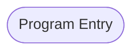

# Program: COBSWAIT

---

## Quick Reference

| Attribute | Value |
|-----------|-------|
| Program ID | `COBSWAIT` |
| Type | BATCH |
| Lines | 42 |
| Source | [COBSWAIT.cbl](../carddemo/COBSWAIT.cbl#L1) |
| Paragraphs | 0 |
| Statements | 0 |
| Impact Risk | **LOW** — 0 programs affected |

> **View Source:** [Open COBSWAIT.cbl](../carddemo/COBSWAIT.cbl#L1)

## Dependency Context

> This section shows how **COBSWAIT** connects to the rest of the system — who calls it,
> what it calls, and what data it shares. If linked programs exist, they must appear here.

### Programs That Call COBSWAIT (Callers)

*No programs call COBSWAIT — this is likely a top-level entry point or CICS transaction starter.*

### Programs Called by COBSWAIT (Callees)

*COBSWAIT does not call any other programs (leaf program).*

### Shared Data (Copybooks & Files)

*No shared copybooks.*

---

## Dependency Graph

> **Legend:** 🔴 Target program · 🔵 Direct callers · 🟢 Direct callees · 🟡 Copybook-coupled · ⚫ Transitive (indirect)

---

## Impact Ripple View

> **If you change COBSWAIT, what else could break?**

| Impact Metric | Count |
|--------------|-------|
| Direct Callers | 0 |
| Transitive Callers (callers of callers) | 0 |
| Direct Callees | 0 |
| Transitive Callees | 0 |
| Copybook-Coupled Programs | 0 |
| **Total Impact** | **0** |
| **Risk Rating** | **LOW** |

---

## Statement Profile

## Control Flow

## Paragraphs

## Executed by JCL Jobs

This program is run by the following batch JCL jobs:

| Job Name | Step | Step Comments |
|----------|------|---------------|
| [WAITSTEP](../jcl/WAITSTEP.md) | `WAIT` | *****************************************************************
Copyright Amaz... |

## Business Rules

*No business rules extracted yet. Run LLM enrichment to extract rules from IF/EVALUATE logic.*

## Key Data Items

| Name | Level | Picture | Section | Business Name |
|------|-------|---------|---------|---------------|
| `MVSWAIT-TIME` | 1 | `9(8)` | WORKING-STORAGE | None |
| `PARM-VALUE` | 1 | `X(8)` | WORKING-STORAGE | None |

---

*Generated 2026-03-16 21:06*