# Program: COCRDLIC

---

## Quick Reference

| Attribute | Value |
|-----------|-------|
| Program ID | `COCRDLIC` |
| Type | ONLINE |
| Lines | 1460 |
| Source | [COCRDLIC.cbl](../carddemo/COCRDLIC.cbl#L1) |
| Paragraphs | 42 |
| Statements | 0 |
| Impact Risk | **HIGH** — 24 programs affected |

> **View Source:** [Open COCRDLIC.cbl](../carddemo/COCRDLIC.cbl#L1)

## Dependency Context

> This section shows how **COCRDLIC** connects to the rest of the system — who calls it,
> what it calls, and what data it shares. If linked programs exist, they must appear here.

### Programs That Call COCRDLIC (Callers)

*No programs call COCRDLIC — this is likely a top-level entry point or CICS transaction starter.*

### Programs Called by COCRDLIC (Callees)

*COCRDLIC does not call any other programs (leaf program).*

### Shared Data (Copybooks & Files)

#### Shared Copybooks

| Copybook | Also Used By | # Co-Users |
|----------|-------------|------------|
| `COCOM01Y` | 00220000, COACTUPC, COACTVWC, COADM01C, COBIL00C (+15 more) | 20 |
| `COCRDLI` |  | 0 |
| `COTTL01Y` | 00220000, COACTUPC, COACTVWC, COADM01C, COBIL00C (+15 more) | 20 |
| `CSDAT01Y` | 00220000, COACTUPC, COACTVWC, COADM01C, COBIL00C (+15 more) | 20 |
| `CSMSG01Y` | 00220000, COACTUPC, COACTVWC, COADM01C, COBIL00C (+15 more) | 20 |
| `CSUSR01Y` | 00220000, COACTUPC, COACTVWC, COADM01C, COCRDSLC (+8 more) | 13 |
| `CVACT02Y` | CBACT02C, CBEXPORT, CBIMPORT, CBTRN01C, COACTVWC (+4 more) | 9 |
| `CVCRD01Y` | 00220000, COACTUPC, COACTVWC, COCRDSLC, COCRDUPC (+1 more) | 6 |
| `DFHAID` | 00220000, COACTUPC, COACTVWC, COADM01C, COBIL00C (+15 more) | 20 |
| `DFHBMSCA` | 00220000, COACTUPC, COACTVWC, COADM01C, COBIL00C (+15 more) | 20 |

---

## Dependency Graph

```mermaid
flowchart TD
    COCRDLIC["⬤ COCRDLIC"]:::target
    CB_COCOM01Y{{"COCOM01Y"}}:::copybook
    COCRDLIC -.- CB_COCOM01Y
    00220000["00220000"]:::coupled
    CB_COCOM01Y -.- 00220000
    COACTUPC["COACTUPC"]:::coupled
    CB_COCOM01Y -.- COACTUPC
    COACTVWC["COACTVWC"]:::coupled
    CB_COCOM01Y -.- COACTVWC
    CB_COTTL01Y{{"COTTL01Y"}}:::copybook
    COCRDLIC -.- CB_COTTL01Y
    00220000["00220000"]:::coupled
    CB_COTTL01Y -.- 00220000
    COACTUPC["COACTUPC"]:::coupled
    CB_COTTL01Y -.- COACTUPC
    COACTVWC["COACTVWC"]:::coupled
    CB_COTTL01Y -.- COACTVWC
    CB_CSDAT01Y{{"CSDAT01Y"}}:::copybook
    COCRDLIC -.- CB_CSDAT01Y
    00220000["00220000"]:::coupled
    CB_CSDAT01Y -.- 00220000
    COACTUPC["COACTUPC"]:::coupled
    CB_CSDAT01Y -.- COACTUPC
    COACTVWC["COACTVWC"]:::coupled
    CB_CSDAT01Y -.- COACTVWC
    CB_CSMSG01Y{{"CSMSG01Y"}}:::copybook
    COCRDLIC -.- CB_CSMSG01Y
    00220000["00220000"]:::coupled
    CB_CSMSG01Y -.- 00220000
    COACTUPC["COACTUPC"]:::coupled
    CB_CSMSG01Y -.- COACTUPC
    COACTVWC["COACTVWC"]:::coupled
    CB_CSMSG01Y -.- COACTVWC
    CB_CSUSR01Y{{"CSUSR01Y"}}:::copybook
    COCRDLIC -.- CB_CSUSR01Y
    00220000["00220000"]:::coupled
    CB_CSUSR01Y -.- 00220000
    COACTUPC["COACTUPC"]:::coupled
    CB_CSUSR01Y -.- COACTUPC
    COACTVWC["COACTVWC"]:::coupled
    CB_CSUSR01Y -.- COACTVWC
    CB_CVACT02Y{{"CVACT02Y"}}:::copybook
    COCRDLIC -.- CB_CVACT02Y
    CBACT02C["CBACT02C"]:::coupled
    CB_CVACT02Y -.- CBACT02C
    CBEXPORT["CBEXPORT"]:::coupled
    CB_CVACT02Y -.- CBEXPORT
    CBIMPORT["CBIMPORT"]:::coupled
    CB_CVACT02Y -.- CBIMPORT
    CB_CVCRD01Y{{"CVCRD01Y"}}:::copybook
    COCRDLIC -.- CB_CVCRD01Y
    00220000["00220000"]:::coupled
    CB_CVCRD01Y -.- 00220000
    COACTUPC["COACTUPC"]:::coupled
    CB_CVCRD01Y -.- COACTUPC
    COACTVWC["COACTVWC"]:::coupled
    CB_CVCRD01Y -.- COACTVWC

    classDef target fill:#f85149,stroke:#da3633,color:#fff,stroke-width:3px
    classDef caller fill:#58a6ff,stroke:#1f6feb,color:#fff
    classDef callee fill:#3fb950,stroke:#238636,color:#fff
    classDef copybook fill:#d29922,stroke:#9e6a03,color:#fff
    classDef coupled fill:#d29922,stroke:#9e6a03,color:#fff,stroke-dasharray:5
    classDef transitive fill:#484f58,stroke:#8b949e,color:#c9d1d9,stroke-dasharray:5
```

> **Legend:** 🔴 Target program · 🔵 Direct callers · 🟢 Direct callees · 🟡 Copybook-coupled · ⚫ Transitive (indirect)

---

## Impact Ripple View

> **If you change COCRDLIC, what else could break?**

| Impact Metric | Count |
|--------------|-------|
| Direct Callers | 0 |
| Transitive Callers (callers of callers) | 0 |
| Direct Callees | 0 |
| Transitive Callees | 0 |
| Copybook-Coupled Programs | 24 |
| **Total Impact** | **24** |
| **Risk Rating** | **HIGH** |

**Programs affected via shared copybooks:**
- `00220000`
- `CBACT02C`
- `CBEXPORT`
- `CBIMPORT`
- `CBTRN01C`
- `COACTUPC`
- `COACTVWC`
- `COADM01C`
- `COBIL00C`
- `COCRDSLC`
- `COCRDUPC`
- `COMEN01C`
- `COPAUS0C`
- `COPAUS1C`
- `CORPT00C`
- `COSGN00C`
- `COTRN00C`
- `COTRN01C`
- `COTRN02C`
- `COTRTLIC`
- `COUSR00C`
- `COUSR01C`
- `COUSR02C`
- `COUSR03C`

---

## Statement Profile

## Control Flow

```mermaid
flowchart TD
    START([Program Entry])
    PROGRAM_ID["PROGRAM-ID"]
    DATE_WRITTEN["DATE-WRITTEN"]
    DATE_COMPILED["DATE-COMPILED"]
    0000_MAIN["0000-MAIN"]
    COMMON_RETURN["COMMON-RETURN"]
    0000_MAIN_EXIT["0000-MAIN-EXIT"]
    1000_SEND_MAP["1000-SEND-MAP"]
    1000_SEND_MAP_EXIT["1000-SEND-MAP-EXIT"]
    1100_SCREEN_INIT["1100-SCREEN-INIT"]
    1100_SCREEN_INIT_EXIT["1100-SCREEN-INIT-EXIT"]
    1200_SCREEN_ARRAY_INIT["1200-SCREEN-ARRAY-INIT"]
    1200_SCREEN_ARRAY_INIT_EXIT["1200-SCREEN-ARRAY-INIT-EXIT"]
    1250_SETUP_ARRAY_ATTRIBS["1250-SETUP-ARRAY-ATTRIBS"]
    1250_SETUP_ARRAY_ATTRIBS_EXIT["1250-SETUP-ARRAY-ATTRIBS-EXIT"]
    1300_SETUP_SCREEN_ATTRS["1300-SETUP-SCREEN-ATTRS"]
    START --> PROGRAM_ID
    MAIN --> YYYY_STORE_PFKEY
    MAIN --> 2000_RECEIVE_MAP
    MAIN --> 9000_READ_FORWARD
    MAIN --> 1000_SEND_MAP
    MAIN --> 9100_READ_BACKWARDS
    MAIN --> 1100_SCREEN_INIT
    MAIN --> 1200_SCREEN_ARRAY_INIT
    MAIN --> 1250_SETUP_ARRAY_ATTRIBS
    MAIN --> 1300_SETUP_SCREEN_ATTRS
    MAIN --> 1400_SETUP_MESSAGE
```

## Paragraphs

### PROGRAM-ID

| | |
|---|---|
| **Paragraph** | `PROGRAM-ID` |
| **Lines** | 26 - 27 |
| **View Code** | [Jump to Line 26](../carddemo/COCRDLIC.cbl#L26) |

### DATE-WRITTEN

| | |
|---|---|
| **Paragraph** | `DATE-WRITTEN` |
| **Lines** | 28 - 29 |
| **View Code** | [Jump to Line 28](../carddemo/COCRDLIC.cbl#L28) |

### DATE-COMPILED

| | |
|---|---|
| **Paragraph** | `DATE-COMPILED` |
| **Lines** | 30 - 297 |
| **View Code** | [Jump to Line 30](../carddemo/COCRDLIC.cbl#L30) |

### 0000-MAIN

| | |
|---|---|
| **Paragraph** | `0000-MAIN` |
| **Lines** | 298 - 603 |
| **View Code** | [Jump to Line 298](../carddemo/COCRDLIC.cbl#L298) |

### COMMON-RETURN

| | |
|---|---|
| **Paragraph** | `COMMON-RETURN` |
| **Lines** | 604 - 620 |
| **View Code** | [Jump to Line 604](../carddemo/COCRDLIC.cbl#L604) |

### 0000-MAIN-EXIT

| | |
|---|---|
| **Paragraph** | `0000-MAIN-EXIT` |
| **Lines** | 621 - 623 |
| **View Code** | [Jump to Line 621](../carddemo/COCRDLIC.cbl#L621) |

### 1000-SEND-MAP

| | |
|---|---|
| **Paragraph** | `1000-SEND-MAP` |
| **Lines** | 624 - 638 |
| **View Code** | [Jump to Line 624](../carddemo/COCRDLIC.cbl#L624) |

### 1000-SEND-MAP-EXIT

| | |
|---|---|
| **Paragraph** | `1000-SEND-MAP-EXIT` |
| **Lines** | 639 - 641 |
| **View Code** | [Jump to Line 639](../carddemo/COCRDLIC.cbl#L639) |

### 1100-SCREEN-INIT

| | |
|---|---|
| **Paragraph** | `1100-SCREEN-INIT` |
| **Lines** | 642 - 673 |
| **View Code** | [Jump to Line 642](../carddemo/COCRDLIC.cbl#L642) |

### 1100-SCREEN-INIT-EXIT

| | |
|---|---|
| **Paragraph** | `1100-SCREEN-INIT-EXIT` |
| **Lines** | 674 - 677 |
| **View Code** | [Jump to Line 674](../carddemo/COCRDLIC.cbl#L674) |

### 1200-SCREEN-ARRAY-INIT

| | |
|---|---|
| **Paragraph** | `1200-SCREEN-ARRAY-INIT` |
| **Lines** | 678 - 744 |
| **View Code** | [Jump to Line 678](../carddemo/COCRDLIC.cbl#L678) |

### 1200-SCREEN-ARRAY-INIT-EXIT

| | |
|---|---|
| **Paragraph** | `1200-SCREEN-ARRAY-INIT-EXIT` |
| **Lines** | 745 - 747 |
| **View Code** | [Jump to Line 745](../carddemo/COCRDLIC.cbl#L745) |

### 1250-SETUP-ARRAY-ATTRIBS

| | |
|---|---|
| **Paragraph** | `1250-SETUP-ARRAY-ATTRIBS` |
| **Lines** | 748 - 833 |
| **View Code** | [Jump to Line 748](../carddemo/COCRDLIC.cbl#L748) |

### 1250-SETUP-ARRAY-ATTRIBS-EXIT

| | |
|---|---|
| **Paragraph** | `1250-SETUP-ARRAY-ATTRIBS-EXIT` |
| **Lines** | 834 - 836 |
| **View Code** | [Jump to Line 834](../carddemo/COCRDLIC.cbl#L834) |

### 1300-SETUP-SCREEN-ATTRS

| | |
|---|---|
| **Paragraph** | `1300-SETUP-SCREEN-ATTRS` |
| **Lines** | 837 - 889 |
| **View Code** | [Jump to Line 837](../carddemo/COCRDLIC.cbl#L837) |

### 1300-SETUP-SCREEN-ATTRS-EXIT

| | |
|---|---|
| **Paragraph** | `1300-SETUP-SCREEN-ATTRS-EXIT` |
| **Lines** | 890 - 894 |
| **View Code** | [Jump to Line 890](../carddemo/COCRDLIC.cbl#L890) |

### 1400-SETUP-MESSAGE

| | |
|---|---|
| **Paragraph** | `1400-SETUP-MESSAGE` |
| **Lines** | 895 - 932 |
| **View Code** | [Jump to Line 895](../carddemo/COCRDLIC.cbl#L895) |

### 1400-SETUP-MESSAGE-EXIT

| | |
|---|---|
| **Paragraph** | `1400-SETUP-MESSAGE-EXIT` |
| **Lines** | 933 - 937 |
| **View Code** | [Jump to Line 933](../carddemo/COCRDLIC.cbl#L933) |

### 1500-SEND-SCREEN

| | |
|---|---|
| **Paragraph** | `1500-SEND-SCREEN` |
| **Lines** | 938 - 947 |
| **View Code** | [Jump to Line 938](../carddemo/COCRDLIC.cbl#L938) |

### 1500-SEND-SCREEN-EXIT

| | |
|---|---|
| **Paragraph** | `1500-SEND-SCREEN-EXIT` |
| **Lines** | 948 - 950 |
| **View Code** | [Jump to Line 948](../carddemo/COCRDLIC.cbl#L948) |

### 2000-RECEIVE-MAP

| | |
|---|---|
| **Paragraph** | `2000-RECEIVE-MAP` |
| **Lines** | 951 - 958 |
| **View Code** | [Jump to Line 951](../carddemo/COCRDLIC.cbl#L951) |

### 2000-RECEIVE-MAP-EXIT

| | |
|---|---|
| **Paragraph** | `2000-RECEIVE-MAP-EXIT` |
| **Lines** | 959 - 961 |
| **View Code** | [Jump to Line 959](../carddemo/COCRDLIC.cbl#L959) |

### 2100-RECEIVE-SCREEN

| | |
|---|---|
| **Paragraph** | `2100-RECEIVE-SCREEN` |
| **Lines** | 962 - 980 |
| **View Code** | [Jump to Line 962](../carddemo/COCRDLIC.cbl#L962) |

### 2100-RECEIVE-SCREEN-EXIT

| | |
|---|---|
| **Paragraph** | `2100-RECEIVE-SCREEN-EXIT` |
| **Lines** | 981 - 984 |
| **View Code** | [Jump to Line 981](../carddemo/COCRDLIC.cbl#L981) |

### 2200-EDIT-INPUTS

| | |
|---|---|
| **Paragraph** | `2200-EDIT-INPUTS` |
| **Lines** | 985 - 998 |
| **View Code** | [Jump to Line 985](../carddemo/COCRDLIC.cbl#L985) |

### 2200-EDIT-INPUTS-EXIT

| | |
|---|---|
| **Paragraph** | `2200-EDIT-INPUTS-EXIT` |
| **Lines** | 999 - 1002 |
| **View Code** | [Jump to Line 999](../carddemo/COCRDLIC.cbl#L999) |

### 2210-EDIT-ACCOUNT

| | |
|---|---|
| **Paragraph** | `2210-EDIT-ACCOUNT` |
| **Lines** | 1003 - 1031 |
| **View Code** | [Jump to Line 1003](../carddemo/COCRDLIC.cbl#L1003) |

### 2210-EDIT-ACCOUNT-EXIT

| | |
|---|---|
| **Paragraph** | `2210-EDIT-ACCOUNT-EXIT` |
| **Lines** | 1032 - 1035 |
| **View Code** | [Jump to Line 1032](../carddemo/COCRDLIC.cbl#L1032) |

### 2220-EDIT-CARD

| | |
|---|---|
| **Paragraph** | `2220-EDIT-CARD` |
| **Lines** | 1036 - 1068 |
| **View Code** | [Jump to Line 1036](../carddemo/COCRDLIC.cbl#L1036) |

### 2220-EDIT-CARD-EXIT

| | |
|---|---|
| **Paragraph** | `2220-EDIT-CARD-EXIT` |
| **Lines** | 1069 - 1072 |
| **View Code** | [Jump to Line 1069](../carddemo/COCRDLIC.cbl#L1069) |

### 2250-EDIT-ARRAY

| | |
|---|---|
| **Paragraph** | `2250-EDIT-ARRAY` |
| **Lines** | 1073 - 1118 |
| **View Code** | [Jump to Line 1073](../carddemo/COCRDLIC.cbl#L1073) |

### 2250-EDIT-ARRAY-EXIT

| | |
|---|---|
| **Paragraph** | `2250-EDIT-ARRAY-EXIT` |
| **Lines** | 1119 - 1122 |
| **View Code** | [Jump to Line 1119](../carddemo/COCRDLIC.cbl#L1119) |

### 9000-READ-FORWARD

| | |
|---|---|
| **Paragraph** | `9000-READ-FORWARD` |
| **Lines** | 1123 - 1260 |
| **View Code** | [Jump to Line 1123](../carddemo/COCRDLIC.cbl#L1123) |

### 9000-READ-FORWARD-EXIT

| | |
|---|---|
| **Paragraph** | `9000-READ-FORWARD-EXIT` |
| **Lines** | 1261 - 1263 |
| **View Code** | [Jump to Line 1261](../carddemo/COCRDLIC.cbl#L1261) |

### 9100-READ-BACKWARDS

| | |
|---|---|
| **Paragraph** | `9100-READ-BACKWARDS` |
| **Lines** | 1264 - 1373 |
| **View Code** | [Jump to Line 1264](../carddemo/COCRDLIC.cbl#L1264) |

### 9100-READ-BACKWARDS-EXIT

| | |
|---|---|
| **Paragraph** | `9100-READ-BACKWARDS-EXIT` |
| **Lines** | 1374 - 1381 |
| **View Code** | [Jump to Line 1374](../carddemo/COCRDLIC.cbl#L1374) |

### 9500-FILTER-RECORDS

| | |
|---|---|
| **Paragraph** | `9500-FILTER-RECORDS` |
| **Lines** | 1382 - 1408 |
| **View Code** | [Jump to Line 1382](../carddemo/COCRDLIC.cbl#L1382) |

### 9500-FILTER-RECORDS-EXIT

| | |
|---|---|
| **Paragraph** | `9500-FILTER-RECORDS-EXIT` |
| **Lines** | 1409 - 1421 |
| **View Code** | [Jump to Line 1409](../carddemo/COCRDLIC.cbl#L1409) |

### SEND-PLAIN-TEXT

| | |
|---|---|
| **Paragraph** | `SEND-PLAIN-TEXT` |
| **Lines** | 1422 - 1432 |
| **View Code** | [Jump to Line 1422](../carddemo/COCRDLIC.cbl#L1422) |

### SEND-PLAIN-TEXT-EXIT

| | |
|---|---|
| **Paragraph** | `SEND-PLAIN-TEXT-EXIT` |
| **Lines** | 1433 - 1440 |
| **View Code** | [Jump to Line 1433](../carddemo/COCRDLIC.cbl#L1433) |

### SEND-LONG-TEXT

| | |
|---|---|
| **Paragraph** | `SEND-LONG-TEXT` |
| **Lines** | 1441 - 1451 |
| **View Code** | [Jump to Line 1441](../carddemo/COCRDLIC.cbl#L1441) |

### SEND-LONG-TEXT-EXIT

| | |
|---|---|
| **Paragraph** | `SEND-LONG-TEXT-EXIT` |
| **Lines** | 1452 - 1460 |
| **View Code** | [Jump to Line 1452](../carddemo/COCRDLIC.cbl#L1452) |

## Business Rules

*No business rules extracted yet. Run LLM enrichment to extract rules from IF/EVALUATE logic.*

## Key Data Items

*No data items found for this program.*

---

*Generated 2026-03-16 21:06*