# Program: COCRDSLC

---

## Quick Reference

| Attribute | Value |
|-----------|-------|
| Program ID | `COCRDSLC` |
| Type | ONLINE |
| Lines | 888 |
| Source | [COCRDSLC.cbl](../carddemo/COCRDSLC.cbl#L1) |
| Paragraphs | 37 |
| Statements | 0 |
| Impact Risk | **HIGH** — 26 programs affected |

> **View Source:** [Open COCRDSLC.cbl](../carddemo/COCRDSLC.cbl#L1)

## Dependency Context

> This section shows how **COCRDSLC** connects to the rest of the system — who calls it,
> what it calls, and what data it shares. If linked programs exist, they must appear here.

### Programs That Call COCRDSLC (Callers)

*No programs call COCRDSLC — this is likely a top-level entry point or CICS transaction starter.*

### Programs Called by COCRDSLC (Callees)

*COCRDSLC does not call any other programs (leaf program).*

### Shared Data (Copybooks & Files)

#### Shared Copybooks

| Copybook | Also Used By | # Co-Users |
|----------|-------------|------------|
| `COCOM01Y` | 00220000, COACTUPC, COACTVWC, COADM01C, COBIL00C (+15 more) | 20 |
| `COCRDSL` |  | 0 |
| `COTTL01Y` | 00220000, COACTUPC, COACTVWC, COADM01C, COBIL00C (+15 more) | 20 |
| `CSDAT01Y` | 00220000, COACTUPC, COACTVWC, COADM01C, COBIL00C (+15 more) | 20 |
| `CSMSG01Y` | 00220000, COACTUPC, COACTVWC, COADM01C, COBIL00C (+15 more) | 20 |
| `CSMSG02Y` | 00220000, COACTUPC, COACTVWC, COCRDUPC, COPAUS0C (+1 more) | 6 |
| `CSUSR01Y` | 00220000, COACTUPC, COACTVWC, COADM01C, COCRDLIC (+8 more) | 13 |
| `CVACT02Y` | CBACT02C, CBEXPORT, CBIMPORT, CBTRN01C, COACTVWC (+4 more) | 9 |
| `CVCRD01Y` | 00220000, COACTUPC, COACTVWC, COCRDLIC, COCRDUPC (+1 more) | 6 |
| `CVCUS01Y` | CBCUS01C, CBEXPORT, CBIMPORT, CBTRN01C, COACTUPC (+4 more) | 9 |
| `DFHAID` | 00220000, COACTUPC, COACTVWC, COADM01C, COBIL00C (+15 more) | 20 |
| `DFHBMSCA` | 00220000, COACTUPC, COACTVWC, COADM01C, COBIL00C (+15 more) | 20 |

---

## Dependency Graph

```mermaid
flowchart TD
    COCRDSLC["⬤ COCRDSLC"]:::target
    CB_COCOM01Y{{"COCOM01Y"}}:::copybook
    COCRDSLC -.- CB_COCOM01Y
    00220000["00220000"]:::coupled
    CB_COCOM01Y -.- 00220000
    COACTUPC["COACTUPC"]:::coupled
    CB_COCOM01Y -.- COACTUPC
    COACTVWC["COACTVWC"]:::coupled
    CB_COCOM01Y -.- COACTVWC
    CB_COTTL01Y{{"COTTL01Y"}}:::copybook
    COCRDSLC -.- CB_COTTL01Y
    00220000["00220000"]:::coupled
    CB_COTTL01Y -.- 00220000
    COACTUPC["COACTUPC"]:::coupled
    CB_COTTL01Y -.- COACTUPC
    COACTVWC["COACTVWC"]:::coupled
    CB_COTTL01Y -.- COACTVWC
    CB_CSDAT01Y{{"CSDAT01Y"}}:::copybook
    COCRDSLC -.- CB_CSDAT01Y
    00220000["00220000"]:::coupled
    CB_CSDAT01Y -.- 00220000
    COACTUPC["COACTUPC"]:::coupled
    CB_CSDAT01Y -.- COACTUPC
    COACTVWC["COACTVWC"]:::coupled
    CB_CSDAT01Y -.- COACTVWC
    CB_CSMSG01Y{{"CSMSG01Y"}}:::copybook
    COCRDSLC -.- CB_CSMSG01Y
    00220000["00220000"]:::coupled
    CB_CSMSG01Y -.- 00220000
    COACTUPC["COACTUPC"]:::coupled
    CB_CSMSG01Y -.- COACTUPC
    COACTVWC["COACTVWC"]:::coupled
    CB_CSMSG01Y -.- COACTVWC
    CB_CSMSG02Y{{"CSMSG02Y"}}:::copybook
    COCRDSLC -.- CB_CSMSG02Y
    00220000["00220000"]:::coupled
    CB_CSMSG02Y -.- 00220000
    COACTUPC["COACTUPC"]:::coupled
    CB_CSMSG02Y -.- COACTUPC
    COACTVWC["COACTVWC"]:::coupled
    CB_CSMSG02Y -.- COACTVWC
    CB_CSUSR01Y{{"CSUSR01Y"}}:::copybook
    COCRDSLC -.- CB_CSUSR01Y
    00220000["00220000"]:::coupled
    CB_CSUSR01Y -.- 00220000
    COACTUPC["COACTUPC"]:::coupled
    CB_CSUSR01Y -.- COACTUPC
    COACTVWC["COACTVWC"]:::coupled
    CB_CSUSR01Y -.- COACTVWC
    CB_CVACT02Y{{"CVACT02Y"}}:::copybook
    COCRDSLC -.- CB_CVACT02Y
    CBACT02C["CBACT02C"]:::coupled
    CB_CVACT02Y -.- CBACT02C
    CBEXPORT["CBEXPORT"]:::coupled
    CB_CVACT02Y -.- CBEXPORT
    CBIMPORT["CBIMPORT"]:::coupled
    CB_CVACT02Y -.- CBIMPORT

    classDef target fill:#f85149,stroke:#da3633,color:#fff,stroke-width:3px
    classDef caller fill:#58a6ff,stroke:#1f6feb,color:#fff
    classDef callee fill:#3fb950,stroke:#238636,color:#fff
    classDef copybook fill:#d29922,stroke:#9e6a03,color:#fff
    classDef coupled fill:#d29922,stroke:#9e6a03,color:#fff,stroke-dasharray:5
    classDef transitive fill:#484f58,stroke:#8b949e,color:#c9d1d9,stroke-dasharray:5
```

> **Legend:** 🔴 Target program · 🔵 Direct callers · 🟢 Direct callees · 🟡 Copybook-coupled · ⚫ Transitive (indirect)

---

## Impact Ripple View

> **If you change COCRDSLC, what else could break?**

| Impact Metric | Count |
|--------------|-------|
| Direct Callers | 0 |
| Transitive Callers (callers of callers) | 0 |
| Direct Callees | 0 |
| Transitive Callees | 0 |
| Copybook-Coupled Programs | 26 |
| **Total Impact** | **26** |
| **Risk Rating** | **HIGH** |

**Programs affected via shared copybooks:**
- `00220000`
- `CBACT02C`
- `CBCUS01C`
- `CBEXPORT`
- `CBIMPORT`
- `CBTRN01C`
- `COACTUPC`
- `COACTVWC`
- `COADM01C`
- `COBIL00C`
- `COCRDLIC`
- `COCRDUPC`
- `COMEN01C`
- `COPAUA0C`
- `COPAUS0C`
- `COPAUS1C`
- `CORPT00C`
- `COSGN00C`
- `COTRN00C`
- `COTRN01C`
- `COTRN02C`
- `COTRTLIC`
- `COUSR00C`
- `COUSR01C`
- `COUSR02C`
- `COUSR03C`

---

## Statement Profile

## Control Flow

```mermaid
flowchart TD
    START([Program Entry])
    PROGRAM_ID["PROGRAM-ID"]
    DATE_WRITTEN["DATE-WRITTEN"]
    DATE_COMPILED["DATE-COMPILED"]
    0000_MAIN["0000-MAIN"]
    COMMON_RETURN["COMMON-RETURN"]
    0000_MAIN_EXIT["0000-MAIN-EXIT"]
    1000_SEND_MAP["1000-SEND-MAP"]
    1000_SEND_MAP_EXIT["1000-SEND-MAP-EXIT"]
    1100_SCREEN_INIT["1100-SCREEN-INIT"]
    1100_SCREEN_INIT_EXIT["1100-SCREEN-INIT-EXIT"]
    1200_SETUP_SCREEN_VARS["1200-SETUP-SCREEN-VARS"]
    1200_SETUP_SCREEN_VARS_EXIT["1200-SETUP-SCREEN-VARS-EXIT"]
    1300_SETUP_SCREEN_ATTRS["1300-SETUP-SCREEN-ATTRS"]
    1300_SETUP_SCREEN_ATTRS_EXIT["1300-SETUP-SCREEN-ATTRS-EXIT"]
    1400_SEND_SCREEN["1400-SEND-SCREEN"]
    START --> PROGRAM_ID
    MAIN --> YYYY_STORE_PFKEY
    MAIN --> 9000_READ_DATA
    MAIN --> 1000_SEND_MAP
    MAIN --> 2000_PROCESS_INPUTS
    MAIN --> SEND_PLAIN_TEXT
    MAIN --> 1100_SCREEN_INIT
    MAIN --> 1200_SETUP_SCREEN_VARS
    MAIN --> 1300_SETUP_SCREEN_ATTRS
    MAIN --> 1400_SEND_SCREEN
    MAIN --> 2100_RECEIVE_MAP
    MAIN --> 2200_EDIT_MAP_INPUTS
    MAIN --> 2210_EDIT_ACCOUNT
    MAIN --> 2220_EDIT_CARD
    MAIN --> 9100_GETCARD_BYACCTCARD
```

## Paragraphs

### PROGRAM-ID

| | |
|---|---|
| **Paragraph** | `PROGRAM-ID` |
| **Lines** | 23 - 24 |
| **View Code** | [Jump to Line 23](../carddemo/COCRDSLC.cbl#L23) |

### DATE-WRITTEN

| | |
|---|---|
| **Paragraph** | `DATE-WRITTEN` |
| **Lines** | 25 - 26 |
| **View Code** | [Jump to Line 25](../carddemo/COCRDSLC.cbl#L25) |

### DATE-COMPILED

| | |
|---|---|
| **Paragraph** | `DATE-COMPILED` |
| **Lines** | 27 - 247 |
| **View Code** | [Jump to Line 27](../carddemo/COCRDSLC.cbl#L27) |

### 0000-MAIN

| | |
|---|---|
| **Paragraph** | `0000-MAIN` |
| **Lines** | 248 - 393 |
| **View Code** | [Jump to Line 248](../carddemo/COCRDSLC.cbl#L248) |

### COMMON-RETURN

| | |
|---|---|
| **Paragraph** | `COMMON-RETURN` |
| **Lines** | 394 - 407 |
| **View Code** | [Jump to Line 394](../carddemo/COCRDSLC.cbl#L394) |

### 0000-MAIN-EXIT

| | |
|---|---|
| **Paragraph** | `0000-MAIN-EXIT` |
| **Lines** | 408 - 411 |
| **View Code** | [Jump to Line 408](../carddemo/COCRDSLC.cbl#L408) |

### 1000-SEND-MAP

| | |
|---|---|
| **Paragraph** | `1000-SEND-MAP` |
| **Lines** | 412 - 422 |
| **View Code** | [Jump to Line 412](../carddemo/COCRDSLC.cbl#L412) |

### 1000-SEND-MAP-EXIT

| | |
|---|---|
| **Paragraph** | `1000-SEND-MAP-EXIT` |
| **Lines** | 423 - 426 |
| **View Code** | [Jump to Line 423](../carddemo/COCRDSLC.cbl#L423) |

### 1100-SCREEN-INIT

| | |
|---|---|
| **Paragraph** | `1100-SCREEN-INIT` |
| **Lines** | 427 - 452 |
| **View Code** | [Jump to Line 427](../carddemo/COCRDSLC.cbl#L427) |

### 1100-SCREEN-INIT-EXIT

| | |
|---|---|
| **Paragraph** | `1100-SCREEN-INIT-EXIT` |
| **Lines** | 453 - 456 |
| **View Code** | [Jump to Line 453](../carddemo/COCRDSLC.cbl#L453) |

### 1200-SETUP-SCREEN-VARS

| | |
|---|---|
| **Paragraph** | `1200-SETUP-SCREEN-VARS` |
| **Lines** | 457 - 498 |
| **View Code** | [Jump to Line 457](../carddemo/COCRDSLC.cbl#L457) |

### 1200-SETUP-SCREEN-VARS-EXIT

| | |
|---|---|
| **Paragraph** | `1200-SETUP-SCREEN-VARS-EXIT` |
| **Lines** | 499 - 501 |
| **View Code** | [Jump to Line 499](../carddemo/COCRDSLC.cbl#L499) |

### 1300-SETUP-SCREEN-ATTRS

| | |
|---|---|
| **Paragraph** | `1300-SETUP-SCREEN-ATTRS` |
| **Lines** | 502 - 558 |
| **View Code** | [Jump to Line 502](../carddemo/COCRDSLC.cbl#L502) |

### 1300-SETUP-SCREEN-ATTRS-EXIT

| | |
|---|---|
| **Paragraph** | `1300-SETUP-SCREEN-ATTRS-EXIT` |
| **Lines** | 559 - 562 |
| **View Code** | [Jump to Line 559](../carddemo/COCRDSLC.cbl#L559) |

### 1400-SEND-SCREEN

| | |
|---|---|
| **Paragraph** | `1400-SEND-SCREEN` |
| **Lines** | 563 - 577 |
| **View Code** | [Jump to Line 563](../carddemo/COCRDSLC.cbl#L563) |

### 1400-SEND-SCREEN-EXIT

| | |
|---|---|
| **Paragraph** | `1400-SEND-SCREEN-EXIT` |
| **Lines** | 578 - 581 |
| **View Code** | [Jump to Line 578](../carddemo/COCRDSLC.cbl#L578) |

### 2000-PROCESS-INPUTS

| | |
|---|---|
| **Paragraph** | `2000-PROCESS-INPUTS` |
| **Lines** | 582 - 592 |
| **View Code** | [Jump to Line 582](../carddemo/COCRDSLC.cbl#L582) |

### 2000-PROCESS-INPUTS-EXIT

| | |
|---|---|
| **Paragraph** | `2000-PROCESS-INPUTS-EXIT` |
| **Lines** | 593 - 595 |
| **View Code** | [Jump to Line 593](../carddemo/COCRDSLC.cbl#L593) |

### 2100-RECEIVE-MAP

| | |
|---|---|
| **Paragraph** | `2100-RECEIVE-MAP` |
| **Lines** | 596 - 604 |
| **View Code** | [Jump to Line 596](../carddemo/COCRDSLC.cbl#L596) |

### 2100-RECEIVE-MAP-EXIT

| | |
|---|---|
| **Paragraph** | `2100-RECEIVE-MAP-EXIT` |
| **Lines** | 605 - 607 |
| **View Code** | [Jump to Line 605](../carddemo/COCRDSLC.cbl#L605) |

### 2200-EDIT-MAP-INPUTS

| | |
|---|---|
| **Paragraph** | `2200-EDIT-MAP-INPUTS` |
| **Lines** | 608 - 642 |
| **View Code** | [Jump to Line 608](../carddemo/COCRDSLC.cbl#L608) |

### 2200-EDIT-MAP-INPUTS-EXIT

| | |
|---|---|
| **Paragraph** | `2200-EDIT-MAP-INPUTS-EXIT` |
| **Lines** | 643 - 646 |
| **View Code** | [Jump to Line 643](../carddemo/COCRDSLC.cbl#L643) |

### 2210-EDIT-ACCOUNT

| | |
|---|---|
| **Paragraph** | `2210-EDIT-ACCOUNT` |
| **Lines** | 647 - 680 |
| **View Code** | [Jump to Line 647](../carddemo/COCRDSLC.cbl#L647) |

### 2210-EDIT-ACCOUNT-EXIT

| | |
|---|---|
| **Paragraph** | `2210-EDIT-ACCOUNT-EXIT` |
| **Lines** | 681 - 684 |
| **View Code** | [Jump to Line 681](../carddemo/COCRDSLC.cbl#L681) |

### 2220-EDIT-CARD

| | |
|---|---|
| **Paragraph** | `2220-EDIT-CARD` |
| **Lines** | 685 - 721 |
| **View Code** | [Jump to Line 685](../carddemo/COCRDSLC.cbl#L685) |

### 2220-EDIT-CARD-EXIT

| | |
|---|---|
| **Paragraph** | `2220-EDIT-CARD-EXIT` |
| **Lines** | 722 - 725 |
| **View Code** | [Jump to Line 722](../carddemo/COCRDSLC.cbl#L722) |

### 9000-READ-DATA

| | |
|---|---|
| **Paragraph** | `9000-READ-DATA` |
| **Lines** | 726 - 731 |
| **View Code** | [Jump to Line 726](../carddemo/COCRDSLC.cbl#L726) |

### 9000-READ-DATA-EXIT

| | |
|---|---|
| **Paragraph** | `9000-READ-DATA-EXIT` |
| **Lines** | 732 - 735 |
| **View Code** | [Jump to Line 732](../carddemo/COCRDSLC.cbl#L732) |

### 9100-GETCARD-BYACCTCARD

| | |
|---|---|
| **Paragraph** | `9100-GETCARD-BYACCTCARD` |
| **Lines** | 736 - 774 |
| **View Code** | [Jump to Line 736](../carddemo/COCRDSLC.cbl#L736) |

### 9100-GETCARD-BYACCTCARD-EXIT

| | |
|---|---|
| **Paragraph** | `9100-GETCARD-BYACCTCARD-EXIT` |
| **Lines** | 775 - 778 |
| **View Code** | [Jump to Line 775](../carddemo/COCRDSLC.cbl#L775) |

### 9150-GETCARD-BYACCT

| | |
|---|---|
| **Paragraph** | `9150-GETCARD-BYACCT` |
| **Lines** | 779 - 809 |
| **View Code** | [Jump to Line 779](../carddemo/COCRDSLC.cbl#L779) |

### 9150-GETCARD-BYACCT-EXIT

| | |
|---|---|
| **Paragraph** | `9150-GETCARD-BYACCT-EXIT` |
| **Lines** | 810 - 819 |
| **View Code** | [Jump to Line 810](../carddemo/COCRDSLC.cbl#L810) |

### SEND-LONG-TEXT

| | |
|---|---|
| **Paragraph** | `SEND-LONG-TEXT` |
| **Lines** | 820 - 830 |
| **View Code** | [Jump to Line 820](../carddemo/COCRDSLC.cbl#L820) |

### SEND-LONG-TEXT-EXIT

| | |
|---|---|
| **Paragraph** | `SEND-LONG-TEXT-EXIT` |
| **Lines** | 831 - 837 |
| **View Code** | [Jump to Line 831](../carddemo/COCRDSLC.cbl#L831) |

### SEND-PLAIN-TEXT

| | |
|---|---|
| **Paragraph** | `SEND-PLAIN-TEXT` |
| **Lines** | 838 - 848 |
| **View Code** | [Jump to Line 838](../carddemo/COCRDSLC.cbl#L838) |

### SEND-PLAIN-TEXT-EXIT

| | |
|---|---|
| **Paragraph** | `SEND-PLAIN-TEXT-EXIT` |
| **Lines** | 849 - 856 |
| **View Code** | [Jump to Line 849](../carddemo/COCRDSLC.cbl#L849) |

### ABEND-ROUTINE

| | |
|---|---|
| **Paragraph** | `ABEND-ROUTINE` |
| **Lines** | 857 - 888 |
| **View Code** | [Jump to Line 857](../carddemo/COCRDSLC.cbl#L857) |

## Business Rules

*No business rules extracted yet. Run LLM enrichment to extract rules from IF/EVALUATE logic.*

## Key Data Items

*No data items found for this program.*

---

*Generated 2026-03-16 21:06*