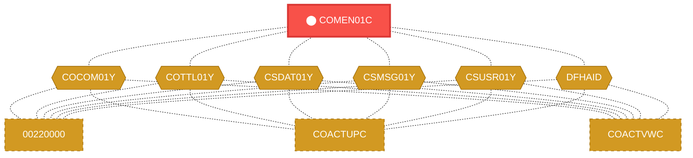
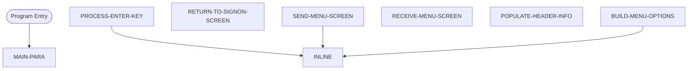

# Program: COMEN01C

---

## Quick Reference

| Attribute | Value |
|-----------|-------|
| Program ID | `COMEN01C` |
| Type | ONLINE |
| Lines | 309 |
| Source | [COMEN01C.cbl](../carddemo/COMEN01C.cbl#L1) |
| Paragraphs | 7 |
| Statements | 33 |
| Impact Risk | **HIGH** — 20 programs affected |

> **View Source:** [Open COMEN01C.cbl](../carddemo/COMEN01C.cbl#L1)

## Dependency Context

> This section shows how **COMEN01C** connects to the rest of the system — who calls it,
> what it calls, and what data it shares. If linked programs exist, they must appear here.

### Programs That Call COMEN01C (Callers)

*No programs call COMEN01C — this is likely a top-level entry point or CICS transaction starter.*

### Programs Called by COMEN01C (Callees)

*COMEN01C does not call any other programs (leaf program).*

### Shared Data (Copybooks & Files)

#### Shared Copybooks

| Copybook | Also Used By | # Co-Users |
|----------|-------------|------------|
| `COCOM01Y` | 00220000, COACTUPC, COACTVWC, COADM01C, COBIL00C (+15 more) | 20 |
| `COMEN01` |  | 0 |
| `COMEN02Y` |  | 0 |
| `COTTL01Y` | 00220000, COACTUPC, COACTVWC, COADM01C, COBIL00C (+15 more) | 20 |
| `CSDAT01Y` | 00220000, COACTUPC, COACTVWC, COADM01C, COBIL00C (+15 more) | 20 |
| `CSMSG01Y` | 00220000, COACTUPC, COACTVWC, COADM01C, COBIL00C (+15 more) | 20 |
| `CSUSR01Y` | 00220000, COACTUPC, COACTVWC, COADM01C, COCRDLIC (+8 more) | 13 |
| `DFHAID` | 00220000, COACTUPC, COACTVWC, COADM01C, COBIL00C (+15 more) | 20 |
| `DFHBMSCA` | 00220000, COACTUPC, COACTVWC, COADM01C, COBIL00C (+15 more) | 20 |

---

## Dependency Graph

> **Legend:** 🔴 Target program · 🔵 Direct callers · 🟢 Direct callees · 🟡 Copybook-coupled · ⚫ Transitive (indirect)

---

## Impact Ripple View

> **If you change COMEN01C, what else could break?**

| Impact Metric | Count |
|--------------|-------|
| Direct Callers | 0 |
| Transitive Callers (callers of callers) | 0 |
| Direct Callees | 0 |
| Transitive Callees | 0 |
| Copybook-Coupled Programs | 20 |
| **Total Impact** | **20** |
| **Risk Rating** | **HIGH** |

**Programs affected via shared copybooks:**
- `00220000`
- `COACTUPC`
- `COACTVWC`
- `COADM01C`
- `COBIL00C`
- `COCRDLIC`
- `COCRDSLC`
- `COCRDUPC`
- `COPAUS0C`
- `COPAUS1C`
- `CORPT00C`
- `COSGN00C`
- `COTRN00C`
- `COTRN01C`
- `COTRN02C`
- `COTRTLIC`
- `COUSR00C`
- `COUSR01C`
- `COUSR02C`
- `COUSR03C`

---

## Statement Profile

| Statement Type | Count |
|---------------|-------|
| MOVE | 18 |
| IF | 5 |
| PERFORM | 4 |
| EXEC_CICS | 4 |
| SET | 1 |
| INSPECT | 1 |

## Control Flow

## Paragraphs

### MAIN-PARA

| | |
|---|---|
| **Paragraph** | `MAIN-PARA` |
| **Lines** | 695 - 730 |
| **View Code** | [Jump to Line 695](../carddemo/COMEN01C.cbl#L695) |

### PROCESS-ENTER-KEY

| | |
|---|---|
| **Paragraph** | `PROCESS-ENTER-KEY` |
| **Lines** | 735 - 811 |
| **View Code** | [Jump to Line 735](../carddemo/COMEN01C.cbl#L735) |

### RETURN-TO-SIGNON-SCREEN

| | |
|---|---|
| **Paragraph** | `RETURN-TO-SIGNON-SCREEN` |
| **Lines** | 816 - 823 |
| **View Code** | [Jump to Line 816](../carddemo/COMEN01C.cbl#L816) |

### SEND-MENU-SCREEN

| | |
|---|---|
| **Paragraph** | `SEND-MENU-SCREEN` |
| **Lines** | 828 - 840 |
| **View Code** | [Jump to Line 828](../carddemo/COMEN01C.cbl#L828) |

### RECEIVE-MENU-SCREEN

| | |
|---|---|
| **Paragraph** | `RECEIVE-MENU-SCREEN` |
| **Lines** | 845 - 853 |
| **View Code** | [Jump to Line 845](../carddemo/COMEN01C.cbl#L845) |

### POPULATE-HEADER-INFO

| | |
|---|---|
| **Paragraph** | `POPULATE-HEADER-INFO` |
| **Lines** | 858 - 877 |
| **View Code** | [Jump to Line 858](../carddemo/COMEN01C.cbl#L858) |

### BUILD-MENU-OPTIONS

| | |
|---|---|
| **Paragraph** | `BUILD-MENU-OPTIONS` |
| **Lines** | 882 - 923 |
| **View Code** | [Jump to Line 882](../carddemo/COMEN01C.cbl#L882) |

## Business Rules

- **Menu Option Selection** `BR-318`  
  The system determines the next action based on the user's menu selection.  
  [View Rule Details](../business-rules/BR-318.md)
- **Invalid Menu Option** `BR-319`  
  If the user enters an invalid menu option, an error message is displayed.  
  [View Rule Details](../business-rules/BR-319.md)
- **Transfer to Selected Program** `BR-320`  
  Based on the user's menu selection, control is transferred to the corresponding program or transaction.  
  [View Rule Details](../business-rules/BR-320.md)
- **Return to Sign-On Screen** `BR-321`  
  If the user chooses to return to the sign-on screen, the system will initiate the sign-on process.  
  [View Rule Details](../business-rules/BR-321.md)

## Key Data Items

| Name | Level | Picture | Section | Business Name |
|------|-------|---------|---------|---------------|
| `WS-VARIABLES` | 1 | `None` | WORKING-STORAGE | None |
| `WS-PGMNAME` | 5 | `X(08)` | WORKING-STORAGE | None |
| `WS-TRANID` | 5 | `X(04)` | WORKING-STORAGE | None |
| `WS-MESSAGE` | 5 | `X(80)` | WORKING-STORAGE | None |
| `WS-USRSEC-FILE` | 5 | `X(08)` | WORKING-STORAGE | None |
| `WS-ERR-FLG` | 5 | `X(01)` | WORKING-STORAGE | None |
| `ERR-FLG-ON` | 88 | `None` | WORKING-STORAGE | None |
| `ERR-FLG-OFF` | 88 | `None` | WORKING-STORAGE | None |
| `WS-RESP-CD` | 5 | `S9(09)` | WORKING-STORAGE | None |
| `WS-REAS-CD` | 5 | `S9(09)` | WORKING-STORAGE | None |
| `WS-OPTION-X` | 5 | `X(02)` | WORKING-STORAGE | None |
| `WS-OPTION` | 5 | `9(02)` | WORKING-STORAGE | None |
| `WS-IDX` | 5 | `S9(04)` | WORKING-STORAGE | None |
| `WS-MENU-OPT-TXT` | 5 | `X(40)` | WORKING-STORAGE | None |
| `CARDDEMO-COMMAREA` | 1 | `None` | WORKING-STORAGE | None |
| `CDEMO-GENERAL-INFO` | 5 | `None` | WORKING-STORAGE | None |
| `CDEMO-FROM-TRANID` | 10 | `X(04)` | WORKING-STORAGE | None |
| `CDEMO-FROM-PROGRAM` | 10 | `X(08)` | WORKING-STORAGE | None |
| `CDEMO-TO-TRANID` | 10 | `X(04)` | WORKING-STORAGE | None |
| `CDEMO-TO-PROGRAM` | 10 | `X(08)` | WORKING-STORAGE | None |
| `CDEMO-USER-ID` | 10 | `X(08)` | WORKING-STORAGE | None |
| `CDEMO-USER-TYPE` | 10 | `X(01)` | WORKING-STORAGE | None |
| `CDEMO-USRTYP-ADMIN` | 88 | `None` | WORKING-STORAGE | None |
| `CDEMO-USRTYP-USER` | 88 | `None` | WORKING-STORAGE | None |
| `CDEMO-PGM-CONTEXT` | 10 | `9(01)` | WORKING-STORAGE | None |
| `CDEMO-PGM-ENTER` | 88 | `None` | WORKING-STORAGE | None |
| `CDEMO-PGM-REENTER` | 88 | `None` | WORKING-STORAGE | None |
| `CDEMO-CUSTOMER-INFO` | 5 | `None` | WORKING-STORAGE | None |
| `CDEMO-CUST-ID` | 10 | `9(09)` | WORKING-STORAGE | None |
| `CDEMO-CUST-FNAME` | 10 | `X(25)` | WORKING-STORAGE | None |
| `CDEMO-CUST-MNAME` | 10 | `X(25)` | WORKING-STORAGE | None |
| `CDEMO-CUST-LNAME` | 10 | `X(25)` | WORKING-STORAGE | None |
| `CDEMO-ACCOUNT-INFO` | 5 | `None` | WORKING-STORAGE | None |
| `CDEMO-ACCT-ID` | 10 | `9(11)` | WORKING-STORAGE | None |
| `CDEMO-ACCT-STATUS` | 10 | `X(01)` | WORKING-STORAGE | None |
| `CDEMO-CARD-INFO` | 5 | `None` | WORKING-STORAGE | None |
| `CDEMO-CARD-NUM` | 10 | `9(16)` | WORKING-STORAGE | None |
| `CDEMO-MORE-INFO` | 5 | `None` | WORKING-STORAGE | None |
| `CDEMO-LAST-MAP` | 10 | `X(7)` | WORKING-STORAGE | None |
| `CDEMO-LAST-MAPSET` | 10 | `X(7)` | WORKING-STORAGE | None |

*Showing 40 of 465 data items. See [Data Dictionary](../data-dictionary.md).*

---

*Generated 2026-03-16 21:06*