# Program: COPAUS0C

---

## Quick Reference

| Attribute | Value |
|-----------|-------|
| Program ID | `COPAUS0C` |
| Type | ONLINE |
| Lines | 1033 |
| Source | [COPAUS0C.cbl](../carddemo/COPAUS0C.cbl#L1) |
| Paragraphs | 20 |
| Statements | 0 |
| Impact Risk | **HIGH** — 38 programs affected |

> **View Source:** [Open COPAUS0C.cbl](../carddemo/COPAUS0C.cbl#L1)

## Dependency Context

> This section shows how **COPAUS0C** connects to the rest of the system — who calls it,
> what it calls, and what data it shares. If linked programs exist, they must appear here.

### Programs That Call COPAUS0C (Callers)

*No programs call COPAUS0C — this is likely a top-level entry point or CICS transaction starter.*

### Programs Called by COPAUS0C (Callees)

*COPAUS0C does not call any other programs (leaf program).*

### Shared Data (Copybooks & Files)

#### Shared Copybooks

| Copybook | Also Used By | # Co-Users |
|----------|-------------|------------|
| `CIPAUDTY` | CBPAUP0C, COPAUA0C, COPAUS1C, COPAUS2C, DBUNLDGS (+2 more) | 7 |
| `CIPAUSMY` | CBPAUP0C, COPAUA0C, COPAUS1C, DBUNLDGS, PAUDBLOD (+1 more) | 6 |
| `COCOM01Y` | 00220000, COACTUPC, COACTVWC, COADM01C, COBIL00C (+15 more) | 20 |
| `COPAU00` |  | 0 |
| `COTTL01Y` | 00220000, COACTUPC, COACTVWC, COADM01C, COBIL00C (+15 more) | 20 |
| `CSDAT01Y` | 00220000, COACTUPC, COACTVWC, COADM01C, COBIL00C (+15 more) | 20 |
| `CSMSG01Y` | 00220000, COACTUPC, COACTVWC, COADM01C, COBIL00C (+15 more) | 20 |
| `CSMSG02Y` | 00220000, COACTUPC, COACTVWC, COCRDSLC, COCRDUPC (+1 more) | 6 |
| `CVACT01Y` | CBACT01C, CBACT04C, CBEXPORT, CBIMPORT, CBSTM03A (+8 more) | 13 |
| `CVACT02Y` | CBACT02C, CBEXPORT, CBIMPORT, CBTRN01C, COACTVWC (+4 more) | 9 |
| `CVACT03Y` | CBACT03C, CBACT04C, CBEXPORT, CBIMPORT, CBSTM03A (+8 more) | 13 |
| `CVCUS01Y` | CBCUS01C, CBEXPORT, CBIMPORT, CBTRN01C, COACTUPC (+4 more) | 9 |
| `DFHAID` | 00220000, COACTUPC, COACTVWC, COADM01C, COBIL00C (+15 more) | 20 |
| `DFHBMSCA` | 00220000, COACTUPC, COACTVWC, COADM01C, COBIL00C (+15 more) | 20 |

---

## Dependency Graph

```mermaid
flowchart TD
    COPAUS0C["⬤ COPAUS0C"]:::target
    CB_CIPAUDTY{{"CIPAUDTY"}}:::copybook
    COPAUS0C -.- CB_CIPAUDTY
    CBPAUP0C["CBPAUP0C"]:::coupled
    CB_CIPAUDTY -.- CBPAUP0C
    COPAUA0C["COPAUA0C"]:::coupled
    CB_CIPAUDTY -.- COPAUA0C
    COPAUS1C["COPAUS1C"]:::coupled
    CB_CIPAUDTY -.- COPAUS1C
    CB_CIPAUSMY{{"CIPAUSMY"}}:::copybook
    COPAUS0C -.- CB_CIPAUSMY
    CBPAUP0C["CBPAUP0C"]:::coupled
    CB_CIPAUSMY -.- CBPAUP0C
    COPAUA0C["COPAUA0C"]:::coupled
    CB_CIPAUSMY -.- COPAUA0C
    COPAUS1C["COPAUS1C"]:::coupled
    CB_CIPAUSMY -.- COPAUS1C
    CB_COCOM01Y{{"COCOM01Y"}}:::copybook
    COPAUS0C -.- CB_COCOM01Y
    00220000["00220000"]:::coupled
    CB_COCOM01Y -.- 00220000
    COACTUPC["COACTUPC"]:::coupled
    CB_COCOM01Y -.- COACTUPC
    COACTVWC["COACTVWC"]:::coupled
    CB_COCOM01Y -.- COACTVWC
    CB_COTTL01Y{{"COTTL01Y"}}:::copybook
    COPAUS0C -.- CB_COTTL01Y
    00220000["00220000"]:::coupled
    CB_COTTL01Y -.- 00220000
    COACTUPC["COACTUPC"]:::coupled
    CB_COTTL01Y -.- COACTUPC
    COACTVWC["COACTVWC"]:::coupled
    CB_COTTL01Y -.- COACTVWC
    CB_CSDAT01Y{{"CSDAT01Y"}}:::copybook
    COPAUS0C -.- CB_CSDAT01Y
    00220000["00220000"]:::coupled
    CB_CSDAT01Y -.- 00220000
    COACTUPC["COACTUPC"]:::coupled
    CB_CSDAT01Y -.- COACTUPC
    COACTVWC["COACTVWC"]:::coupled
    CB_CSDAT01Y -.- COACTVWC
    CB_CSMSG01Y{{"CSMSG01Y"}}:::copybook
    COPAUS0C -.- CB_CSMSG01Y
    00220000["00220000"]:::coupled
    CB_CSMSG01Y -.- 00220000
    COACTUPC["COACTUPC"]:::coupled
    CB_CSMSG01Y -.- COACTUPC
    COACTVWC["COACTVWC"]:::coupled
    CB_CSMSG01Y -.- COACTVWC
    CB_CSMSG02Y{{"CSMSG02Y"}}:::copybook
    COPAUS0C -.- CB_CSMSG02Y
    00220000["00220000"]:::coupled
    CB_CSMSG02Y -.- 00220000
    COACTUPC["COACTUPC"]:::coupled
    CB_CSMSG02Y -.- COACTUPC
    COACTVWC["COACTVWC"]:::coupled
    CB_CSMSG02Y -.- COACTVWC
    classDef target fill:#f85149,stroke:#da3633,color:#fff,stroke-width:3px
    classDef caller fill:#58a6ff,stroke:#1f6feb,color:#fff
    classDef callee fill:#3fb950,stroke:#238636,color:#fff
    classDef copybook fill:#d29922,stroke:#9e6a03,color:#fff
    classDef coupled fill:#d29922,stroke:#9e6a03,color:#fff,stroke-dasharray:5
    classDef transitive fill:#484f58,stroke:#8b949e,color:#c9d1d9,stroke-dasharray:5
```

> **Legend:** 🔴 Target program · 🔵 Direct callers · 🟢 Direct callees · 🟡 Copybook-coupled · ⚫ Transitive (indirect)

---

## Impact Ripple View

> **If you change COPAUS0C, what else could break?**

| Impact Metric | Count |
|--------------|-------|
| Direct Callers | 0 |
| Transitive Callers (callers of callers) | 0 |
| Direct Callees | 0 |
| Transitive Callees | 0 |
| Copybook-Coupled Programs | 38 |
| **Total Impact** | **38** |
| **Risk Rating** | **HIGH** |

**Programs affected via shared copybooks:**
- `00220000`
- `CBACT01C`
- `CBACT02C`
- `CBACT03C`
- `CBACT04C`
- `CBCUS01C`
- `CBEXPORT`
- `CBIMPORT`
- `CBPAUP0C`
- `CBSTM03A`
- `CBTRN01C`
- `CBTRN02C`
- `CBTRN03C`
- `COACCT01`
- `COACTUPC`
- `COACTVWC`
- `COADM01C`
- `COBIL00C`
- `COCRDLIC`
- `COCRDSLC`
- `COCRDUPC`
- `COMEN01C`
- `COPAUA0C`
- `COPAUS1C`
- `COPAUS2C`
- `CORPT00C`
- `COSGN00C`
- `COTRN00C`
- `COTRN01C`
- `COTRN02C`
- `COTRTLIC`
- `COUSR00C`
- `COUSR01C`
- `COUSR02C`
- `COUSR03C`
- `DBUNLDGS`
- `PAUDBLOD`
- `PAUDBUNL`

---

## Statement Profile

## Control Flow

```mermaid
flowchart TD
    START([Program Entry])
    MAIN_PARA["MAIN-PARA"]
    PROCESS_ENTER_KEY["PROCESS-ENTER-KEY"]
    GATHER_DETAILS["GATHER-DETAILS"]
    PROCESS_PF7_KEY["PROCESS-PF7-KEY"]
    PROCESS_PF8_KEY["PROCESS-PF8-KEY"]
    PROCESS_PAGE_FORWARD["PROCESS-PAGE-FORWARD"]
    GET_AUTHORIZATIONS["GET-AUTHORIZATIONS"]
    REPOSITION_AUTHORIZATIONS["REPOSITION-AUTHORIZATIONS"]
    POPULATE_AUTH_LIST["POPULATE-AUTH-LIST"]
    INITIALIZE_AUTH_DATA["INITIALIZE-AUTH-DATA"]
    RETURN_TO_PREV_SCREEN["RETURN-TO-PREV-SCREEN"]
    SEND_PAULST_SCREEN["SEND-PAULST-SCREEN"]
    RECEIVE_PAULST_SCREEN["RECEIVE-PAULST-SCREEN"]
    POPULATE_HEADER_INFO["POPULATE-HEADER-INFO"]
    GATHER_ACCOUNT_DETAILS["GATHER-ACCOUNT-DETAILS"]
    START --> MAIN_PARA
    MAIN --> SEND_PAULST_SCREEN
    MAIN --> GATHER_DETAILS
    MAIN --> RECEIVE_PAULST_SCREEN
    MAIN --> PROCESS_ENTER_KEY
    MAIN --> RETURN_TO_PREV_SCREEN
    MAIN --> PROCESS_PF7_KEY
    MAIN --> PROCESS_PF8_KEY
    MAIN --> GATHER_ACCOUNT_DETAILS
    MAIN --> INITIALIZE_AUTH_DATA
    MAIN --> PROCESS_PAGE_FORWARD
    MAIN --> GET_AUTH_SUMMARY
```

## Paragraphs

### MAIN-PARA

| | |
|---|---|
| **Paragraph** | `MAIN-PARA` |
| **Lines** | 178 - 260 |
| **View Code** | [Jump to Line 178](../carddemo/COPAUS0C.cbl#L178) |

### PROCESS-ENTER-KEY

| | |
|---|---|
| **Paragraph** | `PROCESS-ENTER-KEY` |
| **Lines** | 261 - 341 |
| **View Code** | [Jump to Line 261](../carddemo/COPAUS0C.cbl#L261) |

### GATHER-DETAILS

| | |
|---|---|
| **Paragraph** | `GATHER-DETAILS` |
| **Lines** | 342 - 361 |
| **View Code** | [Jump to Line 342](../carddemo/COPAUS0C.cbl#L342) |

### PROCESS-PF7-KEY

| | |
|---|---|
| **Paragraph** | `PROCESS-PF7-KEY` |
| **Lines** | 362 - 387 |
| **View Code** | [Jump to Line 362](../carddemo/COPAUS0C.cbl#L362) |

### PROCESS-PF8-KEY

| | |
|---|---|
| **Paragraph** | `PROCESS-PF8-KEY` |
| **Lines** | 388 - 414 |
| **View Code** | [Jump to Line 388](../carddemo/COPAUS0C.cbl#L388) |

### PROCESS-PAGE-FORWARD

| | |
|---|---|
| **Paragraph** | `PROCESS-PAGE-FORWARD` |
| **Lines** | 415 - 457 |
| **View Code** | [Jump to Line 415](../carddemo/COPAUS0C.cbl#L415) |

### GET-AUTHORIZATIONS

| | |
|---|---|
| **Paragraph** | `GET-AUTHORIZATIONS` |
| **Lines** | 458 - 487 |
| **View Code** | [Jump to Line 458](../carddemo/COPAUS0C.cbl#L458) |

### REPOSITION-AUTHORIZATIONS

| | |
|---|---|
| **Paragraph** | `REPOSITION-AUTHORIZATIONS` |
| **Lines** | 488 - 521 |
| **View Code** | [Jump to Line 488](../carddemo/COPAUS0C.cbl#L488) |

### POPULATE-AUTH-LIST

| | |
|---|---|
| **Paragraph** | `POPULATE-AUTH-LIST` |
| **Lines** | 522 - 607 |
| **View Code** | [Jump to Line 522](../carddemo/COPAUS0C.cbl#L522) |

### INITIALIZE-AUTH-DATA

| | |
|---|---|
| **Paragraph** | `INITIALIZE-AUTH-DATA` |
| **Lines** | 608 - 664 |
| **View Code** | [Jump to Line 608](../carddemo/COPAUS0C.cbl#L608) |

### RETURN-TO-PREV-SCREEN

| | |
|---|---|
| **Paragraph** | `RETURN-TO-PREV-SCREEN` |
| **Lines** | 665 - 680 |
| **View Code** | [Jump to Line 665](../carddemo/COPAUS0C.cbl#L665) |

### SEND-PAULST-SCREEN

| | |
|---|---|
| **Paragraph** | `SEND-PAULST-SCREEN` |
| **Lines** | 681 - 711 |
| **View Code** | [Jump to Line 681](../carddemo/COPAUS0C.cbl#L681) |

### RECEIVE-PAULST-SCREEN

| | |
|---|---|
| **Paragraph** | `RECEIVE-PAULST-SCREEN` |
| **Lines** | 712 - 725 |
| **View Code** | [Jump to Line 712](../carddemo/COPAUS0C.cbl#L712) |

### POPULATE-HEADER-INFO

| | |
|---|---|
| **Paragraph** | `POPULATE-HEADER-INFO` |
| **Lines** | 726 - 749 |
| **View Code** | [Jump to Line 726](../carddemo/COPAUS0C.cbl#L726) |

### GATHER-ACCOUNT-DETAILS

| | |
|---|---|
| **Paragraph** | `GATHER-ACCOUNT-DETAILS` |
| **Lines** | 750 - 811 |
| **View Code** | [Jump to Line 750](../carddemo/COPAUS0C.cbl#L750) |

### GETCARDXREF-BYACCT

| | |
|---|---|
| **Paragraph** | `GETCARDXREF-BYACCT` |
| **Lines** | 812 - 864 |
| **View Code** | [Jump to Line 812](../carddemo/COPAUS0C.cbl#L812) |

### GETACCTDATA-BYACCT

| | |
|---|---|
| **Paragraph** | `GETACCTDATA-BYACCT` |
| **Lines** | 865 - 914 |
| **View Code** | [Jump to Line 865](../carddemo/COPAUS0C.cbl#L865) |

### GETCUSTDATA-BYCUST

| | |
|---|---|
| **Paragraph** | `GETCUSTDATA-BYCUST` |
| **Lines** | 915 - 965 |
| **View Code** | [Jump to Line 915](../carddemo/COPAUS0C.cbl#L915) |

### GET-AUTH-SUMMARY

| | |
|---|---|
| **Paragraph** | `GET-AUTH-SUMMARY` |
| **Lines** | 966 - 1000 |
| **View Code** | [Jump to Line 966](../carddemo/COPAUS0C.cbl#L966) |

### SCHEDULE-PSB

| | |
|---|---|
| **Paragraph** | `SCHEDULE-PSB` |
| **Lines** | 1001 - 1033 |
| **View Code** | [Jump to Line 1001](../carddemo/COPAUS0C.cbl#L1001) |

## Business Rules

*No business rules extracted yet. Run LLM enrichment to extract rules from IF/EVALUATE logic.*

## Key Data Items

*No data items found for this program.*

---

*Generated 2026-04-13 12:16*