# Program: COPAUS1C

---

## Quick Reference

| Attribute | Value |
|-----------|-------|
| Program ID | `COPAUS1C` |
| Type | ONLINE |
| Lines | 605 |
| Source | [COPAUS1C.cbl](../carddemo/COPAUS1C.cbl#L1) |
| Paragraphs | 15 |
| Statements | 0 |
| Impact Risk | **HIGH** — 26 programs affected |

> **View Source:** [Open COPAUS1C.cbl](../carddemo/COPAUS1C.cbl#L1)

## Dependency Context

> This section shows how **COPAUS1C** connects to the rest of the system — who calls it,
> what it calls, and what data it shares. If linked programs exist, they must appear here.

### Programs That Call COPAUS1C (Callers)

*No programs call COPAUS1C — this is likely a top-level entry point or CICS transaction starter.*

### Programs Called by COPAUS1C (Callees)

*COPAUS1C does not call any other programs (leaf program).*

### Shared Data (Copybooks & Files)

#### Shared Copybooks

| Copybook | Also Used By | # Co-Users |
|----------|-------------|------------|
| `CIPAUDTY` | CBPAUP0C, COPAUA0C, COPAUS0C, COPAUS2C, DBUNLDGS (+2 more) | 7 |
| `CIPAUSMY` | CBPAUP0C, COPAUA0C, COPAUS0C, DBUNLDGS, PAUDBLOD (+1 more) | 6 |
| `COCOM01Y` | COACTUPC, COACTVWC, COADM01C, COBIL00C, COCRDLIC (+15 more) | 20 |
| `COPAU01` |  | 0 |
| `COTTL01Y` | COACTUPC, COACTVWC, COADM01C, COBIL00C, COCRDLIC (+15 more) | 20 |
| `CSDAT01Y` | COACTUPC, COACTVWC, COADM01C, COBIL00C, COCRDLIC (+15 more) | 20 |
| `CSMSG01Y` | COACTUPC, COACTVWC, COADM01C, COBIL00C, COCRDLIC (+15 more) | 20 |
| `CSMSG02Y` | COACTUPC, COACTVWC, COCRDSLC, COCRDUPC, COPAUS0C (+1 more) | 6 |
| `DFHAID` | COACTUPC, COACTVWC, COADM01C, COBIL00C, COCRDLIC (+15 more) | 20 |
| `DFHBMSCA` | COACTUPC, COACTVWC, COADM01C, COBIL00C, COCRDLIC (+15 more) | 20 |

---

## Dependency Graph

```mermaid
flowchart TD
    COPAUS1C["⬤ COPAUS1C"]:::target
    CB_CIPAUDTY{{"CIPAUDTY"}}:::copybook
    COPAUS1C -.- CB_CIPAUDTY
    CBPAUP0C["CBPAUP0C"]:::coupled
    CB_CIPAUDTY -.- CBPAUP0C
    COPAUA0C["COPAUA0C"]:::coupled
    CB_CIPAUDTY -.- COPAUA0C
    COPAUS0C["COPAUS0C"]:::coupled
    CB_CIPAUDTY -.- COPAUS0C
    CB_CIPAUSMY{{"CIPAUSMY"}}:::copybook
    COPAUS1C -.- CB_CIPAUSMY
    CBPAUP0C["CBPAUP0C"]:::coupled
    CB_CIPAUSMY -.- CBPAUP0C
    COPAUA0C["COPAUA0C"]:::coupled
    CB_CIPAUSMY -.- COPAUA0C
    COPAUS0C["COPAUS0C"]:::coupled
    CB_CIPAUSMY -.- COPAUS0C
    CB_COCOM01Y{{"COCOM01Y"}}:::copybook
    COPAUS1C -.- CB_COCOM01Y
    COACTUPC["COACTUPC"]:::coupled
    CB_COCOM01Y -.- COACTUPC
    COACTVWC["COACTVWC"]:::coupled
    CB_COCOM01Y -.- COACTVWC
    COADM01C["COADM01C"]:::coupled
    CB_COCOM01Y -.- COADM01C
    CB_COTTL01Y{{"COTTL01Y"}}:::copybook
    COPAUS1C -.- CB_COTTL01Y
    COACTUPC["COACTUPC"]:::coupled
    CB_COTTL01Y -.- COACTUPC
    COACTVWC["COACTVWC"]:::coupled
    CB_COTTL01Y -.- COACTVWC
    COADM01C["COADM01C"]:::coupled
    CB_COTTL01Y -.- COADM01C
    CB_CSDAT01Y{{"CSDAT01Y"}}:::copybook
    COPAUS1C -.- CB_CSDAT01Y
    COACTUPC["COACTUPC"]:::coupled
    CB_CSDAT01Y -.- COACTUPC
    COACTVWC["COACTVWC"]:::coupled
    CB_CSDAT01Y -.- COACTVWC
    COADM01C["COADM01C"]:::coupled
    CB_CSDAT01Y -.- COADM01C
    CB_CSMSG01Y{{"CSMSG01Y"}}:::copybook
    COPAUS1C -.- CB_CSMSG01Y
    COACTUPC["COACTUPC"]:::coupled
    CB_CSMSG01Y -.- COACTUPC
    COACTVWC["COACTVWC"]:::coupled
    CB_CSMSG01Y -.- COACTVWC
    COADM01C["COADM01C"]:::coupled
    CB_CSMSG01Y -.- COADM01C
    CB_CSMSG02Y{{"CSMSG02Y"}}:::copybook
    COPAUS1C -.- CB_CSMSG02Y
    COACTUPC["COACTUPC"]:::coupled
    CB_CSMSG02Y -.- COACTUPC
    COACTVWC["COACTVWC"]:::coupled
    CB_CSMSG02Y -.- COACTVWC
    COCRDSLC["COCRDSLC"]:::coupled
    CB_CSMSG02Y -.- COCRDSLC
    classDef target fill:#f85149,stroke:#da3633,color:#fff,stroke-width:3px
    classDef caller fill:#58a6ff,stroke:#1f6feb,color:#fff
    classDef callee fill:#3fb950,stroke:#238636,color:#fff
    classDef copybook fill:#d29922,stroke:#9e6a03,color:#fff
    classDef coupled fill:#d29922,stroke:#9e6a03,color:#fff,stroke-dasharray:5
    classDef transitive fill:#484f58,stroke:#8b949e,color:#c9d1d9,stroke-dasharray:5
```

> **Legend:** 🔴 Target program · 🔵 Direct callers · 🟢 Direct callees · 🟡 Copybook-coupled · ⚫ Transitive (indirect)

---

## Impact Ripple View

> **If you change COPAUS1C, what else could break?**

| Impact Metric | Count |
|--------------|-------|
| Direct Callers | 0 |
| Transitive Callers (callers of callers) | 0 |
| Direct Callees | 0 |
| Transitive Callees | 0 |
| Copybook-Coupled Programs | 26 |
| **Total Impact** | **26** |
| **Risk Rating** | **HIGH** |

**Programs affected via shared copybooks:**
- `CBPAUP0C`
- `COACTUPC`
- `COACTVWC`
- `COADM01C`
- `COBIL00C`
- `COCRDLIC`
- `COCRDSLC`
- `COCRDUPC`
- `COMEN01C`
- `COPAUA0C`
- `COPAUS0C`
- `COPAUS2C`
- `CORPT00C`
- `COSGN00C`
- `COTRN00C`
- `COTRN01C`
- `COTRN02C`
- `COTRTLIC`
- `COTRTUPC`
- `COUSR00C`
- `COUSR01C`
- `COUSR02C`
- `COUSR03C`
- `DBUNLDGS`
- `PAUDBLOD`
- `PAUDBUNL`

---

## Statement Profile

## Control Flow

```mermaid
flowchart TD
    START([Program Entry])
    MAIN_PARA["MAIN-PARA"]
    PROCESS_ENTER_KEY["PROCESS-ENTER-KEY"]
    MARK_AUTH_FRAUD["MARK-AUTH-FRAUD"]
    PROCESS_PF8_KEY["PROCESS-PF8-KEY"]
    POPULATE_AUTH_DETAILS["POPULATE-AUTH-DETAILS"]
    RETURN_TO_PREV_SCREEN["RETURN-TO-PREV-SCREEN"]
    SEND_AUTHVIEW_SCREEN["SEND-AUTHVIEW-SCREEN"]
    RECEIVE_AUTHVIEW_SCREEN["RECEIVE-AUTHVIEW-SCREEN"]
    POPULATE_HEADER_INFO["POPULATE-HEADER-INFO"]
    READ_AUTH_RECORD["READ-AUTH-RECORD"]
    READ_NEXT_AUTH_RECORD["READ-NEXT-AUTH-RECORD"]
    UPDATE_AUTH_DETAILS["UPDATE-AUTH-DETAILS"]
    TAKE_SYNCPOINT["TAKE-SYNCPOINT"]
    ROLL_BACK["ROLL-BACK"]
    SCHEDULE_PSB["SCHEDULE-PSB"]
    START --> MAIN_PARA
    MAIN --> RETURN_TO_PREV_SCREEN
    MAIN --> PROCESS_ENTER_KEY
    MAIN --> SEND_AUTHVIEW_SCREEN
    MAIN --> RECEIVE_AUTHVIEW_SCREEN
    MAIN --> MARK_AUTH_FRAUD
    MAIN --> PROCESS_PF8_KEY
    MAIN --> READ_AUTH_RECORD
    MAIN --> TAKE_SYNCPOINT
    MAIN --> POPULATE_AUTH_DETAILS
    MAIN --> UPDATE_AUTH_DETAILS
    MAIN --> ROLL_BACK
```

## Paragraphs

### MAIN-PARA

| | |
|---|---|
| **Paragraph** | `MAIN-PARA` |
| **Lines** | 157 - 207 |
| **View Code** | [Jump to Line 157](../carddemo/COPAUS1C.cbl#L157) |

### PROCESS-ENTER-KEY

| | |
|---|---|
| **Paragraph** | `PROCESS-ENTER-KEY` |
| **Lines** | 208 - 229 |
| **View Code** | [Jump to Line 208](../carddemo/COPAUS1C.cbl#L208) |

### MARK-AUTH-FRAUD

| | |
|---|---|
| **Paragraph** | `MARK-AUTH-FRAUD` |
| **Lines** | 230 - 267 |
| **View Code** | [Jump to Line 230](../carddemo/COPAUS1C.cbl#L230) |

### PROCESS-PF8-KEY

| | |
|---|---|
| **Paragraph** | `PROCESS-PF8-KEY` |
| **Lines** | 268 - 290 |
| **View Code** | [Jump to Line 268](../carddemo/COPAUS1C.cbl#L268) |

### POPULATE-AUTH-DETAILS

| | |
|---|---|
| **Paragraph** | `POPULATE-AUTH-DETAILS` |
| **Lines** | 291 - 359 |
| **View Code** | [Jump to Line 291](../carddemo/COPAUS1C.cbl#L291) |

### RETURN-TO-PREV-SCREEN

| | |
|---|---|
| **Paragraph** | `RETURN-TO-PREV-SCREEN` |
| **Lines** | 360 - 372 |
| **View Code** | [Jump to Line 360](../carddemo/COPAUS1C.cbl#L360) |

### SEND-AUTHVIEW-SCREEN

| | |
|---|---|
| **Paragraph** | `SEND-AUTHVIEW-SCREEN` |
| **Lines** | 373 - 397 |
| **View Code** | [Jump to Line 373](../carddemo/COPAUS1C.cbl#L373) |

### RECEIVE-AUTHVIEW-SCREEN

| | |
|---|---|
| **Paragraph** | `RECEIVE-AUTHVIEW-SCREEN` |
| **Lines** | 398 - 408 |
| **View Code** | [Jump to Line 398](../carddemo/COPAUS1C.cbl#L398) |

### POPULATE-HEADER-INFO

| | |
|---|---|
| **Paragraph** | `POPULATE-HEADER-INFO` |
| **Lines** | 409 - 430 |
| **View Code** | [Jump to Line 409](../carddemo/COPAUS1C.cbl#L409) |

### READ-AUTH-RECORD

| | |
|---|---|
| **Paragraph** | `READ-AUTH-RECORD` |
| **Lines** | 431 - 492 |
| **View Code** | [Jump to Line 431](../carddemo/COPAUS1C.cbl#L431) |

### READ-NEXT-AUTH-RECORD

| | |
|---|---|
| **Paragraph** | `READ-NEXT-AUTH-RECORD` |
| **Lines** | 493 - 519 |
| **View Code** | [Jump to Line 493](../carddemo/COPAUS1C.cbl#L493) |

### UPDATE-AUTH-DETAILS

| | |
|---|---|
| **Paragraph** | `UPDATE-AUTH-DETAILS` |
| **Lines** | 520 - 556 |
| **View Code** | [Jump to Line 520](../carddemo/COPAUS1C.cbl#L520) |

### TAKE-SYNCPOINT

| | |
|---|---|
| **Paragraph** | `TAKE-SYNCPOINT` |
| **Lines** | 557 - 564 |
| **View Code** | [Jump to Line 557](../carddemo/COPAUS1C.cbl#L557) |

### ROLL-BACK

| | |
|---|---|
| **Paragraph** | `ROLL-BACK` |
| **Lines** | 565 - 573 |
| **View Code** | [Jump to Line 565](../carddemo/COPAUS1C.cbl#L565) |

### SCHEDULE-PSB

| | |
|---|---|
| **Paragraph** | `SCHEDULE-PSB` |
| **Lines** | 574 - 605 |
| **View Code** | [Jump to Line 574](../carddemo/COPAUS1C.cbl#L574) |

## Business Rules

*No business rules extracted yet. Run LLM enrichment to extract rules from IF/EVALUATE logic.*

## Key Data Items

*No data items found for this program.*

---

*Generated 2026-04-28 20:00*