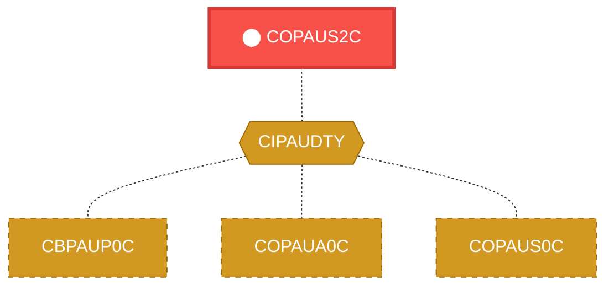
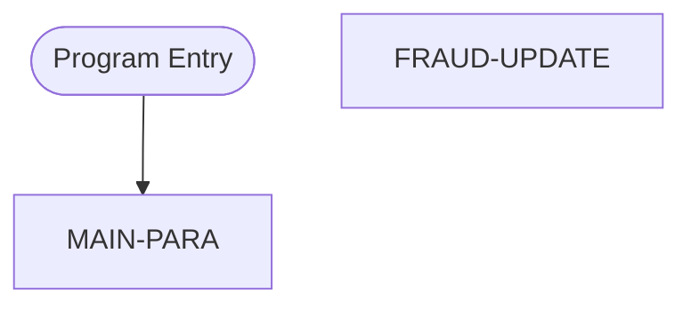

# Program: COPAUS2C

> **Authentication Time Update Handler**
---

## Quick Reference

| Attribute | Value |
|-----------|-------|
| Program ID | `COPAUS2C` |
| Type | ONLINE |
| Lines | 245 |
| Source | [COPAUS2C.cbl](../carddemo/COPAUS2C.cbl#L1) |
| Paragraphs | 2 |
| Statements | 41 |
| Impact Risk | **MEDIUM** — 7 programs affected |

> **View Source:** [Open COPAUS2C.cbl](../carddemo/COPAUS2C.cbl#L1)

## Business Purpose

This program is triggered when a user signs on to the system, and it updates the user's last authentication time. The program takes the current date and time, formats it into a specific string format, and stores it in a variable. It then checks for any errors during this process and sets an error flag if necessary. The program does not read or write to any external files, but it does use a copybook to include additional functionality. The output of this program is an updated authentication time, which is used to track user activity. The program is part of a larger authentication process and is used to ensure that user data is up-to-date and accurate.

**Used By:** System User  |  **Process:** Authentication
## Migration Summary

| Attribute | Value |
|-----------|-------|
| Migration Complexity | **2/5** — The program's logic is straightforward and only involves updating a user's last authentication time, making it a relatively simple migration. |
| Modern Equivalent | A REST API endpoint or a database stored procedure |
| Target Microservice | `auth-service` |

### How to Migrate This Program

First, identify the specific requirements for updating the user's last authentication time and determine the best approach for implementing this functionality in the modern system. Next, design and implement a REST API endpoint or database stored procedure that can handle the update. Then, integrate this new endpoint or procedure with the existing authentication process to ensure seamless functionality. Finally, test the migrated component thoroughly to ensure it works as expected.

### Data Contracts (Input / Output)

The program consumes the current date and time and produces an updated authentication time string in a specific format.

### Migration Risks

> ⚠️ Key migration risks include ensuring accurate date and time formatting, handling potential errors during the update process, and integrating the new component with the existing authentication system.

---

## Dependency Context

> This section shows how **COPAUS2C** connects to the rest of the system — who calls it,
> what it calls, and what data it shares. If linked programs exist, they must appear here.

### Programs That Call COPAUS2C (Callers)

*No programs call COPAUS2C — this is likely a top-level entry point or CICS transaction starter.*

### Programs Called by COPAUS2C (Callees)

*COPAUS2C does not call any other programs (leaf program).*

### Shared Data (Copybooks & Files)

#### Shared Copybooks

| Copybook | Also Used By | # Co-Users |
|----------|-------------|------------|
| `CIPAUDTY` | CBPAUP0C, COPAUA0C, COPAUS0C, COPAUS1C, DBUNLDGS (+2 more) | 7 |

---

## Dependency Graph

> **Legend:** 🔴 Target program · 🔵 Direct callers · 🟢 Direct callees · 🟡 Copybook-coupled · ⚫ Transitive (indirect)

---

## Impact Ripple View

> **If you change COPAUS2C, what else could break?**

| Impact Metric | Count |
|--------------|-------|
| Direct Callers | 0 |
| Transitive Callers (callers of callers) | 0 |
| Direct Callees | 0 |
| Transitive Callees | 0 |
| Copybook-Coupled Programs | 7 |
| **Total Impact** | **7** |
| **Risk Rating** | **MEDIUM** |

**Programs affected via shared copybooks:**
- `CBPAUP0C`
- `COPAUA0C`
- `COPAUS0C`
- `COPAUS1C`
- `DBUNLDGS`
- `PAUDBLOD`
- `PAUDBUNL`

---

## Statement Profile

| Statement Type | Count |
|---------------|-------|
| MOVE | 34 |
| IF | 2 |
| EXEC_CICS | 2 |
| EXECSQL | 2 |
| COMPUTE | 1 |

## Control Flow

## Paragraphs

### Update User Authentication Time

| | |
|---|---|
| **Paragraph** | `MAIN-PARA` |
| **Lines** | 143 - 274 |
| **View Code** | [Jump to Line 143](../carddemo/COPAUS2C.cbl#L143) |

This paragraph is triggered when a user signs on to the system. It starts by getting the current date and time, and then formats it into a specific string format. The formatted date and time are then stored in a variable. The program checks for any errors during this process and sets an error flag if necessary. If there are no errors, it updates the user's last authentication time using the formatted date and time string. The updated authentication time is used to track user activity and ensure that user data is up-to-date and accurate.

> **Purpose:** This paragraph plays a crucial role in the overall program flow by updating the user's last authentication time, which is essential for tracking user activity and ensuring data accuracy.

### Update Fraud Detection Data

| | |
|---|---|
| **Paragraph** | `FRAUD-UPDATE` |
| **Lines** | 275 - 298 |
| **View Code** | [Jump to Line 275](../carddemo/COPAUS2C.cbl#L275) |

This paragraph is triggered after the user's authentication time has been updated. It checks for any potential fraud indicators and updates the relevant data if necessary. The program uses a database query to retrieve the required data and then applies the necessary updates. If any updates are made, the program sets a flag to indicate that the data has been modified. The updated data is used to detect and prevent fraudulent activity. The program's actions are conditional, depending on the outcome of the fraud checks.

> **Purpose:** This paragraph contributes to the overall program flow by updating fraud detection data, which helps to identify and prevent suspicious activity.

## Business Rules

- **Update Fraud Indicator** `BR-001`  
  Under certain conditions, flag a transaction as potentially fraudulent.  
  [View Rule Details](../business-rules/BR-001.md)
- **Flag Potentially Fraudulent Activity** `BR-002`  
  If a specific, but currently unknown, condition is met, then a fraud indicator is updated to reflect a potential fraudulent activity.  
  [View Rule Details](../business-rules/BR-002.md)

## Key Data Items

| Name | Level | Picture | Section | Business Name |
|------|-------|---------|---------|---------------|
| `WS-VARIABLES` | 1 | `None` | WORKING-STORAGE | Working Storage Variables |
| `WS-PGMNAME` | 5 | `X(08)` | WORKING-STORAGE | Program Name |
| `WS-LENGTH` | 5 | `S9(4)` | WORKING-STORAGE | Data Length |
| `WS-AUTH-TIME` | 5 | `9(09)` | WORKING-STORAGE | Authentication Time |
| `WS-AUTH-TIME-AN` | 5 | `X(09)` | WORKING-STORAGE | Authentication Time Alphanumeric |
| `WS-AUTH-TS` | 5 | `None` | WORKING-STORAGE | Authentication Timestamp |
| `WS-AUTH-YY` | 10 | `X(02)` | WORKING-STORAGE | Authentication Year |
| `FILLER` | 10 | `X(01)` | WORKING-STORAGE | None |
| `WS-AUTH-MM` | 10 | `X(02)` | WORKING-STORAGE | Authentication Month |
| `FILLER` | 10 | `X(01)` | WORKING-STORAGE | None |
| `WS-AUTH-DD` | 10 | `X(02)` | WORKING-STORAGE | Authentication Day |
| `FILLER` | 10 | `X(01)` | WORKING-STORAGE | None |
| `WS-AUTH-HH` | 10 | `X(02)` | WORKING-STORAGE | Authentication Hour |
| `FILLER` | 10 | `X(01)` | WORKING-STORAGE | None |
| `WS-AUTH-MI` | 10 | `X(02)` | WORKING-STORAGE | Authentication Minute |
| `FILLER` | 10 | `X(01)` | WORKING-STORAGE | None |
| `WS-AUTH-SS` | 10 | `X(02)` | WORKING-STORAGE | Authentication Second |
| `WS-AUTH-SSS` | 10 | `X(03)` | WORKING-STORAGE | Authentication Milliseconds |
| `FILLER` | 10 | `X(03)` | WORKING-STORAGE | None |
| `WS-ERR-FLG` | 5 | `X(01)` | WORKING-STORAGE | Error Flag |
| `ERR-FLG-ON` | 88 | `None` | WORKING-STORAGE | Error Flag On |
| `ERR-FLG-OF` | 88 | `None` | WORKING-STORAGE | Error Flag Off |
| `WS-SQLCODE` | 5 | `+9(06)` | WORKING-STORAGE | SQL Return Code |
| `WS-SQLSTATE` | 5 | `+9(09)` | WORKING-STORAGE | SQL State |
| `WS-ABS-TIME` | 5 | `S9(15)` | WORKING-STORAGE | Absolute Time |
| `WS-CUR-DATE` | 5 | `X(08)` | WORKING-STORAGE | Current Date |
| `DFHCOMMAREA` | 1 | `None` | LINKAGE | Communication Area |
| `WS-ACCT-ID` | 2 | `9(11)` | LINKAGE | Account ID |
| `WS-CUST-ID` | 2 | `9(9)` | LINKAGE | Customer ID |
| `WS-FRAUD-AUTH-RECORD` | 2 | `None` | LINKAGE | Fraud Authentication Record |
| `PA-AUTHORIZATION-KEY` | 5 | `None` | LINKAGE | Authorization Key |
| `PA-AUTH-DATE-9C` | 10 | `S9(05)` | LINKAGE | Authorization Date |
| `PA-AUTH-TIME-9C` | 10 | `S9(09)` | LINKAGE | Authorization Time |
| `PA-AUTH-ORIG-DATE` | 5 | `X(06)` | LINKAGE | Original Authorization Date |
| `PA-AUTH-ORIG-TIME` | 5 | `X(06)` | LINKAGE | Original Authorization Time |
| `PA-CARD-NUM` | 5 | `X(16)` | LINKAGE | Card Number |
| `PA-AUTH-TYPE` | 5 | `X(04)` | LINKAGE | Authorization Type |
| `PA-CARD-EXPIRY-DATE` | 5 | `X(04)` | LINKAGE | Card Expiry Date |
| `PA-MESSAGE-TYPE` | 5 | `X(06)` | LINKAGE | Message Type |
| `PA-MESSAGE-SOURCE` | 5 | `X(06)` | LINKAGE | Message Source |

*Showing 40 of 74 data items. See [Data Dictionary](../data-dictionary.md).*

---

*Generated 2026-03-16 21:06*