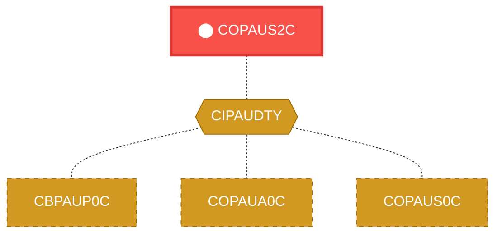

# Program: COPAUS2C

---

## Quick Reference

| Attribute | Value |
|-----------|-------|
| Program ID | `COPAUS2C` |
| Type | ONLINE |
| Lines | 245 |
| Source | [COPAUS2C.cbl](../carddemo/COPAUS2C.cbl#L1) |
| Paragraphs | 2 |
| Statements | 41 |
| Impact Risk | **MEDIUM** — 7 programs affected |

> **View Source:** [Open COPAUS2C.cbl](../carddemo/COPAUS2C.cbl#L1)

## Dependency Context

> This section shows how **COPAUS2C** connects to the rest of the system — who calls it,
> what it calls, and what data it shares. If linked programs exist, they must appear here.

### Programs That Call COPAUS2C (Callers)

*No programs call COPAUS2C — this is likely a top-level entry point or CICS transaction starter.*

### Programs Called by COPAUS2C (Callees)

*COPAUS2C does not call any other programs (leaf program).*

### Shared Data (Copybooks & Files)

#### Shared Copybooks

| Copybook | Also Used By | # Co-Users |
|----------|-------------|------------|
| `CIPAUDTY` | CBPAUP0C, COPAUA0C, COPAUS0C, COPAUS1C, DBUNLDGS (+2 more) | 7 |

---

## Dependency Graph

> **Legend:** 🔴 Target program · 🔵 Direct callers · 🟢 Direct callees · 🟡 Copybook-coupled · ⚫ Transitive (indirect)

---

## Impact Ripple View

> **If you change COPAUS2C, what else could break?**

| Impact Metric | Count |
|--------------|-------|
| Direct Callers | 0 |
| Transitive Callers (callers of callers) | 0 |
| Direct Callees | 0 |
| Transitive Callees | 0 |
| Copybook-Coupled Programs | 7 |
| **Total Impact** | **7** |
| **Risk Rating** | **MEDIUM** |

**Programs affected via shared copybooks:**
- `CBPAUP0C`
- `COPAUA0C`
- `COPAUS0C`
- `COPAUS1C`
- `DBUNLDGS`
- `PAUDBLOD`
- `PAUDBUNL`

---

## Statement Profile

| Statement Type | Count |
|---------------|-------|
| MOVE | 34 |
| IF | 2 |
| EXEC_CICS | 2 |
| EXECSQL | 2 |
| COMPUTE | 1 |

## Control Flow

## Paragraphs

### MAIN-PARA

| | |
|---|---|
| **Paragraph** | `MAIN-PARA` |
| **Lines** | 143 - 274 |
| **View Code** | [Jump to Line 143](../carddemo/COPAUS2C.cbl#L143) |

### FRAUD-UPDATE

| | |
|---|---|
| **Paragraph** | `FRAUD-UPDATE` |
| **Lines** | 275 - 298 |
| **View Code** | [Jump to Line 275](../carddemo/COPAUS2C.cbl#L275) |

## Database Operations (EXEC SQL / DB2)

This program uses the following SQL statements:

| Command | Table / Cursor | Paragraph | Line |
|---------|----------------|-----------|------|
| `INCLUDE` | None | None | 65 |
| `INCLUDE` | None | None | 68 |
| `INSERT` | CARDDEMO.AUTHFRDS | None | 141 |
| `UPDATE` | CARDDEMO.AUTHFRDS | MAIN-PARA | 222 |

**Summary:** 4 SQL statement(s) — INCLUDE (2), INSERT (1), UPDATE (1)

## CICS Commands

This program uses the following EXEC CICS commands:

| Command | Paragraph | Line | Details |
|---------|-----------|------|---------|
| `ASKTIME` | None | 91 | {"details": {}} |
| `FORMATTIME` | None | 95 | {"details": {}} |
| `RETURN` | MAIN-PARA | 218 | {"details": {}} |

**Summary:** 3 CICS command(s) — ASKTIME (1), FORMATTIME (1), RETURN (1)

## Business Rules

- **Update Fraud Indicator** `BR-001`  
  Under certain conditions, flag a transaction as potentially fraudulent.  
  [View Rule Details](../business-rules/BR-001.md)
- **Flag Potentially Fraudulent Activity** `BR-002`  
  If a specific, but currently unknown, condition is met, then a fraud indicator is updated to reflect a potential fraudulent activity.  
  [View Rule Details](../business-rules/BR-002.md)

## Key Data Items

| Name | Level | Picture | Section | Business Name |
|------|-------|---------|---------|---------------|
| `WS-VARIABLES` | 1 | `None` | WORKING-STORAGE | None |
| `WS-PGMNAME` | 5 | `X(08)` | WORKING-STORAGE | None |
| `WS-LENGTH` | 5 | `S9(4)` | WORKING-STORAGE | None |
| `WS-AUTH-TIME` | 5 | `9(09)` | WORKING-STORAGE | None |
| `WS-AUTH-TIME-AN` | 5 | `X(09)` | WORKING-STORAGE | None |
| `WS-AUTH-TS` | 5 | `None` | WORKING-STORAGE | None |
| `WS-AUTH-YY` | 10 | `X(02)` | WORKING-STORAGE | None |
| `FILLER` | 10 | `X(01)` | WORKING-STORAGE | None |
| `WS-AUTH-MM` | 10 | `X(02)` | WORKING-STORAGE | None |
| `FILLER` | 10 | `X(01)` | WORKING-STORAGE | None |
| `WS-AUTH-DD` | 10 | `X(02)` | WORKING-STORAGE | None |
| `FILLER` | 10 | `X(01)` | WORKING-STORAGE | None |
| `WS-AUTH-HH` | 10 | `X(02)` | WORKING-STORAGE | None |
| `FILLER` | 10 | `X(01)` | WORKING-STORAGE | None |
| `WS-AUTH-MI` | 10 | `X(02)` | WORKING-STORAGE | None |
| `FILLER` | 10 | `X(01)` | WORKING-STORAGE | None |
| `WS-AUTH-SS` | 10 | `X(02)` | WORKING-STORAGE | None |
| `WS-AUTH-SSS` | 10 | `X(03)` | WORKING-STORAGE | None |
| `FILLER` | 10 | `X(03)` | WORKING-STORAGE | None |
| `WS-ERR-FLG` | 5 | `X(01)` | WORKING-STORAGE | None |
| `ERR-FLG-ON` | 88 | `None` | WORKING-STORAGE | None |
| `ERR-FLG-OF` | 88 | `None` | WORKING-STORAGE | None |
| `WS-SQLCODE` | 5 | `+9(06)` | WORKING-STORAGE | None |
| `WS-SQLSTATE` | 5 | `+9(09)` | WORKING-STORAGE | None |
| `WS-ABS-TIME` | 5 | `S9(15)` | WORKING-STORAGE | None |
| `WS-CUR-DATE` | 5 | `X(08)` | WORKING-STORAGE | None |
| `DFHCOMMAREA` | 1 | `None` | LINKAGE | None |
| `WS-ACCT-ID` | 2 | `9(11)` | LINKAGE | None |
| `WS-CUST-ID` | 2 | `9(9)` | LINKAGE | None |
| `WS-FRAUD-AUTH-RECORD` | 2 | `None` | LINKAGE | None |
| `PA-AUTHORIZATION-KEY` | 5 | `None` | LINKAGE | None |
| `PA-AUTH-DATE-9C` | 10 | `S9(05)` | LINKAGE | None |
| `PA-AUTH-TIME-9C` | 10 | `S9(09)` | LINKAGE | None |
| `PA-AUTH-ORIG-DATE` | 5 | `X(06)` | LINKAGE | None |
| `PA-AUTH-ORIG-TIME` | 5 | `X(06)` | LINKAGE | None |
| `PA-CARD-NUM` | 5 | `X(16)` | LINKAGE | None |
| `PA-AUTH-TYPE` | 5 | `X(04)` | LINKAGE | None |
| `PA-CARD-EXPIRY-DATE` | 5 | `X(04)` | LINKAGE | None |
| `PA-MESSAGE-TYPE` | 5 | `X(06)` | LINKAGE | None |
| `PA-MESSAGE-SOURCE` | 5 | `X(06)` | LINKAGE | None |

*Showing 40 of 74 data items. See [Data Dictionary](../data-dictionary.md).*

---

*Generated 2026-04-28 20:00*