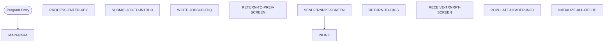

# Program: CORPT00C

---

## Quick Reference

| Attribute | Value |
|-----------|-------|
| Program ID | `CORPT00C` |
| Type | ONLINE |
| Lines | 650 |
| Source | [CORPT00C.cbl](../carddemo/CORPT00C.cbl#L1) |
| Paragraphs | 10 |
| Statements | 39 |
| Impact Risk | **HIGH** — 26 programs affected |

> **View Source:** [Open CORPT00C.cbl](../carddemo/CORPT00C.cbl#L1)

## Dependency Context

> This section shows how **CORPT00C** connects to the rest of the system — who calls it,
> what it calls, and what data it shares. If linked programs exist, they must appear here.

### Programs That Call CORPT00C (Callers)

*No programs call CORPT00C — this is likely a top-level entry point or CICS transaction starter.*

### Programs Called by CORPT00C (Callees)

*CORPT00C does not call any other programs (leaf program).*

### Shared Data (Copybooks & Files)

#### Shared Copybooks

| Copybook | Also Used By | # Co-Users |
|----------|-------------|------------|
| `COCOM01Y` | 00220000, COACTUPC, COACTVWC, COADM01C, COBIL00C (+15 more) | 20 |
| `CORPT00` |  | 0 |
| `COTTL01Y` | 00220000, COACTUPC, COACTVWC, COADM01C, COBIL00C (+15 more) | 20 |
| `CSDAT01Y` | 00220000, COACTUPC, COACTVWC, COADM01C, COBIL00C (+15 more) | 20 |
| `CSMSG01Y` | 00220000, COACTUPC, COACTVWC, COADM01C, COBIL00C (+15 more) | 20 |
| `CVTRA05Y` | CBACT04C, CBEXPORT, CBIMPORT, CBTRN01C, CBTRN02C (+5 more) | 10 |
| `DFHAID` | 00220000, COACTUPC, COACTVWC, COADM01C, COBIL00C (+15 more) | 20 |
| `DFHBMSCA` | 00220000, COACTUPC, COACTVWC, COADM01C, COBIL00C (+15 more) | 20 |

---

## Dependency Graph

```mermaid
flowchart TD
    CORPT00C["⬤ CORPT00C"]:::target
    CB_COCOM01Y{{"COCOM01Y"}}:::copybook
    CORPT00C -.- CB_COCOM01Y
    00220000["00220000"]:::coupled
    CB_COCOM01Y -.- 00220000
    COACTUPC["COACTUPC"]:::coupled
    CB_COCOM01Y -.- COACTUPC
    COACTVWC["COACTVWC"]:::coupled
    CB_COCOM01Y -.- COACTVWC
    CB_COTTL01Y{{"COTTL01Y"}}:::copybook
    CORPT00C -.- CB_COTTL01Y
    00220000["00220000"]:::coupled
    CB_COTTL01Y -.- 00220000
    COACTUPC["COACTUPC"]:::coupled
    CB_COTTL01Y -.- COACTUPC
    COACTVWC["COACTVWC"]:::coupled
    CB_COTTL01Y -.- COACTVWC
    CB_CSDAT01Y{{"CSDAT01Y"}}:::copybook
    CORPT00C -.- CB_CSDAT01Y
    00220000["00220000"]:::coupled
    CB_CSDAT01Y -.- 00220000
    COACTUPC["COACTUPC"]:::coupled
    CB_CSDAT01Y -.- COACTUPC
    COACTVWC["COACTVWC"]:::coupled
    CB_CSDAT01Y -.- COACTVWC
    CB_CSMSG01Y{{"CSMSG01Y"}}:::copybook
    CORPT00C -.- CB_CSMSG01Y
    00220000["00220000"]:::coupled
    CB_CSMSG01Y -.- 00220000
    COACTUPC["COACTUPC"]:::coupled
    CB_CSMSG01Y -.- COACTUPC
    COACTVWC["COACTVWC"]:::coupled
    CB_CSMSG01Y -.- COACTVWC
    CB_CVTRA05Y{{"CVTRA05Y"}}:::copybook
    CORPT00C -.- CB_CVTRA05Y
    CBACT04C["CBACT04C"]:::coupled
    CB_CVTRA05Y -.- CBACT04C
    CBEXPORT["CBEXPORT"]:::coupled
    CB_CVTRA05Y -.- CBEXPORT
    CBIMPORT["CBIMPORT"]:::coupled
    CB_CVTRA05Y -.- CBIMPORT
    CB_DFHAID{{"DFHAID"}}:::copybook
    CORPT00C -.- CB_DFHAID
    00220000["00220000"]:::coupled
    CB_DFHAID -.- 00220000
    COACTUPC["COACTUPC"]:::coupled
    CB_DFHAID -.- COACTUPC
    COACTVWC["COACTVWC"]:::coupled
    CB_DFHAID -.- COACTVWC
    CB_DFHBMSCA{{"DFHBMSCA"}}:::copybook
    CORPT00C -.- CB_DFHBMSCA
    00220000["00220000"]:::coupled
    CB_DFHBMSCA -.- 00220000
    COACTUPC["COACTUPC"]:::coupled
    CB_DFHBMSCA -.- COACTUPC
    COACTVWC["COACTVWC"]:::coupled
    CB_DFHBMSCA -.- COACTVWC

    classDef target fill:#f85149,stroke:#da3633,color:#fff,stroke-width:3px
    classDef caller fill:#58a6ff,stroke:#1f6feb,color:#fff
    classDef callee fill:#3fb950,stroke:#238636,color:#fff
    classDef copybook fill:#d29922,stroke:#9e6a03,color:#fff
    classDef coupled fill:#d29922,stroke:#9e6a03,color:#fff,stroke-dasharray:5
    classDef transitive fill:#484f58,stroke:#8b949e,color:#c9d1d9,stroke-dasharray:5
```

> **Legend:** 🔴 Target program · 🔵 Direct callers · 🟢 Direct callees · 🟡 Copybook-coupled · ⚫ Transitive (indirect)

---

## Impact Ripple View

> **If you change CORPT00C, what else could break?**

| Impact Metric | Count |
|--------------|-------|
| Direct Callers | 0 |
| Transitive Callers (callers of callers) | 0 |
| Direct Callees | 0 |
| Transitive Callees | 0 |
| Copybook-Coupled Programs | 26 |
| **Total Impact** | **26** |
| **Risk Rating** | **HIGH** |

**Programs affected via shared copybooks:**
- `00220000`
- `CBACT04C`
- `CBEXPORT`
- `CBIMPORT`
- `CBTRN01C`
- `CBTRN02C`
- `CBTRN03C`
- `COACTUPC`
- `COACTVWC`
- `COADM01C`
- `COBIL00C`
- `COCRDLIC`
- `COCRDSLC`
- `COCRDUPC`
- `COMEN01C`
- `COPAUS0C`
- `COPAUS1C`
- `COSGN00C`
- `COTRN00C`
- `COTRN01C`
- `COTRN02C`
- `COTRTLIC`
- `COUSR00C`
- `COUSR01C`
- `COUSR02C`
- `COUSR03C`

---

## Statement Profile

| Statement Type | Count |
|---------------|-------|
| MOVE | 19 |
| IF | 6 |
| EXEC_CICS | 5 |
| SET | 3 |
| EVALUATE | 2 |
| PERFORM | 1 |
| INITIALIZE | 1 |
| GOTO | 1 |
| DISPLAY | 1 |

## Control Flow

## Paragraphs

### MAIN-PARA

| | |
|---|---|
| **Paragraph** | `MAIN-PARA` |
| **Lines** | 641 - 680 |
| **View Code** | [Jump to Line 641](../carddemo/CORPT00C.cbl#L641) |

### PROCESS-ENTER-KEY

| | |
|---|---|
| **Paragraph** | `PROCESS-ENTER-KEY` |
| **Lines** | 686 - 934 |
| **View Code** | [Jump to Line 686](../carddemo/CORPT00C.cbl#L686) |

### SUBMIT-JOB-TO-INTRDR

| | |
|---|---|
| **Paragraph** | `SUBMIT-JOB-TO-INTRDR` |
| **Lines** | 940 - 988 |
| **View Code** | [Jump to Line 940](../carddemo/CORPT00C.cbl#L940) |

### WIRTE-JOBSUB-TDQ

| | |
|---|---|
| **Paragraph** | `WIRTE-JOBSUB-TDQ` |
| **Lines** | 993 - 1013 |
| **View Code** | [Jump to Line 993](../carddemo/CORPT00C.cbl#L993) |

### RETURN-TO-PREV-SCREEN

| | |
|---|---|
| **Paragraph** | `RETURN-TO-PREV-SCREEN` |
| **Lines** | 1018 - 1029 |
| **View Code** | [Jump to Line 1018](../carddemo/CORPT00C.cbl#L1018) |

### SEND-TRNRPT-SCREEN

| | |
|---|---|
| **Paragraph** | `SEND-TRNRPT-SCREEN` |
| **Lines** | 1034 - 1058 |
| **View Code** | [Jump to Line 1034](../carddemo/CORPT00C.cbl#L1034) |

### RETURN-TO-CICS

| | |
|---|---|
| **Paragraph** | `RETURN-TO-CICS` |
| **Lines** | 1063 - 1069 |
| **View Code** | [Jump to Line 1063](../carddemo/CORPT00C.cbl#L1063) |

### RECEIVE-TRNRPT-SCREEN

| | |
|---|---|
| **Paragraph** | `RECEIVE-TRNRPT-SCREEN` |
| **Lines** | 1074 - 1082 |
| **View Code** | [Jump to Line 1074](../carddemo/CORPT00C.cbl#L1074) |

### POPULATE-HEADER-INFO

| | |
|---|---|
| **Paragraph** | `POPULATE-HEADER-INFO` |
| **Lines** | 1087 - 1106 |
| **View Code** | [Jump to Line 1087](../carddemo/CORPT00C.cbl#L1087) |

### INITIALIZE-ALL-FIELDS

| | |
|---|---|
| **Paragraph** | `INITIALIZE-ALL-FIELDS` |
| **Lines** | 1111 - 1124 |
| **View Code** | [Jump to Line 1111](../carddemo/CORPT00C.cbl#L1111) |

## Business Rules

- **Transaction Report Submission** `BR-322`  
  A user submits a transaction report request via an online screen.  
  [View Rule Details](../business-rules/BR-322.md)
- **Report Request Submission** `BR-323`  
  When the user presses the ENTER key, the system submits a request to generate a transaction report.  
  [View Rule Details](../business-rules/BR-323.md)
- **Job Submission Confirmation** `BR-324`  
  After submitting the report generation job, the system provides confirmation to the user.  
  [View Rule Details](../business-rules/BR-324.md)
- **Job Submission Confirmation** `BR-325`  
  If the job submission to the internal reader is successful, proceed to write job details to the temporary data queue.  
  [View Rule Details](../business-rules/BR-325.md)
- **Confirmation Screen Display** `BR-326`  
  If writing job details to the temporary data queue is successful, display the confirmation screen to the user.  
  [View Rule Details](../business-rules/BR-326.md)
- **Transaction Report Submission Confirmation** `BR-327`  
  The system confirms the successful submission of a transaction report request.  
  [View Rule Details](../business-rules/BR-327.md)
- **Transaction Report Request Processing** `BR-328`  
  The system processes transaction report requests in the background.  
  [View Rule Details](../business-rules/BR-328.md)
- **Transaction Report Request Logging** `BR-329`  
  The system logs details of transaction report submissions.  
  [View Rule Details](../business-rules/BR-329.md)
- **Return to Previous Screen** `BR-330`  
  The system returns the user to the previous screen.  
  [View Rule Details](../business-rules/BR-330.md)
- **Transaction Report Submission** `BR-331`  
  The system accepts a transaction report request from the user.  
  [View Rule Details](../business-rules/BR-331.md)

## Key Data Items

| Name | Level | Picture | Section | Business Name |
|------|-------|---------|---------|---------------|
| `WS-VARIABLES` | 1 | `None` | WORKING-STORAGE | None |
| `WS-PGMNAME` | 5 | `X(08)` | WORKING-STORAGE | None |
| `WS-TRANID` | 5 | `X(04)` | WORKING-STORAGE | None |
| `WS-MESSAGE` | 5 | `X(80)` | WORKING-STORAGE | None |
| `WS-TRANSACT-FILE` | 5 | `X(08)` | WORKING-STORAGE | None |
| `WS-ERR-FLG` | 5 | `X(01)` | WORKING-STORAGE | None |
| `ERR-FLG-ON` | 88 | `None` | WORKING-STORAGE | None |
| `ERR-FLG-OFF` | 88 | `None` | WORKING-STORAGE | None |
| `WS-TRANSACT-EOF` | 5 | `X(01)` | WORKING-STORAGE | None |
| `TRANSACT-EOF` | 88 | `None` | WORKING-STORAGE | None |
| `TRANSACT-NOT-EOF` | 88 | `None` | WORKING-STORAGE | None |
| `WS-SEND-ERASE-FLG` | 5 | `X(01)` | WORKING-STORAGE | None |
| `SEND-ERASE-YES` | 88 | `None` | WORKING-STORAGE | None |
| `SEND-ERASE-NO` | 88 | `None` | WORKING-STORAGE | None |
| `WS-END-LOOP` | 5 | `X(01)` | WORKING-STORAGE | None |
| `END-LOOP-YES` | 88 | `None` | WORKING-STORAGE | None |
| `END-LOOP-NO` | 88 | `None` | WORKING-STORAGE | None |
| `WS-RESP-CD` | 5 | `S9(09)` | WORKING-STORAGE | None |
| `WS-REAS-CD` | 5 | `S9(09)` | WORKING-STORAGE | None |
| `WS-REC-COUNT` | 5 | `S9(04)` | WORKING-STORAGE | None |
| `WS-IDX` | 5 | `S9(04)` | WORKING-STORAGE | None |
| `WS-REPORT-NAME` | 5 | `X(10)` | WORKING-STORAGE | None |
| `WS-START-DATE` | 5 | `None` | WORKING-STORAGE | None |
| `WS-START-DATE-YYYY` | 10 | `X(04)` | WORKING-STORAGE | None |
| `FILLER` | 10 | `X(01)` | WORKING-STORAGE | None |
| `WS-START-DATE-MM` | 10 | `X(02)` | WORKING-STORAGE | None |
| `FILLER` | 10 | `X(01)` | WORKING-STORAGE | None |
| `WS-START-DATE-DD` | 10 | `X(02)` | WORKING-STORAGE | None |
| `WS-END-DATE` | 5 | `None` | WORKING-STORAGE | None |
| `WS-END-DATE-YYYY` | 10 | `X(04)` | WORKING-STORAGE | None |
| `FILLER` | 10 | `X(01)` | WORKING-STORAGE | None |
| `WS-END-DATE-MM` | 10 | `X(02)` | WORKING-STORAGE | None |
| `FILLER` | 10 | `X(01)` | WORKING-STORAGE | None |
| `WS-END-DATE-DD` | 10 | `X(02)` | WORKING-STORAGE | None |
| `WS-DATE-FORMAT` | 5 | `X(10)` | WORKING-STORAGE | None |
| `WS-NUM-99` | 5 | `99` | WORKING-STORAGE | None |
| `WS-NUM-9999` | 5 | `9999` | WORKING-STORAGE | None |
| `WS-TRAN-AMT` | 5 | `+99999999.99` | WORKING-STORAGE | None |
| `WS-TRAN-DATE` | 5 | `X(08)` | WORKING-STORAGE | None |
| `JCL-RECORD` | 5 | `X(80)` | WORKING-STORAGE | None |

*Showing 40 of 449 data items. See [Data Dictionary](../data-dictionary.md).*

---

*Generated 2026-03-16 21:06*