# Program: COTRN00C

---

## Quick Reference

| Attribute | Value |
|-----------|-------|
| Program ID | `COTRN00C` |
| Type | ONLINE |
| Lines | 700 |
| Source | [COTRN00C.cbl](../carddemo/COTRN00C.cbl#L1) |
| Paragraphs | 16 |
| Statements | 63 |
| Impact Risk | **HIGH** — 26 programs affected |

> **View Source:** [Open COTRN00C.cbl](../carddemo/COTRN00C.cbl#L1)

## Dependency Context

> This section shows how **COTRN00C** connects to the rest of the system — who calls it,
> what it calls, and what data it shares. If linked programs exist, they must appear here.

### Programs That Call COTRN00C (Callers)

*No programs call COTRN00C — this is likely a top-level entry point or CICS transaction starter.*

### Programs Called by COTRN00C (Callees)

*COTRN00C does not call any other programs (leaf program).*

### Shared Data (Copybooks & Files)

#### Shared Copybooks

| Copybook | Also Used By | # Co-Users |
|----------|-------------|------------|
| `COCOM01Y` | 00220000, COACTUPC, COACTVWC, COADM01C, COBIL00C (+15 more) | 20 |
| `COTRN00` |  | 0 |
| `COTTL01Y` | 00220000, COACTUPC, COACTVWC, COADM01C, COBIL00C (+15 more) | 20 |
| `CSDAT01Y` | 00220000, COACTUPC, COACTVWC, COADM01C, COBIL00C (+15 more) | 20 |
| `CSMSG01Y` | 00220000, COACTUPC, COACTVWC, COADM01C, COBIL00C (+15 more) | 20 |
| `CVTRA05Y` | CBACT04C, CBEXPORT, CBIMPORT, CBTRN01C, CBTRN02C (+5 more) | 10 |
| `DFHAID` | 00220000, COACTUPC, COACTVWC, COADM01C, COBIL00C (+15 more) | 20 |
| `DFHBMSCA` | 00220000, COACTUPC, COACTVWC, COADM01C, COBIL00C (+15 more) | 20 |

---

## Dependency Graph

```mermaid
flowchart TD
    COTRN00C["⬤ COTRN00C"]:::target
    CB_COCOM01Y{{"COCOM01Y"}}:::copybook
    COTRN00C -.- CB_COCOM01Y
    00220000["00220000"]:::coupled
    CB_COCOM01Y -.- 00220000
    COACTUPC["COACTUPC"]:::coupled
    CB_COCOM01Y -.- COACTUPC
    COACTVWC["COACTVWC"]:::coupled
    CB_COCOM01Y -.- COACTVWC
    CB_COTTL01Y{{"COTTL01Y"}}:::copybook
    COTRN00C -.- CB_COTTL01Y
    00220000["00220000"]:::coupled
    CB_COTTL01Y -.- 00220000
    COACTUPC["COACTUPC"]:::coupled
    CB_COTTL01Y -.- COACTUPC
    COACTVWC["COACTVWC"]:::coupled
    CB_COTTL01Y -.- COACTVWC
    CB_CSDAT01Y{{"CSDAT01Y"}}:::copybook
    COTRN00C -.- CB_CSDAT01Y
    00220000["00220000"]:::coupled
    CB_CSDAT01Y -.- 00220000
    COACTUPC["COACTUPC"]:::coupled
    CB_CSDAT01Y -.- COACTUPC
    COACTVWC["COACTVWC"]:::coupled
    CB_CSDAT01Y -.- COACTVWC
    CB_CSMSG01Y{{"CSMSG01Y"}}:::copybook
    COTRN00C -.- CB_CSMSG01Y
    00220000["00220000"]:::coupled
    CB_CSMSG01Y -.- 00220000
    COACTUPC["COACTUPC"]:::coupled
    CB_CSMSG01Y -.- COACTUPC
    COACTVWC["COACTVWC"]:::coupled
    CB_CSMSG01Y -.- COACTVWC
    CB_CVTRA05Y{{"CVTRA05Y"}}:::copybook
    COTRN00C -.- CB_CVTRA05Y
    CBACT04C["CBACT04C"]:::coupled
    CB_CVTRA05Y -.- CBACT04C
    CBEXPORT["CBEXPORT"]:::coupled
    CB_CVTRA05Y -.- CBEXPORT
    CBIMPORT["CBIMPORT"]:::coupled
    CB_CVTRA05Y -.- CBIMPORT
    CB_DFHAID{{"DFHAID"}}:::copybook
    COTRN00C -.- CB_DFHAID
    00220000["00220000"]:::coupled
    CB_DFHAID -.- 00220000
    COACTUPC["COACTUPC"]:::coupled
    CB_DFHAID -.- COACTUPC
    COACTVWC["COACTVWC"]:::coupled
    CB_DFHAID -.- COACTVWC
    CB_DFHBMSCA{{"DFHBMSCA"}}:::copybook
    COTRN00C -.- CB_DFHBMSCA
    00220000["00220000"]:::coupled
    CB_DFHBMSCA -.- 00220000
    COACTUPC["COACTUPC"]:::coupled
    CB_DFHBMSCA -.- COACTUPC
    COACTVWC["COACTVWC"]:::coupled
    CB_DFHBMSCA -.- COACTVWC

    classDef target fill:#f85149,stroke:#da3633,color:#fff,stroke-width:3px
    classDef caller fill:#58a6ff,stroke:#1f6feb,color:#fff
    classDef callee fill:#3fb950,stroke:#238636,color:#fff
    classDef copybook fill:#d29922,stroke:#9e6a03,color:#fff
    classDef coupled fill:#d29922,stroke:#9e6a03,color:#fff,stroke-dasharray:5
    classDef transitive fill:#484f58,stroke:#8b949e,color:#c9d1d9,stroke-dasharray:5
```

> **Legend:** 🔴 Target program · 🔵 Direct callers · 🟢 Direct callees · 🟡 Copybook-coupled · ⚫ Transitive (indirect)

---

## Impact Ripple View

> **If you change COTRN00C, what else could break?**

| Impact Metric | Count |
|--------------|-------|
| Direct Callers | 0 |
| Transitive Callers (callers of callers) | 0 |
| Direct Callees | 0 |
| Transitive Callees | 0 |
| Copybook-Coupled Programs | 26 |
| **Total Impact** | **26** |
| **Risk Rating** | **HIGH** |

**Programs affected via shared copybooks:**
- `00220000`
- `CBACT04C`
- `CBEXPORT`
- `CBIMPORT`
- `CBTRN01C`
- `CBTRN02C`
- `CBTRN03C`
- `COACTUPC`
- `COACTVWC`
- `COADM01C`
- `COBIL00C`
- `COCRDLIC`
- `COCRDSLC`
- `COCRDUPC`
- `COMEN01C`
- `COPAUS0C`
- `COPAUS1C`
- `CORPT00C`
- `COSGN00C`
- `COTRN01C`
- `COTRN02C`
- `COTRTLIC`
- `COUSR00C`
- `COUSR01C`
- `COUSR02C`
- `COUSR03C`

---

## Statement Profile

| Statement Type | Count |
|---------------|-------|
| MOVE | 29 |
| IF | 12 |
| EXEC_CICS | 7 |
| EVALUATE | 6 |
| SET | 5 |
| PERFORM | 4 |

## Control Flow

```mermaid
flowchart TD
    START([Program Entry])
    MAIN_PARA["MAIN-PARA"]
    PROCESS_ENTER_KEY["PROCESS-ENTER-KEY"]
    PROCESS_PF7_KEY["PROCESS-PF7-KEY"]
    PROCESS_PF8_KEY["PROCESS-PF8-KEY"]
    PROCESS_PAGE_FORWARD["PROCESS-PAGE-FORWARD"]
    PROCESS_PAGE_BACKWARD["PROCESS-PAGE-BACKWARD"]
    POPULATE_TRAN_DATA["POPULATE-TRAN-DATA"]
    INITIALIZE_TRAN_DATA["INITIALIZE-TRAN-DATA"]
    RETURN_TO_PREV_SCREEN["RETURN-TO-PREV-SCREEN"]
    SEND_TRNLST_SCREEN["SEND-TRNLST-SCREEN"]
    RECEIVE_TRNLST_SCREEN["RECEIVE-TRNLST-SCREEN"]
    POPULATE_HEADER_INFO["POPULATE-HEADER-INFO"]
    STARTBR_TRANSACT_FILE["STARTBR-TRANSACT-FILE"]
    READNEXT_TRANSACT_FILE["READNEXT-TRANSACT-FILE"]
    READPREV_TRANSACT_FILE["READPREV-TRANSACT-FILE"]
    START --> MAIN_PARA
    PROCESS_ENTER_KEY --> INLINE
    PROCESS_PAGE_FORWARD --> INLINE
    PROCESS_PAGE_BACKWARD --> INLINE
    SEND_TRNLST_SCREEN --> INLINE
```

## Paragraphs

### MAIN-PARA

| | |
|---|---|
| **Paragraph** | `MAIN-PARA` |
| **Lines** | 1077 - 1123 |
| **View Code** | [Jump to Line 1077](../carddemo/COTRN00C.cbl#L1077) |

### PROCESS-ENTER-KEY

| | |
|---|---|
| **Paragraph** | `PROCESS-ENTER-KEY` |
| **Lines** | 1128 - 1211 |
| **View Code** | [Jump to Line 1128](../carddemo/COTRN00C.cbl#L1128) |

### PROCESS-PF7-KEY

| | |
|---|---|
| **Paragraph** | `PROCESS-PF7-KEY` |
| **Lines** | 1216 - 1234 |
| **View Code** | [Jump to Line 1216](../carddemo/COTRN00C.cbl#L1216) |

### PROCESS-PF8-KEY

| | |
|---|---|
| **Paragraph** | `PROCESS-PF8-KEY` |
| **Lines** | 1239 - 1256 |
| **View Code** | [Jump to Line 1239](../carddemo/COTRN00C.cbl#L1239) |

### PROCESS-PAGE-FORWARD

| | |
|---|---|
| **Paragraph** | `PROCESS-PAGE-FORWARD` |
| **Lines** | 1261 - 1310 |
| **View Code** | [Jump to Line 1261](../carddemo/COTRN00C.cbl#L1261) |

### PROCESS-PAGE-BACKWARD

| | |
|---|---|
| **Paragraph** | `PROCESS-PAGE-BACKWARD` |
| **Lines** | 1315 - 1358 |
| **View Code** | [Jump to Line 1315](../carddemo/COTRN00C.cbl#L1315) |

### POPULATE-TRAN-DATA

| | |
|---|---|
| **Paragraph** | `POPULATE-TRAN-DATA` |
| **Lines** | 1363 - 1427 |
| **View Code** | [Jump to Line 1363](../carddemo/COTRN00C.cbl#L1363) |

### INITIALIZE-TRAN-DATA

| | |
|---|---|
| **Paragraph** | `INITIALIZE-TRAN-DATA` |
| **Lines** | 1432 - 1487 |
| **View Code** | [Jump to Line 1432](../carddemo/COTRN00C.cbl#L1432) |

### RETURN-TO-PREV-SCREEN

| | |
|---|---|
| **Paragraph** | `RETURN-TO-PREV-SCREEN` |
| **Lines** | 1492 - 1503 |
| **View Code** | [Jump to Line 1492](../carddemo/COTRN00C.cbl#L1492) |

### SEND-TRNLST-SCREEN

| | |
|---|---|
| **Paragraph** | `SEND-TRNLST-SCREEN` |
| **Lines** | 1509 - 1531 |
| **View Code** | [Jump to Line 1509](../carddemo/COTRN00C.cbl#L1509) |

### RECEIVE-TRNLST-SCREEN

| | |
|---|---|
| **Paragraph** | `RECEIVE-TRNLST-SCREEN` |
| **Lines** | 1536 - 1544 |
| **View Code** | [Jump to Line 1536](../carddemo/COTRN00C.cbl#L1536) |

### POPULATE-HEADER-INFO

| | |
|---|---|
| **Paragraph** | `POPULATE-HEADER-INFO` |
| **Lines** | 1549 - 1568 |
| **View Code** | [Jump to Line 1549](../carddemo/COTRN00C.cbl#L1549) |

### STARTBR-TRANSACT-FILE

| | |
|---|---|
| **Paragraph** | `STARTBR-TRANSACT-FILE` |
| **Lines** | 1573 - 1601 |
| **View Code** | [Jump to Line 1573](../carddemo/COTRN00C.cbl#L1573) |

### READNEXT-TRANSACT-FILE

| | |
|---|---|
| **Paragraph** | `READNEXT-TRANSACT-FILE` |
| **Lines** | 1606 - 1635 |
| **View Code** | [Jump to Line 1606](../carddemo/COTRN00C.cbl#L1606) |

### READPREV-TRANSACT-FILE

| | |
|---|---|
| **Paragraph** | `READPREV-TRANSACT-FILE` |
| **Lines** | 1640 - 1669 |
| **View Code** | [Jump to Line 1640](../carddemo/COTRN00C.cbl#L1640) |

### ENDBR-TRANSACT-FILE

| | |
|---|---|
| **Paragraph** | `ENDBR-TRANSACT-FILE` |
| **Lines** | 1674 - 1678 |
| **View Code** | [Jump to Line 1674](../carddemo/COTRN00C.cbl#L1674) |

## Business Rules

- **Transaction Display Limit Reached** `BR-341`  
  If the maximum number of transactions that can be displayed on a single screen has been reached, stop adding more transactions to the display.  
  [View Rule Details](../business-rules/BR-341.md)
- **Transaction Display Limit** `BR-342`  
  The system limits the number of transactions displayed on a single screen.  
  [View Rule Details](../business-rules/BR-342.md)
- **Transaction Data Formatting** `BR-343`  
  Transaction data must be formatted in a specific way for display on the terminal screen.  
  [View Rule Details](../business-rules/BR-343.md)
- **User Navigation** `BR-344`  
  Users can navigate through the list of transactions using specific function keys.  
  [View Rule Details](../business-rules/BR-344.md)
- **Display Previous Page of Transactions** `BR-345`  
  The system displays the previous page of transaction records when the user presses the PF7 key.  
  [View Rule Details](../business-rules/BR-345.md)
- **Display Next Page of Transactions** `BR-346`  
  When the user presses the PF8 key, display the next page of transaction records.  
  [View Rule Details](../business-rules/BR-346.md)
- **Check for End of Transaction Data** `BR-347`  
  Before displaying the next page, verify if the end of the transaction data file has been reached.  
  [View Rule Details](../business-rules/BR-347.md)
- **Transaction Display - Page Forward Limit** `BR-348`  
  The system determines if the last transaction has been displayed.  
  [View Rule Details](../business-rules/BR-348.md)
- **Prevent Paging Beyond First Page** `BR-349`  
  The user cannot navigate to a previous page if they are already on the first page of transaction data.  
  [View Rule Details](../business-rules/BR-349.md)
- **Transaction Data Population** `BR-350`  
  Transaction details are retrieved and prepared for display on the user's screen.  
  [View Rule Details](../business-rules/BR-350.md)
- **Transaction Display Logic** `BR-351`  
  The program determines which transactions to display based on user navigation (paging forward or backward).  
  [View Rule Details](../business-rules/BR-351.md)
- **Return to Previous Screen** `BR-352`  
  The system displays the previous screen of transaction data.  
  [View Rule Details](../business-rules/BR-352.md)
- **Transaction List Display** `BR-353`  
  Display the transaction list on the user's terminal screen.  
  [View Rule Details](../business-rules/BR-353.md)
- **Transaction Display Logic** `BR-354`  
  The system determines which set of transactions to display to the user based on their navigation actions (e.g., next page, previous page).  
  [View Rule Details](../business-rules/BR-354.md)
- **Transaction File End of File Handling** `BR-355`  
  When the end of the transaction file is reached, the system should display a message indicating that there are no more transactions to display.  
  [View Rule Details](../business-rules/BR-355.md)
- **Transaction File Read Error Handling** `BR-356`  
  If an error occurs while reading the transaction file, the system should display an error message to the user and potentially terminate the transaction display process.  
  [View Rule Details](../business-rules/BR-356.md)
- **Transaction File End of File Handling** `BR-357`  
  When attempting to read the previous transaction, if the beginning of the transaction file is reached, indicate that there are no more previous transactions to display.  
  [View Rule Details](../business-rules/BR-357.md)
- **Transaction File Read Error Handling** `BR-358`  
  If an error occurs while attempting to read the previous transaction from the transaction file, display an error message to the user.  
  [View Rule Details](../business-rules/BR-358.md)

## Key Data Items

| Name | Level | Picture | Section | Business Name |
|------|-------|---------|---------|---------------|
| `WS-VARIABLES` | 1 | `None` | WORKING-STORAGE | None |
| `WS-PGMNAME` | 5 | `X(08)` | WORKING-STORAGE | None |
| `WS-TRANID` | 5 | `X(04)` | WORKING-STORAGE | None |
| `WS-MESSAGE` | 5 | `X(80)` | WORKING-STORAGE | None |
| `WS-TRANSACT-FILE` | 5 | `X(08)` | WORKING-STORAGE | None |
| `WS-ERR-FLG` | 5 | `X(01)` | WORKING-STORAGE | None |
| `ERR-FLG-ON` | 88 | `None` | WORKING-STORAGE | None |
| `ERR-FLG-OFF` | 88 | `None` | WORKING-STORAGE | None |
| `WS-TRANSACT-EOF` | 5 | `X(01)` | WORKING-STORAGE | None |
| `TRANSACT-EOF` | 88 | `None` | WORKING-STORAGE | None |
| `TRANSACT-NOT-EOF` | 88 | `None` | WORKING-STORAGE | None |
| `WS-SEND-ERASE-FLG` | 5 | `X(01)` | WORKING-STORAGE | None |
| `SEND-ERASE-YES` | 88 | `None` | WORKING-STORAGE | None |
| `SEND-ERASE-NO` | 88 | `None` | WORKING-STORAGE | None |
| `WS-RESP-CD` | 5 | `S9(09)` | WORKING-STORAGE | None |
| `WS-REAS-CD` | 5 | `S9(09)` | WORKING-STORAGE | None |
| `WS-REC-COUNT` | 5 | `S9(04)` | WORKING-STORAGE | None |
| `WS-IDX` | 5 | `S9(04)` | WORKING-STORAGE | None |
| `WS-PAGE-NUM` | 5 | `S9(04)` | WORKING-STORAGE | None |
| `WS-TRAN-AMT` | 5 | `+99999999.99` | WORKING-STORAGE | None |
| `WS-TRAN-DATE` | 5 | `X(08)` | WORKING-STORAGE | None |
| `CARDDEMO-COMMAREA` | 1 | `None` | WORKING-STORAGE | None |
| `CDEMO-GENERAL-INFO` | 5 | `None` | WORKING-STORAGE | None |
| `CDEMO-FROM-TRANID` | 10 | `X(04)` | WORKING-STORAGE | None |
| `CDEMO-FROM-PROGRAM` | 10 | `X(08)` | WORKING-STORAGE | None |
| `CDEMO-TO-TRANID` | 10 | `X(04)` | WORKING-STORAGE | None |
| `CDEMO-TO-PROGRAM` | 10 | `X(08)` | WORKING-STORAGE | None |
| `CDEMO-USER-ID` | 10 | `X(08)` | WORKING-STORAGE | None |
| `CDEMO-USER-TYPE` | 10 | `X(01)` | WORKING-STORAGE | None |
| `CDEMO-USRTYP-ADMIN` | 88 | `None` | WORKING-STORAGE | None |
| `CDEMO-USRTYP-USER` | 88 | `None` | WORKING-STORAGE | None |
| `CDEMO-PGM-CONTEXT` | 10 | `9(01)` | WORKING-STORAGE | None |
| `CDEMO-PGM-ENTER` | 88 | `None` | WORKING-STORAGE | None |
| `CDEMO-PGM-REENTER` | 88 | `None` | WORKING-STORAGE | None |
| `CDEMO-CUSTOMER-INFO` | 5 | `None` | WORKING-STORAGE | None |
| `CDEMO-CUST-ID` | 10 | `9(09)` | WORKING-STORAGE | None |
| `CDEMO-CUST-FNAME` | 10 | `X(25)` | WORKING-STORAGE | None |
| `CDEMO-CUST-MNAME` | 10 | `X(25)` | WORKING-STORAGE | None |
| `CDEMO-CUST-LNAME` | 10 | `X(25)` | WORKING-STORAGE | None |
| `CDEMO-ACCOUNT-INFO` | 5 | `None` | WORKING-STORAGE | None |

*Showing 40 of 904 data items. See [Data Dictionary](../data-dictionary.md).*

---

*Generated 2026-03-16 21:06*