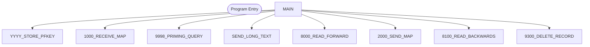

# Program: COTRTLIC

---

## Quick Reference

| Attribute | Value |
|-----------|-------|
| Program ID | `COTRTLIC` |
| Type | ONLINE |
| Lines | 2099 |
| Source | [COTRTLIC.cbl](../carddemo/COTRTLIC.cbl#L1) |
| Paragraphs | 0 |
| Statements | 0 |
| Impact Risk | **HIGH** — 24 programs affected |

> **View Source:** [Open COTRTLIC.cbl](../carddemo/COTRTLIC.cbl#L1)

## Dependency Context

> This section shows how **COTRTLIC** connects to the rest of the system — who calls it,
> what it calls, and what data it shares. If linked programs exist, they must appear here.

### Programs That Call COTRTLIC (Callers)

*No programs call COTRTLIC — this is likely a top-level entry point or CICS transaction starter.*

### Programs Called by COTRTLIC (Callees)

*COTRTLIC does not call any other programs (leaf program).*

### Shared Data (Copybooks & Files)

#### Shared Copybooks

| Copybook | Also Used By | # Co-Users |
|----------|-------------|------------|
| `COCOM01Y` | COACTUPC, COACTVWC, COADM01C, COBIL00C, COCRDLIC (+15 more) | 20 |
| `COTRTLI` |  | 0 |
| `COTTL01Y` | COACTUPC, COACTVWC, COADM01C, COBIL00C, COCRDLIC (+15 more) | 20 |
| `CSDAT01Y` | COACTUPC, COACTVWC, COADM01C, COBIL00C, COCRDLIC (+15 more) | 20 |
| `CSMSG01Y` | COACTUPC, COACTVWC, COADM01C, COBIL00C, COCRDLIC (+15 more) | 20 |
| `CSUSR01Y` | COACTUPC, COACTVWC, COADM01C, COCRDLIC, COCRDSLC (+8 more) | 13 |
| `CVACT02Y` | CBACT02C, CBEXPORT, CBIMPORT, CBTRN01C, COACTVWC (+4 more) | 9 |
| `CVCRD01Y` | COACTUPC, COACTVWC, COCRDLIC, COCRDSLC, COCRDUPC (+1 more) | 6 |
| `DFHAID` | COACTUPC, COACTVWC, COADM01C, COBIL00C, COCRDLIC (+15 more) | 20 |
| `DFHBMSCA` | COACTUPC, COACTVWC, COADM01C, COBIL00C, COCRDLIC (+15 more) | 20 |

---

## Dependency Graph

```mermaid
flowchart TD
    COTRTLIC["⬤ COTRTLIC"]:::target
    CB_COCOM01Y{{"COCOM01Y"}}:::copybook
    COTRTLIC -.- CB_COCOM01Y
    COACTUPC["COACTUPC"]:::coupled
    CB_COCOM01Y -.- COACTUPC
    COACTVWC["COACTVWC"]:::coupled
    CB_COCOM01Y -.- COACTVWC
    COADM01C["COADM01C"]:::coupled
    CB_COCOM01Y -.- COADM01C
    CB_COTTL01Y{{"COTTL01Y"}}:::copybook
    COTRTLIC -.- CB_COTTL01Y
    COACTUPC["COACTUPC"]:::coupled
    CB_COTTL01Y -.- COACTUPC
    COACTVWC["COACTVWC"]:::coupled
    CB_COTTL01Y -.- COACTVWC
    COADM01C["COADM01C"]:::coupled
    CB_COTTL01Y -.- COADM01C
    CB_CSDAT01Y{{"CSDAT01Y"}}:::copybook
    COTRTLIC -.- CB_CSDAT01Y
    COACTUPC["COACTUPC"]:::coupled
    CB_CSDAT01Y -.- COACTUPC
    COACTVWC["COACTVWC"]:::coupled
    CB_CSDAT01Y -.- COACTVWC
    COADM01C["COADM01C"]:::coupled
    CB_CSDAT01Y -.- COADM01C
    CB_CSMSG01Y{{"CSMSG01Y"}}:::copybook
    COTRTLIC -.- CB_CSMSG01Y
    COACTUPC["COACTUPC"]:::coupled
    CB_CSMSG01Y -.- COACTUPC
    COACTVWC["COACTVWC"]:::coupled
    CB_CSMSG01Y -.- COACTVWC
    COADM01C["COADM01C"]:::coupled
    CB_CSMSG01Y -.- COADM01C
    CB_CSUSR01Y{{"CSUSR01Y"}}:::copybook
    COTRTLIC -.- CB_CSUSR01Y
    COACTUPC["COACTUPC"]:::coupled
    CB_CSUSR01Y -.- COACTUPC
    COACTVWC["COACTVWC"]:::coupled
    CB_CSUSR01Y -.- COACTVWC
    COADM01C["COADM01C"]:::coupled
    CB_CSUSR01Y -.- COADM01C
    CB_CVACT02Y{{"CVACT02Y"}}:::copybook
    COTRTLIC -.- CB_CVACT02Y
    CBACT02C["CBACT02C"]:::coupled
    CB_CVACT02Y -.- CBACT02C
    CBEXPORT["CBEXPORT"]:::coupled
    CB_CVACT02Y -.- CBEXPORT
    CBIMPORT["CBIMPORT"]:::coupled
    CB_CVACT02Y -.- CBIMPORT
    CB_CVCRD01Y{{"CVCRD01Y"}}:::copybook
    COTRTLIC -.- CB_CVCRD01Y
    COACTUPC["COACTUPC"]:::coupled
    CB_CVCRD01Y -.- COACTUPC
    COACTVWC["COACTVWC"]:::coupled
    CB_CVCRD01Y -.- COACTVWC
    COCRDLIC["COCRDLIC"]:::coupled
    CB_CVCRD01Y -.- COCRDLIC
    classDef target fill:#f85149,stroke:#da3633,color:#fff,stroke-width:3px
    classDef caller fill:#58a6ff,stroke:#1f6feb,color:#fff
    classDef callee fill:#3fb950,stroke:#238636,color:#fff
    classDef copybook fill:#d29922,stroke:#9e6a03,color:#fff
    classDef coupled fill:#d29922,stroke:#9e6a03,color:#fff,stroke-dasharray:5
    classDef transitive fill:#484f58,stroke:#8b949e,color:#c9d1d9,stroke-dasharray:5
```

> **Legend:** 🔴 Target program · 🔵 Direct callers · 🟢 Direct callees · 🟡 Copybook-coupled · ⚫ Transitive (indirect)

---

## Impact Ripple View

> **If you change COTRTLIC, what else could break?**

| Impact Metric | Count |
|--------------|-------|
| Direct Callers | 0 |
| Transitive Callers (callers of callers) | 0 |
| Direct Callees | 0 |
| Transitive Callees | 0 |
| Copybook-Coupled Programs | 24 |
| **Total Impact** | **24** |
| **Risk Rating** | **HIGH** |

**Programs affected via shared copybooks:**
- `CBACT02C`
- `CBEXPORT`
- `CBIMPORT`
- `CBTRN01C`
- `COACTUPC`
- `COACTVWC`
- `COADM01C`
- `COBIL00C`
- `COCRDLIC`
- `COCRDSLC`
- `COCRDUPC`
- `COMEN01C`
- `COPAUS0C`
- `COPAUS1C`
- `CORPT00C`
- `COSGN00C`
- `COTRN00C`
- `COTRN01C`
- `COTRN02C`
- `COTRTUPC`
- `COUSR00C`
- `COUSR01C`
- `COUSR02C`
- `COUSR03C`

---

## Statement Profile

## Control Flow

## Paragraphs

## Database Operations (EXEC SQL / DB2)

This program uses the following SQL statements:

| Command | Table / Cursor | Paragraph | Line |
|---------|----------------|-----------|------|
| `INCLUDE` | None | None | 304 |
| `INCLUDE` | CARDDEMO.TRANSACTION_TYPE | None | 333 |
| `DECLARE` | CARDDEMO.TRANSACTION_TYPE | None | 354 |
| `FETCH` | None | None | 1626 |
| `FETCH` | None | None | 1661 |
| `FETCH` | None | None | 1753 |
| `SELECT` | CARDDEMO.TRANSACTION_TYPE | None | 1803 |
| `UPDATE` | CARDDEMO.TRANSACTION_TYPE | None | 1846 |
| `DELETE` | CARDDEMO.TRANSACTION_TYPE | None | 1900 |
| `OPEN` | None | None | 1943 |
| `CLOSE` | None | None | 1971 |
| `OPEN` | None | None | 1998 |
| `CLOSE` | None | None | 2027 |
| `INCLUDE` | None | None | 2055 |

**Summary:** 14 SQL statement(s) — INCLUDE (3), DECLARE (1), FETCH (3), SELECT (1), UPDATE (1), DELETE (1), OPEN (2), CLOSE (2)

## Business Rules

*No business rules extracted yet. Run LLM enrichment to extract rules from IF/EVALUATE logic.*

## Key Data Items

*No data items found for this program.*

---

*Generated 2026-04-28 20:00*