# Program: COUSR00C

---

## Quick Reference

| Attribute | Value |
|-----------|-------|
| Program ID | `COUSR00C` |
| Type | ONLINE |
| Lines | 696 |
| Source | [COUSR00C.cbl](../carddemo/COUSR00C.cbl#L1) |
| Paragraphs | 16 |
| Statements | 57 |
| Impact Risk | **HIGH** — 20 programs affected |

> **View Source:** [Open COUSR00C.cbl](../carddemo/COUSR00C.cbl#L1)

## Dependency Context

> This section shows how **COUSR00C** connects to the rest of the system — who calls it,
> what it calls, and what data it shares. If linked programs exist, they must appear here.

### Programs That Call COUSR00C (Callers)

*No programs call COUSR00C — this is likely a top-level entry point or CICS transaction starter.*

### Programs Called by COUSR00C (Callees)

*COUSR00C does not call any other programs (leaf program).*

### Shared Data (Copybooks & Files)

#### Shared Copybooks

| Copybook | Also Used By | # Co-Users |
|----------|-------------|------------|
| `COCOM01Y` | 00220000, COACTUPC, COACTVWC, COADM01C, COBIL00C (+15 more) | 20 |
| `COTTL01Y` | 00220000, COACTUPC, COACTVWC, COADM01C, COBIL00C (+15 more) | 20 |
| `COUSR00` |  | 0 |
| `CSDAT01Y` | 00220000, COACTUPC, COACTVWC, COADM01C, COBIL00C (+15 more) | 20 |
| `CSMSG01Y` | 00220000, COACTUPC, COACTVWC, COADM01C, COBIL00C (+15 more) | 20 |
| `CSUSR01Y` | 00220000, COACTUPC, COACTVWC, COADM01C, COCRDLIC (+8 more) | 13 |
| `DFHAID` | 00220000, COACTUPC, COACTVWC, COADM01C, COBIL00C (+15 more) | 20 |
| `DFHBMSCA` | 00220000, COACTUPC, COACTVWC, COADM01C, COBIL00C (+15 more) | 20 |

---

## Dependency Graph

```mermaid
flowchart TD
    COUSR00C["⬤ COUSR00C"]:::target
    CB_COCOM01Y{{"COCOM01Y"}}:::copybook
    COUSR00C -.- CB_COCOM01Y
    00220000["00220000"]:::coupled
    CB_COCOM01Y -.- 00220000
    COACTUPC["COACTUPC"]:::coupled
    CB_COCOM01Y -.- COACTUPC
    COACTVWC["COACTVWC"]:::coupled
    CB_COCOM01Y -.- COACTVWC
    CB_COTTL01Y{{"COTTL01Y"}}:::copybook
    COUSR00C -.- CB_COTTL01Y
    00220000["00220000"]:::coupled
    CB_COTTL01Y -.- 00220000
    COACTUPC["COACTUPC"]:::coupled
    CB_COTTL01Y -.- COACTUPC
    COACTVWC["COACTVWC"]:::coupled
    CB_COTTL01Y -.- COACTVWC
    CB_CSDAT01Y{{"CSDAT01Y"}}:::copybook
    COUSR00C -.- CB_CSDAT01Y
    00220000["00220000"]:::coupled
    CB_CSDAT01Y -.- 00220000
    COACTUPC["COACTUPC"]:::coupled
    CB_CSDAT01Y -.- COACTUPC
    COACTVWC["COACTVWC"]:::coupled
    CB_CSDAT01Y -.- COACTVWC
    CB_CSMSG01Y{{"CSMSG01Y"}}:::copybook
    COUSR00C -.- CB_CSMSG01Y
    00220000["00220000"]:::coupled
    CB_CSMSG01Y -.- 00220000
    COACTUPC["COACTUPC"]:::coupled
    CB_CSMSG01Y -.- COACTUPC
    COACTVWC["COACTVWC"]:::coupled
    CB_CSMSG01Y -.- COACTVWC
    CB_CSUSR01Y{{"CSUSR01Y"}}:::copybook
    COUSR00C -.- CB_CSUSR01Y
    00220000["00220000"]:::coupled
    CB_CSUSR01Y -.- 00220000
    COACTUPC["COACTUPC"]:::coupled
    CB_CSUSR01Y -.- COACTUPC
    COACTVWC["COACTVWC"]:::coupled
    CB_CSUSR01Y -.- COACTVWC
    CB_DFHAID{{"DFHAID"}}:::copybook
    COUSR00C -.- CB_DFHAID
    00220000["00220000"]:::coupled
    CB_DFHAID -.- 00220000
    COACTUPC["COACTUPC"]:::coupled
    CB_DFHAID -.- COACTUPC
    COACTVWC["COACTVWC"]:::coupled
    CB_DFHAID -.- COACTVWC
    CB_DFHBMSCA{{"DFHBMSCA"}}:::copybook
    COUSR00C -.- CB_DFHBMSCA
    00220000["00220000"]:::coupled
    CB_DFHBMSCA -.- 00220000
    COACTUPC["COACTUPC"]:::coupled
    CB_DFHBMSCA -.- COACTUPC
    COACTVWC["COACTVWC"]:::coupled
    CB_DFHBMSCA -.- COACTVWC

    classDef target fill:#f85149,stroke:#da3633,color:#fff,stroke-width:3px
    classDef caller fill:#58a6ff,stroke:#1f6feb,color:#fff
    classDef callee fill:#3fb950,stroke:#238636,color:#fff
    classDef copybook fill:#d29922,stroke:#9e6a03,color:#fff
    classDef coupled fill:#d29922,stroke:#9e6a03,color:#fff,stroke-dasharray:5
    classDef transitive fill:#484f58,stroke:#8b949e,color:#c9d1d9,stroke-dasharray:5
```

> **Legend:** 🔴 Target program · 🔵 Direct callers · 🟢 Direct callees · 🟡 Copybook-coupled · ⚫ Transitive (indirect)

---

## Impact Ripple View

> **If you change COUSR00C, what else could break?**

| Impact Metric | Count |
|--------------|-------|
| Direct Callers | 0 |
| Transitive Callers (callers of callers) | 0 |
| Direct Callees | 0 |
| Transitive Callees | 0 |
| Copybook-Coupled Programs | 20 |
| **Total Impact** | **20** |
| **Risk Rating** | **HIGH** |

**Programs affected via shared copybooks:**
- `00220000`
- `COACTUPC`
- `COACTVWC`
- `COADM01C`
- `COBIL00C`
- `COCRDLIC`
- `COCRDSLC`
- `COCRDUPC`
- `COMEN01C`
- `COPAUS0C`
- `COPAUS1C`
- `CORPT00C`
- `COSGN00C`
- `COTRN00C`
- `COTRN01C`
- `COTRN02C`
- `COTRTLIC`
- `COUSR01C`
- `COUSR02C`
- `COUSR03C`

---

## Statement Profile

| Statement Type | Count |
|---------------|-------|
| MOVE | 23 |
| IF | 12 |
| EXEC_CICS | 7 |
| EVALUATE | 6 |
| SET | 5 |
| PERFORM | 4 |

## Control Flow

```mermaid
flowchart TD
    START([Program Entry])
    MAIN_PARA["MAIN-PARA"]
    PROCESS_ENTER_KEY["PROCESS-ENTER-KEY"]
    PROCESS_PF7_KEY["PROCESS-PF7-KEY"]
    PROCESS_PF8_KEY["PROCESS-PF8-KEY"]
    PROCESS_PAGE_FORWARD["PROCESS-PAGE-FORWARD"]
    PROCESS_PAGE_BACKWARD["PROCESS-PAGE-BACKWARD"]
    POPULATE_USER_DATA["POPULATE-USER-DATA"]
    INITIALIZE_USER_DATA["INITIALIZE-USER-DATA"]
    RETURN_TO_PREV_SCREEN["RETURN-TO-PREV-SCREEN"]
    SEND_USRLST_SCREEN["SEND-USRLST-SCREEN"]
    RECEIVE_USRLST_SCREEN["RECEIVE-USRLST-SCREEN"]
    POPULATE_HEADER_INFO["POPULATE-HEADER-INFO"]
    STARTBR_USER_SEC_FILE["STARTBR-USER-SEC-FILE"]
    READNEXT_USER_SEC_FILE["READNEXT-USER-SEC-FILE"]
    READPREV_USER_SEC_FILE["READPREV-USER-SEC-FILE"]
    START --> MAIN_PARA
    PROCESS_ENTER_KEY --> INLINE
    PROCESS_PAGE_FORWARD --> INLINE
    PROCESS_PAGE_BACKWARD --> INLINE
    SEND_USRLST_SCREEN --> INLINE
```

## Paragraphs

### MAIN-PARA

| | |
|---|---|
| **Paragraph** | `MAIN-PARA` |
| **Lines** | 1085 - 1131 |
| **View Code** | [Jump to Line 1085](../carddemo/COUSR00C.cbl#L1085) |

### PROCESS-ENTER-KEY

| | |
|---|---|
| **Paragraph** | `PROCESS-ENTER-KEY` |
| **Lines** | 1136 - 1219 |
| **View Code** | [Jump to Line 1136](../carddemo/COUSR00C.cbl#L1136) |

### PROCESS-PF7-KEY

| | |
|---|---|
| **Paragraph** | `PROCESS-PF7-KEY` |
| **Lines** | 1224 - 1242 |
| **View Code** | [Jump to Line 1224](../carddemo/COUSR00C.cbl#L1224) |

### PROCESS-PF8-KEY

| | |
|---|---|
| **Paragraph** | `PROCESS-PF8-KEY` |
| **Lines** | 1247 - 1264 |
| **View Code** | [Jump to Line 1247](../carddemo/COUSR00C.cbl#L1247) |

### PROCESS-PAGE-FORWARD

| | |
|---|---|
| **Paragraph** | `PROCESS-PAGE-FORWARD` |
| **Lines** | 1269 - 1318 |
| **View Code** | [Jump to Line 1269](../carddemo/COUSR00C.cbl#L1269) |

### PROCESS-PAGE-BACKWARD

| | |
|---|---|
| **Paragraph** | `PROCESS-PAGE-BACKWARD` |
| **Lines** | 1323 - 1366 |
| **View Code** | [Jump to Line 1323](../carddemo/COUSR00C.cbl#L1323) |

### POPULATE-USER-DATA

| | |
|---|---|
| **Paragraph** | `POPULATE-USER-DATA` |
| **Lines** | 1371 - 1428 |
| **View Code** | [Jump to Line 1371](../carddemo/COUSR00C.cbl#L1371) |

### INITIALIZE-USER-DATA

| | |
|---|---|
| **Paragraph** | `INITIALIZE-USER-DATA` |
| **Lines** | 1433 - 1488 |
| **View Code** | [Jump to Line 1433](../carddemo/COUSR00C.cbl#L1433) |

### RETURN-TO-PREV-SCREEN

| | |
|---|---|
| **Paragraph** | `RETURN-TO-PREV-SCREEN` |
| **Lines** | 1493 - 1504 |
| **View Code** | [Jump to Line 1493](../carddemo/COUSR00C.cbl#L1493) |

### SEND-USRLST-SCREEN

| | |
|---|---|
| **Paragraph** | `SEND-USRLST-SCREEN` |
| **Lines** | 1509 - 1531 |
| **View Code** | [Jump to Line 1509](../carddemo/COUSR00C.cbl#L1509) |

### RECEIVE-USRLST-SCREEN

| | |
|---|---|
| **Paragraph** | `RECEIVE-USRLST-SCREEN` |
| **Lines** | 1536 - 1544 |
| **View Code** | [Jump to Line 1536](../carddemo/COUSR00C.cbl#L1536) |

### POPULATE-HEADER-INFO

| | |
|---|---|
| **Paragraph** | `POPULATE-HEADER-INFO` |
| **Lines** | 1549 - 1568 |
| **View Code** | [Jump to Line 1549](../carddemo/COUSR00C.cbl#L1549) |

### STARTBR-USER-SEC-FILE

| | |
|---|---|
| **Paragraph** | `STARTBR-USER-SEC-FILE` |
| **Lines** | 1573 - 1601 |
| **View Code** | [Jump to Line 1573](../carddemo/COUSR00C.cbl#L1573) |

### READNEXT-USER-SEC-FILE

| | |
|---|---|
| **Paragraph** | `READNEXT-USER-SEC-FILE` |
| **Lines** | 1606 - 1635 |
| **View Code** | [Jump to Line 1606](../carddemo/COUSR00C.cbl#L1606) |

### READPREV-USER-SEC-FILE

| | |
|---|---|
| **Paragraph** | `READPREV-USER-SEC-FILE` |
| **Lines** | 1640 - 1669 |
| **View Code** | [Jump to Line 1640](../carddemo/COUSR00C.cbl#L1640) |

### ENDBR-USER-SEC-FILE

| | |
|---|---|
| **Paragraph** | `ENDBR-USER-SEC-FILE` |
| **Lines** | 1674 - 1678 |
| **View Code** | [Jump to Line 1674](../carddemo/COUSR00C.cbl#L1674) |

## Business Rules

- **Display User Data** `BR-389`  
  User data is prepared for display on the terminal screen.  
  [View Rule Details](../business-rules/BR-389.md)
- **Display Next Page of Users** `BR-390`  
  When the user requests the next page of user data, display the subsequent set of users from the security file.  
  [View Rule Details](../business-rules/BR-390.md)
- **Display Previous Page of Users** `BR-391`  
  When the user requests the previous page of user data, display the preceding set of users from the security file.  
  [View Rule Details](../business-rules/BR-391.md)
- **Return to Previous Menu** `BR-392`  
  When the user requests to return to the previous menu, terminate the current user display and navigate back to the calling menu.  
  [View Rule Details](../business-rules/BR-392.md)
- **Display Next Page** `BR-393`  
  If the user presses the PF7 key, display the next page of user records.  
  [View Rule Details](../business-rules/BR-393.md)
- **Display Previous Page** `BR-394`  
  If the user presses the PF7 key, display the previous page of user records.  
  [View Rule Details](../business-rules/BR-394.md)
- **Display Next Page** `BR-395`  
  If the user presses the PF8 key, display the next page of user records.  
  [View Rule Details](../business-rules/BR-395.md)
- **End of User List** `BR-396`  
  The user cannot page forward if they are already viewing the last page of user records.  
  [View Rule Details](../business-rules/BR-396.md)
- **Prevent Paging Beyond First Page** `BR-397`  
  The user cannot page backward if they are already on the first page of the user list.  
  [View Rule Details](../business-rules/BR-397.md)
- **User Status Determination** `BR-398`  
  The system determines the status of a user based on a specific code within their security record.  
  [View Rule Details](../business-rules/BR-398.md)
- **Handle Invalid Menu Option** `BR-399`  
  If the user enters an invalid option on the menu, display an error message.  
  [View Rule Details](../business-rules/BR-399.md)
- **Display User List** `BR-400`  
  Display a list of users from the security file on the terminal screen.  
  [View Rule Details](../business-rules/BR-400.md)
- **Page Forward Through User List** `BR-401`  
  Allow the user to page forward through the list of users.  
  [View Rule Details](../business-rules/BR-401.md)
- **Page Backward Through User List** `BR-402`  
  Allow the user to page backward through the list of users.  
  [View Rule Details](../business-rules/BR-402.md)
- **Return to Previous Screen** `BR-403`  
  Allow the user to return to the previous screen (presumably the menu).  
  [View Rule Details](../business-rules/BR-403.md)
- **Return to Previous Screen** `BR-404`  
  When the user chooses to return to the previous screen, the system prepares to display the previous screen.  
  [View Rule Details](../business-rules/BR-404.md)
- **Display User List** `BR-405`  
  The system displays a list of users from the security file on the terminal screen.  
  [View Rule Details](../business-rules/BR-405.md)
- **Page Through User List** `BR-406`  
  The user can navigate through the list of users.  
  [View Rule Details](../business-rules/BR-406.md)
- **Return to Previous Screen** `BR-407`  
  The user can return to the previous screen.  
  [View Rule Details](../business-rules/BR-407.md)
- **Handle Errors and Display Messages** `BR-408`  
  The system handles errors and displays messages to the user.  
  [View Rule Details](../business-rules/BR-408.md)
- **Invalid Security File Status** `BR-409`  
  If the security file is not in a valid state after an attempted read, display an error message to the user.  
  [View Rule Details](../business-rules/BR-409.md)
- **Display User Record** `BR-410`  
  Display the user's record on the terminal screen.  
  [View Rule Details](../business-rules/BR-410.md)
- **Handle End of File** `BR-411`  
  Inform the user that the end of the user list has been reached.  
  [View Rule Details](../business-rules/BR-411.md)
- **Handle File Read Error** `BR-412`  
  Inform the user that there was an error reading the user list.  
  [View Rule Details](../business-rules/BR-412.md)
- **Display Previous User Record** `BR-413`  
  The system retrieves and displays the previous user record from the security file.  
  [View Rule Details](../business-rules/BR-413.md)

## Key Data Items

| Name | Level | Picture | Section | Business Name |
|------|-------|---------|---------|---------------|
| `WS-VARIABLES` | 1 | `None` | WORKING-STORAGE | None |
| `WS-PGMNAME` | 5 | `X(08)` | WORKING-STORAGE | None |
| `WS-TRANID` | 5 | `X(04)` | WORKING-STORAGE | None |
| `WS-MESSAGE` | 5 | `X(80)` | WORKING-STORAGE | None |
| `WS-USRSEC-FILE` | 5 | `X(08)` | WORKING-STORAGE | None |
| `WS-ERR-FLG` | 5 | `X(01)` | WORKING-STORAGE | None |
| `ERR-FLG-ON` | 88 | `None` | WORKING-STORAGE | None |
| `ERR-FLG-OFF` | 88 | `None` | WORKING-STORAGE | None |
| `WS-USER-SEC-EOF` | 5 | `X(01)` | WORKING-STORAGE | None |
| `USER-SEC-EOF` | 88 | `None` | WORKING-STORAGE | None |
| `USER-SEC-NOT-EOF` | 88 | `None` | WORKING-STORAGE | None |
| `WS-SEND-ERASE-FLG` | 5 | `X(01)` | WORKING-STORAGE | None |
| `SEND-ERASE-YES` | 88 | `None` | WORKING-STORAGE | None |
| `SEND-ERASE-NO` | 88 | `None` | WORKING-STORAGE | None |
| `WS-RESP-CD` | 5 | `S9(09)` | WORKING-STORAGE | None |
| `WS-REAS-CD` | 5 | `S9(09)` | WORKING-STORAGE | None |
| `WS-REC-COUNT` | 5 | `S9(04)` | WORKING-STORAGE | None |
| `WS-IDX` | 5 | `S9(04)` | WORKING-STORAGE | None |
| `WS-PAGE-NUM` | 5 | `S9(04)` | WORKING-STORAGE | None |
| `WS-USER-DATA` | 1 | `None` | WORKING-STORAGE | None |
| `USER-REC` | 2 | `None` | WORKING-STORAGE | None |
| `USER-SEL` | 5 | `X(01)` | WORKING-STORAGE | None |
| `FILLER` | 5 | `X(02)` | WORKING-STORAGE | None |
| `USER-ID` | 5 | `X(08)` | WORKING-STORAGE | None |
| `FILLER` | 5 | `X(02)` | WORKING-STORAGE | None |
| `USER-NAME` | 5 | `X(25)` | WORKING-STORAGE | None |
| `FILLER` | 5 | `X(02)` | WORKING-STORAGE | None |
| `USER-TYPE` | 5 | `X(08)` | WORKING-STORAGE | None |
| `CARDDEMO-COMMAREA` | 1 | `None` | WORKING-STORAGE | None |
| `CDEMO-GENERAL-INFO` | 5 | `None` | WORKING-STORAGE | None |
| `CDEMO-FROM-TRANID` | 10 | `X(04)` | WORKING-STORAGE | None |
| `CDEMO-FROM-PROGRAM` | 10 | `X(08)` | WORKING-STORAGE | None |
| `CDEMO-TO-TRANID` | 10 | `X(04)` | WORKING-STORAGE | None |
| `CDEMO-TO-PROGRAM` | 10 | `X(08)` | WORKING-STORAGE | None |
| `CDEMO-USER-ID` | 10 | `X(08)` | WORKING-STORAGE | None |
| `CDEMO-USER-TYPE` | 10 | `X(01)` | WORKING-STORAGE | None |
| `CDEMO-USRTYP-ADMIN` | 88 | `None` | WORKING-STORAGE | None |
| `CDEMO-USRTYP-USER` | 88 | `None` | WORKING-STORAGE | None |
| `CDEMO-PGM-CONTEXT` | 10 | `9(01)` | WORKING-STORAGE | None |
| `CDEMO-PGM-ENTER` | 88 | `None` | WORKING-STORAGE | None |

*Showing 40 of 903 data items. See [Data Dictionary](../data-dictionary.md).*

---

*Generated 2026-03-16 21:06*