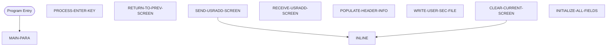

# Program: COUSR01C

---

## Quick Reference

| Attribute | Value |
|-----------|-------|
| Program ID | `COUSR01C` |
| Type | ONLINE |
| Lines | 300 |
| Source | [COUSR01C.cbl](../carddemo/COUSR01C.cbl#L1) |
| Paragraphs | 9 |
| Statements | 34 |
| Impact Risk | **HIGH** — 20 programs affected |

> **View Source:** [Open COUSR01C.cbl](../carddemo/COUSR01C.cbl#L1)

## Dependency Context

> This section shows how **COUSR01C** connects to the rest of the system — who calls it,
> what it calls, and what data it shares. If linked programs exist, they must appear here.

### Programs That Call COUSR01C (Callers)

*No programs call COUSR01C — this is likely a top-level entry point or CICS transaction starter.*

### Programs Called by COUSR01C (Callees)

*COUSR01C does not call any other programs (leaf program).*

### Shared Data (Copybooks & Files)

#### Shared Copybooks

| Copybook | Also Used By | # Co-Users |
|----------|-------------|------------|
| `COCOM01Y` | 00220000, COACTUPC, COACTVWC, COADM01C, COBIL00C (+15 more) | 20 |
| `COTTL01Y` | 00220000, COACTUPC, COACTVWC, COADM01C, COBIL00C (+15 more) | 20 |
| `COUSR01` |  | 0 |
| `CSDAT01Y` | 00220000, COACTUPC, COACTVWC, COADM01C, COBIL00C (+15 more) | 20 |
| `CSMSG01Y` | 00220000, COACTUPC, COACTVWC, COADM01C, COBIL00C (+15 more) | 20 |
| `CSUSR01Y` | 00220000, COACTUPC, COACTVWC, COADM01C, COCRDLIC (+8 more) | 13 |
| `DFHAID` | 00220000, COACTUPC, COACTVWC, COADM01C, COBIL00C (+15 more) | 20 |
| `DFHBMSCA` | 00220000, COACTUPC, COACTVWC, COADM01C, COBIL00C (+15 more) | 20 |

---

## Dependency Graph

```mermaid
flowchart TD
    COUSR01C["⬤ COUSR01C"]:::target
    CB_COCOM01Y{{"COCOM01Y"}}:::copybook
    COUSR01C -.- CB_COCOM01Y
    00220000["00220000"]:::coupled
    CB_COCOM01Y -.- 00220000
    COACTUPC["COACTUPC"]:::coupled
    CB_COCOM01Y -.- COACTUPC
    COACTVWC["COACTVWC"]:::coupled
    CB_COCOM01Y -.- COACTVWC
    CB_COTTL01Y{{"COTTL01Y"}}:::copybook
    COUSR01C -.- CB_COTTL01Y
    00220000["00220000"]:::coupled
    CB_COTTL01Y -.- 00220000
    COACTUPC["COACTUPC"]:::coupled
    CB_COTTL01Y -.- COACTUPC
    COACTVWC["COACTVWC"]:::coupled
    CB_COTTL01Y -.- COACTVWC
    CB_CSDAT01Y{{"CSDAT01Y"}}:::copybook
    COUSR01C -.- CB_CSDAT01Y
    00220000["00220000"]:::coupled
    CB_CSDAT01Y -.- 00220000
    COACTUPC["COACTUPC"]:::coupled
    CB_CSDAT01Y -.- COACTUPC
    COACTVWC["COACTVWC"]:::coupled
    CB_CSDAT01Y -.- COACTVWC
    CB_CSMSG01Y{{"CSMSG01Y"}}:::copybook
    COUSR01C -.- CB_CSMSG01Y
    00220000["00220000"]:::coupled
    CB_CSMSG01Y -.- 00220000
    COACTUPC["COACTUPC"]:::coupled
    CB_CSMSG01Y -.- COACTUPC
    COACTVWC["COACTVWC"]:::coupled
    CB_CSMSG01Y -.- COACTVWC
    CB_CSUSR01Y{{"CSUSR01Y"}}:::copybook
    COUSR01C -.- CB_CSUSR01Y
    00220000["00220000"]:::coupled
    CB_CSUSR01Y -.- 00220000
    COACTUPC["COACTUPC"]:::coupled
    CB_CSUSR01Y -.- COACTUPC
    COACTVWC["COACTVWC"]:::coupled
    CB_CSUSR01Y -.- COACTVWC
    CB_DFHAID{{"DFHAID"}}:::copybook
    COUSR01C -.- CB_DFHAID
    00220000["00220000"]:::coupled
    CB_DFHAID -.- 00220000
    COACTUPC["COACTUPC"]:::coupled
    CB_DFHAID -.- COACTUPC
    COACTVWC["COACTVWC"]:::coupled
    CB_DFHAID -.- COACTVWC
    CB_DFHBMSCA{{"DFHBMSCA"}}:::copybook
    COUSR01C -.- CB_DFHBMSCA
    00220000["00220000"]:::coupled
    CB_DFHBMSCA -.- 00220000
    COACTUPC["COACTUPC"]:::coupled
    CB_DFHBMSCA -.- COACTUPC
    COACTVWC["COACTVWC"]:::coupled
    CB_DFHBMSCA -.- COACTVWC

    classDef target fill:#f85149,stroke:#da3633,color:#fff,stroke-width:3px
    classDef caller fill:#58a6ff,stroke:#1f6feb,color:#fff
    classDef callee fill:#3fb950,stroke:#238636,color:#fff
    classDef copybook fill:#d29922,stroke:#9e6a03,color:#fff
    classDef coupled fill:#d29922,stroke:#9e6a03,color:#fff,stroke-dasharray:5
    classDef transitive fill:#484f58,stroke:#8b949e,color:#c9d1d9,stroke-dasharray:5
```

> **Legend:** 🔴 Target program · 🔵 Direct callers · 🟢 Direct callees · 🟡 Copybook-coupled · ⚫ Transitive (indirect)

---

## Impact Ripple View

> **If you change COUSR01C, what else could break?**

| Impact Metric | Count |
|--------------|-------|
| Direct Callers | 0 |
| Transitive Callers (callers of callers) | 0 |
| Direct Callees | 0 |
| Transitive Callees | 0 |
| Copybook-Coupled Programs | 20 |
| **Total Impact** | **20** |
| **Risk Rating** | **HIGH** |

**Programs affected via shared copybooks:**
- `00220000`
- `COACTUPC`
- `COACTVWC`
- `COADM01C`
- `COBIL00C`
- `COCRDLIC`
- `COCRDSLC`
- `COCRDUPC`
- `COMEN01C`
- `COPAUS0C`
- `COPAUS1C`
- `CORPT00C`
- `COSGN00C`
- `COTRN00C`
- `COTRN01C`
- `COTRN02C`
- `COTRTLIC`
- `COUSR00C`
- `COUSR02C`
- `COUSR03C`

---

## Statement Profile

| Statement Type | Count |
|---------------|-------|
| MOVE | 20 |
| EXEC_CICS | 5 |
| PERFORM | 3 |
| IF | 3 |
| EVALUATE | 2 |
| SET | 1 |

## Control Flow

## Paragraphs

### MAIN-PARA

| | |
|---|---|
| **Paragraph** | `MAIN-PARA` |
| **Lines** | 494 - 533 |
| **View Code** | [Jump to Line 494](../carddemo/COUSR01C.cbl#L494) |

### PROCESS-ENTER-KEY

| | |
|---|---|
| **Paragraph** | `PROCESS-ENTER-KEY` |
| **Lines** | 538 - 583 |
| **View Code** | [Jump to Line 538](../carddemo/COUSR01C.cbl#L538) |

### RETURN-TO-PREV-SCREEN

| | |
|---|---|
| **Paragraph** | `RETURN-TO-PREV-SCREEN` |
| **Lines** | 588 - 601 |
| **View Code** | [Jump to Line 588](../carddemo/COUSR01C.cbl#L588) |

### SEND-USRADD-SCREEN

| | |
|---|---|
| **Paragraph** | `SEND-USRADD-SCREEN` |
| **Lines** | 607 - 619 |
| **View Code** | [Jump to Line 607](../carddemo/COUSR01C.cbl#L607) |

### RECEIVE-USRADD-SCREEN

| | |
|---|---|
| **Paragraph** | `RECEIVE-USRADD-SCREEN` |
| **Lines** | 624 - 632 |
| **View Code** | [Jump to Line 624](../carddemo/COUSR01C.cbl#L624) |

### POPULATE-HEADER-INFO

| | |
|---|---|
| **Paragraph** | `POPULATE-HEADER-INFO` |
| **Lines** | 637 - 656 |
| **View Code** | [Jump to Line 637](../carddemo/COUSR01C.cbl#L637) |

### WRITE-USER-SEC-FILE

| | |
|---|---|
| **Paragraph** | `WRITE-USER-SEC-FILE` |
| **Lines** | 661 - 697 |
| **View Code** | [Jump to Line 661](../carddemo/COUSR01C.cbl#L661) |

### CLEAR-CURRENT-SCREEN

| | |
|---|---|
| **Paragraph** | `CLEAR-CURRENT-SCREEN` |
| **Lines** | 702 - 705 |
| **View Code** | [Jump to Line 702](../carddemo/COUSR01C.cbl#L702) |

### INITIALIZE-ALL-FIELDS

| | |
|---|---|
| **Paragraph** | `INITIALIZE-ALL-FIELDS` |
| **Lines** | 710 - 718 |
| **View Code** | [Jump to Line 710](../carddemo/COUSR01C.cbl#L710) |

## Business Rules

- **Invalid Security Level** `BR-414`  
  If the entered security level is not valid, the user will be notified and must re-enter a valid security level.  
  [View Rule Details](../business-rules/BR-414.md)
- **Invalid User ID** `BR-415`  
  If the entered User ID is invalid, the user will be notified and must re-enter a valid User ID.  
  [View Rule Details](../business-rules/BR-415.md)
- **User ID Format Check** `BR-416`  
  The system validates the format of the entered User ID.  
  [View Rule Details](../business-rules/BR-416.md)
- **Password Complexity Check** `BR-417`  
  The system enforces password complexity rules when a new password is created.  
  [View Rule Details](../business-rules/BR-417.md)
- **Security Profile Authorization** `BR-418`  
  The system verifies if the user initiating the creation of a new user has the necessary permissions.  
  [View Rule Details](../business-rules/BR-418.md)
- **Clear Screen and Return** `BR-419`  
  After processing, the system clears the input screen and returns the user to the previous screen.  
  [View Rule Details](../business-rules/BR-419.md)
- **Invalid Security Level** `BR-420`  
  If the entered security level is not valid, display an error message.  
  [View Rule Details](../business-rules/BR-420.md)

## Key Data Items

| Name | Level | Picture | Section | Business Name |
|------|-------|---------|---------|---------------|
| `WS-VARIABLES` | 1 | `None` | WORKING-STORAGE | None |
| `WS-PGMNAME` | 5 | `X(08)` | WORKING-STORAGE | None |
| `WS-TRANID` | 5 | `X(04)` | WORKING-STORAGE | None |
| `WS-MESSAGE` | 5 | `X(80)` | WORKING-STORAGE | None |
| `WS-USRSEC-FILE` | 5 | `X(08)` | WORKING-STORAGE | None |
| `WS-ERR-FLG` | 5 | `X(01)` | WORKING-STORAGE | None |
| `ERR-FLG-ON` | 88 | `None` | WORKING-STORAGE | None |
| `ERR-FLG-OFF` | 88 | `None` | WORKING-STORAGE | None |
| `WS-RESP-CD` | 5 | `S9(09)` | WORKING-STORAGE | None |
| `WS-REAS-CD` | 5 | `S9(09)` | WORKING-STORAGE | None |
| `CARDDEMO-COMMAREA` | 1 | `None` | WORKING-STORAGE | None |
| `CDEMO-GENERAL-INFO` | 5 | `None` | WORKING-STORAGE | None |
| `CDEMO-FROM-TRANID` | 10 | `X(04)` | WORKING-STORAGE | None |
| `CDEMO-FROM-PROGRAM` | 10 | `X(08)` | WORKING-STORAGE | None |
| `CDEMO-TO-TRANID` | 10 | `X(04)` | WORKING-STORAGE | None |
| `CDEMO-TO-PROGRAM` | 10 | `X(08)` | WORKING-STORAGE | None |
| `CDEMO-USER-ID` | 10 | `X(08)` | WORKING-STORAGE | None |
| `CDEMO-USER-TYPE` | 10 | `X(01)` | WORKING-STORAGE | None |
| `CDEMO-USRTYP-ADMIN` | 88 | `None` | WORKING-STORAGE | None |
| `CDEMO-USRTYP-USER` | 88 | `None` | WORKING-STORAGE | None |
| `CDEMO-PGM-CONTEXT` | 10 | `9(01)` | WORKING-STORAGE | None |
| `CDEMO-PGM-ENTER` | 88 | `None` | WORKING-STORAGE | None |
| `CDEMO-PGM-REENTER` | 88 | `None` | WORKING-STORAGE | None |
| `CDEMO-CUSTOMER-INFO` | 5 | `None` | WORKING-STORAGE | None |
| `CDEMO-CUST-ID` | 10 | `9(09)` | WORKING-STORAGE | None |
| `CDEMO-CUST-FNAME` | 10 | `X(25)` | WORKING-STORAGE | None |
| `CDEMO-CUST-MNAME` | 10 | `X(25)` | WORKING-STORAGE | None |
| `CDEMO-CUST-LNAME` | 10 | `X(25)` | WORKING-STORAGE | None |
| `CDEMO-ACCOUNT-INFO` | 5 | `None` | WORKING-STORAGE | None |
| `CDEMO-ACCT-ID` | 10 | `9(11)` | WORKING-STORAGE | None |
| `CDEMO-ACCT-STATUS` | 10 | `X(01)` | WORKING-STORAGE | None |
| `CDEMO-CARD-INFO` | 5 | `None` | WORKING-STORAGE | None |
| `CDEMO-CARD-NUM` | 10 | `9(16)` | WORKING-STORAGE | None |
| `CDEMO-MORE-INFO` | 5 | `None` | WORKING-STORAGE | None |
| `CDEMO-LAST-MAP` | 10 | `X(7)` | WORKING-STORAGE | None |
| `CDEMO-LAST-MAPSET` | 10 | `X(7)` | WORKING-STORAGE | None |
| `COUSR1AI` | 1 | `None` | WORKING-STORAGE | None |
| `FILLER` | 2 | `X(12)` | WORKING-STORAGE | None |
| `TRNNAMEL` | 2 | `S9(4)` | WORKING-STORAGE | None |
| `TRNNAMEF` | 2 | `X` | WORKING-STORAGE | None |

*Showing 40 of 312 data items. See [Data Dictionary](../data-dictionary.md).*

---

*Generated 2026-03-16 21:06*