# Program: COUSR02C

---

## Quick Reference

| Attribute | Value |
|-----------|-------|
| Program ID | `COUSR02C` |
| Type | ONLINE |
| Lines | 415 |
| Source | [COUSR02C.cbl](../carddemo/COUSR02C.cbl#L1) |
| Paragraphs | 11 |
| Statements | 40 |
| Impact Risk | **HIGH** — 20 programs affected |

> **View Source:** [Open COUSR02C.cbl](../carddemo/COUSR02C.cbl#L1)

## Dependency Context

> This section shows how **COUSR02C** connects to the rest of the system — who calls it,
> what it calls, and what data it shares. If linked programs exist, they must appear here.

### Programs That Call COUSR02C (Callers)

*No programs call COUSR02C — this is likely a top-level entry point or CICS transaction starter.*

### Programs Called by COUSR02C (Callees)

*COUSR02C does not call any other programs (leaf program).*

### Shared Data (Copybooks & Files)

#### Shared Copybooks

| Copybook | Also Used By | # Co-Users |
|----------|-------------|------------|
| `COCOM01Y` | 00220000, COACTUPC, COACTVWC, COADM01C, COBIL00C (+15 more) | 20 |
| `COTTL01Y` | 00220000, COACTUPC, COACTVWC, COADM01C, COBIL00C (+15 more) | 20 |
| `COUSR02` |  | 0 |
| `CSDAT01Y` | 00220000, COACTUPC, COACTVWC, COADM01C, COBIL00C (+15 more) | 20 |
| `CSMSG01Y` | 00220000, COACTUPC, COACTVWC, COADM01C, COBIL00C (+15 more) | 20 |
| `CSUSR01Y` | 00220000, COACTUPC, COACTVWC, COADM01C, COCRDLIC (+8 more) | 13 |
| `DFHAID` | 00220000, COACTUPC, COACTVWC, COADM01C, COBIL00C (+15 more) | 20 |
| `DFHBMSCA` | 00220000, COACTUPC, COACTVWC, COADM01C, COBIL00C (+15 more) | 20 |

---

## Dependency Graph

```mermaid
flowchart TD
    COUSR02C["⬤ COUSR02C"]:::target
    CB_COCOM01Y{{"COCOM01Y"}}:::copybook
    COUSR02C -.- CB_COCOM01Y
    00220000["00220000"]:::coupled
    CB_COCOM01Y -.- 00220000
    COACTUPC["COACTUPC"]:::coupled
    CB_COCOM01Y -.- COACTUPC
    COACTVWC["COACTVWC"]:::coupled
    CB_COCOM01Y -.- COACTVWC
    CB_COTTL01Y{{"COTTL01Y"}}:::copybook
    COUSR02C -.- CB_COTTL01Y
    00220000["00220000"]:::coupled
    CB_COTTL01Y -.- 00220000
    COACTUPC["COACTUPC"]:::coupled
    CB_COTTL01Y -.- COACTUPC
    COACTVWC["COACTVWC"]:::coupled
    CB_COTTL01Y -.- COACTVWC
    CB_CSDAT01Y{{"CSDAT01Y"}}:::copybook
    COUSR02C -.- CB_CSDAT01Y
    00220000["00220000"]:::coupled
    CB_CSDAT01Y -.- 00220000
    COACTUPC["COACTUPC"]:::coupled
    CB_CSDAT01Y -.- COACTUPC
    COACTVWC["COACTVWC"]:::coupled
    CB_CSDAT01Y -.- COACTVWC
    CB_CSMSG01Y{{"CSMSG01Y"}}:::copybook
    COUSR02C -.- CB_CSMSG01Y
    00220000["00220000"]:::coupled
    CB_CSMSG01Y -.- 00220000
    COACTUPC["COACTUPC"]:::coupled
    CB_CSMSG01Y -.- COACTUPC
    COACTVWC["COACTVWC"]:::coupled
    CB_CSMSG01Y -.- COACTVWC
    CB_CSUSR01Y{{"CSUSR01Y"}}:::copybook
    COUSR02C -.- CB_CSUSR01Y
    00220000["00220000"]:::coupled
    CB_CSUSR01Y -.- 00220000
    COACTUPC["COACTUPC"]:::coupled
    CB_CSUSR01Y -.- COACTUPC
    COACTVWC["COACTVWC"]:::coupled
    CB_CSUSR01Y -.- COACTVWC
    CB_DFHAID{{"DFHAID"}}:::copybook
    COUSR02C -.- CB_DFHAID
    00220000["00220000"]:::coupled
    CB_DFHAID -.- 00220000
    COACTUPC["COACTUPC"]:::coupled
    CB_DFHAID -.- COACTUPC
    COACTVWC["COACTVWC"]:::coupled
    CB_DFHAID -.- COACTVWC
    CB_DFHBMSCA{{"DFHBMSCA"}}:::copybook
    COUSR02C -.- CB_DFHBMSCA
    00220000["00220000"]:::coupled
    CB_DFHBMSCA -.- 00220000
    COACTUPC["COACTUPC"]:::coupled
    CB_DFHBMSCA -.- COACTUPC
    COACTVWC["COACTVWC"]:::coupled
    CB_DFHBMSCA -.- COACTVWC

    classDef target fill:#f85149,stroke:#da3633,color:#fff,stroke-width:3px
    classDef caller fill:#58a6ff,stroke:#1f6feb,color:#fff
    classDef callee fill:#3fb950,stroke:#238636,color:#fff
    classDef copybook fill:#d29922,stroke:#9e6a03,color:#fff
    classDef coupled fill:#d29922,stroke:#9e6a03,color:#fff,stroke-dasharray:5
    classDef transitive fill:#484f58,stroke:#8b949e,color:#c9d1d9,stroke-dasharray:5
```

> **Legend:** 🔴 Target program · 🔵 Direct callers · 🟢 Direct callees · 🟡 Copybook-coupled · ⚫ Transitive (indirect)

---

## Impact Ripple View

> **If you change COUSR02C, what else could break?**

| Impact Metric | Count |
|--------------|-------|
| Direct Callers | 0 |
| Transitive Callers (callers of callers) | 0 |
| Direct Callees | 0 |
| Transitive Callees | 0 |
| Copybook-Coupled Programs | 20 |
| **Total Impact** | **20** |
| **Risk Rating** | **HIGH** |

**Programs affected via shared copybooks:**
- `00220000`
- `COACTUPC`
- `COACTVWC`
- `COADM01C`
- `COBIL00C`
- `COCRDLIC`
- `COCRDSLC`
- `COCRDUPC`
- `COMEN01C`
- `COPAUS0C`
- `COPAUS1C`
- `CORPT00C`
- `COSGN00C`
- `COTRN00C`
- `COTRN01C`
- `COTRN02C`
- `COTRTLIC`
- `COUSR00C`
- `COUSR01C`
- `COUSR03C`

---

## Statement Profile

| Statement Type | Count |
|---------------|-------|
| MOVE | 20 |
| EXEC_CICS | 6 |
| IF | 5 |
| EVALUATE | 4 |
| PERFORM | 3 |
| SET | 2 |

## Control Flow

```mermaid
flowchart TD
    START([Program Entry])
    MAIN_PARA["MAIN-PARA"]
    PROCESS_ENTER_KEY["PROCESS-ENTER-KEY"]
    UPDATE_USER_INFO["UPDATE-USER-INFO"]
    RETURN_TO_PREV_SCREEN["RETURN-TO-PREV-SCREEN"]
    SEND_USRUPD_SCREEN["SEND-USRUPD-SCREEN"]
    RECEIVE_USRUPD_SCREEN["RECEIVE-USRUPD-SCREEN"]
    POPULATE_HEADER_INFO["POPULATE-HEADER-INFO"]
    READ_USER_SEC_FILE["READ-USER-SEC-FILE"]
    UPDATE_USER_SEC_FILE["UPDATE-USER-SEC-FILE"]
    CLEAR_CURRENT_SCREEN["CLEAR-CURRENT-SCREEN"]
    INITIALIZE_ALL_FIELDS["INITIALIZE-ALL-FIELDS"]
    START --> MAIN_PARA
    SEND_USRUPD_SCREEN --> INLINE
    CLEAR_CURRENT_SCREEN --> INLINE
```

## Paragraphs

### MAIN-PARA

| | |
|---|---|
| **Paragraph** | `MAIN-PARA` |
| **Lines** | 505 - 561 |
| **View Code** | [Jump to Line 505](../carddemo/COUSR02C.cbl#L505) |

### PROCESS-ENTER-KEY

| | |
|---|---|
| **Paragraph** | `PROCESS-ENTER-KEY` |
| **Lines** | 566 - 595 |
| **View Code** | [Jump to Line 566](../carddemo/COUSR02C.cbl#L566) |

### UPDATE-USER-INFO

| | |
|---|---|
| **Paragraph** | `UPDATE-USER-INFO` |
| **Lines** | 600 - 668 |
| **View Code** | [Jump to Line 600](../carddemo/COUSR02C.cbl#L600) |

### RETURN-TO-PREV-SCREEN

| | |
|---|---|
| **Paragraph** | `RETURN-TO-PREV-SCREEN` |
| **Lines** | 673 - 684 |
| **View Code** | [Jump to Line 673](../carddemo/COUSR02C.cbl#L673) |

### SEND-USRUPD-SCREEN

| | |
|---|---|
| **Paragraph** | `SEND-USRUPD-SCREEN` |
| **Lines** | 689 - 701 |
| **View Code** | [Jump to Line 689](../carddemo/COUSR02C.cbl#L689) |

### RECEIVE-USRUPD-SCREEN

| | |
|---|---|
| **Paragraph** | `RECEIVE-USRUPD-SCREEN` |
| **Lines** | 706 - 714 |
| **View Code** | [Jump to Line 706](../carddemo/COUSR02C.cbl#L706) |

### POPULATE-HEADER-INFO

| | |
|---|---|
| **Paragraph** | `POPULATE-HEADER-INFO` |
| **Lines** | 719 - 738 |
| **View Code** | [Jump to Line 719](../carddemo/COUSR02C.cbl#L719) |

### READ-USER-SEC-FILE

| | |
|---|---|
| **Paragraph** | `READ-USER-SEC-FILE` |
| **Lines** | 743 - 776 |
| **View Code** | [Jump to Line 743](../carddemo/COUSR02C.cbl#L743) |

### UPDATE-USER-SEC-FILE

| | |
|---|---|
| **Paragraph** | `UPDATE-USER-SEC-FILE` |
| **Lines** | 781 - 813 |
| **View Code** | [Jump to Line 781](../carddemo/COUSR02C.cbl#L781) |

### CLEAR-CURRENT-SCREEN

| | |
|---|---|
| **Paragraph** | `CLEAR-CURRENT-SCREEN` |
| **Lines** | 818 - 821 |
| **View Code** | [Jump to Line 818](../carddemo/COUSR02C.cbl#L818) |

### INITIALIZE-ALL-FIELDS

| | |
|---|---|
| **Paragraph** | `INITIALIZE-ALL-FIELDS` |
| **Lines** | 826 - 834 |
| **View Code** | [Jump to Line 826](../carddemo/COUSR02C.cbl#L826) |

## Business Rules

- **Data Movement** `BR-421`  
  Data is moved from one location to another.  
  [View Rule Details](../business-rules/BR-421.md)
- **Profile Update Validation** `BR-422`  
  The system validates the updated profile information entered by the user.  
  [View Rule Details](../business-rules/BR-422.md)
- **Security Record Update** `BR-423`  
  The system updates the user's security record with the validated profile information.  
  [View Rule Details](../business-rules/BR-423.md)
- **Display Updated Information** `BR-424`  
  The system displays the updated profile information to the user.  
  [View Rule Details](../business-rules/BR-424.md)
- **Invalid Security Code** `BR-425`  
  If the security code entered by the user is invalid, the update process will not proceed.  
  [View Rule Details](../business-rules/BR-425.md)
- **Profile Update Confirmation** `BR-426`  
  The user must confirm the changes to their profile information before the update is applied.  
  [View Rule Details](../business-rules/BR-426.md)
- **Clear Screen Messages** `BR-427`  
  The system clears the screen message fields.  
  [View Rule Details](../business-rules/BR-427.md)
- **Invalid Security Level** `BR-428`  
  If the user enters a security level that is not valid, the update will not proceed.  
  [View Rule Details](../business-rules/BR-428.md)
- **Security Record Not Found** `BR-429`  
  If the user's security record cannot be found, the update will not proceed.  
  [View Rule Details](../business-rules/BR-429.md)
- **Invalid Security Level** `BR-430`  
  If the security level entered is not valid, the update will not proceed.  
  [View Rule Details](../business-rules/BR-430.md)
- **Password Complexity Check** `BR-431`  
  The new password must meet complexity requirements before it can be accepted.  
  [View Rule Details](../business-rules/BR-431.md)

## Key Data Items

| Name | Level | Picture | Section | Business Name |
|------|-------|---------|---------|---------------|
| `WS-VARIABLES` | 1 | `None` | WORKING-STORAGE | None |
| `WS-PGMNAME` | 5 | `X(08)` | WORKING-STORAGE | None |
| `WS-TRANID` | 5 | `X(04)` | WORKING-STORAGE | None |
| `WS-MESSAGE` | 5 | `X(80)` | WORKING-STORAGE | None |
| `WS-USRSEC-FILE` | 5 | `X(08)` | WORKING-STORAGE | None |
| `WS-ERR-FLG` | 5 | `X(01)` | WORKING-STORAGE | None |
| `ERR-FLG-ON` | 88 | `None` | WORKING-STORAGE | None |
| `ERR-FLG-OFF` | 88 | `None` | WORKING-STORAGE | None |
| `WS-RESP-CD` | 5 | `S9(09)` | WORKING-STORAGE | None |
| `WS-REAS-CD` | 5 | `S9(09)` | WORKING-STORAGE | None |
| `WS-USR-MODIFIED` | 5 | `X(01)` | WORKING-STORAGE | None |
| `USR-MODIFIED-YES` | 88 | `None` | WORKING-STORAGE | None |
| `USR-MODIFIED-NO` | 88 | `None` | WORKING-STORAGE | None |
| `CARDDEMO-COMMAREA` | 1 | `None` | WORKING-STORAGE | None |
| `CDEMO-GENERAL-INFO` | 5 | `None` | WORKING-STORAGE | None |
| `CDEMO-FROM-TRANID` | 10 | `X(04)` | WORKING-STORAGE | None |
| `CDEMO-FROM-PROGRAM` | 10 | `X(08)` | WORKING-STORAGE | None |
| `CDEMO-TO-TRANID` | 10 | `X(04)` | WORKING-STORAGE | None |
| `CDEMO-TO-PROGRAM` | 10 | `X(08)` | WORKING-STORAGE | None |
| `CDEMO-USER-ID` | 10 | `X(08)` | WORKING-STORAGE | None |
| `CDEMO-USER-TYPE` | 10 | `X(01)` | WORKING-STORAGE | None |
| `CDEMO-USRTYP-ADMIN` | 88 | `None` | WORKING-STORAGE | None |
| `CDEMO-USRTYP-USER` | 88 | `None` | WORKING-STORAGE | None |
| `CDEMO-PGM-CONTEXT` | 10 | `9(01)` | WORKING-STORAGE | None |
| `CDEMO-PGM-ENTER` | 88 | `None` | WORKING-STORAGE | None |
| `CDEMO-PGM-REENTER` | 88 | `None` | WORKING-STORAGE | None |
| `CDEMO-CUSTOMER-INFO` | 5 | `None` | WORKING-STORAGE | None |
| `CDEMO-CUST-ID` | 10 | `9(09)` | WORKING-STORAGE | None |
| `CDEMO-CUST-FNAME` | 10 | `X(25)` | WORKING-STORAGE | None |
| `CDEMO-CUST-MNAME` | 10 | `X(25)` | WORKING-STORAGE | None |
| `CDEMO-CUST-LNAME` | 10 | `X(25)` | WORKING-STORAGE | None |
| `CDEMO-ACCOUNT-INFO` | 5 | `None` | WORKING-STORAGE | None |
| `CDEMO-ACCT-ID` | 10 | `9(11)` | WORKING-STORAGE | None |
| `CDEMO-ACCT-STATUS` | 10 | `X(01)` | WORKING-STORAGE | None |
| `CDEMO-CARD-INFO` | 5 | `None` | WORKING-STORAGE | None |
| `CDEMO-CARD-NUM` | 10 | `9(16)` | WORKING-STORAGE | None |
| `CDEMO-MORE-INFO` | 5 | `None` | WORKING-STORAGE | None |
| `CDEMO-LAST-MAP` | 10 | `X(7)` | WORKING-STORAGE | None |
| `CDEMO-LAST-MAPSET` | 10 | `X(7)` | WORKING-STORAGE | None |
| `CDEMO-CU02-INFO` | 5 | `None` | WORKING-STORAGE | None |

*Showing 40 of 324 data items. See [Data Dictionary](../data-dictionary.md).*

---

*Generated 2026-03-16 21:06*