# Program: COUSR03C

---

## Quick Reference

| Attribute | Value |
|-----------|-------|
| Program ID | `COUSR03C` |
| Type | ONLINE |
| Lines | 360 |
| Source | [COUSR03C.cbl](../carddemo/COUSR03C.cbl#L1) |
| Paragraphs | 11 |
| Statements | 40 |
| Impact Risk | **HIGH** — 20 programs affected |

> **View Source:** [Open COUSR03C.cbl](../carddemo/COUSR03C.cbl#L1)

## Dependency Context

> This section shows how **COUSR03C** connects to the rest of the system — who calls it,
> what it calls, and what data it shares. If linked programs exist, they must appear here.

### Programs That Call COUSR03C (Callers)

*No programs call COUSR03C — this is likely a top-level entry point or CICS transaction starter.*

### Programs Called by COUSR03C (Callees)

*COUSR03C does not call any other programs (leaf program).*

### Shared Data (Copybooks & Files)

#### Shared Copybooks

| Copybook | Also Used By | # Co-Users |
|----------|-------------|------------|
| `COCOM01Y` | 00220000, COACTUPC, COACTVWC, COADM01C, COBIL00C (+15 more) | 20 |
| `COTTL01Y` | 00220000, COACTUPC, COACTVWC, COADM01C, COBIL00C (+15 more) | 20 |
| `COUSR03` |  | 0 |
| `CSDAT01Y` | 00220000, COACTUPC, COACTVWC, COADM01C, COBIL00C (+15 more) | 20 |
| `CSMSG01Y` | 00220000, COACTUPC, COACTVWC, COADM01C, COBIL00C (+15 more) | 20 |
| `CSUSR01Y` | 00220000, COACTUPC, COACTVWC, COADM01C, COCRDLIC (+8 more) | 13 |
| `DFHAID` | 00220000, COACTUPC, COACTVWC, COADM01C, COBIL00C (+15 more) | 20 |
| `DFHBMSCA` | 00220000, COACTUPC, COACTVWC, COADM01C, COBIL00C (+15 more) | 20 |

---

## Dependency Graph

```mermaid
flowchart TD
    COUSR03C["⬤ COUSR03C"]:::target
    CB_COCOM01Y{{"COCOM01Y"}}:::copybook
    COUSR03C -.- CB_COCOM01Y
    00220000["00220000"]:::coupled
    CB_COCOM01Y -.- 00220000
    COACTUPC["COACTUPC"]:::coupled
    CB_COCOM01Y -.- COACTUPC
    COACTVWC["COACTVWC"]:::coupled
    CB_COCOM01Y -.- COACTVWC
    CB_COTTL01Y{{"COTTL01Y"}}:::copybook
    COUSR03C -.- CB_COTTL01Y
    00220000["00220000"]:::coupled
    CB_COTTL01Y -.- 00220000
    COACTUPC["COACTUPC"]:::coupled
    CB_COTTL01Y -.- COACTUPC
    COACTVWC["COACTVWC"]:::coupled
    CB_COTTL01Y -.- COACTVWC
    CB_CSDAT01Y{{"CSDAT01Y"}}:::copybook
    COUSR03C -.- CB_CSDAT01Y
    00220000["00220000"]:::coupled
    CB_CSDAT01Y -.- 00220000
    COACTUPC["COACTUPC"]:::coupled
    CB_CSDAT01Y -.- COACTUPC
    COACTVWC["COACTVWC"]:::coupled
    CB_CSDAT01Y -.- COACTVWC
    CB_CSMSG01Y{{"CSMSG01Y"}}:::copybook
    COUSR03C -.- CB_CSMSG01Y
    00220000["00220000"]:::coupled
    CB_CSMSG01Y -.- 00220000
    COACTUPC["COACTUPC"]:::coupled
    CB_CSMSG01Y -.- COACTUPC
    COACTVWC["COACTVWC"]:::coupled
    CB_CSMSG01Y -.- COACTVWC
    CB_CSUSR01Y{{"CSUSR01Y"}}:::copybook
    COUSR03C -.- CB_CSUSR01Y
    00220000["00220000"]:::coupled
    CB_CSUSR01Y -.- 00220000
    COACTUPC["COACTUPC"]:::coupled
    CB_CSUSR01Y -.- COACTUPC
    COACTVWC["COACTVWC"]:::coupled
    CB_CSUSR01Y -.- COACTVWC
    CB_DFHAID{{"DFHAID"}}:::copybook
    COUSR03C -.- CB_DFHAID
    00220000["00220000"]:::coupled
    CB_DFHAID -.- 00220000
    COACTUPC["COACTUPC"]:::coupled
    CB_DFHAID -.- COACTUPC
    COACTVWC["COACTVWC"]:::coupled
    CB_DFHAID -.- COACTVWC
    CB_DFHBMSCA{{"DFHBMSCA"}}:::copybook
    COUSR03C -.- CB_DFHBMSCA
    00220000["00220000"]:::coupled
    CB_DFHBMSCA -.- 00220000
    COACTUPC["COACTUPC"]:::coupled
    CB_DFHBMSCA -.- COACTUPC
    COACTVWC["COACTVWC"]:::coupled
    CB_DFHBMSCA -.- COACTVWC

    classDef target fill:#f85149,stroke:#da3633,color:#fff,stroke-width:3px
    classDef caller fill:#58a6ff,stroke:#1f6feb,color:#fff
    classDef callee fill:#3fb950,stroke:#238636,color:#fff
    classDef copybook fill:#d29922,stroke:#9e6a03,color:#fff
    classDef coupled fill:#d29922,stroke:#9e6a03,color:#fff,stroke-dasharray:5
    classDef transitive fill:#484f58,stroke:#8b949e,color:#c9d1d9,stroke-dasharray:5
```

> **Legend:** 🔴 Target program · 🔵 Direct callers · 🟢 Direct callees · 🟡 Copybook-coupled · ⚫ Transitive (indirect)

---

## Impact Ripple View

> **If you change COUSR03C, what else could break?**

| Impact Metric | Count |
|--------------|-------|
| Direct Callers | 0 |
| Transitive Callers (callers of callers) | 0 |
| Direct Callees | 0 |
| Transitive Callees | 0 |
| Copybook-Coupled Programs | 20 |
| **Total Impact** | **20** |
| **Risk Rating** | **HIGH** |

**Programs affected via shared copybooks:**
- `00220000`
- `COACTUPC`
- `COACTVWC`
- `COADM01C`
- `COBIL00C`
- `COCRDLIC`
- `COCRDSLC`
- `COCRDUPC`
- `COMEN01C`
- `COPAUS0C`
- `COPAUS1C`
- `CORPT00C`
- `COSGN00C`
- `COTRN00C`
- `COTRN01C`
- `COTRN02C`
- `COTRTLIC`
- `COUSR00C`
- `COUSR01C`
- `COUSR02C`

---

## Statement Profile

| Statement Type | Count |
|---------------|-------|
| MOVE | 20 |
| EXEC_CICS | 6 |
| IF | 5 |
| EVALUATE | 4 |
| PERFORM | 3 |
| SET | 2 |

## Control Flow

```mermaid
flowchart TD
    START([Program Entry])
    MAIN_PARA["MAIN-PARA"]
    PROCESS_ENTER_KEY["PROCESS-ENTER-KEY"]
    DELETE_USER_INFO["DELETE-USER-INFO"]
    RETURN_TO_PREV_SCREEN["RETURN-TO-PREV-SCREEN"]
    SEND_USRDEL_SCREEN["SEND-USRDEL-SCREEN"]
    RECEIVE_USRDEL_SCREEN["RECEIVE-USRDEL-SCREEN"]
    POPULATE_HEADER_INFO["POPULATE-HEADER-INFO"]
    READ_USER_SEC_FILE["READ-USER-SEC-FILE"]
    DELETE_USER_SEC_FILE["DELETE-USER-SEC-FILE"]
    CLEAR_CURRENT_SCREEN["CLEAR-CURRENT-SCREEN"]
    INITIALIZE_ALL_FIELDS["INITIALIZE-ALL-FIELDS"]
    START --> MAIN_PARA
    SEND_USRDEL_SCREEN --> INLINE
    CLEAR_CURRENT_SCREEN --> INLINE
```

## Paragraphs

### MAIN-PARA

| | |
|---|---|
| **Paragraph** | `MAIN-PARA` |
| **Lines** | 493 - 548 |
| **View Code** | [Jump to Line 493](../carddemo/COUSR03C.cbl#L493) |

### PROCESS-ENTER-KEY

| | |
|---|---|
| **Paragraph** | `PROCESS-ENTER-KEY` |
| **Lines** | 553 - 580 |
| **View Code** | [Jump to Line 553](../carddemo/COUSR03C.cbl#L553) |

### DELETE-USER-INFO

| | |
|---|---|
| **Paragraph** | `DELETE-USER-INFO` |
| **Lines** | 585 - 603 |
| **View Code** | [Jump to Line 585](../carddemo/COUSR03C.cbl#L585) |

### RETURN-TO-PREV-SCREEN

| | |
|---|---|
| **Paragraph** | `RETURN-TO-PREV-SCREEN` |
| **Lines** | 608 - 619 |
| **View Code** | [Jump to Line 608](../carddemo/COUSR03C.cbl#L608) |

### SEND-USRDEL-SCREEN

| | |
|---|---|
| **Paragraph** | `SEND-USRDEL-SCREEN` |
| **Lines** | 624 - 636 |
| **View Code** | [Jump to Line 624](../carddemo/COUSR03C.cbl#L624) |

### RECEIVE-USRDEL-SCREEN

| | |
|---|---|
| **Paragraph** | `RECEIVE-USRDEL-SCREEN` |
| **Lines** | 641 - 649 |
| **View Code** | [Jump to Line 641](../carddemo/COUSR03C.cbl#L641) |

### POPULATE-HEADER-INFO

| | |
|---|---|
| **Paragraph** | `POPULATE-HEADER-INFO` |
| **Lines** | 654 - 673 |
| **View Code** | [Jump to Line 654](../carddemo/COUSR03C.cbl#L654) |

### READ-USER-SEC-FILE

| | |
|---|---|
| **Paragraph** | `READ-USER-SEC-FILE` |
| **Lines** | 678 - 711 |
| **View Code** | [Jump to Line 678](../carddemo/COUSR03C.cbl#L678) |

### DELETE-USER-SEC-FILE

| | |
|---|---|
| **Paragraph** | `DELETE-USER-SEC-FILE` |
| **Lines** | 716 - 747 |
| **View Code** | [Jump to Line 716](../carddemo/COUSR03C.cbl#L716) |

### CLEAR-CURRENT-SCREEN

| | |
|---|---|
| **Paragraph** | `CLEAR-CURRENT-SCREEN` |
| **Lines** | 752 - 755 |
| **View Code** | [Jump to Line 752](../carddemo/COUSR03C.cbl#L752) |

### INITIALIZE-ALL-FIELDS

| | |
|---|---|
| **Paragraph** | `INITIALIZE-ALL-FIELDS` |
| **Lines** | 760 - 767 |
| **View Code** | [Jump to Line 760](../carddemo/COUSR03C.cbl#L760) |

## Business Rules

- **User Deletion Authorization** `BR-432`  
  The system must verify that the user attempting to delete an account has the necessary permissions to perform this action.  
  [View Rule Details](../business-rules/BR-432.md)
- **User Existence Check Before Deletion** `BR-433`  
  The system must confirm that the user account to be deleted actually exists before attempting the deletion.  
  [View Rule Details](../business-rules/BR-433.md)
- **Security Record Deletion** `BR-434`  
  When a user account is deleted, the corresponding security record must also be deleted to prevent unauthorized access.  
  [View Rule Details](../business-rules/BR-434.md)
- **General Information Deletion** `BR-435`  
  When a user account is deleted, the user's general information record must also be deleted to maintain data integrity.  
  [View Rule Details](../business-rules/BR-435.md)
- **User Deletion Confirmation** `BR-436`  
  The system must confirm the user's intent to delete a user account before proceeding with the deletion.  
  [View Rule Details](../business-rules/BR-436.md)
- **Security Record Deletion** `BR-437`  
  The system must delete the user's security record when a user account is deleted.  
  [View Rule Details](../business-rules/BR-437.md)
- **General Information Deletion** `BR-438`  
  The system must delete the user's general information when a user account is deleted.  
  [View Rule Details](../business-rules/BR-438.md)
- **User Deletion Confirmation** `BR-439`  
  The system must confirm the user's intention to delete a user account before proceeding with the deletion.  
  [View Rule Details](../business-rules/BR-439.md)
- **Security Record Deletion** `BR-440`  
  The system must delete the user's security record when a user account is deleted.  
  [View Rule Details](../business-rules/BR-440.md)
- **General Information Deletion** `BR-441`  
  The system must delete the user's general information when a user account is deleted.  
  [View Rule Details](../business-rules/BR-441.md)
- **Return to Previous Screen** `BR-442`  
  After deleting a user account, the system returns the user to the screen they were on before initiating the delete process.  
  [View Rule Details](../business-rules/BR-442.md)
- **User Security Record Not Found** `BR-443`  
  If a user's security record cannot be found, the user cannot be deleted.  
  [View Rule Details](../business-rules/BR-443.md)
- **User Security Record Deletion Status** `BR-444`  
  The system must confirm the successful deletion of the user's security record before proceeding.  
  [View Rule Details](../business-rules/BR-444.md)

## Key Data Items

| Name | Level | Picture | Section | Business Name |
|------|-------|---------|---------|---------------|
| `WS-VARIABLES` | 1 | `None` | WORKING-STORAGE | None |
| `WS-PGMNAME` | 5 | `X(08)` | WORKING-STORAGE | None |
| `WS-TRANID` | 5 | `X(04)` | WORKING-STORAGE | None |
| `WS-MESSAGE` | 5 | `X(80)` | WORKING-STORAGE | None |
| `WS-USRSEC-FILE` | 5 | `X(08)` | WORKING-STORAGE | None |
| `WS-ERR-FLG` | 5 | `X(01)` | WORKING-STORAGE | None |
| `ERR-FLG-ON` | 88 | `None` | WORKING-STORAGE | None |
| `ERR-FLG-OFF` | 88 | `None` | WORKING-STORAGE | None |
| `WS-RESP-CD` | 5 | `S9(09)` | WORKING-STORAGE | None |
| `WS-REAS-CD` | 5 | `S9(09)` | WORKING-STORAGE | None |
| `WS-USR-MODIFIED` | 5 | `X(01)` | WORKING-STORAGE | None |
| `USR-MODIFIED-YES` | 88 | `None` | WORKING-STORAGE | None |
| `USR-MODIFIED-NO` | 88 | `None` | WORKING-STORAGE | None |
| `CARDDEMO-COMMAREA` | 1 | `None` | WORKING-STORAGE | None |
| `CDEMO-GENERAL-INFO` | 5 | `None` | WORKING-STORAGE | None |
| `CDEMO-FROM-TRANID` | 10 | `X(04)` | WORKING-STORAGE | None |
| `CDEMO-FROM-PROGRAM` | 10 | `X(08)` | WORKING-STORAGE | None |
| `CDEMO-TO-TRANID` | 10 | `X(04)` | WORKING-STORAGE | None |
| `CDEMO-TO-PROGRAM` | 10 | `X(08)` | WORKING-STORAGE | None |
| `CDEMO-USER-ID` | 10 | `X(08)` | WORKING-STORAGE | None |
| `CDEMO-USER-TYPE` | 10 | `X(01)` | WORKING-STORAGE | None |
| `CDEMO-USRTYP-ADMIN` | 88 | `None` | WORKING-STORAGE | None |
| `CDEMO-USRTYP-USER` | 88 | `None` | WORKING-STORAGE | None |
| `CDEMO-PGM-CONTEXT` | 10 | `9(01)` | WORKING-STORAGE | None |
| `CDEMO-PGM-ENTER` | 88 | `None` | WORKING-STORAGE | None |
| `CDEMO-PGM-REENTER` | 88 | `None` | WORKING-STORAGE | None |
| `CDEMO-CUSTOMER-INFO` | 5 | `None` | WORKING-STORAGE | None |
| `CDEMO-CUST-ID` | 10 | `9(09)` | WORKING-STORAGE | None |
| `CDEMO-CUST-FNAME` | 10 | `X(25)` | WORKING-STORAGE | None |
| `CDEMO-CUST-MNAME` | 10 | `X(25)` | WORKING-STORAGE | None |
| `CDEMO-CUST-LNAME` | 10 | `X(25)` | WORKING-STORAGE | None |
| `CDEMO-ACCOUNT-INFO` | 5 | `None` | WORKING-STORAGE | None |
| `CDEMO-ACCT-ID` | 10 | `9(11)` | WORKING-STORAGE | None |
| `CDEMO-ACCT-STATUS` | 10 | `X(01)` | WORKING-STORAGE | None |
| `CDEMO-CARD-INFO` | 5 | `None` | WORKING-STORAGE | None |
| `CDEMO-CARD-NUM` | 10 | `9(16)` | WORKING-STORAGE | None |
| `CDEMO-MORE-INFO` | 5 | `None` | WORKING-STORAGE | None |
| `CDEMO-LAST-MAP` | 10 | `X(7)` | WORKING-STORAGE | None |
| `CDEMO-LAST-MAPSET` | 10 | `X(7)` | WORKING-STORAGE | None |
| `CDEMO-CU03-INFO` | 5 | `None` | WORKING-STORAGE | None |

*Showing 40 of 312 data items. See [Data Dictionary](../data-dictionary.md).*

---

*Generated 2026-03-16 21:06*