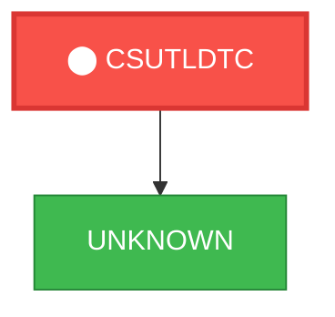
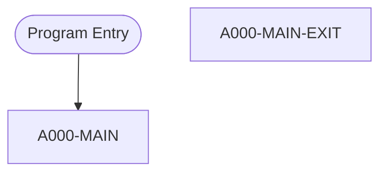

# Program: CSUTLDTC

---

## Quick Reference

| Attribute | Value |
|-----------|-------|
| Program ID | `CSUTLDTC` |
| Type | BATCH |
| Lines | 158 |
| Source | [CSUTLDTC.cbl](../carddemo/CSUTLDTC.cbl#L1) |
| Paragraphs | 2 |
| Statements | 11 |
| Impact Risk | **LOW** — 0 programs affected |

> **View Source:** [Open CSUTLDTC.cbl](../carddemo/CSUTLDTC.cbl#L1)

## Dependency Context

> This section shows how **CSUTLDTC** connects to the rest of the system — who calls it,
> what it calls, and what data it shares. If linked programs exist, they must appear here.

### Programs That Call CSUTLDTC (Callers)

*No programs call CSUTLDTC — this is likely a top-level entry point or CICS transaction starter.*

### Programs Called by CSUTLDTC (Callees)

| Called Program | Type | Line | Why |
|----------------|------|------|-----|
| [UNKNOWN](UNKNOWN.md) | None | 116 |  |

### Shared Data (Copybooks & Files)

*No shared copybooks.*

---

## Dependency Graph

> **Legend:** 🔴 Target program · 🔵 Direct callers · 🟢 Direct callees · 🟡 Copybook-coupled · ⚫ Transitive (indirect)

---

## Impact Ripple View

> **If you change CSUTLDTC, what else could break?**

| Impact Metric | Count |
|--------------|-------|
| Direct Callers | 0 |
| Transitive Callers (callers of callers) | 0 |
| Direct Callees | 0 |
| Transitive Callees | 0 |
| Copybook-Coupled Programs | 0 |
| **Total Impact** | **0** |
| **Risk Rating** | **LOW** |

---

## Statement Profile

| Statement Type | Count |
|---------------|-------|
| MOVE | 8 |
| EXIT | 1 |
| EVALUATE | 1 |
| CALL | 1 |

## Control Flow

## Paragraphs

### A000-MAIN

| | |
|---|---|
| **Paragraph** | `A000-MAIN` |
| **Lines** | 103 - 151 |
| **View Code** | [Jump to Line 103](../carddemo/CSUTLDTC.cbl#L103) |

### A000-MAIN-EXIT

| | |
|---|---|
| **Paragraph** | `A000-MAIN-EXIT` |
| **Lines** | 152 - 154 |
| **View Code** | [Jump to Line 152](../carddemo/CSUTLDTC.cbl#L152) |

## Business Rules

- **Date Validation Result** `BR-445`  
  The system validates a date against a specified format and provides a validation result.  
  [View Rule Details](../business-rules/BR-445.md)
- **Date Conversion to Lillian Format** `BR-446`  
  The system converts a valid date to the Lillian date format.  
  [View Rule Details](../business-rules/BR-446.md)
- **Error Reporting for Invalid Dates** `BR-447`  
  The system reports an error when a date is invalid.  
  [View Rule Details](../business-rules/BR-447.md)

## Key Data Items

| Name | Level | Picture | Section | Business Name |
|------|-------|---------|---------|---------------|
| `WS-DATE-TO-TEST` | 1 | `None` | WORKING-STORAGE | None |
| `Vstring-length` | 2 | `S9(4)` | WORKING-STORAGE | None |
| `Vstring-text` | 2 | `None` | WORKING-STORAGE | None |
| `Vstring-char` | 3 | `X` | WORKING-STORAGE | None |
| `WS-DATE-FORMAT` | 1 | `None` | WORKING-STORAGE | None |
| `Vstring-length` | 2 | `S9(4)` | WORKING-STORAGE | None |
| `Vstring-text` | 2 | `None` | WORKING-STORAGE | None |
| `Vstring-char` | 3 | `X` | WORKING-STORAGE | None |
| `OUTPUT-LILLIAN` | 1 | `S9(9)` | WORKING-STORAGE | None |
| `WS-MESSAGE` | 1 | `None` | WORKING-STORAGE | None |
| `WS-SEVERITY` | 2 | `X(04)` | WORKING-STORAGE | None |
| `WS-SEVERITY-N` | 2 | `9(4)` | WORKING-STORAGE | None |
| `FILLER` | 2 | `X(11)` | WORKING-STORAGE | None |
| `WS-MSG-NO` | 2 | `X(04)` | WORKING-STORAGE | None |
| `WS-MSG-NO-N` | 2 | `9(4)` | WORKING-STORAGE | None |
| `FILLER` | 2 | `X(01)` | WORKING-STORAGE | None |
| `WS-RESULT` | 2 | `X(15)` | WORKING-STORAGE | None |
| `FILLER` | 2 | `X(01)` | WORKING-STORAGE | None |
| `FILLER` | 2 | `X(09)` | WORKING-STORAGE | None |
| `WS-DATE` | 2 | `X(10)` | WORKING-STORAGE | None |
| `FILLER` | 2 | `X(01)` | WORKING-STORAGE | None |
| `FILLER` | 2 | `X(10)` | WORKING-STORAGE | None |
| `WS-DATE-FMT` | 2 | `X(10)` | WORKING-STORAGE | None |
| `FILLER` | 2 | `X(01)` | WORKING-STORAGE | None |
| `FILLER` | 2 | `X(03)` | WORKING-STORAGE | None |
| `FEEDBACK-CODE` | 1 | `None` | WORKING-STORAGE | None |
| `FEEDBACK-TOKEN-VALUE` | 2 | `None` | WORKING-STORAGE | None |
| `FC-INVALID-DATE` | 88 | `None` | WORKING-STORAGE | None |
| `FC-INSUFFICIENT-DATA` | 88 | `None` | WORKING-STORAGE | None |
| `FC-BAD-DATE-VALUE` | 88 | `None` | WORKING-STORAGE | None |
| `FC-INVALID-ERA` | 88 | `None` | WORKING-STORAGE | None |
| `FC-UNSUPP-RANGE` | 88 | `None` | WORKING-STORAGE | None |
| `FC-INVALID-MONTH` | 88 | `None` | WORKING-STORAGE | None |
| `FC-BAD-PIC-STRING` | 88 | `None` | WORKING-STORAGE | None |
| `FC-NON-NUMERIC-DATA` | 88 | `None` | WORKING-STORAGE | None |
| `FC-YEAR-IN-ERA-ZERO` | 88 | `None` | WORKING-STORAGE | None |
| `CASE-1-CONDITION-ID` | 3 | `None` | WORKING-STORAGE | None |
| `SEVERITY` | 4 | `S9(4)` | WORKING-STORAGE | None |
| `MSG-NO` | 4 | `S9(4)` | WORKING-STORAGE | None |
| `CASE-2-CONDITION-ID` | 3 | `None` | WORKING-STORAGE | None |

*Showing 40 of 48 data items. See [Data Dictionary](../data-dictionary.md).*

---

*Generated 2026-03-16 21:06*