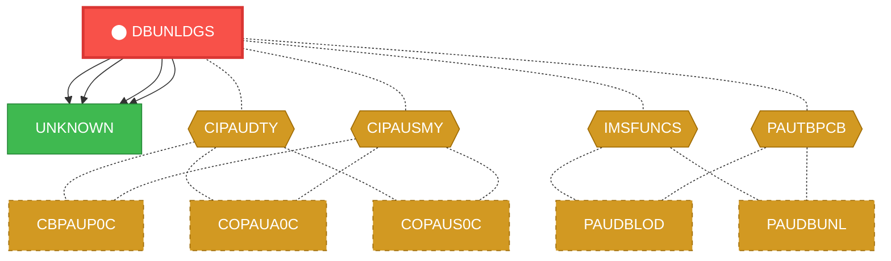
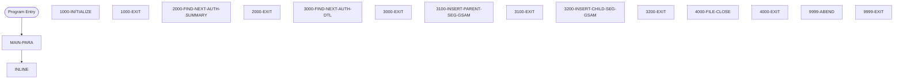

# Program: DBUNLDGS

> **Authorization Summary Unloader**
---

## Quick Reference

| Attribute | Value |
|-----------|-------|
| Program ID | `DBUNLDGS` |
| Type | BATCH |
| Lines | 367 |
| Source | [DBUNLDGS.CBL](../carddemo/DBUNLDGS.CBL#L1) |
| Paragraphs | 15 |
| Statements | 36 |
| Impact Risk | **MEDIUM** — 7 programs affected |

> **View Source:** [Open DBUNLDGS.CBL](../carddemo/DBUNLDGS.CBL#L1)

## Business Purpose

This program is triggered by a scheduled batch job to unload authorization summary data. It iterates through authorization records, processes each record, and inserts parent and child segments into a database. The program reads and writes various data items, including authorization dates, expiry days, and application IDs. It produces updated authorization summary records and tracks the number of records written, read, and deleted. The program also handles errors and exceptions, and provides summary information for auditing and reporting purposes.

**Used By:** Batch Scheduler  |  **Process:** Transaction Processing

## Dependency Context

> This section shows how **DBUNLDGS** connects to the rest of the system — who calls it,
> what it calls, and what data it shares. If linked programs exist, they must appear here.

### Programs That Call DBUNLDGS (Callers)

*No programs call DBUNLDGS — this is likely a top-level entry point or CICS transaction starter.*

### Programs Called by DBUNLDGS (Callees)

| Called Program | Type | Line | Why |
|----------------|------|------|-----|
| [UNKNOWN](UNKNOWN.md) | None | 412 |  |
| [UNKNOWN](UNKNOWN.md) | None | 457 |  |
| [UNKNOWN](UNKNOWN.md) | None | 492 |  |
| [UNKNOWN](UNKNOWN.md) | None | 511 |  |

### Shared Data (Copybooks & Files)

#### Shared Copybooks

| Copybook | Also Used By | # Co-Users |
|----------|-------------|------------|
| `CIPAUDTY` | CBPAUP0C, COPAUA0C, COPAUS0C, COPAUS1C, COPAUS2C (+2 more) | 7 |
| `CIPAUSMY` | CBPAUP0C, COPAUA0C, COPAUS0C, COPAUS1C, PAUDBLOD (+1 more) | 6 |
| `IMSFUNCS` | PAUDBLOD, PAUDBUNL | 2 |
| `PADFLPCB` |  | 0 |
| `PASFLPCB` |  | 0 |
| `PAUTBPCB` | PAUDBLOD, PAUDBUNL | 2 |

---

## Dependency Graph

> **Legend:** 🔴 Target program · 🔵 Direct callers · 🟢 Direct callees · 🟡 Copybook-coupled · ⚫ Transitive (indirect)

---

## Impact Ripple View

> **If you change DBUNLDGS, what else could break?**

| Impact Metric | Count |
|--------------|-------|
| Direct Callers | 0 |
| Transitive Callers (callers of callers) | 0 |
| Direct Callees | 0 |
| Transitive Callees | 0 |
| Copybook-Coupled Programs | 7 |
| **Total Impact** | **7** |
| **Risk Rating** | **MEDIUM** |

**Programs affected via shared copybooks:**
- `CBPAUP0C`
- `COPAUA0C`
- `COPAUS0C`
- `COPAUS1C`
- `COPAUS2C`
- `PAUDBLOD`
- `PAUDBUNL`

---

## Statement Profile

| Statement Type | Count |
|---------------|-------|
| IF | 8 |
| EXIT | 7 |
| DISPLAY | 6 |
| CALL | 4 |
| PERFORM | 3 |
| INITIALIZE | 2 |
| GOBACK | 2 |
| ACCEPT | 2 |
| MOVE | 1 |
| ENTRY | 1 |

## Control Flow

## Paragraphs

### MAIN-PARA

| | |
|---|---|
| **Paragraph** | `MAIN-PARA` |
| **Lines** | 354 - 369 |
| **View Code** | [Jump to Line 354](../carddemo/DBUNLDGS.CBL#L354) |

### 1000-INITIALIZE

| | |
|---|---|
| **Paragraph** | `1000-INITIALIZE` |
| **Lines** | 372 - 384 |
| **View Code** | [Jump to Line 372](../carddemo/DBUNLDGS.CBL#L372) |

### 1000-EXIT

| | |
|---|---|
| **Paragraph** | `1000-EXIT` |
| **Lines** | 402 - 403 |
| **View Code** | [Jump to Line 402](../carddemo/DBUNLDGS.CBL#L402) |

### 2000-FIND-NEXT-AUTH-SUMMARY

| | |
|---|---|
| **Paragraph** | `2000-FIND-NEXT-AUTH-SUMMARY` |
| **Lines** | 406 - 447 |
| **View Code** | [Jump to Line 406](../carddemo/DBUNLDGS.CBL#L406) |

### 2000-EXIT

| | |
|---|---|
| **Paragraph** | `2000-EXIT` |
| **Lines** | 448 - 449 |
| **View Code** | [Jump to Line 448](../carddemo/DBUNLDGS.CBL#L448) |

### 3000-FIND-NEXT-AUTH-DTL

| | |
|---|---|
| **Paragraph** | `3000-FIND-NEXT-AUTH-DTL` |
| **Lines** | 453 - 485 |
| **View Code** | [Jump to Line 453](../carddemo/DBUNLDGS.CBL#L453) |

### 3000-EXIT

| | |
|---|---|
| **Paragraph** | `3000-EXIT` |
| **Lines** | 486 - 487 |
| **View Code** | [Jump to Line 486](../carddemo/DBUNLDGS.CBL#L486) |

### 3100-INSERT-PARENT-SEG-GSAM

| | |
|---|---|
| **Paragraph** | `3100-INSERT-PARENT-SEG-GSAM` |
| **Lines** | 490 - 505 |
| **View Code** | [Jump to Line 490](../carddemo/DBUNLDGS.CBL#L490) |

### 3100-EXIT

| | |
|---|---|
| **Paragraph** | `3100-EXIT` |
| **Lines** | 506 - 507 |
| **View Code** | [Jump to Line 506](../carddemo/DBUNLDGS.CBL#L506) |

### 3200-INSERT-CHILD-SEG-GSAM

| | |
|---|---|
| **Paragraph** | `3200-INSERT-CHILD-SEG-GSAM` |
| **Lines** | 509 - 524 |
| **View Code** | [Jump to Line 509](../carddemo/DBUNLDGS.CBL#L509) |

### 3200-EXIT

| | |
|---|---|
| **Paragraph** | `3200-EXIT` |
| **Lines** | 525 - 526 |
| **View Code** | [Jump to Line 525](../carddemo/DBUNLDGS.CBL#L525) |

### 4000-FILE-CLOSE

| | |
|---|---|
| **Paragraph** | `4000-FILE-CLOSE` |
| **Lines** | 528 - 529 |
| **View Code** | [Jump to Line 528](../carddemo/DBUNLDGS.CBL#L528) |

### 4000-EXIT

| | |
|---|---|
| **Paragraph** | `4000-EXIT` |
| **Lines** | 544 - 545 |
| **View Code** | [Jump to Line 544](../carddemo/DBUNLDGS.CBL#L544) |

### 9999-ABEND

| | |
|---|---|
| **Paragraph** | `9999-ABEND` |
| **Lines** | 547 - 553 |
| **View Code** | [Jump to Line 547](../carddemo/DBUNLDGS.CBL#L547) |

### 9999-EXIT

| | |
|---|---|
| **Paragraph** | `9999-EXIT` |
| **Lines** | 555 - 556 |
| **View Code** | [Jump to Line 555](../carddemo/DBUNLDGS.CBL#L555) |

## Business Rules

- **Authorization Summary Record Found** `BR-003`  
  If an authorization summary record is successfully read from the database, process it to extract associated detail records.  
  [View Rule Details](../business-rules/BR-003.md)
- **Authorization Detail Record Found** `BR-004`  
  If an authorization detail record is successfully read from the database, process it to be written to the output file.  
  [View Rule Details](../business-rules/BR-004.md)
- **End of Authorization Detail Records** `BR-005`  
  If there are no more authorization detail records associated with a summary record, proceed to the next authorization summary record.  
  [View Rule Details](../business-rules/BR-005.md)
- **Detail Record Belongs to Summary Record** `BR-006`  
  A detail record is only processed if it is associated with the current authorization summary record.  
  [View Rule Details](../business-rules/BR-006.md)
- **Authorization Detail Record Limit** `BR-007`  
  There is a limit to the number of detail records that can be associated with a single authorization summary record.  
  [View Rule Details](../business-rules/BR-007.md)
- **Authorization Summary Record Insertion** `BR-008`  
  An authorization summary record must be written to the GSAM file.  
  [View Rule Details](../business-rules/BR-008.md)
- **Authorization Detail Record Insertion** `BR-009`  
  Authorization detail records associated with a summary record are written to the GSAM file.  
  [View Rule Details](../business-rules/BR-009.md)

## Key Data Items

| Name | Level | Picture | Section | Business Name |
|------|-------|---------|---------|---------------|
| `OPFIL1-REC` | 1 | `X(100)` | WORKING-STORAGE | Output File 1 Record |
| `OPFIL2-REC` | 1 | `None` | WORKING-STORAGE | Output File 2 Record |
| `ROOT-SEG-KEY` | 5 | `S9(11)` | WORKING-STORAGE | Root Segment Key |
| `CHILD-SEG-REC` | 5 | `X(200)` | WORKING-STORAGE | Child Segment Record |
| `WS-VARIABLES` | 1 | `None` | WORKING-STORAGE | Working Storage Variables |
| `WS-PGMNAME` | 5 | `X(08)` | WORKING-STORAGE | Program Name |
| `CURRENT-DATE` | 5 | `9(06)` | WORKING-STORAGE | Current Date |
| `CURRENT-YYDDD` | 5 | `9(05)` | WORKING-STORAGE | Current Year and Day |
| `WS-AUTH-DATE` | 5 | `9(05)` | WORKING-STORAGE | Authorization Date |
| `WS-EXPIRY-DAYS` | 5 | `S9(4)` | WORKING-STORAGE | Expiry Days |
| `WS-DAY-DIFF` | 5 | `S9(4)` | WORKING-STORAGE | Day Difference |
| `IDX` | 5 | `S9(4)` | WORKING-STORAGE | Index |
| `WS-CURR-APP-ID` | 5 | `9(11)` | WORKING-STORAGE | Current Application ID |
| `WS-NO-CHKP` | 5 | `9(8)` | WORKING-STORAGE | Number of Checkpoints |
| `WS-AUTH-SMRY-PROC-CNT` | 5 | `9(8)` | WORKING-STORAGE | Authorization Summary Process Count |
| `WS-TOT-REC-WRITTEN` | 5 | `S9(8)` | WORKING-STORAGE | Total Records Written |
| `WS-NO-SUMRY-READ` | 5 | `S9(8)` | WORKING-STORAGE | Number of Summary Records Read |
| `WS-NO-SUMRY-DELETED` | 5 | `S9(8)` | WORKING-STORAGE | Number of Summary Records Deleted |
| `WS-NO-DTL-READ` | 5 | `S9(8)` | WORKING-STORAGE | Number of Detail Records Read |
| `WS-NO-DTL-DELETED` | 5 | `S9(8)` | WORKING-STORAGE | Number of Detail Records Deleted |
| `WS-ERR-FLG` | 5 | `X(01)` | WORKING-STORAGE | Error Flag |
| `ERR-FLG-ON` | 88 | `None` | WORKING-STORAGE | Error Flag On |
| `ERR-FLG-OFF` | 88 | `None` | WORKING-STORAGE | Error Flag Off |
| `WS-END-OF-AUTHDB-FLAG` | 5 | `X(01)` | WORKING-STORAGE | End of Authorization Database Flag |
| `END-OF-AUTHDB` | 88 | `None` | WORKING-STORAGE | End of Authorization Database |
| `NOT-END-OF-AUTHDB` | 88 | `None` | WORKING-STORAGE | Authorization Database Not Exhausted |
| `WS-MORE-AUTHS-FLAG` | 5 | `X(01)` | WORKING-STORAGE | More Authorizations Flag |
| `MORE-AUTHS` | 88 | `None` | WORKING-STORAGE | More Authorizations Exist |
| `NO-MORE-AUTHS` | 88 | `None` | WORKING-STORAGE | No More Authorizations Exist |
| `WS-END-OF-ROOT-SEG` | 5 | `X(01)` | WORKING-STORAGE | End of Root Segment Indicator |
| `WS-END-OF-CHILD-SEG` | 5 | `X(01)` | WORKING-STORAGE | End of Child Segment Indicator |
| `WS-INFILE-STATUS` | 5 | `X(02)` | WORKING-STORAGE | Input File Status |
| `WS-OUTFL1-STATUS` | 5 | `X(02)` | WORKING-STORAGE | First Output File Status |
| `WS-OUTFL2-STATUS` | 5 | `X(02)` | WORKING-STORAGE | Second Output File Status |
| `WS-CUSTID-STATUS` | 5 | `X(02)` | WORKING-STORAGE | Customer ID Status |
| `END-OF-FILE` | 88 | `None` | WORKING-STORAGE | End of File Indicator |
| `WK-CHKPT-ID` | 5 | `None` | WORKING-STORAGE | Checkpoint ID |
| `FILLER` | 10 | `X(04)` | WORKING-STORAGE | None |
| `WK-CHKPT-ID-CTR` | 10 | `9(04)` | WORKING-STORAGE | Checkpoint ID Counter |
| `WS-IMS-VARIABLES` | 1 | `None` | WORKING-STORAGE | IMS Variables |

*Showing 40 of 162 data items. See [Data Dictionary](../data-dictionary.md).*

---

*Generated 2026-03-16 21:06*